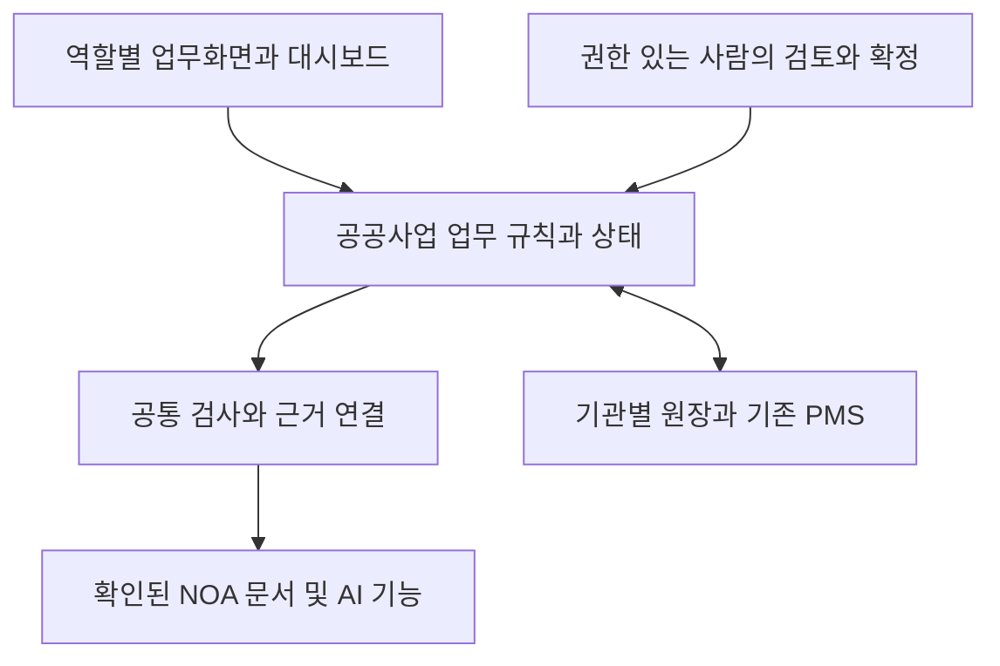

# NOA 기반 공공 PMS 서비스 모델 검토서

2026년 9월 11일 · v0.1 · 조사 및 설계 검토 초안

## 1 기획 방향과 권고안

이 문서는 CCK의 NOA를 활용해 공공 정보화사업 관리 서비스를 어떤 형태로 제공할지 판단하기 위한 조사 및 설계 검토서다. 독자는 CCK 사업기획자와 NOA 제품 책임자, 발주기관 업무 담당자다. 제품 구현이나 구매 확정 문서는 아니다.

권고안은 NOA를 공통 업무 기반으로 활용하고, 공공사업의 기준·산출물·검토·보완·승인을 관리하는 전용 업무모듈을 구성하는 것이다. 대시보드는 담당자가 처리할 업무와 병목을 확인하는 진입 화면으로 설계한다. 검사 로직은 분야별 기준을 바꿔 재사용할 수 있도록 업무 상태 관리와 구분한다.

| 선택할 대상 | 이번 기획의 판단 |
| --- | --- |
| 제품 기반 | NOA의 문서·AI·업무 환경을 우선 재사용 후보로 둔다. 실제 제공 버전과 확장 기능은 확인한다. |
| 사용 화면 | NOA 안의 전용 화면을 우선 검토한다. 내부 확장이 어렵다면 별도 업무화면을 NOA에 연계한다. |
| 업무 로직 | 공공사업의 책임·기한·버전·상태·최종 판단 규칙은 명시적으로 설계한다. |
| 기관별 판매 방식 | 기존 PMS가 없는 기관에는 업무모듈을, 기존 PMS가 정착된 기관에는 검사 및 근거 연계를 우선 제안한다. |

### 서로 다른 세 가지 결정

NOA 사용 여부는 재사용할 제품 기반의 결정이다. 대시보드 구성은 사용자가 보는 화면의 결정이다. 로직 구성은 어떤 조건에서 업무 상태가 바뀌고 누가 책임지는지의 결정이다. 세 가지를 함께 설계해야 하며, 화면만으로 책임과 검수 이력이 완성되지는 않는다.

### 가정과 범위

조사 기준일은 2026년 9월 11일이다. NOA 소스 수정권, 확장 SDK, API 명세, 설치 버전과 가용 용량은 미확정으로 둔다. 기존 서버와 로컬 LLM 활용 및 신규 인프라 투자 0을 전제로 하되, 설계·연계·검증·운영비는 별도로 산정한다. 신규 OCR·VLM·외부 클라우드 대체 호출은 이번 범위에 포함하지 않는다.

기존 공공 RFP의 52개 요구사항은 비교 기준선으로 유지한다. 이 검토서의 시나리오를 좁혔다고 전체 요구사항을 삭제하거나 법정 감리·기업 자동등급을 1차 범위에 추가하지 않는다.

## 2 NOA와 CCK 자산의 확인 범위

NOA 공식 소개는 문서와 프로젝트를 함께 다루는 업무 환경, 자체 LLM, 업무 자동화, 승인 및 이력 관리를 설명한다. 이는 공급사 공개 설명을 확인한 결과이며 해당 기관 설치본의 기능·성능을 시험한 결과는 아니다. 공식 페이지 직접 열람은 시간 초과였고 검색 색인에 수록된 공식 본문으로 내용을 확인했다. [N01]

| 재사용 후보 | 읽은 자료의 내용 | 공공 PMS에 적용하기 전 확인 |
| --- | --- | --- |
| NOA 업무 환경 | 문서·프로젝트·일정 연결과 업무 수행을 소개 [N01] | 기관별 화면과 필드 확장, 사업 단위 접근권한, 기존 도구와의 중복 |
| NOA 통제 기능 | 사람 검토·승인과 행동 이력을 소개 [N01] | 며칠간 대기하는 업무 복구, 대결·권한 회수, 이력 정정과 버전 관리 |
| Argus와 Keeper | 내부 기술목록에 추론·실행 및 작업 상태 관리 후보로 기록 [L01] | NOA에 포함된 실제 모듈과 버전, 실행 중단 후 사람 검토 재개 지원 |
| Nexus | 내부 목록에 LLM 호출 관리 후보로 기록 [L01] | 로컬 모델 연결, 외부 호출 차단, 자동 클라우드 대체 기능 해제 |
| 조직 인증과 문서 처리 | 내부 목록에 Mothership 및 문서 자산 후보가 존재 [L01] | 재사용 권리, 기관별 격리, 외부 수행사 권한, 전자문서 지원 범위 |

### 기존 자산과 신규 설계를 구분하는 기준

내부 기술목록은 파생 정리 자료다. Keeper의 사람 개입 후 중단·재개와 제품 간 실제 구성 관계는 확정 근거가 부족하다. 목록의 완료·확인 표기를 이번 검증 결과로 옮기지 않는다. NOA와 Argus·Keeper·Nexus가 특정 구조로 연결돼 있다고 단정하지 않는다.

일반적인 작업 로그와 공공 PMS의 판단 이력은 필요한 보존 정보가 다르다. 내부 목록에서 신규 과제로 분류된 NL2SQL 및 Evidence Trail 명칭을 이미 운영 중인 공통 기능으로 계상하지 않는다. NOA가 소개하는 스캔 문서 기능도 이번 공공 PMS 범위에 자동 편입하지 않는다.

Accio의 버전 비교와 검증 사례는 검사 업무를 제품으로 묶는 참고 사례로만 사용한다. 회계 분야 기능이나 생산성 수치를 공공사업 관리에 그대로 적용하지 않는다. [N02]

## 3 제공 방식별 비교와 선택 조건

| 대안 | 기대효과 | 비용과 기간의 변수 | 주요 위험과 선행조건 |
| --- | --- | --- | --- |
| A NOA 내부 확장 | 기존 업무 맥락과 화면·인증을 활용 | 확장 지점·권한·상태 관리가 충분하면 신규 작업 감소 가능 | NOA 수정 범위와 업그레이드 호환성 확인 필요 |
| B 별도 업무화면 연계 | 공공사업 처리 흐름과 가시성을 직접 설계 | 화면·도메인 로직·연계 구현 및 양쪽 회귀검증 필요 | 동일 정보 이중 관리 방지와 API 안정성 필요 |
| C 기존 PMS에 검사 제공 | 현재 PMS를 계속 쓰며 문서검토 지원 | 연계 대상별 어댑터와 결과 반영 방식에 따라 변동 | 기존 PMS의 상태·버전 식별과 처리권한 확인 필요 |
| D 신규 통합 PMS | 전체 업무 경험과 데이터 모델을 직접 통제 | 공통 기능까지 새로 만들면 구축·이관·운영 부담 증가 | 기존 제품 부적합 증거와 별도 사업 타당성 필요 |

이 표는 구조에 따른 정성 비교다. 실제 견적·기간·효율 우위를 산출한 결과가 아니다. A도 확장 제약과 제품 변경 비용이 크면 B보다 비쌀 수 있다. 독립 서비스나 별도 DB를 먼저 정하기보다 논리적 책임을 나누고 실제 확장 수단에 맞춰 배치한다.

### 권고하는 선택 순서

첫째, NOA 내부에 전용 화면과 장기 업무 상태를 안전하게 확장할 수 있고 재사용 권리가 확인되면 A를 선택한다. 둘째, 문서·AI API는 충분하지만 업무화면 또는 상태 확장이 부족하면 B를 선택한다. 셋째, 기관에 정착된 PMS가 있으면 그 시스템을 원장으로 유지하는 C를 우선 비교한다. D는 앞선 방식으로 필수 요구사항을 충족할 수 없는 경우에 다시 검토한다.

### 대시보드의 적절한 범위

대시보드는 일정·검토 대기·미결 책임을 보여주고 해당 업무로 이동하거나 권한 있는 처리 명령을 실행하게 한다. 읽기 전용 현황판은 초기에 병목을 측정하는 용도로 유용할 수 있으나 제출·보완·승인 서비스 전체를 대신하지는 않는다.

Power BI의 현황 요약, Power Automate의 승인 흐름, Camunda의 사람 작업과 외부 폼 연결은 화면과 업무 처리를 구분하는 설계 참고 사례다. 이 제품의 설치·구매를 권고하거나 그 기능이 NOA에 있다고 판단하는 근거는 아니다. [N03–N05]

## 4 구매자와 이용자를 연결하는 서비스 모델

가칭은 NOA 공공사업 이행관리 모듈이다. NOA의 공식 제품명이 아니라 이번 기획을 설명하기 위한 이름이다. 구매 가치는 담당자가 사업의 다음 행동과 책임을 파악하고, 검토 과정의 근거를 남겨 인수인계와 유지관리까지 이어가도록 돕는 데 둔다.

| 구분 | 제공 내용 | 구매 또는 운영 단위 |
| --- | --- | --- |
| 기본 제공 | 기준·일정·산출물·검토·보완·승인·인수인계 | 기관 단위 이용을 기본 검토하고 사업 수·동시 이용량은 견적 조건으로 분리 |
| 공공사업 기준 묶음 | 기관이 승인한 완료기준, 점검 항목, 문서·평가 양식 | 공통 양식과 기관별 규칙을 구분하고 개정 유지관리 범위 명시 |
| 도입 지원 | 현행 업무 분석, 설정, 자료 이관, 연계, 교육, 검증 | 일회성 도입비와 변경 과업을 구분 |
| 운영 지원 | 오류 대응, 모델·규칙 변경검증, 보안·호환성 점검 | 유지관리 책임과 포함 작업량을 계약에서 확인 |
| 검사 연계 제공 | 기존 PMS의 문서·기준을 받아 근거와 검토 후보 반환 | 기관별 연계 범위와 처리량 기준을 별도 협의 |

### 역할별 가치와 비용 부담

발주기관은 검토·추적·인수인계 부담 완화와 사업 연속성 확보를 위해 도입한다. 수행사는 제출 전 확인, 공식 제출, 보완 및 소명 기능을 기본 참여 기능으로 이용한다. 유료 여부가 필수 참여, 평가 결과 또는 노출 순위에 영향을 주지 않도록 설계한다. CCK는 제품·기준 적용·운영을 지원하며 기관의 계약 판단과 평가 확정 권한을 대신하지 않는다.

NOA 기존 라이선스에 포함된 기능과 추가 공공사업 모듈 비용을 구분한다. 기존 자산을 다시 구축 비용으로 중복 계상하거나 사용권 확인 없이 무료 자산으로 간주하지 않는다. 기관이 이미 가진 PMS·전자결재·문서 저장소의 교체를 기본 구매 조건으로 두지 않는다.

### 확장 경로

정보화사업 이행관리에서 검증한 공통 기준·증거·조치 구조를 기관별로 재사용한다. 정보시스템 감리 지원은 후속 기준과 독립적 판단 권한을 갖춘 모듈로 검토한다. 회계감사나 다른 감사로의 확장은 별도 전문 기준·권한·책임 검증을 거친다. 기관 간 데이터 공유와 자동 기업등급은 이 확장 가능성만으로 허용되지 않는다.

## 5 서비스 구성과 정보의 관리 책임

권고 구조는 업무 화면 → 공공사업 업무 규칙 → 공통 검사 기능 → 문서와 근거의 연결이다. NOA가 실제로 제공하는 기능은 각 층에서 재사용한다. 이 구분은 논리 설계이며 신규 서버·마이크로서비스·데이터베이스를 각각 만들어야 한다는 의미가 아니다.

| 계층 | 핵심 책임 | 권한과 연결 원칙 |
| --- | --- | --- |
| 역할별 업무 화면 | 담당 업무, 비교 검토, 보완, 인수인계, 현황 요약 | 권한 범위의 데이터만 표시하고 모든 변경은 업무 규칙을 거친다. |
| 공공사업 업무 모듈 | 적용기준·상태·기한·책임·변경·평가·유지관리 | 누가 어떤 조건에서 상태를 바꿀 수 있는지 관리한다. |
| CCK 검사 기능 | 자료 구조화, 규칙 검사, 의미 비교, 근거 연결 | 검토 후보와 분석 상태를 반환한다. 계약 승인·평가 확정은 하지 않는다. |
| NOA 공통 기능 후보 | 문서·검색·AI 실행·인증·로그 등 | 실제 버전의 확장성과 권리 확인 후 재사용한다. |
| 기관 기존 시스템 | 전자결재·계약·조직·기존 PMS·문서 저장소 | 소관 원장을 유지하고 필요한 식별자와 상태를 연계한다. |

### 원장은 정보별로 한 곳을 정한다

계약 원문과 공식 결재 상태는 기관이 지정한 계약·전자결재 시스템을 우선 원장으로 둔다. 공공사업의 제출·검토·보완 상태는 A·B에서는 전용 업무모듈, C에서는 기존 PMS를 원장 후보로 둔다. NOA 문서 저장소를 쓰더라도 문서 버전과 위치를 원장 기록에 연결한다. 실제 운영 체계에 따라 확정하되 같은 판단을 두 시스템에서 독립 확정하지 않는다.

### 설계할 최소 정보 묶음

기관과 사용자 역할, 서비스·사업·계약, 기준 버전, 의무·완료조건, 산출물 버전, 증거 위치, 검사 실행, 검토 후보, 담당자 판단, 조치, 승인, 평가 관측, 유지관리 책임을 식별한다. 하나의 서비스에는 구축·운영·고도화 계약이 동시에 연결될 수 있다.

화면이 옮겨져도 식별자와 판단 이력은 이어져야 한다. 연결 실패 시 마지막 동기화 시각과 원장 위치를 보여주고, 재처리로 승인이나 보완요청이 중복 생성되지 않게 한다. 기관 계약서와 실제 연계 사양을 확인하기 전에는 원장 위치를 확정값으로 쓰지 않는다.

## 6 이용 흐름과 화면 기획 범위

담당자의 첫 화면은 통계보다 지금 처리할 업무를 우선한다. 사업 책임자는 필요한 범위의 현황을 요약해 보되, 대기 사유와 근거로 내려갈 수 있어야 한다. 채팅은 문서 탐색과 설명을 돕는 보조 경로로 두고 공식 상태 변경에는 명시적인 확인과 권한 검사를 적용한다.

| 화면 후보 | 사용자 목표와 주요 행동 | 보여줄 핵심 정보 |
| --- | --- | --- |
| UI01 내 업무 | 기관 담당자가 검토·협의·승인 요청을 처리 | 대기 상대·처리기한·지연 사유·마지막 변경·다음 행동 |
| UI02 사업과 기준 | 기관과 수행사가 적용기준 및 책임을 확인 | 서비스·계약 연결, 승인된 요구사항, 기준 버전, 변경 영향 |
| UI03 제출과 검토 | 수행사는 제출·소명, 검토자는 비교·보완·재검토 | 원문 위치, 제출 버전, 후보·판단 구분, 미해결 조치 |
| UI04 운영과 인수인계 | 후임자가 미결 책임과 유지관리 공백을 파악 | 결정 경위, 책임 범위, 기간 산정 근거, 차기 계약 준비 |
| UI05 기관 현황 | 책임자가 여러 사업의 병목과 추이를 확인 | 상태 집계의 기준일, 미확인 값, 병목 원인, 권한 내 상세 연결 |

### 기본 이용 흐름

기관 설정 및 역할 배정 → 사업·계약 연결 → 적용기준 확인 → 수행사 사전 확인과 공식 제출 → 담당자 검토 및 보완 → 재검토와 권한자 확정 → 평가 관측·유지관리·인수인계로 이어진다. 검토 지연이나 수행사 보완 지연을 구분해 대기 상대를 표시한다.

### 설계 단계에서 확인할 화면 상태

자료 없음, 기한 미정, 분석 중, 일부 분석 실패, 권한 없음, 연결 지연, 재시도, 최신 버전 변경, 담당자 교체 상태를 정의한다. 빈 값을 정상 또는 0점으로 표시하지 않는다. AI 장애 중에도 공식 접수 기록과 사람이 수행하는 검토 경로는 유지한다.

상세 화면정의서에서는 키보드 이동, 포커스, 표 읽기 순서, 색상 외 상태 표시, 오류 복구 및 접근성 검증 방법을 명세한다. WCAG 2.2 AA는 설계 목표로 두되 기관 적용 기준과 수용조건을 확인한다. 이번 산출물은 화면 목적과 흐름의 기획이며 실제 화면·프로토타입을 만들거나 사용성을 시험한 결과가 아니다.

## 7 시험결과서 검토로 확인하는 서비스 흐름

첫 검증 사례는 시험결과서 한 종류의 접수부터 보완과 승인까지로 좁힌다. 입력은 텍스트가 있는 전자문서와 구조화 자료다. 이는 전체 개발 범위 축소가 아니라 NOA와 공공사업 로직의 결합 가능성을 확인할 최소 업무 흐름이다.

### 기준 확인과 제출

① 담당자는 요구사항, 시험 항목, 필요한 증빙과 완료조건을 확인한다. AI가 추출한 조건은 후보이며 담당자가 적용 범위와 버전을 확정한다. ② 수행사는 제출 전 누락 후보를 확인하고 공식 제출한다. 제출 시각과 제출 버전, 접수 결과를 남긴다.

### 검사와 사람의 판단

③ 검사 기능은 확인된 기준과 해당 제출 버전을 비교한다. 원문 위치, 부족한 증거, 분석할 수 없는 항목을 구분해 반환한다. ④ 담당자는 후보를 확인해 보완요청·추가 설명 요청·기각·판단 보류를 선택하고 사유를 기록한다. 후보가 있다는 이유로 계약 불이행이나 업체 감점이 확정되지는 않는다.

### 조치와 종결

⑤ 수행사는 소명 또는 수정본을 제출한다. 담당자는 새 버전과 조치 증거를 다시 확인한다. ⑥ 권한자는 충족한 완료조건과 남은 쟁점을 확인해 판단을 확정한다. 승인과 반려의 절차는 기관 업무 규칙에 맞춘다. 이후 인수인계와 수행이력에는 최종 판단과 근거가 연결된다.

| 서로 구분할 상태 | 예시 | 혼동을 막는 규칙 |
| --- | --- | --- |
| 자료 제출 상태 | 작성 중 · 제출 · 접수 · 교체본 접수 | 접수 완료는 분석 성공이나 승인 완료를 뜻하지 않는다. |
| 검사 실행 상태 | 대기 · 실행 · 일부 실패 · 완료 · 취소 | 분석 결과가 없으면 통과가 아니라 미검사 또는 판단 불가로 표시한다. |
| 업무 검토 상태 | 검토 대기 · 보완 중 · 재검토 · 확정 | 오직 정해진 권한자가 조건에 맞는 업무 명령으로 변경한다. |

검사 중 새 문서가 제출되면 이전 결과는 이전 버전에 남긴다. 확정 후 내용이 바뀌면 기존 승인 이력을 덮어쓰지 않고 변경 요청과 재검토 대상을 만든다. 승인 효력의 유지·철회는 해당 업무 규칙과 권한자의 판단에 따른다.

## 8 공통 검사와 공공사업 로직의 분리

날짜·상태·필수 항목처럼 정확한 판정이 가능한 부분은 일반 업무 규칙으로 처리한다. 문장 의미 대응과 증거 부족 가능성은 AI가 후보를 제시한다. 적용 여부와 계약상 판단은 담당자와 권한자가 확정한다. 이 구분이 AI의 추가 가치와 오류 영향을 따로 측정하게 한다.

| 규칙 ID | 설계할 규칙 | 처리 주체 |
| --- | --- | --- |
| BR01 | 기준은 원문·적용기간·버전·확정자를 갖고 변경 영향 대상을 남긴다. | 업무 규칙과 담당자 |
| BR02 | 최초·변경·예측·실제 일정을 구분하고 기한 미정은 지연으로 확정하지 않는다. | 업무 규칙 |
| BR03 | 공식 접수는 문서 버전과 연결하고 분석 장애와 분리해 보존한다. | 업무 규칙 |
| BR04 | 의미 불일치·증거 부족 후보는 원문 위치와 검사 범위를 함께 제시한다. | AI 검사와 담당자 |
| BR05 | 미검사·해석 불가·근거 없음은 충족이나 위반 확정과 구분한다. | 검사 기능과 업무 규칙 |
| BR06 | 보완 사유·책임 역할·응답기한·소명을 연결하고 미해결 상태를 추적한다. | 담당자와 수행사 |
| BR07 | 재검토는 조치와 최신 제출 버전을 대조하고 이전 판단을 보존한다. | 업무 규칙과 담당자 |
| BR08 | 권한자가 확정하며 대결·권한 회수·담당자 변경 이후의 접근을 통제한다. | 기관 권한 체계 |
| BR09 | 재시도·중복 응답·순서가 바뀐 결과가 조치나 승인을 중복 생성하지 않는다. | 연계 및 업무 규칙 |
| BR10 | 평가 관측 불가·무응답·의견 차이는 보존한다. AI 후보를 자동 감점하지 않는다. | 평가 규칙과 권한자 |
| BR11 | 유지관리 기간은 계약의 구분·기산일·예외를 확인한 뒤 산정한다. | 업무 규칙과 담당자 |
| BR12 | 문서 내용의 명령이 시스템 권한·외부 호출·승인을 변경하지 못하게 한다. | 검사 실행과 권한 통제 |

병목 기록에는 대기 중인 역할, 시작 시각, 합의 기한, 차단 사유, 선행 의존관계와 다음 행동을 남긴다. 지연 일수만으로 수행사의 귀책을 결정하지 않는다. 기관 검토 대기, 합의된 범위 변경, 외부 협의 지연 등을 구분하는 것이 서비스의 핵심 업무 로직이다.

## 9 기존 요구사항과 후속 설계의 연결

비교 기준은 2026년 9월 11일 공공 RFP의 52개 요구사항이다. 기본 50개와 조건부 연계 2개를 유지한다. 아래 ID는 공공 RFP 식별자이며 이전 내부 요구사항의 같은 번호와 혼용하지 않는다. [L03]

| 서비스 설계 묶음 | 연결할 공공 RFP 요구사항 | 다음 설계에서 확정할 내용 |
| --- | --- | --- |
| 사업과 책임 | SFR 001–010 | 서비스·계약 관계, 역할, 기준 변경, 네 종류 일정과 병목 사유 |
| 산출물 검사와 조치 | SFR 011–018 | 버전·접수·실행 상태·후보·소명·재검토·확정 |
| 평가와 조직 기억 | SFR 019–025 | 다중 관측, 소명·정정, 인수인계, 유지관리 책임 |
| 보안과 품질 | SER 001–002 / QUR 001–004 | 기관 격리, 사람의 판단 이력, 재현성, 장애 중 접수 유지 |
| 성능과 사용성 | PER 001 / INR 001 | 처리량·응답 측정 조건, 역할별 화면과 오류 복구 |
| 데이터와 연계 | DAR 001–004 / SIR 001–002 | 원장 위치, 문서 범위, 버전, 반출·반환, 조건부 API |
| 도입과 사업관리 | PSR 001–003 / PMR 001–004 | 기본 참여, 교육·종료 인계, 편익 측정, 테일러링·추적 |
| 상업 조건과 검증 | COR 001–002 / TER 001–004 | 재사용 권리·중복 비용, 업무·AI·성능·보안 수용검증 |

### 1차 기획과 후속 확장의 경계

1차 요구에는 기초 수행이력·관측 및 소명, 유지관리·인수인계가 포함된다. 첫 시나리오가 산출물 검토라는 이유로 이 범위를 없애지 않는다. 법정 감리 지원, 고도화된 기업등급, 차기 RFP 자동 생성, 컨소시엄 추천과 기관 간 데이터 공유는 후속 검토로 유지한다.

### 테일러링과 공공 RFP 반영 방식

이 검토서는 기존 테일러링 내역에 서비스 모델 판단 근거로 연결한다. 후속 산출물은 요구사항 명세, 업무·화면 설계, 아키텍처·연계 명세, 상태·규칙 목록, 수용검증 계획으로 이어간다. 실제 기관 양식의 식별코드와 필수 여부는 기존 테일러링 원장을 따른다.

내부 기획에서는 NOA 재사용을 검토하되 공공 RFP에는 기능·성능·상호운용성과 재사용 조건으로 표현한다. 특정 제품 지명이나 조달 방식의 적법성을 이 검토서로 확정하지 않는다. 예산·기간·물량·연계·보안 등 기존 미확정 사항도 유지한다.

## 10 비용 구조와 정량 편익 산정

신규 인프라 투자 0은 새 장비를 구입하지 않는다는 제약이다. 전체 도입비가 0이라는 뜻은 아니다. 기존 서버와 로컬 LLM의 가용 용량이 부족하면 우선 대상 업무·처리량·실행 시간을 조정하고, 제약 변경은 별도 의사결정으로 다룬다.

| 비용 항목 | 확인 또는 산정할 근거 |
| --- | --- |
| 기존 NOA 이용 | 기존 계약의 포함 기능, 추가 사용권, 유지관리와 확장 권리 |
| 도입과 설계 | 업무 분석·설정, 화면·규칙 설계, 문서 구조화, 자료 이관 |
| 연계와 검증 | 기관별 API, 인증, 실패 복구, 문서·AI·업무 수용검증 |
| 지속 운영 | 관리자 시간, 지원, 규칙 개정, 모델 변경 검증, 로그·저장·백업 |
| 이용자 전환 | 교육, 병행 운영, 추가 검토와 오탐 처리, 업무 적응 |

### 편익 산식과 계산 경계

업무별 연간 환산 편익 = 연간 적용 건수 × 적용 비율 × 건당 순절감 시간 × 해당 업무의 시간당 비용. 순절감 시간은 현행 소요시간에서 도입 후 입력·검토·오류 수정·추가 관리시간을 모두 차감한 값이다. 초와 분은 시간 단위로 통일한다.

기관 관점 순편익 = 기관이 얻는 중복 없는 연간 편익 − 기관의 연간 추가 비용. 다년 비교는 같은 기간과 할인 기준으로 비용·편익을 현재가치화한다. 비교 기간·가격 기준·잔존가치·할인율이 미확정인 동안 NPV 또는 B/C를 확정 수치로 제시하지 않는다.

기존 자산의 과거 지출을 추가 현금 지출로 다시 계산하지 않는다. 다만 실제 추가 사용으로 발생하는 운영비와 다른 업무의 가용 용량 감소는 구분해 기록한다. 수행사 시간 절감은 기관 절감과 별도 집계하고, 사회적 편익 합산 시 동일 업무와 이전지출의 중복을 검토한다.

### 예시 계산

가상으로 연간 100건, 건당 순절감 0.5시간, 시간당 4만원이면 연간 환산 편익은 200만원이다. 연간 추가 운영비가 150만원이라면 운영비 차감 후 50만원이며 초기 도입비는 아직 차감하지 않은 값이다. 모두 산식 설명용 가정으로 실제 단가·물량·절감률·사업성을 의미하지 않는다.

시간의 금액 환산은 업무 여력의 가치이며 실제 예산 절감과 구분한다. 실제 지출이 줄어든 항목만 현금 절감으로 집계하고 절감 시간을 감축 인원으로 환산하지 않는다.

## 11 도입 전후 효과를 검증하는 계획

현재 불편의 크기는 사용자 경험에서 출발한 가설이다. 기관의 전체 업무에 대한 관측 결과로 일반화하지 않는다. 현행 방식, 양식·알림·규칙만 개선한 방식, 여기에 AI 검사를 더한 방식을 같은 업무 범위로 비교해 NOA 재사용 효과와 AI의 추가 효과를 구분한다.

| 편익 가설 | 지표와 자료 | 확인 책임과 해석 범위 |
| --- | --- | --- |
| 찾기와 보고 부담 완화 | 건당 탐색·취합·작성·재확인 시간 / 작업 기록 | 업무 담당자. 도입 후 입력과 오탐 검토 시간을 포함 |
| 검토 병목 완화 | 접수→판단 경과시간, 실제 작업시간, 대기 사유 | PMO 또는 사업관리자. 작업시간과 달력 대기시간을 분리 |
| 품질과 재작업 개선 | 독립 검토에서 확인한 누락·오판·재보완 및 심각도 | 업무 전문가. AI 지적 수를 품질 향상으로 간주하지 않음 |
| 인수인계 부담 완화 | 새 담당자의 주요 질문 해결 시간, 미결 책임 누락 | 신임·전임 담당자. 반복 학습 효과와 자료 차이를 기록 |
| 서비스 연속성 개선 | 지원 공백, 갱신 준비 누락, 장애와 사용자 영향 | 운영 담당자. 사례 수집 후 PMS 기여와 다른 원인을 구분 |

### 측정 방법

검증 단위는 실제 사업의 독립적인 검토 업무 또는 산출물 묶음으로 정한다. 같은 문서의 반복 실행을 새로운 사업 표본으로 세지 않는다. 난이도·분량·보안 등급·담당자 숙련도를 기록하고 학습 효과와 사업 진행 단계의 차이를 비교 설계에 반영한다.

정확도 목표나 절감률을 근거 없이 먼저 보장하지 않는다. 표본 수와 판정 임계값은 기초 관측과 허용 손실을 확인한 뒤 별도 평가 계획에서 정한다. 오류로 중요한 요구사항을 놓쳤을 때의 피해를 평균 시간 절감과 함께 검토한다. 이번 조사에서는 해당 성능 실험을 실행하지 않았다.

### 사회적 편익의 연결

미결 책임 파악과 유지관리 공백 예방은 공공서비스 중단·불편 감소로 이어질 수 있다는 가설이다. 실제 영향을 받은 서비스·이용자·기간을 확인해야 국민 편익으로 주장할 수 있다. 계약 규모 전체에 임의의 개선률을 곱하거나 감리·사업관리 절감액을 같은 작업에 중복 계상하지 않는다. 관계 의존적 판단의 여지 감소 역시 이의제기·정정·근거 충실도와 함께 검증한다.

## 12 NOA 적합성 확인 항목

아래 항목은 제품 책임자와 기관 담당자가 확인할 시연·문서 검토 기준이다. 현재 모두 확인 예정이며 이번 조사에서 합격을 판정한 항목은 없다. 제품 설명을 실제 재사용 범위로 전환하는 데 필요한 증거를 요청한다.

| 항목 | 요청할 증거와 확인 시나리오 | 선택에 미치는 영향 |
| --- | --- | --- |
| F01 확장 권리 | 설치 버전·라이선스·소스 수정권·SDK 및 확장 예제 확인 | A의 선행조건 |
| F02 업무 상태 | 며칠간 검토 대기 후 재로그인·재시작해 미결 업무를 이어가는 시연 | 불가하면 별도 업무 상태 관리 검토 |
| F03 사용자 권한 | 기관·사업·수행사별 분리, 대결, 권한 회수 후 접근 차단 확인 | 모든 대안의 필수 검토 |
| F04 문서와 버전 | 전자문서 원문 위치·제출본 고정·새 버전 비교·지원 불가 표시 확인 | 검사 근거와 재검토 가능성 |
| F05 접수와 검사 분리 | AI 실패 중 접수 보존, 수동 검토, 재시도와 중복 방지 확인 | 서비스 연속성 조건 |
| F06 판단 이력 | 후보·확정 판단 구분, 소명·철회·정정과 이전 근거 추적 확인 | 공공사업 업무모듈 적합성 |
| F07 로컬 실행 | 실제 모델 연결과 외부 호출·대체 호출 차단을 설정 및 로그로 확인 | 기존 인프라·폐쇄망 제약 |
| F08 연계 계약 | 문서·실행·결과·권한 API, 이벤트 또는 조회 방식, 오류·버전 정책 확인 | B와 C의 선행조건 |
| F09 반출과 복구 | 허용된 형식으로 원문·상태·근거를 내보내고 복구·열람하는 시연 | 기관 운영과 계약 종료 조건 |
| F10 용량과 변경 | 기관 물량의 처리량·저장량 확인, 제품·모델 업데이트 영향과 되돌림 확인 | 비용·일정 산정 조건 |

F01과 F02가 부족해도 F04·F07·F08이 충족되면 B를 검토할 수 있다. 기존 PMS가 F02·F03·F06의 책임을 수행하고 연계가 가능하면 C를 검토한다. 안전한 권한·근거·접수 보존을 어느 구성에서도 충족하지 못하면 범위를 조정하고 구현 결정은 보류한다.

필요 자료는 제품 시연, 버전별 기능표, 확장·API 문서, 사용권 범위, 기관 현행 시스템 및 물량 정보다. 자료 확인은 제품 담당자의 설명과 실제 증거를 구분해 기록하고 계약·보안 관계자의 확인 범위도 남긴다.

## 13 다음 기획 단계와 의사결정

이번 단계는 서비스 모델과 구성 대안의 정리다. 후속 기획은 NOA 적합성 확인 결과를 요구사항·화면·업무 규칙에 반영하는 순서로 진행한다. 개발 일정과 예산은 기능 제공 범위·기관 물량·연계 조건을 확인한 후 산정한다.

| 단계 | 남길 산출물 | 완료 기준 |
| --- | --- | --- |
| 1 제품 적합성 확인 | F01–F10 증거표와 A·B·C 선택 기록 | 재사용·신규 설계·미확정 기능의 경계 확인 |
| 2 업무와 화면 구체화 | 역할별 유스케이스, 화면정의, 상태·예외 목록 | 시험결과서 흐름과 인수인계의 책임·행동·오류 복구 설명 가능 |
| 3 로직과 데이터 명세 | 기준·상태·권한 규칙, 원장·연계 명세, 추적표 | 누가 무엇을 변경하고 어떤 근거를 남기는지 검증 가능 |
| 4 도입 타당성 검증 계획 | 현행 기준선, 비교 실험, 비용 원장, 수용 계획 | 절감과 오류·재작업을 함께 측정할 조건 합의 |
| 5 RFP 차이 반영 | 52개 기준선 대비 변경 내역과 테일러링 | 기관·제품 확인 결과와 승인된 변경만 명세에 반영 |

### 현재 결정과 미결 사항

기획 결정 D01은 NOA 기반 공공사업 업무모듈을 권고하는 것이다. D02는 역할별 업무화면과 검사·업무 규칙을 구분하는 것이다. D03은 기존 PMS가 정착된 기관에 검사 연계형을 함께 제시하는 것이다. 이는 이번 검토의 권고이며 기관 승인이나 제품 기능 확정이 아니다.

미결 U01은 NOA 실제 수정·연계 범위, U02는 기관 원장과 공식 판단 경로, U03은 서버·모델·물량의 적합성, U04는 사용권·도입·운영 비용, U05는 현장 편익과 수용성이다. 각각 NOA 제품 책임자, 기관 업무·정보화 담당자, 운영·계약 담당자가 증거로 확인해야 한다.

### 품질 검토와 재검토 조건

적용 방법은 근거 조사, 대안 비교, 요구사항 추적을 결합한 설계 단계 검토다. 자체 문서 검토 판정은 조건부 적합이며, NOA 재사용 가능성이 미확정인 상태에서 구현 준비 완료로 판정하지 않는다. 독립 평가위원 심의·실제 사용자 시험·NOA 실행 검증은 수행하지 않았다.

제품의 확장·API가 부족하거나 기존 PMS와 기능이 중복되면 A·B·C를 다시 비교한다. 비AI 업무 개선 대비 AI 순편익이 확인되지 않으면 AI 적용 업무를 축소한다. 다음 단계 산출물도 Word 중심 설계 문서로 작성하고 실제 제품 구현은 별도 요청 범위로 둔다.

## 14 출처와 근거의 적용 범위

조회일은 2026년 9월 11일이다. 공식 제품 소개는 공급사 설명, 내부 목록과 기존 기획서는 파생 문서로 구분했다. 아래 자료는 해당 주장 가까이에 표시한 ID와 연결된다. 법률 판단·가격 확정·실제 설치본 성능을 입증하는 자료로 사용하지 않는다.

### 공식 자료

[N01] CCK Solution NOA 제품 소개. 문서·업무 환경과 통제 기능의 공개 설명을 확인. 게시 버전은 미표시. 직접 페이지 요청은 시간 초과, 검색 색인의 공식 본문 확인. https://www.ccksolution.com/noa

[N02] CCK Solution Accio 제품 소개. 문서 버전 비교·검사 기능의 제품화 참고. 공공 PMS 성능이나 NOA 구성 근거로 사용하지 않음. https://www.ccksolution.com/accio

[N03] Microsoft Learn Power BI dashboards for business users. 현황 요약 화면의 참고. 모든 대시보드의 기능 한계를 정의하는 근거는 아님. https://learn.microsoft.com/en-us/power-bi/consumer/end-user-dashboards

[N04] Microsoft Learn Get started with approvals. 승인 요청·처리 흐름의 참고. NOA 기능 또는 폐쇄망 도입 가능성의 근거는 아님. https://learn.microsoft.com/en-us/power-automate/modern-approvals

[N05] Camunda 8.9 User tasks. 사람 작업의 대기·재개와 외부 폼 연결 개념의 참고. 별도 엔진 도입을 전제하지 않음. https://docs.camunda.io/docs/components/modeler/bpmn/user-tasks/

### 내부 자료

[L01] CCK 회사정보 아카이브의 01_TECH_ASSETS/00_TECH_CATALOG.md. 26.09 draft v1, 문서 갱신 2026년 9월 5일. Argus·Keeper·Nexus·Mothership 및 신규 과제 구분 부분 열람. 원 소스코드와 계약서의 독립 확인은 미수행.

[L02] 공공PMS_병목관리/서비스모델_정의서.md. 2026년 9월 10일 v0.1. 기관 구매·수행사 참여·사업 전주기·사람 판단의 기존 기획 경계 확인.

[L03] 공공PMS_병목관리/공공RFP_2026-09-11/README.md 및 공공RFP_요구사항_추적표.md. 52개 요구사항과 조건부 연계·후속 확장 구분 확인. 계약 또는 발주 승인 상태로 간주하지 않음.

[L04] 현재 대화의 사용자 요구. 구현 없이 서비스 모델·설계를 명확히 하고 NOA 기반, 대시보드, 로직 구성의 대안을 조사하며 Word 형태로 정리할 것. 기관 전체의 공식 수요 조사로 일반화하지 않음.

결론은 위 근거와 제약에 따른 설계 판단이다. 실제 NOA 버전·API·사용권·운영 성능·기관 현행 업무와 편익 수치는 추가 확인이 필요하다. 정확한 내부 경로와 출처별 확인 상태는 동봉 Markdown 및 출처원장에 기록한다.

## 부록 정확한 출처 경로

- N01 [NOA 공식 제품 소개](<https://www.ccksolution.com/noa>) · 직접 열람 시간 초과 / 공식 페이지 검색 색인 본문 확인 · 미검증 설치본 기능·API·소스·사용권·실행성능
- N02 [Accio 공식 제품 소개](<https://www.ccksolution.com/accio>) · 공식 검색 본문 확인 · 미검증 PMS 적용성·효과
- N03 [Power BI dashboards for business users](<https://learn.microsoft.com/en-us/power-bi/consumer/end-user-dashboards>) · 검색 본문 확인 · 미검증 NOA와의 기능 대응
- N04 [Get started with approvals](<https://learn.microsoft.com/en-us/power-automate/modern-approvals>) · 원문 열람 · 미검증 NOA와의 기능 대응
- N05 [Camunda User tasks](<https://docs.camunda.io/docs/components/modeler/bpmn/user-tasks/>) · 원문 열람 · 미검증 NOA와의 기능 대응
- L01 [CCK 기술 자산 목록](<G:/내 드라이브/1. 업무영역/6. CCK/#. 회사정보/01. 아카이브/(AX-CHATGPT)/01_TECH_ASSETS/00_TECH_CATALOG.md>) · 관련 항목 부분 열람 · 미검증 원 소스·계약·실제 NOA 구성
- L02 [서비스모델 정의서](<G:/내 드라이브/1. 업무영역/6. CCK/1. 사업관리/TS/bizops/[TS 사업기획]/04_기관리서치/공공PMS_병목관리/서비스모델_정의서.md>) · 관련 부분 열람 · 미검증 기관 승인·시장 검증
- L03 [공공 RFP 요구사항 추적표](<G:/내 드라이브/1. 업무영역/6. CCK/1. 사업관리/TS/bizops/[TS 사업기획]/04_기관리서치/공공PMS_병목관리/공공RFP_2026-09-11/공공RFP_요구사항_추적표.md>) · 원문 열람 · 미검증 기관 발주 승인
- L04 현재 대화 사용자 요청 · 현재 대화 · 미검증 기관 전체 수요·합의

## 부록 논리 구성도

도식은 논리적 책임 구분이다. 실제 배치·API·DB와 NOA 모듈 구성은 적합성 확인 후 정한다.
