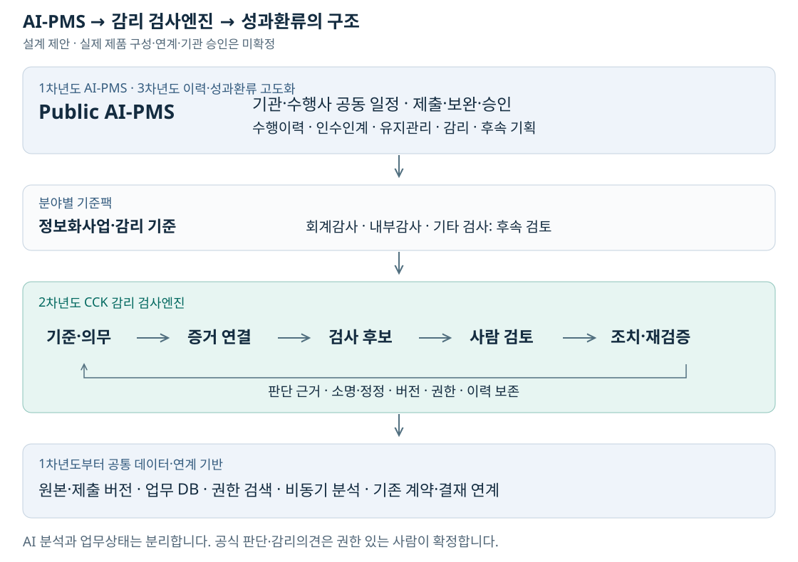

# CCK Public AI-PMS 서비스 설명서

- 작성일: 2026-09-10 / 설명자료 v1.1
- 독자: 사업 검토자, 발주기관 담당자, 수행사 PM, 감리·운영·기획 담당자
- 상태: **사업·설계 제안. 실제 엔진·PMS 구현, 기관 승인, 도입 효과 실증 전.**
- 연결: [HTML 설명자료](CCK_Public_AI_PMS_설명서.html) · [아키텍처 SVG](CCK_Public_AI_PMS_아키텍처.svg)
- 기준: 참조 대화 사용자 발언 21건과 기존 조사·구조화 문서. 이전 추가 5건은 [기존 보존본](대화추가_2026-09-10.json), 이번 6건을 포함한 전체는 [21개 턴 보존본](대화전체_설계계속_2026-09-10.json)에 기록.
- 가정: 첫 적용은 공공 정보화사업. TS의 실제 실증 수요·법적 권한·기존 과업과 비중복은 미확정.

## 1. 한 문장과 사업 정의

**공공서비스를 만드는 사업에서 누락·재작업·관리 단절을 줄이기 위해, 담당자와 수행업체의 일상 업무에 기준·증거·검사·보완을 연결합니다.**

1차년도에 AI-PMS를 구축해 공동 업무와 근거를 축적하고, 2차년도에 CCK의 감리 검사엔진을 구축합니다. 3차년도에는 다면평가·기업 레퍼런스·성과환류를 고도화합니다. 공통 검사·검증 구조는 장기 설계이며 실제 엔진 보유·성능은 미확인입니다.

핵심 흐름은 **공동 업무처리 → 이행근거·수행이력 축적 → 인수인계·유지관리 → 감리·평가·후속 기획**이다. CCK의 핵심을 검사로 보는 사용자의 구상을 반영하며, 공통 엔진의 실제 보유 여부와 성능을 확인한 것은 아니다.

직접 사용자는 기관 담당자·수행업체·감리원이다. 최종 국민 편익은 대상 공공서비스의 장애·반복 불편 감소와 연결해 검증해야 한다. 관리 효율 자체만으로 국민 효과를 확정하지 않는다.

## 2. 육하원칙

| 구분 | 정의 |
|---|---|
| 왜 | 관리 단절·재작업·판단 근거 부족을 줄여 품질·연속성을 지원 |
| 무엇을 | 공동 일정·산출물 처리와 기준·증거·검사·보완·이력을 연결 |
| 누가 | 기관 담당·검토·승인자, 수행사 PM·실무자, 감리원, 운영·기획 담당자 |
| 언제 | 착수 기준 확정부터 수행·검수·유지관리·차기 발주까지 |
| 어디서 | 기관이 허용한 업무환경과 기존 계약·전자결재·PMS 연계 |
| 어떻게 | 공통 엔진에 분야별 기준 적용, AI 후보를 권한 있는 사람이 검토·확정 |

## 3. 왜 도입하는가: 현행과 기대 변화

아래 현행은 사용자 경험에서 도출한 문제 가설이며 기관 전체의 실태조사 결과가 아니다.

| 현행 문제 가설 | 도입 후 처리 | 실측 지표 |
|---|---|---|
| 기준을 다시 찾고 해석 | 조항·버전·완료조건을 업무에 연결 | 근거 탐색 시간·잘못된 적용 |
| 기관·업체가 각자 일정 취합 | 양측 일정과 대기 원인을 공동 확인 | 중복 입력·확인 연락 |
| 파일 제출만으로 진행 판단 | 제출·검토·보완·승인과 증거를 분리 | 검토 누락·미결 체류 |
| 지적·답변이 연락에 흩어짐 | 발견사항마다 소명·보완·재검증 연결 | 반복 보완·정정 소요 |
| 담당자 교체 때 재학습 | 목적·결정·현재 미결·후속 책임 연결 | 인수인계 시간·기간 누락 |
| 평가·후속 기획의 근거 부족 | 확정 이력·피드백으로 대안 비교 | 근거 연결률·문제 재발 |

AI는 비정형 문서의 의미·표현 차이, 요구사항과 시험증거의 대응, 상충·누락 후보 확인을 돕는다. 날짜·권한·승인은 규칙과 업무 절차로 처리한다.

현행 방식, 기존 PMS 설정·연계, 규칙 기반 검토, AI 지원을 같은 자료로 비교한다. 기존 일정·산출물 기능과 겹치는 부분은 재사용하며 AI 오탐·입력·수정·운영 부담을 포함해 추가 가치를 판단한다.

## 4. 공통 검사·검증 엔진과 서비스 기능

공통 반복구조: **기준 → 증거 → 검사 → 사람 판단 → 조치 → 재검증 → 이력**.

서비스는 사업·일정 공동관리, 문서·증거, AI 검사, 검토·보완·재검증, AI·감리사 두 경로, 기업 수행이력, 전주기 운영·개선의 7개 영역이다. 상세 기능 ID는 참조 AI 답변의 F-01~17과 맞췄으며 기존 PMS-F ID와는 별도 이름공간이다.

| ID | 기능 | 사용자 | 목적 | 관리 입력 | 결과 | 범위 제안 | 판단 경계 |
|---|---|---|---|---|---|---|---|
| F-01 | 사업공간·계약 | 기관·수행사 | 사업·계약·역할·서비스를 연결 | 목적·책임·연결 계약 | 사업공간·서비스 식별자 | 1차년도 | 최종 계약과 전결 확인 |
| F-02 | 기준·의무 관리 | 기관 검토자 | 법령·계약에서 적용기준 후보 추출 | 원문·적용 의무·책임·기한·완료조건 | 공동 검토·권한자 확정 Baseline 버전 | 1차년도 | 사람이 적용 여부 확정 |
| F-03 | 공동 일정 | 기관·수행사 | 양측의 선행조건과 4종 날짜 관리 | 최초·승인·예상·실제 일정 | 공동 WBS·대기 원인 | 1차년도 | 대기 시간과 귀책 구별 |
| F-04 | 역할별 업무함 | 기관·수행사 | 지금 처리할 제출·검토·회신 안내 | 대상·책임자·기한·다음 행동 | 업무 요청·응답 이력 | 1차년도 | 권한·위임·수신 범위 적용 |
| F-05 | 제출·버전 | 수행사 | 산출물과 요구사항·시험증거 연결 | 제출시각·원본·대상 버전 | 변경 불가 제출 이력 | 1차년도 | AI 실패에도 정상 접수 유지 |
| F-06 | 제출 전 자체점검 | 수행사 | 같은 기준으로 누락 후보를 먼저 확인 | 필수 항목·증빙 부족 후보 | 자체점검 결과 | 1차년도 | 사전 점검은 공식 승인 아님 |
| F-07 | AI 산출물 검사 | 검토자 | 형식·정합성·증거·요구사항을 대조 | 요구사항별 근거 위치와 미검토 구간 | 근거를 연결한 검사 후보 | 1차년도 기초 검토 / 2차년도 검사엔진 | 찾지 못함과 부적합 구별 |
| F-08 | 발견사항 관리 | 검토자 | AI 후보와 사람의 지적을 별도 기록 | 근거·중요도·확정 상태 | Finding 원장 | 1차년도 기본 이슈 / 2차년도 구조화 Finding | 자동 업체 잘못 확정 금지 |
| F-09 | 보완·소명 | 기관·수행사 | 보완자료·이견·계약 근거를 공식 연결 | 요청·응답·책임·처리기한 | 보완·소명·정정 이력 | 1차년도 | 정당한 이견·철회 보존 |
| F-10 | 재검증·승인 | 검토·승인권자 | 수정된 증거를 현재 버전에서 재확인 | 해결·부분·미해결·유보 | 확정 판단·결정 근거 | 1차년도 | PMS 승인과 공식 검사 구별 |
| F-11 | AI·감리사 두 경로 | 감리원·감리법인 | 상시 분석과 독립 전문검토 연결 | 차이점·현장 확인·시정 증거 | 감리 검토·시정·재검증 | 2차년도 | AI 결과와 감리의견 자동 합의 없음 |
| F-12 | 기업 수행이력 | 기관·기업 | 사업·역할별 확인된 품질·대응 기록 | 역할·기간·성과·소명·정정 | 근거 있는 레퍼런스 | 1차년도 기초 이력 / 3차년도 고도화 | 자료 없음은 저성과 아님 |
| F-13 | 주기적 만족도·다면평가 | 담당·검토·관리·결재·업무부서·사용자 | 협업·산출물·서비스·PMS 경험 분리 | 관찰 범위·시점·목적별 항목·근거 | 목적별 피드백 | 1차년도 주기적 다면평가 / 3차년도 분석 | 관찰 불가·미응답은 0점 아님 |
| F-14 | 유지관리 | 운영 담당자 | 하자·운영·라이선스·지원 기간 연결 | 기산 사건·책임·지원 공백 | 기간·미결 장애·다음 준비 | 1차년도 핵심 / 3차년도 성과 연계 | 기간 만료로 장애 자동 종결 금지 |
| F-15 | 인수인계 | 새 담당자 | 목적·결정·현재 미결·다음 업무 제공 | 원문과 연결된 사업 브리핑 | 역할 인계·권한·미결 목록 | 1차년도 | 기존 결정 이력 보존 |
| F-16 | 개선 대안 | 업무·기획 담당자 | 현 계약 보완·운영 개선·신규 투자를 비교 | 문제·원인·영향·비AI 대안 | 개선 후보·보류 사유 | 3차년도 | 신규 구축만 추천하지 않음 |
| F-17 | 차기 RFP | 발주 기획자 | 확정 문제를 검증 가능한 요구로 전환 | 목표·완료조건·시험·추적 | RFP 초안과 근거 연결 | 3차년도 | 발주 타당성과 공식 절차 별도 |

**주기적 만족도·다면평가 기초·기본 수행이력·인수인계·유지관리 핵심은 1차년도에 포함한다.** 대화 중 달랐던 단계 배치를 이렇게 종합했다. 공식 기업등급·입찰 활용·기관 간 공유는 별도 권한과 기준을 확인한다. 자료가 없는 신규 업체를 저성과로 처리하지 않는다.

기업 레퍼런스는 회사×사업×실제 역할×기간별 확인 사실을 기본으로 하고, 소명·정정·긍정적 성과도 함께 보여준다. 협업·산출물·서비스·PMS 만족도를 목적별로 나누고 주관적 의견과 확정된 이행기록을 구별한다.

## 5. 공동 처리 흐름: 산출물 하나의 끝까지

| 단계 | 담당 | 처리 | AI 지원 | 남는 기록 |
|---|---|---|---|---|
| 기준 확정 | 기관·수행사·승인권자 | 원문에서 추출한 요구·책임·기한·완료조건을 공동 검토하고 권한자가 기준 버전을 확정합니다. | 의무·제출물·조항을 후보로 추출합니다. | 기준 버전 · 확정자 · 완료조건 |
| 작성·자체점검 | 수행업체 | 산출물을 작성하고 제출 전에 동일 기준으로 확인합니다. | 누락·상충·증빙 부족 후보를 보여줍니다. | 초안 · 자체점검 결과 · 접근 범위 |
| 공식 제출 | 수행업체 | 과업·요구사항에 해당 버전과 증거를 제출합니다. | 접수 후 별도 작업으로 분석을 시작합니다. | 제출시각 · 원본 · 버전 · 접수증 |
| 근거 검토 | 기관 검토자 | 원문과 증거를 보고 지적의 타당성을 판단합니다. | 1차년도 기초 검토를 지원하고, 2차년도에는 고정 기준·증거·Test로 구조화 검사 후보를 만듭니다. | 후보 · 확인 근거 · 판단 · 검토 회차 |
| 보완·소명 | 수행업체 + 기관 | 자료를 보완하거나 계약 근거로 이견을 설명합니다. | 이전 지적과 답변·수정 위치를 연결합니다. | 요청 · 답변 · 소명 · 변경 요청 |
| 재검증·확정 | 검토자·승인권자 | 현재 버전의 실제 증거로 해소·유지·철회를 확정합니다. | 보완 전후의 차이와 남은 확인을 정리합니다. | 재검증 · 확정자 · 근거 · 유효 버전 |
| 이력 재사용 | 기관·운영·기획 | 확정 기록을 인수인계·유지관리·기본 레퍼런스에 연결합니다. | 권한 있는 원문을 근거로 요약·초안을 제공합니다. | 역할별 이력 · 정정 · 다음 조치 |

### 시험결과서 설명 사례

결과서에 성공 수치가 있지만 원시 로그를 찾지 못하면 AI는 추가 증거 필요 후보를 제시한다. 담당자가 타당성을 검토하고 수행사는 증거를 추가하거나 다른 첨부의 로그로 소명한다. 검토자는 현재 제출 버전에서 해소·유지·철회·정정을 판단한다. 로그가 검색되지 않았다는 사실만으로 시험 실패나 업체 부실을 확정하지 않는다.

### 세 가지 상태

- 업무 상태: 작성·제출·검토·보완·재검증·승인.
- AI 상태: 대기·분석 중·완료·일부 추출·실패.
- 공식 계약 절차: 해당 제도·권한에 따른 검사·인수·변경 확정.

정상 접수 후 AI 분석이 실패해도 원래 제출시각과 버전을 유지한다. 재시도·수동 검토 경로를 제공한다. 구버전의 분석 결과로 최신 제출본을 승인하지 않는다.

### 일정·책임·접근

최초 계획일·현재 승인일·예상일·실제 이행일을 분리한다. 기관 검토·자료 제공, 업체 보완, 외부 선행조건을 구별하고 대기시간을 귀책·벌점으로 자동 변환하지 않는다.

공유 업무는 함께 보되 기관 내부 메모·수행사 미제출 초안·타 기업 영업자료를 구분한다. 담당자 변경은 현재 역할과 미결 과업을 인계하고 과거 행위자는 기록에 남긴다.

하자·운영·라이선스·제조사 지원은 각 기산 사건과 기간을 관리한다. 시작이 미확정이면 종료일도 미확정이다. 기간 만료가 미해결 장애의 자동 종결을 뜻하지 않는다.

## 6. AI와 감리사의 두 경로

동일한 접근권한 내에서 기준·산출물·시험증거·변경이력을 활용한다. **AI의 상시 검사 지원과 감리사의 독립 전문검토**를 연결하는 후속 모듈이다.

| 경로 | 주요 역할 | 경계 |
|---|---|---|
| AI 검사 지원 | 분석 가능한 문서·요구사항 대조, 누락·불일치·증빙 부족 후보, 보완 차이 | 추출 실패·미확보·미검토 범위 표시. 법정 감리·감리의견으로 표시하지 않음 |
| 감리원·감리법인 | 사업 맥락·중요도·범위, 현장·시스템 확인, 인터뷰, 추가 전문검사 | 해당 권한에 따라 감리의견·시정 확인을 독립 판단 |
| 차이점 검토 | 상충 의견·증거 차이를 검토하고 보완·재검증 | AI와 사람이 동의했다는 사실만으로 정확성 증명 불가 |

등록된 모든 항목을 검사 대상으로 삼는 것과 모두 검증 완료인 것은 다르다. 후속 장애가 발생했다고 감리 부실을 자동 판정하지 않고 당시 범위·확인 가능성·근거·시정 확인을 검토한다. 감리 자격·전문성에 대한 우려는 사용자 의견이며 전체 감리원의 실태로 일반화하지 않는다.

## 7. 기술 아키텍처

1. 업무 서비스: Public AI-PMS의 공동 일정·제출·검토·승인·이력·운영·감리·기획.
2. 분야별 기준팩: 정보화사업·감리 기준. 회계감사·내부감사·기타 검사는 후속 검토.
3. 공통 엔진: 기준·의무, 증거 연결, 검사 후보, 사람 검토, 조치·재검증, 소명·정정·이력.
4. 데이터·연계: 원본·버전, 업무 DB, 권한 검색, 비동기 분석, 계약·결재 시스템.

핵심 객체: STANDARD → CONTROL → OBJECT → EVIDENCE → TEST → FINDING → REVIEW → ACTION → RETEST → CONCLUSION.

각 항목은 기준·세부조건·대상·증거·방법·발견사항·검토·조치·재검증·결론이다. 서비스 하나에 여러 사업·계약이 연결될 수 있다.

문서 등록 → 형식·권한 확인 → 문단·표·셀 추출 → 추출 품질 기록 → 적용 요구사항 목록별 대조 → 근거 검색 → AI 후보 → 형식·인용·버전 확인 → 사람 검토로 처리한다. 검색 상위 일부 결과만으로 전체 충족을 확정하지 않는다.

접수와 무거운 분석을 분리하고 중복 요청·재시도·동시 수정·구버전 승인을 제어한다. 파일 저장과 업무 DB의 불일치 보정, 권한 철회와 캐시 정리, 복구 절차를 설계한다. API·파일·검색·캐시에 같은 권한을 적용한다.

계약·전자결재의 공식 원본과 PMS 업무 기록의 책임을 필드별로 정한다. 분석 장애를 이유로 임의로 외부 모델에 전송하지 않는다. 기존 인증·문서·검색·LLM 기반과 계약 범위를 확인해 재사용과 신규 구현을 구별한다.

다른 분야로의 확장은 공통 구조 재사용 가설이다. 업무별 법적 지위·검사방법·데이터·전문가·최종 권한을 검증해야 하며 기준팩만 바꾸면 즉시 호환된다고 보장하지 않는다.

## 8. 정량 편익: 설명용 가정과 산식

**아래는 가상 계산이며 실측 효과·공표 임금·확정 견적이 아니다.** 기관·수행사의 동일 기간·범위 업무를 합산하는 예시이며 현금 예산 절감·감축 인원으로 환산하지 않는다.

| 업무 | 현행 시간/사업·년 | 감소 가정 | 총감소 시간 |
|---|---|---|---|
| 계약·지침·과거자료 탐색 | 300 | 20% | 60.0 |
| 진행 취합·보고·추적 | 500 | 25% | 125.0 |
| 산출물 검토·사전점검 | 400 | 20% | 80.0 |
| 담당자 변경·인수인계 | 80 | 30% | 24.0 |
| 감리·검수 증거 준비 | 200 | 20% | 40.0 |

| 추가 입력 | 예시값 | 해석 |
|---|---|---|
| 연간 사업 수 | 10건 | 동일 범위의 업무량을 갖는다고 가정 |
| 시간당 환산 단가 | 50,000원 | 공식 단가가 아닌 임의 입력값 |
| 추가 검토·수정 | 40시간/사업 | 오탐 확인·수정·중복 입력 등 추가 부담 |
| 연간 운영비 | 6,000만원 | 모델·인프라·운영·유지비 가정 |
| 초기 구축·연계비 | 10,000만원 | 교육·이관 등 일회성 비용 가정 |
| 단순 배분 연수 | 3년 | 할인·효과 발현 시점·잔존가치 제외 |

산식:

- 순확보 시간 = Σ(현행 시간 × 감소율) − AI 오탐 확인·수정 등 추가 시간.
- 도입 후 시간 = 현행 시간 − 순확보 시간.
- 연간 시간가치 = 순확보 시간 × 적용 단가 × 연간 사업 수.
- 연환산 차이 = 연간 시간가치 − 연간 운영비 − 초기 구축·연계·교육비 ÷ 배분 연수.

### 기본 가정 계산 결과

- 현행 1,480시간 → 총감소 329시간.
- 추가 부담 40시간을 빼면 **순확보 289시간/사업**, 도입 후 1,191시간.
- 시간가치는 사업당 1,445만원, 연간 10개 사업에서 **14,450만원**.
- 연환산 구축·운영비는 **9,333.3만원**, 차이는 **5,116.7만원**.
- 이것은 단순 연환산 설명이며 정식 B/C·현금흐름·투자회수 결과가 아니다. HTML에서 가정을 바꿔 음수와 비용 증가도 확인할 수 있다.

이전 대화의 329시간은 추가업무 차감 전 총감소 가정이다. 본 자료는 추가업무 40시간을 별도로 차감하고 공식 임금 대신 명시적인 가상 단가를 사용하므로 이전 답변의 편익 금액과 같지 않다.

감리 준비·기관 대응·인수인계를 위 업무에 포함한 뒤 다시 더하지 않는다. 위험회피·재작업·지연 비용은 사건별 발생확률·실제 손실·기여도를 검증하기 전 합계에서 제외한다. 기관 전체 예산이나 시장규모에 임의 감소율을 곱해 실현 편익으로 표시하지 않는다.

## 9. 기능과 편익의 연결

| 업무 | 개선 메커니즘 | 실측 지표 | 산정 |
|---|---|---|---|
| 계약·지침·과거자료 탐색 | 기준·의무와 원문 위치 연결 | 정확한 근거를 찾는 순소요시간 | 동일 범위 순소요시간 차이 × 업무별 적용 단가 |
| 진행 취합·보고·추적 | 공동 일정·업무함·사건 기반 보고 | 취합·입력·확인 연락 시간 | 동일 범위 순소요시간 차이 × 업무별 적용 단가 |
| 산출물 검토·사전점검 | 요구사항별 증거와 누락 후보 | 검토시간·오탐 재확인·누락 | 동일 범위 순소요시간 차이 × 업무별 적용 단가 |
| 담당자 변경·인수인계 | 미결·결정·계약 브리핑 | 업무 파악 시간·인계 누락 | 동일 범위 순소요시간 차이 × 업무별 적용 단가 |
| 감리·검수 증거 준비 | 수행 중 증거와 조치 이력 축적 | 증거 수집·정리 시간 | 동일 범위 순소요시간 차이 × 업무별 적용 단가 |

### 사회적 편익의 지표

- 판단의 투명성: 근거가 연결된 평가 비율, 소명·정정 처리시간, 후속 조회의 정정 반영률.
- 행정의 연속성: 인수인계 후 재문의·미결 누락·계약 지원기간 누락, 업무 파악 시간.
- 국민 서비스 품질: 초기 장애·반복 결함·이용 실패·서비스 만족도. 대상 서비스와 인과를 확인.
- 공정한 기업 이력: 실제 역할 확인률, 동일 기준 적용, 자료 부족 표시, 소명·정정 접근성.

관계·카르텔 감소, 업체선정 실패 예방, 사업 성공률 향상은 효과 가설이다. 독립적 실증 없이 달성한 성과나 금전편익으로 넣지 않는다.

## 10. 개발 순서와 실증

개발 연차 Y1~Y3와 사업 내부 업무 단계 B1~B3를 구분한다. 실제 시작연도·예산은 미확정이다.

| 연차 | 목표 | 범위 | 산출물 | 다음 연차 조건 |
|---|---|---|---|---|
| 1차년도 | AI-PMS 플랫폼 구축 | 사업등록·기준 초안과 승인 · 공동 WBS·역할별 업무함 · 제출·버전·증거·보완·소명 · AI 문서탐색·추출·기초 자체점검 · 주기적 만족도·다면평가 기초 수집 · 인수인계·유지관리 핵심 | 운영 가능한 AI-PMS와 버전이 고정된 Baseline·Evidence·업무이력 | 정상·실패·소명·권한·최신 버전 검증 통과, 현행 대비 입력 부담·순시간 측정 |
| 2차년도 | AI 감리 검사엔진 구축 | 버전별 Control·Test와 검사 실행 · 누락·정합성·추적성·증빙 충분성 검사 · 정보시스템 감리 기준팩 · Finding 후보·전문검토·시정·재검증 · AI와 감리사의 일치·불일치·동시 미발견 검증 | 정보화사업용 검사엔진·감리 지원 모듈과 검증 데이터셋 | 분리된 시험자료와 독립 전문가 검토로 오류·미탐·근거 정확성 평가, 감리 판단권한 확인 |
| 3차년도 | 레퍼런스·성과환류 고도화 | 기업×사업×실제 역할별 레퍼런스 · 다면평가 시계열·소명·정정 반영 · 운영 성과·만족도·개선 대안 · 차기 RFP 근거와 검증조건 초안 · 기관별 기준·권한 설정과 확장 검증 | 근거 중심 레퍼런스·개선/RFP 지원과 기관별 적용 모델 | 평가 기준·표본·활용권한·신규기업 보호 확인, 예측은 데이터 충족 시에만 실증 |

1차년도는 기초 AI 문서 지원과 공동 업무 완결에 집중한다. 2차년도에 버전별 검사·Finding·감리 기준팩·독립 검토를 구축하고, 3차년도에 레퍼런스·평가·성과환류를 고도화한다. 전체를 독립 R&D로 재분류하지 않는다.

협업·컨소시엄 지원은 후속 활용이다. 기관은 필요 역량·역할을 정의하고 기업은 적법한 수행이력으로 보완 역량을 검토한다. 비공개 평가정보 공유나 특정 업체의 자동 선정은 승인된 기능이 아니다.

실증은 업무 유형·난이도·참여자·문서 버전을 맞춰 현행/규칙 기반/AI 지원을 비교한다. 사업 변화·학습효과가 섞이는 단순 전후 비교의 한계를 기록한다. 표본·허용 오류·성공 기준을 결과를 보기 전에 정한다.

확인할 항목은 순업무시간, 누락·불리한 오판과 정정, 기관·업체의 총 입력 부담, 대상 공공서비스의 품질·연속성이다. 감리원의 AI 의견 확인만을 독립 평가로 표시하지 않는다. 실제 사용자 참여 평가가 필요하다.

단계별 기간·예산·목표값·구매·심의 경로는 실제 사업조건 확인 후 결정한다. 운영 효율화의 인력 영향을 숨기거나 시간을 감축 인원으로 변환하지 않는다.

### P01~P07

| 기준 | 초점 | 확인 |
|---|---|---|
| P01 | 국민 편익 | 대상 공공서비스의 장애·반복 불편 감소까지 인과를 확인 |
| P02 | 현업·인력 영향 | 시간의 재배치·품질 향상을 평가하고 감축 인원으로 환산하지 않음 |
| P03 | AI 추가 가치 | 기존 PMS·규칙 기반·AI 지원을 같은 자료로 비교 |
| P04 | TS 업무 연결 | 실증 업무·실제 조직·수행 권한을 특정 |
| P05 | 확장성 | 공통 엔진과 기관·분야별 기준·권한을 분리 |
| P06 | 기관·법적 근거 | 설치 근거·업무·위탁 관계를 구분해 확인 |
| P07 | 재정·책임 | 운영·연계·오류비용을 포함하고 규모별 절차 검토 |

## 11. 요구·설계·수치의 확인 수준

| 항목 | 근거 | 상태 |
|---|---|---|
| 사용자 요구 | 공공 PMS 병목 관리의 발언 21건 | 2026-09-10 본문 확인. 기관 공식 결정은 아님 |
| 기존 조사 | 2026-09-09 조사·구조화 및 16개 출처 원장 | 당시 확인 수준 유지. 이번 외부 현행성 재검증 없음 |
| CCK 엔진·17개 기능·감리 두 경로 | 사용자 구상과 참조 AI 제안의 종합 | 실제 엔진 자산·성능·시스템 구현·법적 적용 미확정 |
| 업무량·감소율 | 참조 AI의 가상 예시 | 예측·실증 계수로 승격하지 않음 |
| 50,000원·추가업무·사업수·구축운영비 | 이번 설명서 임의 입력값 | 공표 임금·실제 급여·견적 아님 |
| 이전 시제품·24개 점검 | 참조 답변의 완료 주장 | 실제 파일·시험기록 미확보 |
| 이번 HTML 동작 | 별도 제작·검증 기록 | 설명자료의 동작 검사이며 PMS/AI 실증 아님 |

신규 요구 연결:

| 요구 ID | 원발언 | 내용 | 반영 |
|---|---|---|---|
| PMS-R21 | PMS-T11 | 아키텍처를 시각 자료로 설명 | HTML 아키텍처·독립 SVG |
| PMS-R22 | PMS-T12 | AI·감리사 두 경로 | 감리 절·F-11 |
| PMS-R23 | PMS-T13 | 전체 서비스 구조 재정리 | 서비스 7개 영역·흐름·개발 단계 |
| PMS-R24 | PMS-T14 | CCK 검사 중심의 기능정의 | 공통 엔진·분야별 기준팩·F-01~17 |
| PMS-R25 | PMS-T15 | 도입 이유와 정량·사회경제 편익 | 도입 전후·편익 계산·실증 설계 |
| PMS-R26 | PMS-T16 | AI 검사와 사람 감리의 두 경로로 문서·산출물 타당성 확인 | AI·감리 / B3 / Y2 |
| PMS-R27 | PMS-T16 | 주기적 만족도와 직접 담당·중간관리·최종 결재 등 다면평가 | 평가 영역 / EV01~07 / Y1 수집·Y3 활용 |
| PMS-R28 | PMS-T16 | 우수·미흡 수행의 근거를 남기고 신규기업의 도전 기회 지원 | 레퍼런스 운영 규칙 / Y3 |
| PMS-R29 | PMS-T17 | 전체 구조를 1:1 한 장으로 설명 | 연차별_구조한장.svg |
| PMS-R30 | PMS-T18 | 업무 1단계 사업등록·기준설정 상세화 | B1 / BL-01 / 상세설계 |
| PMS-R31 | PMS-T19 | 업무 2단계 공동 수행·산출물·Evidence 관리 | B2 / EX-01 / 상세설계 |
| PMS-R32 | PMS-T20 | 업무 3단계 AI 검사·검토·소명·재검증 상세화 | B3 / IN-01 / 상세설계 |
| PMS-R33 | PMS-T21 | 1차 목표 AI-PMS, 2차 목표 감리엔진과 2·3차년도 고도화 | Y1~Y3 / 기능별 연차 / 아키텍처 |

기존 요구 PMS-R01~20의 상세 연결은 [요구 추적표](../대화확인_변경점과_요구사항추적표.md)에 있다. 기존 원장은 보존하고 이번 확장 R21~33은 이 설명자료에서 별도로 관리한다. 원대화 F-01~17은 사용자 직접 명세가 아닌 AI 제안이며 [설명 데이터](설명자료_데이터.json)의 legacy_req에서 이전 요구와 연결한다.

새 답변에 인용된 시장규모·공표 임금·다른 분야의 생성형 AI 생산성 연구 수치는 이번 자료에서 검증된 사실이나 실현 편익으로 채택하지 않았다. 별도 공식 원문 조사와 공공 PMS 현장 적용성 검토가 필요하다.

## 12. 이번에 구체화한 업무 설계와 다면평가

| 업무 단계 | 입력 | 처리 | 결과 | 개발 범위 |
|---|---|---|---|---|
| B1 사업등록·기준설정 | RFP·계약·협상 결과·수행계획·적용 지침 | AI 초안 → 기관 검토 → 수행사 의견 → 충돌 조정 → 권한자 승인 → 기준 버전 고정 | Baseline + Requirement + 책임·기한·완료조건·평가 계획 | 1차년도 핵심 / 2차년도 검사기준으로 확장 |
| B2 사업수행·증거축적 | 승인 Baseline·공동 WBS·작성 중 산출물 | 과업 수행 → 자체점검 → 공식 제출 → 원본·버전·접수 기록 → 기관 검토함 → 비동기 분석 | Submission + Evidence + 업무·요청·회의·변경·평가 시점 이력 | 1차년도 핵심 / 2차년도 감리 입력으로 재사용 |
| B3 AI 검사·사람 검토 | 대상 기준·제출본의 고정 버전 + Evidence + Test | 검사 실행 → Finding 후보 → 사람 확인·유보·철회 → 보완·소명 → 현재 버전 재검증 → 확정 이력 | InspectionRun + Finding + Review + Action + Retest | 1차년도 기초 검토 / 2차년도 감리 검사엔진 |

| 평가자 | 관찰 영역 | 근거 | 경계 |
|---|---|---|---|
| 직접 사업 담당자 | 합의된 일정·요청 대응·협업 | 요청·회신·변경 사유·업무 기록 | 기술 적합성을 혼자 확정하지 않음 |
| 산출물·기술 검토자 | 요구 충족·시험 증거·보완 품질 | 검토 회차·확정 Finding·시험자료 | 검토한 산출물·전문 영역으로 제한 |
| 중간관리자 | 쟁점 공유·의사결정 지원·위험 대응 | 보고·회의·상향 요청과 처리 | 관찰하지 않은 일상 수행은 평가 불가 |
| 최종 결재자·책임자 | 사업목적 달성·중요 결정의 적절성 | 확정 성과·범위 변경·의사결정 자료 | 직급에 따라 자동 가중하지 않음 |
| 관련 업무부서 | 업무 적합성·요구 반영·업무 전환 | 사용자 검증·교육·업무 적용 결과 | 참여·관찰 범위와 평가 시점을 함께 기록 |
| 실서비스 사용자 | 이용 편의·접근성·문제 해결 | 사용 맥락·시점·설문·불편 신고 | 서비스 경험을 기업 귀책으로 자동 환산하지 않음 |
| 감리원·전문가 | 검증 범위의 적합성·증거·시정 확인 | 독립 감리·전문검토와 재확인 | 감리의견과 만족도 점수를 구별 |

| 평가 시점 | 수집 | 집계 규칙 |
|---|---|---|
| 착수 | 평가 대상·역할·항목·관찰 범위·주기를 사전 정의 | 현재 문제와 기대를 기준선으로 기록 |
| 정기 점검 | 사업이 정한 월간·주기별 협업 및 업무부서 점검 | 주기는 사업별 설정, 모든 역할에 같은 설문을 반복하지 않음 |
| 주요 산출물 | 제출·검토·보완·승인 사건에 연결 | 검토자 중심의 관찰 가능한 품질 기록 |
| 시험·종료 | 업무부서·책임자·실사용자 목적별 평가 | 협업·산출물·서비스·PMS 경험을 별도 집계 |
| 운영 | 사용 경험·장애·유지관리와 개선 확인 | 표본·응답률·역할 변화 및 정정 이력 표시 |

평가 대상·주기·역할·질문을 착수에 정하고 주기적 점검·산출물·시험·종료·운영에 연결한다. 수행 사실, 검사·감리 결과, 주관적 평가를 분리해 보여준다. 관찰 불가·미응답은 0점이 아니다.

우수·미흡 수행은 확인된 근거·영향·소명·개선 결과와 함께 레퍼런스에 남긴다. 내부 점수 증감도 사전 기준과 정정 절차가 필요하며, AI 후보·보완 횟수·지연 일수를 자동 벌점으로 바꾸지 않는다. 신규기업의 무이력은 미평가로 처리한다. 공식 입찰 가감점·제재·기관 간 공유는 별도 법적 근거와 권한을 확인한다.

구체적인 Baseline·Evidence·Finding 필드, 상태전이, 화면 5종, API 계약 초안, 수용 시나리오, 평가척도 후보와 운영 규칙은 [연차별·업무별 상세설계](CCK_Public_AI_PMS_연차별_상세설계.md)에 있다. 이 API와 제품 시나리오는 아직 구현·실행하지 않았다.

### 연차별 편익 측정

| 연차 | 우선 측정할 지표 |
|---|---|
| 1차년도 | 탐색·취합·인수인계·증거 준비의 순시간 및 미결 누락 |
| 2차년도 | 순검토시간·조기 발견·중요 누락·보완 반복 및 오탐 비용 |
| 3차년도 | 정정 반영·평가 근거 충족·문제 재발·서비스 품질 |

기존 계산기는 하나의 운영기간에 대한 가상 계산이다. 비용배분 3년은 제품 개발 3개년과 별개다. 연차별 적용 업무량·효과 발현·순시간·추가비용을 실측하고 같은 시간을 여러 연차 효과에 중복 합산하지 않는다.

## 13. 사용 방법과 다음 입력

- HTML 파일은 브라우저에서 직접 연다. 외부 라이브러리·폰트·데이터 호출 없이 화면과 예시 계산이 작동한다. 목차·단계 선택·예외 설명·편익 계산·인쇄를 제공한다.
- HTML 자체 화면·계산에는 한 파일이면 된다. Markdown·SVG·검증문서 다운로드 링크까지 유지하려면 같은 폴더를 함께 옮긴다.
- Markdown은 본 문서를 편집하고, SVG는 보고서·슬라이드의 정확한 구조도로 사용할 수 있다.
- 동작 예시는 메모리 안에서 설명만 바꾸며 실제 업무자료를 저장·전송하지 않는다.
- 후속 입력은 실제 계약·산출물·검토 사건, 기관·업체 역할, 현행 시스템·이용권한·문서 표본과 실제 비용이다.

[제작·검증 범위](설명자료_검증.md) · [설계·수용기준](설명자료_설계.md) · [기존 조사](../공공PMS_병목관리_조사보고서_2026-09-09.md) · [기존 구조화](../공공PMS_전체구조화_2026-09-09.md) · [출처목록](../출처목록.md) · [후속조사](../후속조사_대기열.md)
