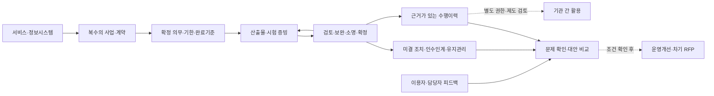

# 공공 PMS 병목 관리 관련 조사
부제: 공공사업 이행근거·병목관리 AX의 차별성, 평가 절차와 TS 적용 가능성

- 조사일: 2026-09-09 / 버전: v0.1
- 상태: 관련 조사 초안. 기관 승인·사업 선정·예산 확보 문서가 아니다.
- 독자: 사업기획자, 발주기관 사업담당자·정보화·계약·감사 담당자
- 참조: [공공 PMS 병목 관리 대화](chatgpt-conversation://6aa098d5-82b0-83e9-81af-668c665dc3b4)
- 근거: [출처목록](출처목록.md), [출처원장](출처원장.json), [후속조사 대기열](후속조사_대기열.md)
- 표기: **사실**은 열람한 자료의 확인 범위, **가설·제안**은 이번 조사자의 해석과 설계, **미검증**은 추가 확인 대상이다.

## 1. 결론

**공공 PMS를 활용한 사업관리·평가 지원은 검토할 가치가 있다. 다만 일정·산출물·만족도 기능의 통합만으로 신규성을 주장하기는 어렵다.** 국내 기관 규정과 제품에 이미 관련 기능이 나타난다. 이번 구상의 경쟁력은 다음 세 가지를 실제 사업자료로 입증할 수 있는지에 달려 있다.

1. 서로 다른 문서에서 계약 의무와 이행증거를 정확히 연결하는가.
2. 제출 지연, 기관 검토 대기, 승인되지 않은 변경을 구분하여 다음 조치를 설명하는가.
3. 담당자가 바뀌어도 근거·소명·정정 이력이 남아 평가와 유지관리 판단을 재현할 수 있는가.

**권고 진입안은 기존 PMS·문서관리와 연계하는 ‘공공사업 이행근거·병목관리 AX’다.** 정보화사업의 한 산출물이 제출→검토→보완→승인되는 흐름부터 검증하고, 인수인계·하자 및 유지관리·만족도 기록을 연결한다. 수행기업의 종합등급, 입찰 배점, 기관 간 평가정보 공유, 컨소시엄 추천과 감리 전문기능은 각기 별도 조건을 확인해 확장한다.

상위 목적은 공공계약의 공정성·책임성과 공공서비스 품질이다. 일상 사용 가치는 확인 연락과 문서 재탐색 부담을 줄이는 것이다. 초기 성과는 **판단 근거의 추적성, 잘못된 귀책의 정정, 검토 누락 및 관리 단절 감소**로 측정한다. 카르텔 감소나 국민 서비스 개선이 이미 입증됐다고 주장하지 않는다.

**TS의 자체 정보화사업 관리 실증과 TS가 범정부 기업평가를 운영하는 사업은 권한·주체가 다르다.** 전자는 수요를 확인할 수 있는 출발점이며, 후자의 포괄적 수행 근거는 이번 조사에서 확보하지 못했다. 현재 국민체감형 TS 신규사업 목록에 자동 편입하지 않고 별도 주제 조사로 보존한다.

## 2. 문제와 조사 범위

### 참조 대화에서 확인한 요구

대화 6개 사용자 발언에서 다음 구상을 확인했다. 이는 사용자의 경험과 사업 의도이며, TS 공식 정책이나 공공기관 전체의 실태를 뜻하지 않는다. 대화 속 AI의 기존 답변은 조사 방향의 참고자료로만 사용했다. [PMS-S01]

| 요구 | 이번 조사에서 답할 질문 |
|---|---|
| 법령·지침과 일자별 산출물 관리 | 적용 조건·기한·완료기준을 무엇으로 확정할 것인가 |
| 한글·엑셀 분절과 직접 연락 | 양식 통합 이후에도 남는 책임·상태·증거 단절은 무엇인가 |
| 수행 태도·산출물 품질·만족도 | 관찰 가능한 사실과 평가자의 의견을 어떻게 구별할 것인가 |
| 공정한 기업평가 | 업체·발주기관 모두의 책임, 소명·정정과 평가 권한을 어떻게 남길 것인가 |
| 담당자 교체·유지관리 | 서비스와 여러 계약, 미결 조치·기간·책임 범위를 어떻게 연결할 것인가 |
| 후속 RFP·컨소시엄·타 기관 확산 | 어느 정보를 어느 목적으로 재사용할 수 있는가 |
| 정보시스템 감리 확장 | 감리법인의 독립적 판단을 보존하며 무엇을 지원할 것인가 |

**가정:** 최초 적용은 공공 정보화 구축·운영·유지관리 사업으로 한정한다. 실제 계약서·승인 요구사항·검토이력은 아직 확보되지 않았다. 기존 플랫폼의 재사용권, API, 보안 환경과 예산·기간은 미정이다.

조사는 제도·국내 기능 선례·해외 평가 절차·AI 활용·TS 적용성을 비교하는 범위다. 국내외 시장 전수조사, 특허 신규성 조사, 제품 데모, 법률의견, 실제 사업 실증은 수행하지 않았다. 독립 R&D를 신규 후보로 분리하지 않고 필요한 PoC는 AX+SI 전환 과업으로 본다.

## 3. 공개 자료가 보여주는 기존 범위

| 조사 대상 | 확인한 사실 | 이번 구상에 주는 의미 | 확인 한계 |
|---|---|---|---|
| NIA 단계별 사업관리 가이드 | 2023.2 가이드가 법령·지침·단계별 고려사항을 제공한다고 안내 | 적용규칙과 업무목록을 정리할 출발 자료가 있음 | 게시문 확인. 첨부 본문과 2026년 전 규정 현행성 미검증 |
| 국세청 정보화사업관리규정 | 2024판 제20조에 단계별 PMS 기록, 제23~27조에 진도·변경·품질·감리 협조·검사, 제28~31조에 SLA·만족도·개선 절차 | 병목·품질·만족도 관리가 기존 제도에서도 함께 다뤄짐 | 해당 판본 본문 확인. 현행성·실제 시스템 기능·성과는 미검증 |
| STEG E-GENE PMS | 공급사가 WBS·산출물·이력·검수·리스크·대시보드 기능을 소개 | 기본 PMS 기능을 신규 차별성으로 잡으면 약함 | 공식 제품 설명이며 실증 성과·가격은 미확인 |
| WATCH2 Project | 공급사가 산출물 다단계 승인·누락 검출·요구사항 변경·보고서 자동화를 소개 | 승인흐름과 누락 검출도 직접 비교할 기존 대안 | 실제 작동·보안·기관 도입은 확인하지 않음 |
| 미국 CPARS/FAR | 객관적 수행자료, 업체 소명, 상위 검토, 평가 기록·접근 제한 절차가 존재 | 기업평가에는 점수 외에 운영 절차가 필요하다는 구체적 비교 기준 | 미국 제도. 국내 적용 근거와 부패 감소 효과를 뜻하지 않음 |

근거: [NIA](https://www.nia.or.kr/site/nia_kor/ex/bbs/View.do?bcIdx=25213&cbIdx=99852&parentSeq=25213) [PMS-S02], [국세청 규정](https://www.law.go.kr/LSW/admRulLsInfoP.do?admRulSeq=2100000246488) [PMS-S03], [STEG](https://steg.co.kr/kr/sub/product/ppms.php) [PMS-S04], [WATCH2](https://watch2.co.kr/watch2project/) [PMS-S05], [FAR 42.1503](https://www.acquisition.gov/far/42.1503) [PMS-S06].

국세청 사례는 다른 기관에도 동일 절차를 적용해야 한다는 근거가 아니다. 제품 사이트에 기능이 설명돼 있다고 품질이 검증된 것도 아니다. 반대로 공개 설명에 없는 기능을 해당 제품이 보유하지 않는다고 단정하지 않는다.

**차별성 판단:** “PMS에 AI를 붙였다”가 아니라, 현행 PMS 또는 규칙 기반 도구로 남는 검토 문제를 더 잘 해결하는지 비교해야 한다. 공급사 데모에서는 같은 익명화 시험자료를 주고 아래를 직접 확인한다.

- 변경계약으로 기한이 바뀐 경우 원기한과 유효기한을 구별하는가.
- 시험결과서의 주장과 실제 시험 증빙을 구분하는가.
- 정상 제출 뒤 기관이 검토하지 않은 시간을 업체 지연으로 계산하지 않는가.
- 잘못된 평가가 정정되면 인수인계·조회·후속 문서에도 정정 상태가 반영되는가.

국내 적격심사·신인도 등 인접 제도를 검색했으나, 정보화사업의 지속 평가와 기관 간 공유를 이 구상과 동일하게 운용하는 제도는 이번 범위에서 확인하지 못했다. **이는 국내 선례가 없다는 판정이 아니다.**

## 4. 병목을 측정 가능한 업무 문제로 바꾸기

아래는 사용자 설명을 재구성한 가설이다. 발생 빈도와 손실은 실제 기록으로 확인해야 한다.

| 병목 가설 | 확보할 사건·증거 | 관리·분석 방식 제안 | 주의할 오판 |
|---|---|---|---|
| 적용 의무 불명확 | 계약·특수조건·기준·승인 변경 | 의무별 적용조건·근거 위치·유효기간·확정자 | 참고 가이드를 계약상 의무로 바꿈 |
| 제출 여부와 충족 여부 혼동 | 문서 버전, 접수·검토·승인 시각 | 제출·검토완료·승인을 별도 상태로 관리 | 파일 업로드만으로 완료 처리 |
| 검토 대기 누적 | 접수, 배정, 검토 착수·종료 | 기관 검토 대기와 수행사 보완 대기 분리 | 모든 지연을 수행사 귀책으로 판단 |
| 산출물 간 불일치 | 요구사항–설계–시험–증빙 대응 | 누락·상충 후보와 원문을 함께 표시 | 문서의 서술을 시험 성공 증거로 간주 |
| 승인 없는 변경 | 변경 요청·협의·승인·계약변경 | 유효 기준선과 미승인 요청을 별도 표시 | 최신 날짜 문서가 항상 우선한다고 판단 |
| 인수인계 단절 | 담당 배정, 미결조치, 결정 근거 | 담당자 변경 시 권한을 이관하고 상태 재확인 | 전임자의 기억을 공식 근거로 고정 |
| 하자·유지관리 책임 혼동 | 계약별 책임범위·기산 사건·기간 | 동일 서비스에 여러 계약을 연결 | 사업 종료일을 모든 보증 종료일로 사용 |

시간 분석에서는 접수→승인 전체 기간, 기관 검토 대기, 수행사 보완, 공동 협의·보류를 구분한다. 영업일·달력일, 타임존, 마감 시각과 중지 조건은 계약·기관 기준으로 고정한다. 병행 업무의 시간을 단순 합산하지 않는다.

진척률에는 **계획 진척, 수행사 보고 진척, 검토로 확인된 이행 상태**를 구분해 보여준다. 파일 수·문서 길이·지적 건수만으로 품질이나 진척을 계산하지 않는다. 산출물별 중요도와 완료조건은 사전에 합의한다.

## 5. 서비스 구조와 AI의 추가 역할

다음은 구현 전 설계 제안이다. 기존 도구의 연계 가능성이 확인되면 필요한 부분만 구축한다.

| 역할 | 기본 SI·규칙 기반 | AI 검토 후보 | 사람이 확정할 사항 |
|---|---|---|---|
| 기준 등록 | 문서 ID·버전·권한·기한·알림 | 비정형 문서의 조건부 의무 추출 | 적용 기준, 충돌 해결, 완료조건 |
| 산출물 확인 | 필수 파일·필드·형식·참조 무결성 | 표현이 다른 요구사항 연결, 근거 누락·상충 후보 | 실제 충족 여부와 보완요청 |
| 병목 파악 | 상태별 대기·기한·선후행 계산 | 관련 사건·지연 설명의 일관성 검토 | 책임 구분과 일정 변경 |
| 인수인계 | 계약·자산·미결조치·권한 연결 | 근거 위치가 있는 요약·확인 질문 | 책임 인수와 누락 여부 |
| 피드백·RFP | 설문·처리상태·현행과업 연결 | 의견 분류·중복 묶음·대안 초안 | 원인, 투자 필요성, 중립적 요구사항 |
| 감리 지원 | 점검항목·증빙·시정조치 추적 | 교차 문서 대응·근거 부족 후보 | 감리법인·감리원의 전문적 판단 |

**AI를 빼도 되는 조건:** 문서가 이미 표준화되어 있고 규칙 기반 점검으로 같은 효과를 얻거나, AI 교정·재검토 부담이 절감분을 초과하면 AI 범위를 축소한다. AI의 추가 가치가 입증되지 않은 상태로 AX 신규사업을 확정하지 않는다.

데이터의 최소 단위는 기관·서비스·계약·의무·산출물 버전·검토사건·조치·평가·피드백이다. 각 판단에는 출처 위치, 적용 버전, 확정자, 상태와 정정 연결을 남긴다. 기관별 데이터와 권한은 분리하고 모델 제공자도 교체할 수 있도록 원문·추출결과·확정결과를 구별한다.

검색·분석은 사용자의 문서 접근권한 안에서 수행한다. 업로드 문서에 포함된 명령문은 데이터로 취급한다. AI가 스스로 승인·감점·통지·기관 간 공유를 실행하도록 설계하지 않는다. 암호화·파싱 실패·읽기 권한 부족은 검토 불가 상태로 표시한다.

## 6. 수행기업 평가와 만족도 설계

### 평가 단위부터 구분

**제안:** 초기 기록 단위는 “기업 전체”가 아니라 **해당 계약에서 맡은 역할과 의무의 이행**으로 잡는다. 공동수급체·주관사·참여사·하도급자의 역할을 구분하고, 회사 전체의 상시 역량으로 확대 해석하지 않는다. 규모·난이도·과업변경·발주기관 책임이 다른 계약을 한 점수로 바로 줄 세우지 않는다.

| 구분 | 기록할 내용 | 평가에 섞지 않을 내용 |
|---|---|---|
| 확인된 이행사실 | 유효기한, 제출·보완·검토 기록, 확인된 결함과 조치 | AI 후보 지적을 확정 결함으로 간주 |
| 산출물 검토 | 요구사항별 충족 근거·증빙 부족·판단 유보 | 분량·문장 유창성으로 품질 대체 |
| 협업 경험 | 합의된 회신·위험보고·보완 행동과 구체적 사례 | 말투·호감·계약 밖 요구 수용 여부 |
| 서비스 이용자 만족 | 사용 성공·실패, 불편 사례, 이용 맥락 | 담당자 협업 만족을 국민 만족으로 대체 |
| 절차 공정성 | 업체 소명·재검토·정정·이해충돌 처리 기록 | 일방 지적과 반박 미기재 |

설문은 최초 측정→주요 검토 단계→종료 또는 운영주기에 맞춰 수집한다. 담당자, 실제 이용자, 수행사 각 집단의 질문과 결과를 구분한다. 응답자 수·응답률·역할·시점을 함께 기록하고, 소수 응답과 미응답을 낮은 평가로 바꾸지 않는다. 익명성이 필요한 응답은 원문 접근과 집계 범위를 따로 설계한다.

### 확정 절차

제안 흐름은 **AI 발견 → 담당자 검토 → 업체 통지·소명 → 필요 시 별도 검토자 재검토 → 확정 또는 유보 → 정정 이력 유지**다. 긍정적 이행도 같은 기준으로 기록한다. 최초 기준과 변경 기준을 남기고 불리한 새 기준을 과거 계약에 임의 적용하지 않는다.

비교 근거인 FAR 42.1503은 객관적 자료와 평가서술, 업체 의견, 상위 검토와 접근 통제를 함께 다룬다. 조회한 FAC 2026-01은 업체 소명기회에 14 calendar days를 규정한다. 이 기간·등급·보존기간을 국내 기준으로 복사하지 않는다. [PMS-S06]

### 공정성을 설명할 때 지킬 경계

추적 가능한 근거와 정정 절차는 자의적 평가를 줄일 가능성이 있다. 그러나 평가자가 특정 업체에 유리한 기준을 만들거나 기록을 선택적으로 남기면 같은 플랫폼이 불공정을 강화할 수도 있다. 평가권한 분리, 변경 로그와 이의제기 처리까지 검증해야 한다.

수주 집중·반복 참여·특수관계 의심 정보만으로 담합이나 카르텔을 확정하지 않는다. 초기 기능은 계약이행의 확인 가능성을 높이는 데 한정한다. 부패·담합 분석으로 확장하려면 별도의 데이터 근거·전문 판단·오탐 구제와 성과 검증이 필요하다.

## 7. 법령·제도 검토와 기능 경계

아래는 열람 범위에 기초한 기획 판단이다. 실제 적용 여부는 사업·계약·데이터·이용목적에 따라 확정해야 한다.

| 쟁점 | 확인 근거·시행 또는 발행일 | 이번 적용 판단 | 남은 확인 |
|---|---|---|---|
| TS 계약 처리 | 공기업·준정부기관 계약사무규칙 제2조 / 2026-04-20 | 규칙·특별법과 국가계약법령 준용 관계를 출발점으로 검토 | TS 계약·평가 내규, 계약방식, 평가항목·공고 반영 절차 |
| 정보시스템 감리 | 전자정부법 제57조 / 2026-08-28 | 법정 감리와 발주기관 PMS 검토의 역할을 구분 | 시행령상 대상·예외·감리기준, 개별 사업 감리 범위 |
| 개인정보 자동화 판단 | 개인정보위 안내 / 2024-09-26 | 개인정보를 쓰는 결정에는 설명·검토·실질적 사람 판단 검토 필요 | 현행 법·고시, 개인사업자·담당자 정보 포함 여부, 예외 |
| 고영향 AI 확인 | 인공지능기본법 제33조 / 2026-07-21 | 제공자는 고영향 해당 여부를 사전 검토해야 함 | 정의·세부 분야·시행령·실제 이용방식 |
| 고영향 AI 영향평가 | 같은 법 제35조 / 2026-07-21 | 영향평가 노력 및 국가기관등의 우선 고려 규정 확인 | 해당 제품·기관·활용 범위. 모든 AI사업의 동일 의무심의로 단정 금지 |
| 기관 간 연계·공동이용 | 전자정부법 제67조 / 2026-08-28 | 조건에 따른 사전협의 경로를 확인할 필요 | 하위 규정의 대상·제외, 사업범위·연계구조 |
| TS 외부사업 운영 권한 | 한국교통안전공단법 제6조 / 2018-01-01 | 교통·자동차 정보시스템 사업을 범정부 업체평가의 포괄 권한으로 읽지 않음 | 정관, 지정·승인, 별도 추진주체·사업 수행조직 |

근거: [계약사무규칙](https://www.law.go.kr/LSW/lsLawLinkInfo.do?chrClsCd=010202&lsJoLnkSeq=900124845) [PMS-S08], [전자정부법 제57조](https://www.law.go.kr/lsLawLinkInfo.do?chrClsCd=010202&lsJoLnkSeq=900621262) [PMS-S07], [개인정보위](https://pipc.go.kr/np/cop/bbs/selectBoardArticle.do?bbsId=BS074&mCode=C020010000&nttId=10611) [PMS-S11], [AI 제33조](https://www.law.go.kr/lsLinkCommonInfo.do?chrClsCd=010202&lsJoLnkSeq=1031810895) [PMS-S12], [AI 제35조](https://www.law.go.kr/lsLinkCommonInfo.do?chrClsCd=010202&lsJoLnkSeq=1031810855) [PMS-S13], [전자정부법 제67조](https://www.law.go.kr/LSW/lsSideInfoP.do?docCls=jo&joBrNo=00&joNo=0067&lsiSeq=283701&urlMode=lsScJoRltInfoR) [PMS-S15]. TS 사업조항은 [PMS-S09] 참조.

법인에 대한 모든 평가가 개인정보 보호법상 자동화된 결정이라는 뜻은 아니다. 담당자·기술인·개인사업자 정보가 포함되는지부터 구분한다. 사람의 승인 버튼만 존재한다고 실질적 검토가 보장되는 것도 아니다.

기관 내부 참고, 동일 기관 차기 발주, 다른 기관 제공, 외부 공개는 이용목적·접근자·영향이 다르다. 저장된 기록이라는 이유만으로 기관 간 공유나 입찰 배점에 사용할 수 있다고 전제하지 않는다. 기업의 정정 요청만으로 공식 기록을 즉시 삭제하거나 영구 보존하는 정책도 확정하지 않는다. 기관 기록관리·보유기간·분쟁보존 기준을 함께 확인한다.

### 감리 후속 모듈

먼저 지원할 수 있는 가설은 점검항목–요구사항–설계–시험–시정조치 연결, 근거 찾기, 누락 후보, 미종결 지적과 재검증 기록이다. 전문 적정성 판단과 감리보고서의 최종 확정은 해당 책임자에게 둔다. 시스템 구축사 또는 평가 대상 업체가 감리의견을 수정·삭제할 권한을 갖지 않도록 한다. [PMS-S07]

사용자의 전문성 우려를 “감리자격이 낮다”는 사실로 채택하지 않았다. 공식 별표 검색 발췌에는 기사+경력 6년, 산업기사+경력 9년 등 경로가 보인다. 이번에는 별표 현행 연계와 교육요건 전체를 검증하지 않았으므로 자격제도 수준을 판정하지 않는다. 사업별 전문성과 실제 검증 깊이는 감리보고서·재현시험·시정조치 증거로 확인할 문제다. [PMS-S10]

## 8. TS와 범정부 사업화의 구분

ALIO의 기존 보존 원천응답을 직접 읽으면 TS는 국토교통부 소관 준정부기관(위탁집행형)으로 기록돼 있다. 이번에 지정고시 전수 대조나 ALIO 신규 호출을 수행한 것은 아니다. [PMS-S16]

| 사업 경로 | 현재 검토 | 첫 수요자·책임자 가설 | 중단 또는 선행 조건 |
|---|---|---|---|
| TS 자체 정보화사업 실증 | 조사 진행 가능 | 사업부서·정보화·계약 담당, 실제 부서명·전결은 미확인 | 관리 병목 사례, 자료권한, 기존 PMS·계약 중복 확인 |
| 다른 공공기관에 같은 기능 공급 | 후속 시장검증 | 기관별 발주·정보화 담당 | 기관별 규칙·연계·운영비·구매 수요 확인 |
| 여러 기관의 기업평가 공동운영 | 제도 검토 선행 | 조달·계약 정책 권한과 운영책임을 가진 주체 확인 필요 | 정보 제공 근거·평가기준·구제 절차·공동 운영 거버넌스 |
| 감리 지원 제품 | 후속 기능 검증 | 감리법인·감리원 및 발주기관 | 감리 독립성·전문 검증·기록권한 |
| 컨소시엄 역량 탐색 | 후순위 | 적법한 공개 역량정보를 이용하는 사업자 등 | 비공개 발주정보·평가정보 유출과 특정 업체 유도 방지 |

TS의 국민 가치 연결은 **사업 품질·유지관리 책임 개선 → 교통서비스의 반복 오류·장애·처리 실패 감소 → 이용 국민의 불편 감소**라는 가설이다. 중간 단계가 길다. 국민 체감과 연결되는 실제 서비스 장애·개선 사례를 확보하기 전, 교통약자 지원 등 직접 서비스 후보보다 우선한다고 단정할 수 없다.

기존 [신규사업 범위와 중복배제](../../00_기획지침/신규사업_범위와_중복배제.md)와 [기존 TS 프로젝트 맥락](../../00_자료목록/기존_TS_프로젝트_맥락.md)을 적용했다. 공통 AI 플랫폼·권한·일반 업무지원 기반을 다시 구축하는 제안은 중복 위험이 있다. PMS 업무 자체가 현재 계약에 포함되는지는 최종 계약·승인 요구사항·실제 기능을 대조해야 한다.

**분류:** 별도 관련 조사 / AX+SI 가능성 검토 / TS 비중복 미확정 / 국민체감·구매 수요 미검증. 기존 신규사업 5건의 집계와 포트폴리오는 이번 조사로 변경하지 않았다.

## 9. 도입 대안과 실증 계획

### 대안 비교 — 비용·기간은 상대적 가설

| 대안 | 내용 | 예상 부담 | 장점 | 한계·선행조건 |
|---|---|---|---|---|
| A. 업무 규칙 정비 | 표준 ID·완료조건·검토기한·책임표와 기존 PMS 설정 | 상대적으로 낮음 | 원인과 기준선을 빠르게 확인 | 비정형 문서 해석 부담은 남을 수 있음 |
| B. 기존 PMS 연계 AX | A에 문서 의미 연결·근거 검토·인수인계 지원을 추가 | 중간, 연계·보안에 좌우 | 작은 범위로 AI의 추가 가치를 비교 가능 | API·문서 품질·오류 교정 비용 확인 필요 |
| C. 전면 플랫폼 구축 | PMS·평가·기관 공유·RFP·감리를 동시 구축 | 상대적으로 높음 | 장기 구상 통합 가능 | 신규성과 권한·평가제도·데이터를 동시에 입증해야 함 |

**권고:** A를 비교 기준으로 만들고 B를 실증한다. 기존 제품 설정으로 해결되는 부분은 재사용한다. C는 현 단계의 기본 제안으로 삼기 어렵다. 일정·예산 수치는 실제 문서량, 사용자·계약 수, 연계와 보안 조건 확인 전 미정이다.

### 실증의 최소 단위

진행 사업 1건, 종료 사업 1건, 운영·유지관리 사업 1건에서 가능 여부를 탐색하는 방안을 제안한다. 이는 편의표본이며 공공기관 전체를 대표하는 표본이 아니다. 자료 확보가 쉬운 사업만으로 일반 효과를 추정하지 않는다.

1. 실제 문서 이용권한과 시험환경을 정하고, 계약 의무·산출물 1종·책임자·검토 흐름을 확정한다.
2. 원문·승인변경·제출·보완·검사 기록으로 기준선과 사건 흐름을 재구성한다.
3. 현행 방식, 규칙 기반 SI, AX+SI를 같은 업무·기준에서 비교한다.
4. 확인 연락뿐 아니라 추가 입력·AI 오판 교정·재검토·분쟁 대응 시간도 합산한다.
5. 기관 검토 대기, 보류·변경·중복 문서, 증거 없음, 정상 이행에 대한 부당 지적을 별도 시험한다.
6. 검증된 범위만 제한 운영 후보로 판단하고, AI를 중단해도 수동 검토와 기존 기록을 유지한다.

기능 데모용 사례와 최종 평가 사례는 구분한다. 동일 계약의 여러 문서·재제출·여러 평가자 응답은 독립 표본처럼 합산하지 않는다. 실제 실행 기간은 최소한 정기보고와 산출물 검토·보완 한 주기를 포함하도록 정한다.

### 측정·수용기준 초안

아래는 실증 전에 기관과 확정할 설계이며 측정 결과가 아니다. 정량 임계값은 중요 실패의 손실, 기준선과 확보 자료량을 보고 사전 결정한다.

| 측정 대상 | 단위·분모 | 측정 방법 | 수용 판단 초안·책임자 |
|---|---|---|---|
| 의무·기한·근거 정확성 | 사람이 검증한 의무 항목 | 원문·승인변경과 대조, 오류 유형별 집계 | 승인 기록의 근거·버전·확정자 누락 없음 / 업무책임자 |
| 누락 발견 | 전문가가 확인한 누락 사건 | AI 지적뿐 아니라 미지적·통과 사례도 검토 | 사전 합의한 중요 누락 한계 충족 / 별도 검토 전문가 |
| 불리한 오판 | 정상 이행 사건 및 전체 지적 건, 각각 구분 | 허위 결함·잘못된 귀책·미승인 기한 적용 확인 | 미해결 중대 오판이 있으면 해당 기능 운영 보류 / 계약·품질 책임자 |
| 업무부담 | 완결된 제출–검토–보완 주기 | 현행·규칙·AI의 총 작업시간과 대기시간 비교 | AI 교정 포함 순부담 감소, 중요 오류 악화 없음 / 현업 |
| 인수인계 정확성 | 새 담당자의 계약·미결 질문 | 원기록과 답 비교, 찾는 시간·누락 기록 | 책임범위·기한·미결 사항을 근거로 확인 가능 / 인수 담당 |
| 정정 전파 | 정정된 평가사건 | 조회·요약·후속 문서에서 상태 일치 확인 | 구버전을 최신 확정값으로 제공하는 경로 없음 / 시스템·기록 담당 |
| 공정성·수용성 | 업체·기관·이용자 집단별 사례·응답 | 응답 분포·소명·이의처리 사례 검토 | 소명 누락·권한 없는 확정 해소 / 운영책임자 |
| 국민 효과 | 연결된 교통서비스의 실패·장애·불편 | 해당 서비스 운영자료와 전후 변화 분석 | PMS 효과로 연결되는 인과근거 확보 후 주장 / 서비스 책임자 |

수치가 좋아질 때까지 같은 평가셋에서 기준을 바꾸지 않는다. 평가자 간 불일치는 원문 판독 오류와 정당한 판단 차이로 구분하고, 미확인·유보를 보존한다. 중대한 실패가 0건 관측되더라도 운영 위험 0을 입증한 것은 아니다. NIST 안내는 평가에서 신뢰성을 다룰 근거로 참고했으며, 이 표의 구체적 기준은 이번 설계 제안이다. [PMS-S14]

## 10. 후속 RFP·유지관리·확산의 설계 조건

후속 사업은 피드백을 수집할 때마다 신규 기능으로 확대하지 않는다. **현 계약 미이행 → 하자·유지관리 범위 → 운영 절차 개선 → 사용성 보완 → 별도 투자** 순으로 어떤 경로가 적합한지 비교한다. AI가 원인을 확인하지 않은 상태에서 만든 문장을 RFP 필수조건으로 넣지 않는다.

RFP 초안에는 문제 증거, 대상 이용자, 기존 대안, 요구사항, 수용시험과 제외범위를 연결한다. 특정 업체만 충족하는 기술명·보유실적을 불필요하게 끼워 넣거나, 현 계약의 미이행을 신규 예산으로 넘기는지 확인한다. 업체 의견도 근거 자료로 검토하되 AI 의견과 동일하게 검증한다.

하자보수, 유상 유지관리, 구독·라이선스, 제조사 지원 종료는 계약별로 구분한다. 기산 사건·변경합의·예외를 확인하고 책임기관·업체와 미결 조치를 연결한다. 임의의 공통 보증기간을 적용하지 않는다.

다른 기관으로 확산할 때 재사용할 것은 공통 데이터 관계·업무흐름·근거 추적·모델 평가 방식이다. 바뀌는 것은 법령·계약규칙·조직·전결·설문·보안·보유기간·연계 방식이다. **같은 기능을 설치하는 것과 평가 데이터를 공유하는 것은 별도 결정**이다.

비용 항목은 자료 정비·문서변환, 기존 PMS 연계, AI 처리, 사람 검토, 보안·로그·저장, 법령·규칙 갱신, 운영지원, 교육과 종료·이관으로 나눠 산정한다. 평가 대상 기업에 유리한 등급을 주는 대가로 과금하는 구조는 배제한다. 기관 수에 단가를 곱한 매출이나 감축 인원 환산을 근거 없는 사업성 수치로 쓰지 않는다.

## 11. P01~P07 검토와 판정

| 기준 | 현재 충족 근거 | 필수 보완 | 기획 상태 |
|---|---|---|---|
| P01 국민 가치 | 공공서비스 품질·연속성 연결 가설, 독립 R&D 제외 | 실제 국민 불편·피해와 연결되는 사례 | 미검증 |
| P02 인력·수용성 | 감원 환산 없이 검토 품질·직무 부담·교육을 검토 | 현업·수행사 인터뷰와 실제 직무 영향 | 미검증 |
| P03 AX+SI | 규칙 기반 SI와 AI 역할·대안·시험 구분 | 같은 자료 비교로 AI 추가 가치 입증 | 설계 초안 |
| P04 메가이슈·TS 문제 | 공공서비스 신뢰·책임성에서 계약·유지관리로 문제 구체화 | TS의 반복 병목·국민 영향 규모·공식 실태 | 미검증 |
| P05 확산 | 공통 기능과 기관별 권한·규칙 분리 | 타 기관 수요·도입비·운영책임 | 가설 |
| P06 기관·법정업무 | ALIO 보존응답, TS 사업조항, 계약규칙 대조 | 실제 부서·전결·규정·외부사업 권한 | 일부 확인 |
| P07 WHY·재정 | 비교대안·평가 절차·비용 항목·조건별 심의 검토 | 지불의사·견적·재원·적용 절차 확정 | 미검증 |

**조사자의 기획 검토 판정: 조건부 합격 — 실제 문제·자료와 비AI 대비 가치를 확인하는 다음 조사로 진행 가능.**
**TS 신규사업 선정, 본구축·기관 간 공유·공식 평가·감리 대체 승인: 보류.**

조건부 합격은 문서가 후속 의사결정을 지원할 수 있다는 자체 검토이며, 독립 평가위원·실제 사용자·법률전문가의 승인을 뜻하지 않는다. 별도 외부 검토는 수행하지 않았다.

사용자 관점에서는 기존 시스템에 같은 정보를 중복 입력해야 하는지, 억울한 평가를 정정할 수 있는지, 후임자가 책임과 미결 사항을 실제로 찾을 수 있는지가 도입 성패를 좌우한다. 읽기 쉬운 화면과 접근성 검증은 향후 UI 설계·구현 시 수행한다. 이번 산출물은 조사 문서이며 화면·프로토타입은 만들지 않았다.

## 12. 다음 실행 순서

1. **PMS-Q01~02:** TS 실제 담당부서·사업 1건·자료권한과 기존 계약 중복을 확인한다.
2. **PMS-Q03~04:** 기존 PMS·연계 기능과 실제 제출→검토→보완 사건을 대조해 문제 기준선을 만든다.
3. **PMS-Q05~07:** 공식 평가 활용·소명·정정·개인정보·AI 적용성, 현업과 업체 수용성을 확인한다.
4. **PMS-Q08:** 익명화 자료로 규칙 기반과 AI의 동일 과제 비교를 설계한다.
5. **PMS-Q09~10:** 감리 확장과 타 기관 시장·구매 경로를 별도로 조사한다.
6. **PMS-Q11~12:** 비교에 사용한 규정·가이드의 현행성과 TS 국민 효과·운영비를 보완한다.

첫 기관 협의에서 제시할 문안:

> 담당자가 바뀌어도 계약 의무, 산출물 검토와 보완, 유지관리 책임이 끊기지 않도록 실제 사업자료의 연결 상태를 점검하고자 합니다. 기존 PMS 기능과 겹치는 부분을 먼저 확인한 뒤, 문서 간 이행증거 검토에 AI가 추가 가치를 내는지 비교하겠습니다. 초기에는 승인된 내부 관리·검토지원 범위에서 근거 정확성, 불리한 오판, 총 업무부담과 정정 절차를 검증하고 그 결과로 후속 범위를 정하겠습니다.

자료 요청·기관 연락·실제 자료의 외부 전송은 이번 조사에서 수행하지 않았다. 필요한 자료와 담당 역할·완료 기준은 [후속조사 대기열](후속조사_대기열.md)에 남겼다.
