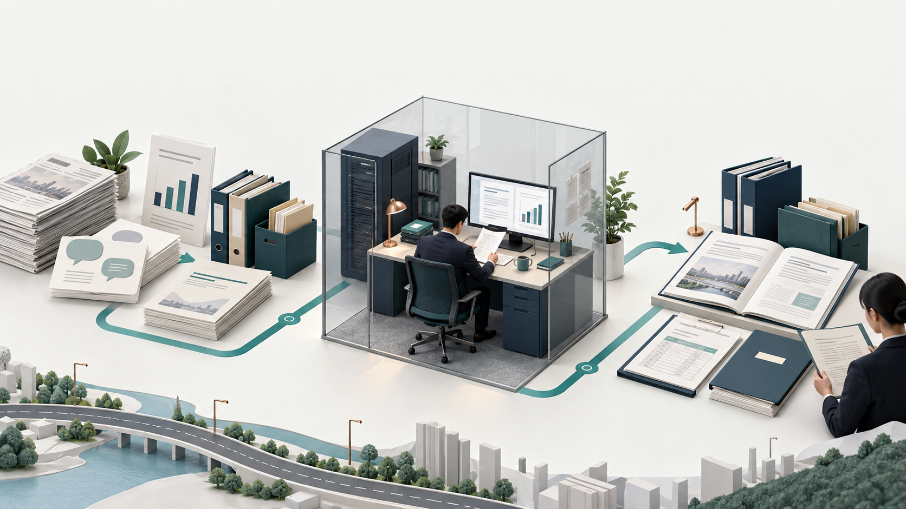
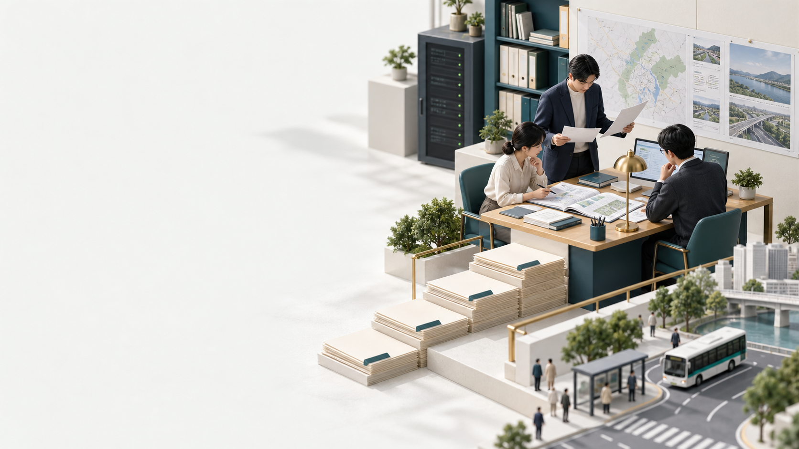

# P23 생성 이미지 기록

2026-09-15 · 내장 image_gen__imagegen 사용

두 그림은 설명용 생성 이미지이며 실제 TS 기관·직원·시설 사진이 아니다. 기존 로컬 서버를 사용하는 서비스의 컨셉을 표현한다. 정확한 한글·수치·기술 도식은 HTML 및 PowerPoint의 별도 요소로 배치했다.

## 1. assets/전체_서비스컨셉.png



최종 프롬프트 원문:

```text
Create a polished, premium editorial 3D illustration for a Korean public-agency policy-planning proposal presentation. Aspect ratio 16:9 landscape, high resolution. NO TEXT, NO LETTERS, NO NUMBERS, NO LOGOS. Off-white background #F3F5F2, restrained deep navy #143747 and teal #066F64 with small warm copper accents. Elegant tactile paper, matte architecture, subtle realistic shadows, sophisticated contemporary institutional presentation, not childish clipart, not glowing sci-fi.

Composition: a coherent isometric tabletop scene across the lower and central part of the frame. At LEFT, distinct paper-based evidence sources: short stacks of newspaper pages (abstract marks only), citizen message sheets represented with neutral speech bubble icons, a standing statistics sheet with a simple bar chart, and policy report folders. In the CENTER, a modest secure local computing workstation housed in a transparent architectural enclosure, a compact navy server and one display, paired with a human analyst at a desk reviewing paper. Clearly physical on-premises workspace, no remote clouds. At RIGHT, orderly outputs: an open policy dossier, a budget worksheet, a procurement specification folder and a human reviewer inspecting a document. A subtle continuous teal path in the tabletop visually connects these three spatial zones without arrow labels. A small abstract road-shaped line anchors the foreground to transport/public service context, no vehicles needed. The exact workflow and Korean labels will be overlaid separately as editable text, so leave a clean band of negative space across the TOP 25% and small clean gaps around objects. Show information becoming organized and reviewable, not automatic government decisions. Keep all core objects readable at slide size. Avoid AI brains, robots, cameras, sensors, OCR scanners, biometrics, giant data clouds, security lock clichés, charts with invented numbers, official flags and seals.
```

## 2. assets/표지_협업컨셉.png



최종 프롬프트 원문:

```text
Create a premium editorial concept illustration for the cover of a Korean public-agency policy-planning presentation, 16:9 landscape. Absolutely no text, letters, numbers, official logos or seals. Photorealistic tactile miniature / carefully art-directed architectural model style, off-white paper #F3F5F2, deep navy #143747, teal #066F64, restrained brass accent, diffuse studio daylight. LEFT 45% must remain clean pale negative space for large Korean title typography to be added separately. RIGHT 55%: an elegant public-sector collaborative planning desk with three adult professionals neutrally dressed, one standing comparing two sheets, two seated reviewing an open policy dossier and a modest computer display; an orderly staircase of paper folders leads toward the desk; one modest local server cabinet integrated near the back wall, no imposing futuristic machinery. A subtle miniature road and a few neutral human figures at bottom right suggest better transport services for citizens. The scene communicates careful evidence review and interdepartmental planning, with humanity and clarity. No cameras, sensors, robots, AI brains, flying holograms, clouds, transparent HUDs, scanning beams, people looking at the viewer or cyber-security padlock icon. Balanced editorial composition with generous white space; no decorative disconnected cards or dashboards; realistic hands but not close-up.
```
