<!--P23-SLIDE-V13-->
[이미지 컨셉도와 20장 서비스 통합설명 v1.3](../슬라이드_통합설명_v1.3/00_서비스_통합설명.html)

# 01 컨셉도

이 서비스는 누구의 어떤 일을 돕는가?

허용된 자료를 검토 가능한 근거로 만들고, 정책·예산·발주 문서에 연결한다.

[노드를 선택하는 HTML](00_서비스_로직맵.html)

## 단계별 입출력·판단

### C01 정책·통계·국민 의견

- 역할: 자료 담당자
- 입력: 공개 정책보고서·공식 통계·허용된 뉴스·공개 정책의견
- 처리: 자료의 기간·원출처·이용조건을 확인해 반입 대상을 고른다.
- 출력: 출처 목록과 반입 파일
- 사람의 판단: 원문 이용권과 공개 범위를 확인한다.
- 보완·유보: 이용권 미확인 또는 비공개 민원은 반입 대기.
- 데이터: Source: 출처·기간·권리·원문 위치
- 연결: [F01 서식](../서식/F01_문제정의_정책사업_검토서.html)

### C02 TS 업무·기존 사업

- 역할: 업무부서 자료 소유자
- 입력: TS 사업계획·기존 계약·검수·업무 현황 자료
- 처리: 정책 의제와 관련된 자료를 부서 접근권한에 맞게 제공한다.
- 출력: 권한이 붙은 내부 자료 묶음
- 사람의 판단: 제공 범위와 개인정보 처리를 확인한다.
- 보완·유보: 다른 부서의 원문 접근권한을 자동 부여하지 않는다.
- 데이터: Source: 소유부서·접근등급·유효일
- 연결: [F01 서식](../서식/F01_문제정의_정책사업_검토서.html)

### C03 담당자의 조사 질문

- 역할: 업무·기획 담당자
- 입력: 검토할 의제, 대상 국민·업무, 기간, 허용 자료
- 처리: 무엇을 알아보려는지와 자료 범위를 등록한다.
- 출력: 검토 의제와 조사 질문
- 사람의 판단: 의제의 범위와 담당자를 확인한다.
- 보완·유보: 의제가 넓으면 대상·기간을 줄여 다시 등록.
- 데이터: Issue.seed + Source IDs
- 연결: [F01 서식](../서식/F01_문제정의_정책사업_검토서.html)

### C04 NOA 정책기획 작업대

- 역할: 기존 NOA + 로컬 LLM + 추가 업무 구성
- 입력: 허용 자료·문제 틀·사업원장·문서 프로필
- 처리: 근거 정리 → 문제·대안 초안 → 문서 초안을 지원한다. 권한·계산·상태·양식 처리는 SW 규칙과 연결한다.
- 출력: 부서가 검토할 문제·사업·예산·발주 초안
- 사람의 판단: 정책·예산·안전·계약의 공식 판단을 수행한다.
- 보완·유보: 현재 도식은 제안 설계. 실제 NOA API·제품 재사용·HWPX 출력은 확인 필요.
- 데이터: NOA tasks, evidence refs, artifact versions
- 연결: [F01 서식](../서식/F01_문제정의_정책사업_검토서.html)

### C05 문제·정책 검토서

- 역할: NOA 초안 + 업무 담당 검토
- 입력: 근거 카드, 대상, 불편·위험, 현황
- 처리: 누가 어떤 과정에서 어떤 불이익을 겪는지 작성하고 현상·원인 가설·조사 필요를 나눈다.
- 출력: 문제정의 카드
- 사람의 판단: 문제의 타당성·원인 가설·반대 의견을 확인한다.
- 보완·유보: 근거가 부족하면 추가조사 또는 유보. AI 문장을 검증된 원인으로 확정하지 않는다.
- 데이터: Issue, Claim IDs, review_status
- 연결: [F01 서식](../서식/F01_문제정의_정책사업_검토서.html)

### C06 예산 요구·설명자료

- 역할: 계산 규칙 + 예산 담당자
- 입력: 수량·단가·공수·연차·VAT·운영비·근거
- 처리: 산식으로 비용과 증감을 계산하고 누락 연차를 표시한다. 요구액·승인액·계약액을 구분한다.
- 출력: 예산 요구 시나리오와 불완전 항목
- 사람의 판단: 재원·제출 경로·비목·비용 인정범위를 확인한다.
- 보완·유보: 미확인을 0원으로 바꾸지 않는다. 감액 시 범위·일정·검수를 다시 검토.
- 데이터: CostLine, BudgetScenario, requested/approved
- 연결: [F02 서식](../서식/F02_예산요구_사업설명자료.html)

### C07 RFP·공고 준비자료

- 역할: 로컬 LLM + 문서 출력 규칙
- 입력: 검토된 원장 버전, 양식 프로필, 허용 근거
- 처리: 문서 목적에 맞는 문장을 작성하고 금액·표·참조를 규칙으로 넣는다.
- 출력: F01–F06 문서 초안과 근거 참조
- 사람의 판단: 수치·범위·문체·표·쪽나눔·공개 적합성을 검토한다.
- 보완·유보: 빈 근거·승인액·협의 결과를 지어내지 않는다. 고정 HWPX 출력은 실제 연동·렌더 검증 필요.
- 데이터: Artifact, source_version, project_version
- 연결: [F04 서식](../서식/F04_발주기관_RFP_초안.html)

### C08 담당자 검토와 공식 인계

- 역할: 업무·정보화·계약 담당자
- 입력: 실제 예산 근거, 범위 버전, 요구사항·검수, 공개본
- 처리: 사업목적을 발주 요구사항으로 바꾸고 계약조건과 공개할 첨부를 확인한다.
- 출력: RFP·공고 준비용 검토본
- 사람의 판단: 계약 방식·참가요건·평가·일정·공개 여부를 확정한다.
- 보완·유보: 실제 예산·계약조건 미확인 또는 변경 영향 미해결이면 인계 준비를 보류.
- 데이터: Requirement, Acceptance, ReleaseDraft
- 연결: [F05 서식](../서식/F05_공고작성_인계서.html)

## 전달 관계

- C01 → C04: 허용 자료
- C02 → C04: 업무 맥락
- C03 → C04: 검토 목표
- C04 → C05: 문제·근거
- C04 → C06: 사업·비용
- C04 → C07: 범위·요구
- C04 → C08: 초안·미확인 사항

## 제약

기존 서버·로컬 LLM·NOA 기반 제안 설계. 신규 인프라 투자0원 전제. 실제 API·용량·자료권한·서식·HWPX 변환은 검증 전이다. 금액·자료 예시는 가상이며 실제 승인·기관 처리 결과가 아니다.
