# 02 서비스 흐름도

입력한 자료가 어떤 검토를 거쳐 문서가 되는가?

행은 업무 단계, 열은 입력·시스템·담당자와 결과다. 1단계의 결과를 다음 단계에서 재사용한다.

[노드를 선택하는 HTML](01_서비스_흐름도.html)

## 단계별 입출력·판단

### S01 01 자료·질문 등록

- 역할: 업무·기획 담당자
- 입력: 검토할 의제, 대상 국민·업무, 기간, 허용 자료
- 처리: 무엇을 알아보려는지와 자료 범위를 등록한다.
- 출력: 검토 의제와 조사 질문
- 사람의 판단: 의제의 범위와 담당자를 확인한다.
- 보완·유보: 의제가 넓으면 대상·기간을 줄여 다시 등록.
- 데이터: Issue.seed + Source IDs
- 연결: [F01 서식](../서식/F01_문제정의_정책사업_검토서.html)

### S02 근거 추출·문제 초안

- 역할: NOA + 로컬 LLM
- 입력: 허용된 자료 구간과 분석 질문
- 처리: 사실·의견·가설을 구분하고 주장별 지지·반대 근거와 원문 위치를 연결한다.
- 출력: 근거 카드와 조사 공백
- 사람의 판단: 숫자의 분모·기간과 인용이 원문에 맞는지 확인한다.
- 보완·유보: 기사 건수를 독립 근거 수로 일반화하지 않으며 원인이 불명확하면 가설로 남긴다.
- 데이터: Claim, EvidenceRef, SourceGroup
- 연결: [F01 서식](../서식/F01_문제정의_정책사업_검토서.html)

### S03 문제 확인 → F01

- 역할: NOA 초안 + 업무 담당 검토
- 입력: 근거 카드, 대상, 불편·위험, 현황
- 처리: 누가 어떤 과정에서 어떤 불이익을 겪는지 작성하고 현상·원인 가설·조사 필요를 나눈다.
- 출력: 문제정의 카드
- 사람의 판단: 문제의 타당성·원인 가설·반대 의견을 확인한다.
- 보완·유보: 근거가 부족하면 추가조사 또는 유보. AI 문장을 검증된 원인으로 확정하지 않는다.
- 데이터: Issue, Claim IDs, review_status
- 연결: [F01 서식](../서식/F01_문제정의_정책사업_검토서.html)

### S04 02 소관·기존사업 대조

- 역할: 업무·기획 담당자
- 입력: 문제 카드, TS 소관 근거, 현행 사업·계약
- 처리: TS 단독·협업·타기관·미확인을 구분하고 기존 수행 범위와 추가할 일을 비교한다.
- 출력: 소관·기존사업 중복 검토
- 사람의 판단: 실제 업무 소관과 계약 추가분을 판단한다.
- 보완·유보: 타기관 소관이면 협업·인계안을 검토하고 TS 단독 신규사업으로 확정하지 않는다.
- 데이터: MandateRef, ExistingProjectRef, ScopeDelta
- 연결: [F01 서식](../서식/F01_문제정의_정책사업_검토서.html)

### S05 대안 비교·사업 구성

- 역할: NOA 초안 + 기획 담당자
- 입력: 확인된 문제·소관·기존 대응·제약
- 처리: 현행 유지·운영 개선·기구축 고도화·신규 도입을 효과·비용·기간·의존성으로 비교한다.
- 출력: 대안 비교표와 선택 사유
- 사람의 판단: 어떤 대안을 추진·유보할지 결정한다.
- 보완·유보: AI 도입을 미리 정답으로 두지 않는다. 불확실한 효과는 검증 가설로 표시.
- 데이터: Alternative, Decision, Scope
- 연결: [F01 서식](../서식/F01_문제정의_정책사업_검토서.html)

### S06 사업범위 검토 → 원장

- 역할: 기획·업무·정보화 담당자
- 입력: 선택한 대안·수행 주체·기존 자산·검수 목표
- 처리: 목표·대상·포함/제외 범위·요구사항·일정·비용 항목을 같은 사업 ID에 연결한다.
- 출력: 공통 사업원장 버전
- 사람의 판단: 범위·실행 가능성·책임자를 확인한다.
- 보완·유보: 현행 API·사용권·서버 여력이 미확인이면 선행조건으로 남긴다.
- 데이터: Project, Scope, Requirement, Acceptance
- 연결: [F02 서식](../서식/F02_예산요구_사업설명자료.html)

### S07 03 재원·연차·단가 입력

- 역할: 계산 규칙 + 예산 담당자
- 입력: 수량·단가·공수·연차·VAT·운영비·근거
- 처리: 산식으로 비용과 증감을 계산하고 누락 연차를 표시한다. 요구액·승인액·계약액을 구분한다.
- 출력: 예산 요구 시나리오와 불완전 항목
- 사람의 판단: 재원·제출 경로·비목·비용 인정범위를 확인한다.
- 보완·유보: 미확인을 0원으로 바꾸지 않는다. 감액 시 범위·일정·검수를 다시 검토.
- 데이터: CostLine, BudgetScenario, requested/approved
- 연결: [F02 서식](../서식/F02_예산요구_사업설명자료.html)

### S08 비용 검증·예산문서 초안

- 역할: 계산 규칙 + 예산 담당자
- 입력: 수량·단가·공수·연차·VAT·운영비·근거
- 처리: 산식으로 비용과 증감을 계산하고 누락 연차를 표시한다. 요구액·승인액·계약액을 구분한다.
- 출력: 예산 요구 시나리오와 불완전 항목
- 사람의 판단: 재원·제출 경로·비목·비용 인정범위를 확인한다.
- 보완·유보: 미확인을 0원으로 바꾸지 않는다. 감액 시 범위·일정·검수를 다시 검토.
- 데이터: CostLine, BudgetScenario, requested/approved
- 연결: [F02 서식](../서식/F02_예산요구_사업설명자료.html)

### S09 예산 검토 → F02·F03·F06

- 역할: 기획·예산 담당자
- 입력: 요구자료, 실제 심의 질의·회신·결과
- 처리: 질의에 필요한 근거를 찾아 답변 초안을 만들고 실제 결과를 등록한다.
- 출력: 보완표·실제 심의 결과 참조
- 사람의 판단: 회신 내용과 예산 결과 증빙을 확인한다.
- 보완·유보: 버튼을 눌렀다는 이유로 예산 확보·승인 상태를 만들지 않는다.
- 데이터: ReviewQuestion, Response, DecisionRef
- 연결: [F06 서식](../서식/F06_심의질의_답변보완표.html)

### S10 04 실제 결과·범위 재확인

- 역할: 기획·업무·정보화 담당자
- 입력: 선택한 대안·수행 주체·기존 자산·검수 목표
- 처리: 목표·대상·포함/제외 범위·요구사항·일정·비용 항목을 같은 사업 ID에 연결한다.
- 출력: 공통 사업원장 버전
- 사람의 판단: 범위·실행 가능성·책임자를 확인한다.
- 보완·유보: 현행 API·사용권·서버 여력이 미확인이면 선행조건으로 남긴다.
- 데이터: Project, Scope, Requirement, Acceptance
- 연결: [F02 서식](../서식/F02_예산요구_사업설명자료.html)

### S11 RFP·공고 준비 초안

- 역할: 로컬 LLM + 문서 출력 규칙
- 입력: 검토된 원장 버전, 양식 프로필, 허용 근거
- 처리: 문서 목적에 맞는 문장을 작성하고 금액·표·참조를 규칙으로 넣는다.
- 출력: F01–F06 문서 초안과 근거 참조
- 사람의 판단: 수치·범위·문체·표·쪽나눔·공개 적합성을 검토한다.
- 보완·유보: 빈 근거·승인액·협의 결과를 지어내지 않는다. 고정 HWPX 출력은 실제 연동·렌더 검증 필요.
- 데이터: Artifact, source_version, project_version
- 연결: [F04 서식](../서식/F04_발주기관_RFP_초안.html)

### S12 발주 검토 → F04·F05

- 역할: 업무·정보화·계약 담당자
- 입력: 실제 예산 근거, 범위 버전, 요구사항·검수, 공개본
- 처리: 사업목적을 발주 요구사항으로 바꾸고 계약조건과 공개할 첨부를 확인한다.
- 출력: RFP·공고 준비용 검토본
- 사람의 판단: 계약 방식·참가요건·평가·일정·공개 여부를 확정한다.
- 보완·유보: 실제 예산·계약조건 미확인 또는 변경 영향 미해결이면 인계 준비를 보류.
- 데이터: Requirement, Acceptance, ReleaseDraft
- 연결: [F05 서식](../서식/F05_공고작성_인계서.html)

## 전달 관계

- S01 → S02: 입력
- S02 → S03: 초안
- S04 → S05: 입력
- S05 → S06: 초안
- S07 → S08: 입력
- S08 → S09: 초안
- S10 → S11: 입력
- S11 → S12: 초안
- S03 → S04: 확인된 문제
- S06 → S07: 검토된 범위
- S09 → S10: 실제 결과와 보완사항

## 제약

기존 서버·로컬 LLM·NOA 기반 제안 설계. 신규 인프라 투자0원 전제. 실제 API·용량·자료권한·서식·HWPX 변환은 검증 전이다. 금액·자료 예시는 가상이며 실제 승인·기관 처리 결과가 아니다.
