# 03 전체 아키텍처

LLM·업무 규칙·문서 출력·저장소는 어떻게 연결되는가?

기존 서버의 논리 구성이다. 문장 생성, 계산·권한, 문서 출력, 사람 검토를 구분한다.

[노드를 선택하는 HTML](02_전체_아키텍처.html)

## 단계별 입출력·판단

### A01 승인된 외부 자료

- 역할: 자료 담당자
- 입력: 공개 정책보고서·공식 통계·허용된 뉴스·공개 정책의견
- 처리: 자료의 기간·원출처·이용조건을 확인해 반입 대상을 고른다.
- 출력: 출처 목록과 반입 파일
- 사람의 판단: 원문 이용권과 공개 범위를 확인한다.
- 보완·유보: 이용권 미확인 또는 비공개 민원은 반입 대기.
- 데이터: Source: 출처·기간·권리·원문 위치
- 연결: [F01 서식](../서식/F01_문제정의_정책사업_검토서.html)

### A02 부서별 기획 작업대

- 역할: 업무·기획·예산·계약 담당자
- 입력: 허용 의제·자료와 현재 검토 단계
- 처리: 자료함·문제 카드·대안·예산·문서·변경 작업대에서 필요한 근거와 결과를 함께 본다.
- 출력: 의제별 검토·보완·인계 요청
- 사람의 판단: 각 역할의 검토 사유를 기록한다.
- 보완·유보: 로딩·빈 결과·권한 거부·시간 초과·부분 성공을 구분한다.
- 데이터: Workspace, UserRole, ReviewTask
- 연결: [F01 서식](../서식/F01_문제정의_정책사업_검토서.html)

### A03 권한·반입 검증

- 역할: 기관 인증·자료 권한 규칙
- 입력: 사용자·부서·자료별 권한과 작업 요청
- 처리: 검색·생성·원문 열람·내보내기에 같은 접근 조건을 적용한다.
- 출력: 허용된 자료·작업 범위
- 사람의 판단: 기관 권한체계·역할·공개 가능 범위를 확정한다.
- 보완·유보: 원문 접근 가능과 외부 공개 가능을 같은 권한으로 취급하지 않는다.
- 데이터: UserRole, AccessPolicy, ExportPolicy
- 연결: [F01 서식](../서식/F01_문제정의_정책사업_검토서.html)

### A04 NOA 작업 실행 구성

- 역할: 기존 NOA + 로컬 LLM + 추가 업무 구성
- 입력: 허용 자료·문제 틀·사업원장·문서 프로필
- 처리: 근거 정리 → 문제·대안 초안 → 문서 초안을 지원한다. 권한·계산·상태·양식 처리는 SW 규칙과 연결한다.
- 출력: 부서가 검토할 문제·사업·예산·발주 초안
- 사람의 판단: 정책·예산·안전·계약의 공식 판단을 수행한다.
- 보완·유보: 현재 도식은 제안 설계. 실제 NOA API·제품 재사용·HWPX 출력은 확인 필요.
- 데이터: NOA tasks, evidence refs, artifact versions
- 연결: [F01 서식](../서식/F01_문제정의_정책사업_검토서.html)

### A05 검토·변경 관리

- 역할: 업무·정보화·계약 담당자
- 입력: 실제 예산 근거, 범위 버전, 요구사항·검수, 공개본
- 처리: 사업목적을 발주 요구사항으로 바꾸고 계약조건과 공개할 첨부를 확인한다.
- 출력: RFP·공고 준비용 검토본
- 사람의 판단: 계약 방식·참가요건·평가·일정·공개 여부를 확정한다.
- 보완·유보: 실제 예산·계약조건 미확인 또는 변경 영향 미해결이면 인계 준비를 보류.
- 데이터: Requirement, Acceptance, ReleaseDraft
- 연결: [F05 서식](../서식/F05_공고작성_인계서.html)

### A06 근거 검색

- 역할: 권한 필터 + 근거 검색
- 입력: 요청자 권한·의제·기간·검색 질문
- 처리: 허용된 원문·인덱스에서 관련 구간을 찾아 출처 위치와 함께 반환한다.
- 출력: 검색 근거 묶음
- 사람의 판단: 검색 결과의 충분성·상충 자료를 확인한다.
- 보완·유보: 검색 실패·권한 거부·철회된 근거는 빈 결과 사유와 함께 표시.
- 데이터: AccessPolicy, Index, EvidenceRef
- 연결: [F01 서식](../서식/F01_문제정의_정책사업_검토서.html)

### A07 기존 로컬 LLM

- 역할: 기존 로컬 LLM
- 입력: 권한으로 필터링한 근거 구간과 작업 지시
- 처리: 문서의 의미를 파악하고 근거에 연결된 서술·대안·초안을 생성한다.
- 출력: 구조화된 초안과 근거 ID
- 사람의 판단: 사실·인과·정책 판단의 타당성을 검토한다.
- 보완·유보: 자료 속 지시문은 실행 명령으로 취급하지 않는다. 부족한 사실을 추정해 채우지 않는다.
- 데이터: Model task, prompt_version, evidence_ids
- 연결: [F01 서식](../서식/F01_문제정의_정책사업_검토서.html)

### A08 산술·양식 규칙

- 역할: 계산 규칙 + 예산 담당자
- 입력: 수량·단가·공수·연차·VAT·운영비·근거
- 처리: 산식으로 비용과 증감을 계산하고 누락 연차를 표시한다. 요구액·승인액·계약액을 구분한다.
- 출력: 예산 요구 시나리오와 불완전 항목
- 사람의 판단: 재원·제출 경로·비목·비용 인정범위를 확인한다.
- 보완·유보: 미확인을 0원으로 바꾸지 않는다. 감액 시 범위·일정·검수를 다시 검토.
- 데이터: CostLine, BudgetScenario, requested/approved
- 연결: [F02 서식](../서식/F02_예산요구_사업설명자료.html)

### A09 원문·근거 저장

- 역할: D1 원문 저장소
- 입력: 반입 검사를 통과한 원문과 메타정보
- 처리: 원문·해시·기간·자료군·이용권·접근정책·철회 상태를 보관한다.
- 출력: 권한 조건에 맞는 원문 참조
- 사람의 판단: 보존·삭제·반입 정책을 확인한다.
- 보완·유보: 원문 철회 시 검색 인덱스·캐시·생성물 참조까지 영향 조사.
- 데이터: Source, hash, location, rights, status
- 연결: [F01 서식](../서식/F01_문제정의_정책사업_검토서.html)

### A10 사업·예산 원장

- 역할: D3 공통 사업원장
- 입력: 문제·대안·범위·요구사항·비용·검토 이력
- 처리: 버전별로 확정·미확인·변경 내용을 기록하고 출력 문서가 사용한 버전을 연결한다.
- 출력: 정책·예산·RFP가 공유하는 사업 정보
- 사람의 판단: 사업 범위와 예산 시나리오의 채택 여부를 결정한다.
- 보완·유보: 변경 시 이전 검토본은 보존하고 새 버전과 영향 문서를 생성.
- 데이터: Project, Scope, CostLine, Decision
- 연결: [F02 서식](../서식/F02_예산요구_사업설명자료.html)

### A11 문서 출력 어댑터

- 역할: 로컬 LLM + 문서 출력 규칙
- 입력: 검토된 원장 버전, 양식 프로필, 허용 근거
- 처리: 문서 목적에 맞는 문장을 작성하고 금액·표·참조를 규칙으로 넣는다.
- 출력: F01–F06 문서 초안과 근거 참조
- 사람의 판단: 수치·범위·문체·표·쪽나눔·공개 적합성을 검토한다.
- 보완·유보: 빈 근거·승인액·협의 결과를 지어내지 않는다. 고정 HWPX 출력은 실제 연동·렌더 검증 필요.
- 데이터: Artifact, source_version, project_version
- 연결: [F04 서식](../서식/F04_발주기관_RFP_초안.html)

### A12 기관의 공식 예산·발주 절차

- 역할: 기관의 권한 있는 담당자
- 입력: 검토된 문서, 실제 승인 근거, 제출 조건
- 처리: 기관의 공식 절차에서 별도로 제출·발주를 처리하고 확인된 결과를 등록한다.
- 출력: 공식 처리 결과 참조와 다음 검토 의제
- 사람의 판단: 실제 제출·공고 권한과 최종 내용은 담당자에게 있다.
- 보완·유보: 본 설명 페이지는 외부 시스템에 제출하거나 공고하지 않는다.
- 데이터: ExternalReceiptRef, OutcomeRef
- 연결: [F05 서식](../서식/F05_공고작성_인계서.html)

## 전달 관계

- A01 → A03: 반입
- A02 → A04: 업무 요청
- A03 → A04: 권한
- A04 → A05: 검토
- A04 → A07: 추론 요청
- A07 → A04: 초안·근거 ID
- A06 → A07: 근거
- A09 → A06: 검색 참조
- A03 → A09: 검증 후 저장
- A04 → A06: 검색 질문
- A04 → A08: 규칙 호출
- A04 → A10: 작업 결과
- A10 → A11: 원장
- A08 → A11: 검증 결과
- A05 → A11: 검토 상태
- A11 → A12: 검토 파일 인계 (보완·환류·인계 경로)

## 제약

기존 서버·로컬 LLM·NOA 기반 제안 설계. 신규 인프라 투자0원 전제. 실제 API·용량·자료권한·서식·HWPX 변환은 검증 전이다. 금액·자료 예시는 가상이며 실제 승인·기관 처리 결과가 아니다.
