# 04 데이터 흐름도

원문 한 건이 어떤 데이터와 문서로 남는가?

E=자료 제공·이용 주체, P=처리, D=저장소. 화살표는 전달되는 데이터다.

[노드를 선택하는 HTML](03_데이터_흐름도.html)

## 단계별 입출력·판단

### E1 E1 외부 허용 자료

- 역할: 자료 담당자
- 입력: 공개 정책보고서·공식 통계·허용된 뉴스·공개 정책의견
- 처리: 자료의 기간·원출처·이용조건을 확인해 반입 대상을 고른다.
- 출력: 출처 목록과 반입 파일
- 사람의 판단: 원문 이용권과 공개 범위를 확인한다.
- 보완·유보: 이용권 미확인 또는 비공개 민원은 반입 대기.
- 데이터: Source: 출처·기간·권리·원문 위치
- 연결: [F01 서식](../서식/F01_문제정의_정책사업_검토서.html)

### E2 E2 TS 내부 자료

- 역할: 업무부서 자료 소유자
- 입력: TS 사업계획·기존 계약·검수·업무 현황 자료
- 처리: 정책 의제와 관련된 자료를 부서 접근권한에 맞게 제공한다.
- 출력: 권한이 붙은 내부 자료 묶음
- 사람의 판단: 제공 범위와 개인정보 처리를 확인한다.
- 보완·유보: 다른 부서의 원문 접근권한을 자동 부여하지 않는다.
- 데이터: Source: 소유부서·접근등급·유효일
- 연결: [F01 서식](../서식/F01_문제정의_정책사업_검토서.html)

### P1 P1 반입·권한·중복

- 역할: 권한·반입 규칙
- 입력: 전자문서와 자료별 권한·기간·원출처
- 처리: 형식·권한을 검사하고 원문 위치를 보존한다. 전재·재배포 문서는 같은 자료군으로 연결한다.
- 출력: 분석 가능한 문서와 자료군 ID
- 사람의 판단: 격리·중복 후보를 검토하고 허용 여부를 결정한다.
- 보완·유보: 스캔·비인가·읽기 실패 자료는 사유를 표시하고 별도로 보완.
- 데이터: Source, SourceGroup, AccessPolicy
- 연결: [F01 서식](../서식/F01_문제정의_정책사업_검토서.html)

### D1 D1 원문·접근정책

- 역할: D1 원문 저장소
- 입력: 반입 검사를 통과한 원문과 메타정보
- 처리: 원문·해시·기간·자료군·이용권·접근정책·철회 상태를 보관한다.
- 출력: 권한 조건에 맞는 원문 참조
- 사람의 판단: 보존·삭제·반입 정책을 확인한다.
- 보완·유보: 원문 철회 시 검색 인덱스·캐시·생성물 참조까지 영향 조사.
- 데이터: Source, hash, location, rights, status
- 연결: [F01 서식](../서식/F01_문제정의_정책사업_검토서.html)

### P2 P2 주장·근거 추출

- 역할: NOA + 로컬 LLM
- 입력: 허용된 자료 구간과 분석 질문
- 처리: 사실·의견·가설을 구분하고 주장별 지지·반대 근거와 원문 위치를 연결한다.
- 출력: 근거 카드와 조사 공백
- 사람의 판단: 숫자의 분모·기간과 인용이 원문에 맞는지 확인한다.
- 보완·유보: 기사 건수를 독립 근거 수로 일반화하지 않으며 원인이 불명확하면 가설로 남긴다.
- 데이터: Claim, EvidenceRef, SourceGroup
- 연결: [F01 서식](../서식/F01_문제정의_정책사업_검토서.html)

### D2 D2 근거 카드

- 역할: D2 근거 저장소
- 입력: 주장·원문 위치·지지/반대 관계·독립 자료군
- 처리: 문제정의에서 주장한 내용이 어느 원문에 근거하는지 유지한다.
- 출력: 근거 카드와 원문 추적 경로
- 사람의 판단: 출처 일치와 주장 표현의 정확성을 검토한다.
- 보완·유보: 철회·정정·접근 회수 시 참조된 문제 카드 재검토.
- 데이터: Claim, EvidenceRef, SourceGroup
- 연결: [F01 서식](../서식/F01_문제정의_정책사업_검토서.html)

### P3 P3 문제·대안·사업 검토

- 역할: 기획·업무·정보화 담당자
- 입력: 선택한 대안·수행 주체·기존 자산·검수 목표
- 처리: 목표·대상·포함/제외 범위·요구사항·일정·비용 항목을 같은 사업 ID에 연결한다.
- 출력: 공통 사업원장 버전
- 사람의 판단: 범위·실행 가능성·책임자를 확인한다.
- 보완·유보: 현행 API·사용권·서버 여력이 미확인이면 선행조건으로 남긴다.
- 데이터: Project, Scope, Requirement, Acceptance
- 연결: [F02 서식](../서식/F02_예산요구_사업설명자료.html)

### D3 D3 공통 사업원장

- 역할: D3 공통 사업원장
- 입력: 문제·대안·범위·요구사항·비용·검토 이력
- 처리: 버전별로 확정·미확인·변경 내용을 기록하고 출력 문서가 사용한 버전을 연결한다.
- 출력: 정책·예산·RFP가 공유하는 사업 정보
- 사람의 판단: 사업 범위와 예산 시나리오의 채택 여부를 결정한다.
- 보완·유보: 변경 시 이전 검토본은 보존하고 새 버전과 영향 문서를 생성.
- 데이터: Project, Scope, CostLine, Decision
- 연결: [F02 서식](../서식/F02_예산요구_사업설명자료.html)

### D5 D5 승인 양식 프로필

- 역할: 양식 규칙 + 서식 담당자
- 입력: 수신기관·재원·연도와 승인된 양식
- 처리: 문서 프로필을 선택하고 공통 원장 필드를 양식의 항목·표·슬롯에 매핑한다.
- 출력: 버전이 명시된 필드 매핑표
- 사람의 판단: 실제 제출 양식과 필수 항목을 확인한다.
- 보완·유보: 양식 연도·수신처 불일치, 미매핑 필드는 보완 대상으로 표시.
- 데이터: TemplateProfile, FieldMapping, template_hash
- 연결: [F03 서식](../서식/F03_2027_신규사업_리스트.html)

### P4 P4 산식·필드 검증

- 역할: 계산 규칙 + 예산 담당자
- 입력: 수량·단가·공수·연차·VAT·운영비·근거
- 처리: 산식으로 비용과 증감을 계산하고 누락 연차를 표시한다. 요구액·승인액·계약액을 구분한다.
- 출력: 예산 요구 시나리오와 불완전 항목
- 사람의 판단: 재원·제출 경로·비목·비용 인정범위를 확인한다.
- 보완·유보: 미확인을 0원으로 바꾸지 않는다. 감액 시 범위·일정·검수를 다시 검토.
- 데이터: CostLine, BudgetScenario, requested/approved
- 연결: [F02 서식](../서식/F02_예산요구_사업설명자료.html)

### P5 P5 문서 생성

- 역할: 로컬 LLM + 문서 출력 규칙
- 입력: 검토된 원장 버전, 양식 프로필, 허용 근거
- 처리: 문서 목적에 맞는 문장을 작성하고 금액·표·참조를 규칙으로 넣는다.
- 출력: F01–F06 문서 초안과 근거 참조
- 사람의 판단: 수치·범위·문체·표·쪽나눔·공개 적합성을 검토한다.
- 보완·유보: 빈 근거·승인액·협의 결과를 지어내지 않는다. 고정 HWPX 출력은 실제 연동·렌더 검증 필요.
- 데이터: Artifact, source_version, project_version
- 연결: [F04 서식](../서식/F04_발주기관_RFP_초안.html)

### D4 D4 문서·검토 기록

- 역할: D4 문서·검토 기록
- 입력: 생성 초안·근거/원장/양식 버전·검토 결과
- 처리: 어떤 데이터로 문서를 작성했는지 기록하고 공개본·내부본을 구분한다.
- 출력: 추적 가능한 문서 파일과 검토 이력
- 사람의 판단: 내용과 공개 적합성을 확인한다.
- 보완·유보: 수동 수정본을 자동 덮어쓰지 않으며 오래된 버전은 재검토 표시.
- 데이터: Artifact, version_refs, review_status
- 연결: [F04 서식](../서식/F04_발주기관_RFP_초안.html)

### E3 E3 담당자 검토·인계

- 역할: 업무·정보화·계약 담당자
- 입력: 실제 예산 근거, 범위 버전, 요구사항·검수, 공개본
- 처리: 사업목적을 발주 요구사항으로 바꾸고 계약조건과 공개할 첨부를 확인한다.
- 출력: RFP·공고 준비용 검토본
- 사람의 판단: 계약 방식·참가요건·평가·일정·공개 여부를 확정한다.
- 보완·유보: 실제 예산·계약조건 미확인 또는 변경 영향 미해결이면 인계 준비를 보류.
- 데이터: Requirement, Acceptance, ReleaseDraft
- 연결: [F05 서식](../서식/F05_공고작성_인계서.html)

## 전달 관계

- E1 → P1: 원문
- E2 → P1: 부서 권한
- P1 → D1: 자료
- D1 → P2: 원문
- P2 → D2: Claim·위치
- D2 → P3: 근거
- P3 → D3: 검토
- D3 → P4: 범위·비용
- D5 → P4: 양식
- P4 → P5: 필드
- P5 → D4: 초안
- D4 → E3: 검토 파일
- E3 → D3: 검토 사유·새 버전 (보완·환류·인계 경로)

## 제약

기존 서버·로컬 LLM·NOA 기반 제안 설계. 신규 인프라 투자0원 전제. 실제 API·용량·자료권한·서식·HWPX 변환은 검증 전이다. 금액·자료 예시는 가상이며 실제 승인·기관 처리 결과가 아니다.
