# 05 판단·예외 로직

근거가 부족하거나 예산이 바뀌면 어디로 돌아가는가?

초안 생성과 다음 단계의 검토 준비를 분리한다. 유보·보완·타기관 협업 경로를 함께 표시한다.

[노드를 선택하는 HTML](04_판단과_예외.html)

## 단계별 입출력·판단

### L00 의제·허용 자료

- 역할: 업무·기획 담당자
- 입력: 검토할 의제, 대상 국민·업무, 기간, 허용 자료
- 처리: 무엇을 알아보려는지와 자료 범위를 등록한다.
- 출력: 검토 의제와 조사 질문
- 사람의 판단: 의제의 범위와 담당자를 확인한다.
- 보완·유보: 의제가 넓으면 대상·기간을 줄여 다시 등록.
- 데이터: Issue.seed + Source IDs
- 연결: [F01 서식](../서식/F01_문제정의_정책사업_검토서.html)

### L01 근거·문제 확인?

- 역할: NOA 초안 + 업무 담당 검토
- 입력: 근거 카드, 대상, 불편·위험, 현황
- 처리: 누가 어떤 과정에서 어떤 불이익을 겪는지 작성하고 현상·원인 가설·조사 필요를 나눈다.
- 출력: 문제정의 카드
- 사람의 판단: 문제의 타당성·원인 가설·반대 의견을 확인한다.
- 보완·유보: 근거가 부족하면 추가조사 또는 유보. AI 문장을 검증된 원인으로 확정하지 않는다.
- 데이터: Issue, Claim IDs, review_status
- 연결: [F01 서식](../서식/F01_문제정의_정책사업_검토서.html)

### L02 소관·추가 범위 확인?

- 역할: 업무·기획 담당자
- 입력: 문제 카드, TS 소관 근거, 현행 사업·계약
- 처리: TS 단독·협업·타기관·미확인을 구분하고 기존 수행 범위와 추가할 일을 비교한다.
- 출력: 소관·기존사업 중복 검토
- 사람의 판단: 실제 업무 소관과 계약 추가분을 판단한다.
- 보완·유보: 타기관 소관이면 협업·인계안을 검토하고 TS 단독 신규사업으로 확정하지 않는다.
- 데이터: MandateRef, ExistingProjectRef, ScopeDelta
- 연결: [F01 서식](../서식/F01_문제정의_정책사업_검토서.html)

### L11 추가조사·문제 수정

- 역할: 담당자 보완·유보
- 입력: 검토를 막는 누락·불일치·반대 근거
- 처리: 필요한 자료·담당자·검토 조건을 적고 확인할 단계로 돌아간다.
- 출력: 보완 요청 또는 유보 사유
- 사람의 판단: 조사·협업·재검토 여부를 결정한다.
- 보완·유보: 그럴듯한 문장으로 공백을 숨기지 않는다.
- 데이터: ReviewIssue, Owner, required_evidence
- 연결: [F06 서식](../서식/F06_심의질의_답변보완표.html)

### L12 소관·협업·중복 보완

- 역할: 업무·기획 담당자
- 입력: 문제 카드, TS 소관 근거, 현행 사업·계약
- 처리: TS 단독·협업·타기관·미확인을 구분하고 기존 수행 범위와 추가할 일을 비교한다.
- 출력: 소관·기존사업 중복 검토
- 사람의 판단: 실제 업무 소관과 계약 추가분을 판단한다.
- 보완·유보: 타기관 소관이면 협업·인계안을 검토하고 TS 단독 신규사업으로 확정하지 않는다.
- 데이터: MandateRef, ExistingProjectRef, ScopeDelta
- 연결: [F01 서식](../서식/F01_문제정의_정책사업_검토서.html)

### L03 예산 결과·범위 일치?

- 역할: 기획·예산 담당자
- 입력: 요구자료, 실제 심의 질의·회신·결과
- 처리: 질의에 필요한 근거를 찾아 답변 초안을 만들고 실제 결과를 등록한다.
- 출력: 보완표·실제 심의 결과 참조
- 사람의 판단: 회신 내용과 예산 결과 증빙을 확인한다.
- 보완·유보: 버튼을 눌렀다는 이유로 예산 확보·승인 상태를 만들지 않는다.
- 데이터: ReviewQuestion, Response, DecisionRef
- 연결: [F06 서식](../서식/F06_심의질의_답변보완표.html)

### L04 양식·계약 검토 완료?

- 역할: 업무·정보화·계약 담당자
- 입력: 실제 예산 근거, 범위 버전, 요구사항·검수, 공개본
- 처리: 사업목적을 발주 요구사항으로 바꾸고 계약조건과 공개할 첨부를 확인한다.
- 출력: RFP·공고 준비용 검토본
- 사람의 판단: 계약 방식·참가요건·평가·일정·공개 여부를 확정한다.
- 보완·유보: 실제 예산·계약조건 미확인 또는 변경 영향 미해결이면 인계 준비를 보류.
- 데이터: Requirement, Acceptance, ReleaseDraft
- 연결: [F05 서식](../서식/F05_공고작성_인계서.html)

### L05 검토 파일 인계 준비

- 역할: 기관의 권한 있는 담당자
- 입력: 검토된 문서, 실제 승인 근거, 제출 조건
- 처리: 기관의 공식 절차에서 별도로 제출·발주를 처리하고 확인된 결과를 등록한다.
- 출력: 공식 처리 결과 참조와 다음 검토 의제
- 사람의 판단: 실제 제출·공고 권한과 최종 내용은 담당자에게 있다.
- 보완·유보: 본 설명 페이지는 외부 시스템에 제출하거나 공고하지 않는다.
- 데이터: ExternalReceiptRef, OutcomeRef
- 연결: [F05 서식](../서식/F05_공고작성_인계서.html)

### L13 범위·예산 재설계

- 역할: 변경 영향 규칙 + 담당자
- 입력: 근거 철회·예산 감액·범위 변경 이벤트
- 처리: 참조 그래프에서 영향받는 문제·비용·요구사항·문서를 찾고 재검토 목록을 만든다.
- 출력: 변경 전후 비교와 재검토 대상
- 사람의 판단: 조정할 범위와 새 문서 내용을 확인한다.
- 보완·유보: 자동 감액만으로 기존 범위가 수행 가능하다고 표시하지 않는다.
- 데이터: ChangeEvent, DependencyRef, ChangeImpact
- 연결: [F06 서식](../서식/F06_심의질의_답변보완표.html)

### L14 양식·계약조건 보완

- 역할: 양식 규칙 + 서식 담당자
- 입력: 수신기관·재원·연도와 승인된 양식
- 처리: 문서 프로필을 선택하고 공통 원장 필드를 양식의 항목·표·슬롯에 매핑한다.
- 출력: 버전이 명시된 필드 매핑표
- 사람의 판단: 실제 제출 양식과 필수 항목을 확인한다.
- 보완·유보: 양식 연도·수신처 불일치, 미매핑 필드는 보완 대상으로 표시.
- 데이터: TemplateProfile, FieldMapping, template_hash
- 연결: [F03 서식](../서식/F03_2027_신규사업_리스트.html)

## 전달 관계

- L00 → L01: 검토
- L01 → L02: 확인됨
- L01 → L11: 부족·상충
- L11 → L01: 재검토 (보완·환류·인계 경로)
- L02 → L12: 미확인·중복
- L02 → L03: 확인 후 예산 검토
- L03 → L04: 실제 결과 반영
- L03 → L13: 미확인·감액 미반영
- L13 → L03: 조정 후 재검토 (보완·환류·인계 경로)
- L04 → L05: 검토됨
- L04 → L14: 불일치·미완료
- L14 → L04: 보완 후 재검토 (보완·환류·인계 경로)
- L12 → L02: 범위 확인 (보완·환류·인계 경로)

## 제약

기존 서버·로컬 LLM·NOA 기반 제안 설계. 신규 인프라 투자0원 전제. 실제 API·용량·자료권한·서식·HWPX 변환은 검증 전이다. 금액·자료 예시는 가상이며 실제 승인·기관 처리 결과가 아니다.
