# 06 변경·문서 추적

원장과 근거가 바뀌면 어떤 문서를 다시 봐야 하는가?

한 가상 의제의 참조 관계다. 변경은 새 버전으로 기록하며 과거 검토본을 자동 덮어쓰지 않는다.

[노드를 선택하는 HTML](05_변경과_문서추적.html)

## 단계별 입출력·판단

### V01 SRC-01 근거 원문

- 역할: 자료 담당자
- 입력: 공개 정책보고서·공식 통계·허용된 뉴스·공개 정책의견
- 처리: 자료의 기간·원출처·이용조건을 확인해 반입 대상을 고른다.
- 출력: 출처 목록과 반입 파일
- 사람의 판단: 원문 이용권과 공개 범위를 확인한다.
- 보완·유보: 이용권 미확인 또는 비공개 민원은 반입 대기.
- 데이터: Source: 출처·기간·권리·원문 위치
- 연결: [F01 서식](../서식/F01_문제정의_정책사업_검토서.html)

### V02 CL-01 근거 카드

- 역할: D2 근거 저장소
- 입력: 주장·원문 위치·지지/반대 관계·독립 자료군
- 처리: 문제정의에서 주장한 내용이 어느 원문에 근거하는지 유지한다.
- 출력: 근거 카드와 원문 추적 경로
- 사람의 판단: 출처 일치와 주장 표현의 정확성을 검토한다.
- 보완·유보: 철회·정정·접근 회수 시 참조된 문제 카드 재검토.
- 데이터: Claim, EvidenceRef, SourceGroup
- 연결: [F01 서식](../서식/F01_문제정의_정책사업_검토서.html)

### V03 ISS-01 문제 카드

- 역할: NOA 초안 + 업무 담당 검토
- 입력: 근거 카드, 대상, 불편·위험, 현황
- 처리: 누가 어떤 과정에서 어떤 불이익을 겪는지 작성하고 현상·원인 가설·조사 필요를 나눈다.
- 출력: 문제정의 카드
- 사람의 판단: 문제의 타당성·원인 가설·반대 의견을 확인한다.
- 보완·유보: 근거가 부족하면 추가조사 또는 유보. AI 문장을 검증된 원인으로 확정하지 않는다.
- 데이터: Issue, Claim IDs, review_status
- 연결: [F01 서식](../서식/F01_문제정의_정책사업_검토서.html)

### V04 PRJ-01 사업원장 v1 → v2

- 역할: 기획·업무·정보화 담당자
- 입력: 선택한 대안·수행 주체·기존 자산·검수 목표
- 처리: 목표·대상·포함/제외 범위·요구사항·일정·비용 항목을 같은 사업 ID에 연결한다.
- 출력: 공통 사업원장 버전
- 사람의 판단: 범위·실행 가능성·책임자를 확인한다.
- 보완·유보: 현행 API·사용권·서버 여력이 미확인이면 선행조건으로 남긴다.
- 데이터: Project, Scope, Requirement, Acceptance
- 연결: [F02 서식](../서식/F02_예산요구_사업설명자료.html)

### V05 요구예산 가정 100 → 70백만원

- 역할: 계산 규칙 + 예산 담당자
- 입력: 수량·단가·공수·연차·VAT·운영비·근거
- 처리: 산식으로 비용과 증감을 계산하고 누락 연차를 표시한다. 요구액·승인액·계약액을 구분한다.
- 출력: 예산 요구 시나리오와 불완전 항목
- 사람의 판단: 재원·제출 경로·비목·비용 인정범위를 확인한다.
- 보완·유보: 미확인을 0원으로 바꾸지 않는다. 감액 시 범위·일정·검수를 다시 검토.
- 데이터: CostLine, BudgetScenario, requested/approved
- 연결: [F02 서식](../서식/F02_예산요구_사업설명자료.html)

### V06 변경 영향 검토

- 역할: 변경 영향 규칙 + 담당자
- 입력: 근거 철회·예산 감액·범위 변경 이벤트
- 처리: 참조 그래프에서 영향받는 문제·비용·요구사항·문서를 찾고 재검토 목록을 만든다.
- 출력: 변경 전후 비교와 재검토 대상
- 사람의 판단: 조정할 범위와 새 문서 내용을 확인한다.
- 보완·유보: 자동 감액만으로 기존 범위가 수행 가능하다고 표시하지 않는다.
- 데이터: ChangeEvent, DependencyRef, ChangeImpact
- 연결: [F06 서식](../서식/F06_심의질의_답변보완표.html)

### V07 F01 문제·정책 검토서

- 역할: NOA 초안 + 업무 담당 검토
- 입력: 근거 카드, 대상, 불편·위험, 현황
- 처리: 누가 어떤 과정에서 어떤 불이익을 겪는지 작성하고 현상·원인 가설·조사 필요를 나눈다.
- 출력: 문제정의 카드
- 사람의 판단: 문제의 타당성·원인 가설·반대 의견을 확인한다.
- 보완·유보: 근거가 부족하면 추가조사 또는 유보. AI 문장을 검증된 원인으로 확정하지 않는다.
- 데이터: Issue, Claim IDs, review_status
- 연결: [F01 서식](../서식/F01_문제정의_정책사업_검토서.html)

### V08 F02·F03 예산 자료

- 역할: 계산 규칙 + 예산 담당자
- 입력: 수량·단가·공수·연차·VAT·운영비·근거
- 처리: 산식으로 비용과 증감을 계산하고 누락 연차를 표시한다. 요구액·승인액·계약액을 구분한다.
- 출력: 예산 요구 시나리오와 불완전 항목
- 사람의 판단: 재원·제출 경로·비목·비용 인정범위를 확인한다.
- 보완·유보: 미확인을 0원으로 바꾸지 않는다. 감액 시 범위·일정·검수를 다시 검토.
- 데이터: CostLine, BudgetScenario, requested/approved
- 연결: [F02 서식](../서식/F02_예산요구_사업설명자료.html)

### V09 F04 RFP 초안

- 역할: 로컬 LLM + 문서 출력 규칙
- 입력: 검토된 원장 버전, 양식 프로필, 허용 근거
- 처리: 문서 목적에 맞는 문장을 작성하고 금액·표·참조를 규칙으로 넣는다.
- 출력: F01–F06 문서 초안과 근거 참조
- 사람의 판단: 수치·범위·문체·표·쪽나눔·공개 적합성을 검토한다.
- 보완·유보: 빈 근거·승인액·협의 결과를 지어내지 않는다. 고정 HWPX 출력은 실제 연동·렌더 검증 필요.
- 데이터: Artifact, source_version, project_version
- 연결: [F04 서식](../서식/F04_발주기관_RFP_초안.html)

### V10 F05·F06 인계·보완

- 역할: 업무·정보화·계약 담당자
- 입력: 실제 예산 근거, 범위 버전, 요구사항·검수, 공개본
- 처리: 사업목적을 발주 요구사항으로 바꾸고 계약조건과 공개할 첨부를 확인한다.
- 출력: RFP·공고 준비용 검토본
- 사람의 판단: 계약 방식·참가요건·평가·일정·공개 여부를 확정한다.
- 보완·유보: 실제 예산·계약조건 미확인 또는 변경 영향 미해결이면 인계 준비를 보류.
- 데이터: Requirement, Acceptance, ReleaseDraft
- 연결: [F05 서식](../서식/F05_공고작성_인계서.html)

## 전달 관계

- V01 → V02: 원문 참조
- V02 → V03: 주장 근거
- V03 → V04: 사업화 검토
- V04 → V05: 범위·수량
- V05 → V06: 금액 변경
- V01 → V06: 철회·정정 이벤트 (보완·환류·인계 경로)
- V06 → V07: 재검토 (보완·환류·인계 경로)
- V06 → V08: 재검토 (보완·환류·인계 경로)
- V06 → V09: 재검토 (보완·환류·인계 경로)
- V06 → V10: 재검토 (보완·환류·인계 경로)

## 제약

기존 서버·로컬 LLM·NOA 기반 제안 설계. 신규 인프라 투자0원 전제. 실제 API·용량·자료권한·서식·HWPX 변환은 검증 전이다. 금액·자료 예시는 가상이며 실제 승인·기관 처리 결과가 아니다.
