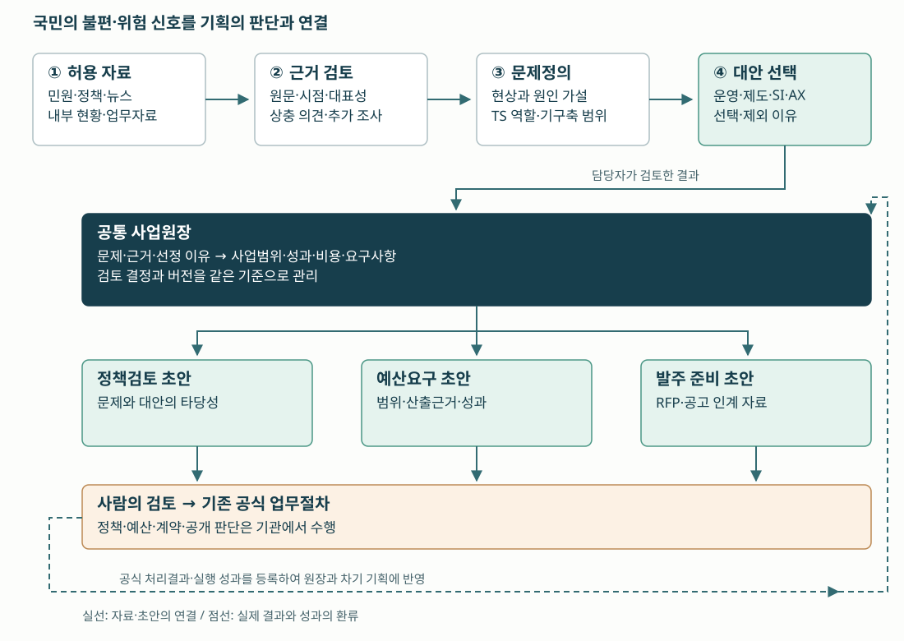
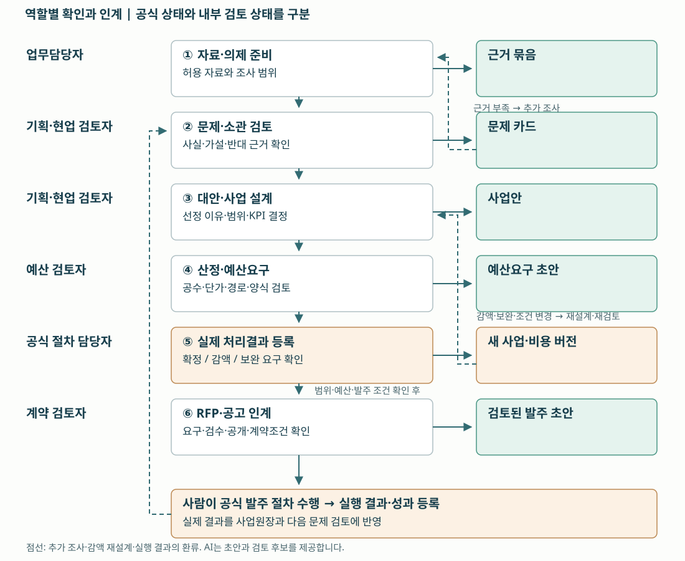
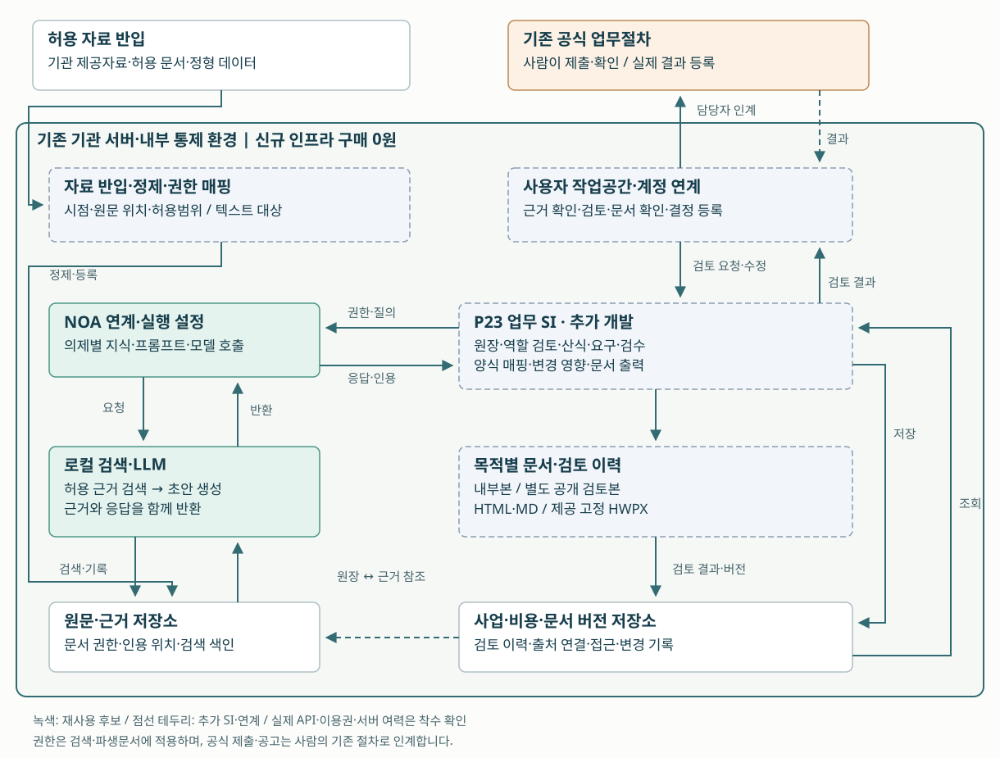
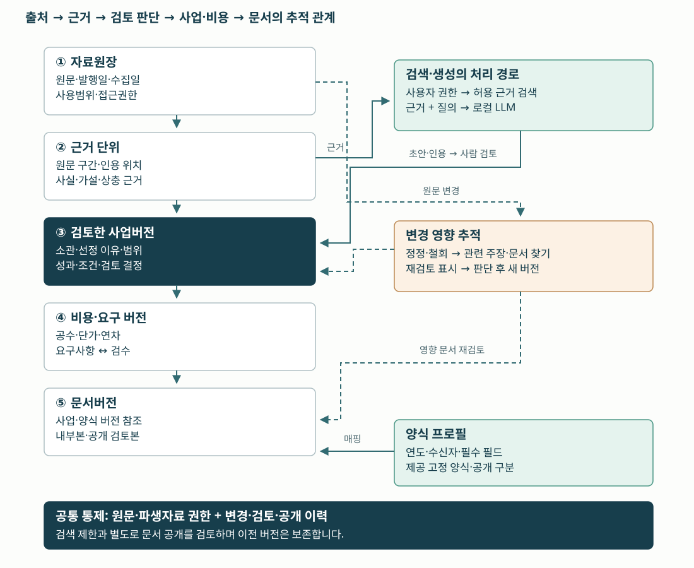

# 국민의 문제를 근거 있는 사업으로 연결하는 기획지원

**한국교통안전공단 P23 도입제안서 · CCK NOA 기반 로컬 LLM · 검토용 v1.4 / 2026.09.15**

## 01. 제안 요지

국민의 불편과 교통안전 현장의 위험 신호는 민원, 정책보고서, 뉴스, 업무자료에 서로 다른 모습으로 남습니다. 정책을 기획하는 담당자는 이 자료를 함께 읽고, 공단이 해결할 문제를 고른 다음, 사업의 범위와 예산을 설명해야 합니다. 이후 예산·계약 단계에서도 같은 사업을 다른 형식의 문서로 다시 설명합니다.

**P23은 이 과정에서 근거와 판단이 끊기지 않도록 돕는 기획지원 서비스입니다.** 자료에서 근거 후보와 쟁점을 찾고, 담당자가 선택한 문제·대안·사업범위를 하나의 사업원장에 연결합니다. 이 원장을 바탕으로 정책검토서, 예산요구 설명자료, 발주기관 RFP 등의 초안을 작성하며, 내용이 바뀌면 다시 검토할 문서를 알려줍니다.

**제안하는 변화** — 담당자가 하나의 문제를 열면, 원문 근거부터 선택한 대안, 사업범위, 비용, 관련 문서와 검토 이력까지 이어서 볼 수 있습니다. 검토에 쓰인 판단을 다음 담당자가 이어받는 것이 서비스의 핵심 가치입니다.

| 도입 판단 항목 | 제안 내용 |
|---|---|
| 주 사용자 | 기획·혁신 기능 담당자, 현업 부서, 예산·계약 검토자. 실제 조직명·전결권한은 착수 시 매핑 |
| 국민에게 이어지는 가치 | 반복되는 불편·위험을 검토 대상으로 구체화하고, 개선사업의 선정 이유와 개선 결과를 남김 |
| 도입 방식 | CCK가 업무분석·NOA 연계·추가 SI·검증·교육을 주관하는 AX 구축용역 |
| 환경 조건 | 기존 기관 서버와 로컬 LLM 활용. 신규 서버·GPU·스토리지 등 인프라 구매 0원 |
| 최초 적용 범위 | 의제 1개, 부서 2개, 허용 자료 4유형, 문서 프로필 6종으로 시범 구축 |
| 현재 판단 단계 | 서비스 제안·설계 단계. 실제 NOA 연계, 기관 적용, 승인·효과 측정은 미수행 |

P23은 TS 22개 업무 검토에서 확장한 **부서 공통 기획지원 후보**입니다. 공식 업무분류에 새 업무가 확정되었다는 의미는 아닙니다. 이 제안서는 P23 자체의 도입을 판단하기 위한 자료이며, P23으로 발굴할 개별 교통안전 사업은 별도의 타당성 검토를 거칩니다.

## 02. 도입해야 할 문제는 무엇인가

자료를 빨리 요약하는 것만으로 기획이 끝나지는 않습니다. 부서별로 자료의 해석이 다를 수 있고, 민원 한 건이 전체 이용자의 문제를 대표하지 않을 수 있습니다. 예산이 줄어들면 사업범위와 검수조건도 바뀌어야 합니다. 따라서 자료 검토, 판단의 기록, 문서 간 일관성을 함께 다룰 필요가 있습니다.

아래는 사용자와의 기획 대화에서 도출한 **현업 확인 전 업무 가설**입니다. TS에서 발생 빈도나 투입시간이 조사된 사실로 제시하지 않습니다.

| 업무 가설 | 담당자에게 필요한 변화 | 도입 전 확인할 증거 |
|---|---|---|
| 보고서·민원·뉴스·현황을 따로 읽고 다시 정리한다 | 같은 의제의 근거와 반대 근거를 묶고 원문으로 돌아간다 | 의제별 자료량, 준비시간, 원문 확인 방식 |
| 현상과 원인 추정이 섞여 사업이 먼저 정해진다 | 관찰 사실·원인 가설·추가 조사·TS 개입 가능성을 나눠 검토한다 | 기존 기획서의 문제·원인·대안 연결 여부 |
| 기획·예산·계약으로 인계하면서 선택 이유가 약해진다 | 선택·제외 이유와 범위를 다음 문서에 연결한다 | 부서 간 추가 질의, 문서 간 누락 사례 |
| 감액·근거 정정 후 일부 문서만 수정된다 | 영향받는 범위·비용·요구사항·문서를 함께 재검토한다 | 변경 이력, 금액·범위·검수조건 불일치 |

**공공적 목적은 더 많은 문서를 만드는 데 있지 않습니다.** 현장의 문제를 충분히 검토하고, 공단이 개입할 수 있는 개선사업으로 연결하는 데 있습니다. 기획시간을 줄인다면 그 시간을 반대 근거 확인과 현장 검토에 활용하도록 설계합니다. 인력 감축을 성과로 삼지 않습니다.

### 현행 방식과 비교해 추가 가치가 있어야 합니다

| 접근 방법 | 잘하는 일 | 남는 업무와 P23의 적용 판단 |
|---|---|---|
| 현행 검색·공유폴더·문서 작성 | 담당자의 전문 판단, 유연한 문서 편집 | 자료를 넘나드는 근거 연결과 변경 추적 부담을 실제 확인 |
| 양식·업무절차 SI 개선 | 필수값, 상태, 산식, 정해진 문서 출력 | 자료 해석이 단순하고 정형 입력으로 충분하면 이 방식이 더 적합 |
| NOA·로컬 LLM + 업무 SI | 서로 다른 표현의 자료에서 쟁점·근거 후보를 묶고, 검토 결과를 여러 문서에 연결 | 같은 의제·자료로 비교해 근거 누락과 검토 부담이 실제 줄어드는 경우 채택 |

P23의 필요성은 “AI를 쓸 수 있다”가 아니라 **해석이 필요한 자료와 부서 간 인계가 함께 있는 업무인지**로 판단합니다. 검색과 양식 개선만으로 충분한 업무에는 그 범위의 개선을 우선합니다.

## 03. 서비스 컨셉: 하나의 근거에서 여러 행정 문서로

*국민 의견과 업무자료를 기관 내부에서 검토하고 정책·예산·발주 초안으로 연결하는 설명용 생성 이미지. 실제 구축 화면이나 제품 성능을 표현한 그림이 아닙니다.*

자료를 입력하면 바로 사업을 확정하는 구조가 아닙니다. **근거를 읽고, 판단을 남기고, 선택한 사업을 구체화하는 순서**를 서비스로 제공합니다. 같은 사업원장을 사용하더라도 정책검토·예산요구·RFP는 수신자와 목적에 맞춰 서로 다른 내용을 담습니다.

**서비스 컨셉도.** 국민의 문제 신호를 근거·검토·사업원장·문서 초안으로 연결하고, 실제 처리결과를 다음 기획에 반영합니다.

| 서비스의 구성 | 담당자가 보는 결과 | 도입 가치 |
|---|---|---|
| 근거 묶음 | 원문 위치, 자료 시점, 관찰 사실, 상충 의견, 확인이 필요한 내용 | 요약의 근거와 대표성을 직접 판단 |
| 문제·대안 검토 | 원인 가설, TS 소관, 기존 과업, 운영·제도·SI·AX 대안 | 기술부터 정하기 전에 개입할 문제를 선정 |
| 공통 사업원장 | 선정 이유, 범위, KPI, 실행조건, 비용과 검토 결정 | 부서가 바뀌어도 선택 이유와 범위를 보존 |
| 목적별 문서 전환 | 정책검토서, 예산 설명자료, RFP·공고 인계 초안 | 중복 작성과 문서 간 불일치를 줄이는 기반 |

**국민이 P23에 직접 접속해야 가치가 생기는 것은 아닙니다.** 내부 담당자의 문제 검토와 사업 설계 품질을 높이고, 실행 결과를 다시 기획에 반영하는 방식으로 국민 안전·편익에 기여하도록 제안합니다. 실제 사고 감소나 예약 편의 개선은 개별 사업 시행 후 따로 평가합니다.

## 04. 서비스 모델과 사용자 경험

사용자는 파일 목록을 보는 것에서 시작해, 의제별 작업공간에서 근거와 판단을 함께 다룹니다. AI는 자료의 의미를 연결하고 초안을 제시합니다. 담당자는 이를 수정·채택·보류하면서 결정의 이유를 남깁니다.

| 작업공간 | 핵심 서비스 | 사용자에게 남는 산출물 |
|---|---|---|
| 의제 접수·자료함 | 의제 범위 지정, 허용 자료 등록, 중복·시점·권한 확인 | 자료 목록과 조사 범위 |
| 근거 검토 | 관련 문장·표의 근거 위치, 사실/가설 구분, 반대 근거 후보 | 출처가 연결된 문제 카드 |
| 사업 설계 | 소관·기구축 범위 대조, 대안 비교, 실행조건·KPI 정리 | 선택 이유가 있는 사업안 |
| 예산·양식 | 공수·단가·금액 검증, 예산 경로·서식 프로필 선택 | 검토 가능한 예산요구 초안 |
| 발주 준비 | 기능·비기능 요구와 검수조건 매핑, 공개 내용 검토 | 발주기관 RFP와 공고 인계 초안 |
| 변경·성과 | 정정·감액·보완 요구의 영향 표시, 실제 결과 등록 | 문서 재검토 목록과 차기 기획 근거 |

**화면에서 확인할 수 있어야 하는 것**

의제 목록에서 “자동차검사 예약 탐색”을 선택하면 ① 문제 카드 ② 연결된 근거 ③ 검토 중인 대안 ④ 범위·비용·관련 문서 ⑤ 남은 확인사항이 보입니다. 문장 옆의 출처를 누르면 해당 원문 위치로 이동하고, 금액을 변경하면 영향을 받는 요구사항과 문서가 “재검토 필요”로 표시되는 흐름입니다. 이는 구축할 사용자 경험의 설명이며 현재 구현된 제품 화면은 아닙니다.

## 05. 서비스 흐름: 누가 무엇을 확인하고 넘기는가

기획담당자 한 사람이 모든 판단을 대신하지 않도록 역할별 검토를 둡니다. 업무담당자는 현장 맥락과 원문을 확인하고, 기획담당자는 문제와 대안을, 예산담당자는 산정과 경로를, 계약담당자는 요구와 공개 범위를 검토합니다. 아래 역할은 기능상 구분으로, 실제 TS 조직·전결체계에 맞춰 조정합니다.

**서비스 흐름도.** 자료 준비부터 공식 처리결과 등록까지 담당자와 인계 산출물을 연결합니다. 부족한 근거와 감액은 해당 검토 단계로 되돌립니다.

| 인계 지점 | AI·시스템의 지원 | 다음 단계로 넘기기 전 사람의 확인 |
|---|---|---|
| 자료 → 문제 카드 | 유사 표현 묶기, 인용 후보, 사실·가설·상충 쟁점 분리 | 원문 맥락, 대표성, 추가 조사 필요 여부 |
| 문제 → 사업안 | TS 소관·기구축 과업 대조 후보, 대안 비교 초안 | 해결 필요성, 개입 가능성, 대안 선택 이유 |
| 사업안 → 예산요구 | 범위·KPI·산식·양식 연결과 누락 표시 | 공수·단가·연차·운영비와 실제 예산 경로 |
| 공식 결과 → 발주 준비 | 결과 등록, 감액·조건 변경의 영향 목록 | 확정 범위와 일정·요구·검수조건의 정합성 |
| 발주 초안 → 공식 절차 | 내부본·공개본 구분, 요구사항·검수 연결 | 계약조건, 경쟁성, 보호정보와 공개 적정성 |

내부 서비스의 “검토 완료”는 공식 예산 승인이나 발주 승인을 뜻하지 않습니다. 공식 절차는 기존 업무체계에서 사람이 수행하고, 확인된 결과를 다시 등록해 다음 문서의 기준으로 삼습니다. 자동 제출·공고 게시 기능은 최초 범위에 포함하지 않습니다.

## 06. 업무 사례: 예약 불편이 사업 요구가 되기까지

사용자는 자동차검사소 검색 후 날짜마다 마감 여부를 확인하기 위해 화면을 반복 이동하는 불편을 설명했습니다. 이것은 문제 탐색을 시작할 수 있는 **개인 경험**이며, TS 전체 이용자에 대한 통계나 확인된 시스템 장애는 아닙니다. 다음은 그 경험으로 서비스 사용법을 설명하는 예시입니다.

| 단계 | P23에서 정리할 내용 | 판단과 추가 확인 |
|---|---|---|
| ① 현상 | 검사소 검색 결과에서 선택 날짜의 예약 가능 상태를 비교하기 어렵다는 경험 | 실제 화면 흐름·이용 관찰로 재현 |
| ② 원인 가설 | 상태 표시의 한계 / 화면 이동 설계 / 조회 연계의 문제 / 실제 슬롯 부족 | 데이터 갱신 장애라고 단정하지 않음 |
| ③ 반대 근거·조사 | 희망 조건에 실제 빈 슬롯이 있는가? 이미 다른 화면에서 비교가 가능한가? | 허용된 예약 현황·로그·사용성 관찰 확보 |
| ④ 대안 | 안내 개선, 기존 조회·화면 개선, 상태 연계 보완, 공급 운영 검토 | 빈 슬롯 부족이면 검색 개선만으로 해결되지 않음 |
| ⑤ 사업범위 예시 | 같은 탐색 맥락에서 날짜·검사소 비교, 입력 조건 유지, 마감·조회실패 구분 | 실제 원인 확인 후 범위 채택 |
| ⑥ 예산·RFP 전환 | 확정 범위에 맞는 WBS, 상태 조회 연계 요구, 검수 시나리오 | 비용은 해당 개선사업에 별도 산정 |
| ⑦ 효과 확인 | 후보 탐색 시간, 화면 왕복, 조건 재입력, 상태 표시 일치 | 시행 전 기준선과 시행 후를 비교 |

**이 사례의 예약 개선은 별도 SI 또는 운영 개선사업이 될 수 있습니다.** P23은 그 사업의 문제·근거·대안·요구사항을 만들도록 돕습니다. 예약 화면 자체에 LLM을 반드시 넣어야 한다는 제안은 아닙니다.

같은 방식으로 안전점검 후 반복되는 미조치, 안전교육의 이용 장애, 기준 변경에 따른 안내 혼선 등을 의제로 검토할 수 있습니다. 이들은 확장 후보이며 실제 발생·소관·자료 접근을 확인한 후 적용합니다. 사고 원인에 관한 인과관계는 기사·민원 묶음만으로 확정하지 않습니다.

## 07. 전체 아키텍처: 기존 환경에 업무 기능을 더한다

**CCK의 주관 수행 범위는 기존 NOA·로컬 LLM의 활용과, 기획업무를 완결하기 위한 SI의 결합입니다.** 기관 내부에서 자료를 검색하고 초안을 만드는 기능에 사업원장, 검토 상태, 산식, 양식, 변경 추적을 연결합니다. 신규 인프라 구매 없이 운영 가능한 범위를 기존 서버 측정 결과에 맞춥니다.

**전체 아키텍처.** 기존 기관 환경 안의 재사용 후보와 추가 개발 영역을 구별합니다. 근거 검색·응답 반환·문서 검토·공식 결과 환류를 함께 표시합니다.

| 영역 | 제안하는 구성 | 재사용·구현 판단 |
|---|---|---|
| 사용자·기존 업무환경 | 기관 계정, 부서 역할, 기존 저장소·공식 업무절차 | SSO·저장소 인터페이스·전결권한 확인 후 연계 |
| NOA·로컬 검색·LLM | 의제별 검색, 근거 기반 초안, 프롬프트·지식 설정 | CCK 내부 기술자료에 기반한 재사용 후보. 현재 TS 연계 범위·API·모델 사용권은 확인 필요 |
| P23 추가 SI | 사업원장, 상태·검토 이력, 비용 산식, 요구·검수 연결, 양식 출력 | 본 사업의 신규 구현·시험·인수 범위 |
| 문서 어댑터 | HTML/MD 6종, 발주처 제공 고정 HWPX 2종 | docsmith/python-hwpx 검토자료 활용 가능성 검증. 외부 OSS 이용권·의존 버전·렌더 품질 별도 확인 |
| 운영 통제 | 원문·파생자료 권한, 이력, 보존, 백업·반출 정책 | 기존 정책을 확인하고 추가 구현·시험할 항목을 확정 |

### AI·규칙·사람의 역할을 분명히 합니다

| AI가 제안할 일 | 결정적으로 처리할 일 | 사람이 판단할 일 |
|---|---|---|
| 문서의 의미 연결, 근거 후보 추출, 원인 가설·반대 근거·초안 작성 | 접근 통제, 필수값, 합계·단위·연차, 버전·상태, 양식 매핑 | 근거의 충분성, 정책 타당성, 소관·대안·범위·예산·계약·공개 |

로컬 LLM은 기관이 통제하는 환경에서 추론과 근거 접근을 관리하기 위한 선택입니다. 접근권한·로그·보존·백업·반출 통제가 함께 구현되어야 데이터 주권의 요구를 충족할 수 있습니다. “로컬이므로 보안이 자동 보장된다”거나 “클라우드보다 저렴하고 빠르다”는 성능 주장은 하지 않습니다.

스캔 이미지 인식, 비전·OCR·STT, 센서 처리, 차량·시설 제어는 제품 범위에서 제외합니다. 초기 자료는 **텍스트 추출이 가능한 허용 문서와 정형 데이터**로 한정합니다. 현재 기획된 NL2SQL/Evidence Trail 기능을 이미 완성된 NOA 기본 기능으로 전제하지 않습니다.

## 08. 데이터 흐름: 근거와 권한이 문서까지 따라간다

자료의 출처를 표시하는 데서 끝나면 어느 문서가 그 근거를 사용했는지 알기 어렵습니다. P23은 원문, 근거 단위, 주장·가설, 사업버전, 비용·요구사항, 문서버전을 연결합니다. 원문이 정정되거나 철회되면 그 연결을 따라 검토 대상을 찾습니다.

**데이터 흐름도.** 원문·근거·사업·문서의 추적 관계와 검색·생성 경로를 구별하고, 권한·정정의 영향을 파생 자료까지 연결합니다.

| 데이터 단위 | 관리할 핵심 정보 | 이 정보가 필요한 이유 |
|---|---|---|
| 자료 | 출처, 수집일·발행일, 허용범위, 원문 위치, 접근권한 | 오래되거나 사용할 수 없는 자료를 구별 |
| 근거 | 원문 구간·표 위치, 인용, 문맥, 근거를 사용한 주장 | 요약을 원문과 대조하고 오해를 수정 |
| 문제·사업 | 사실·가설·반대 근거, 소관, 대안, 선택 이유, 버전 | 사람의 판단을 문서 생성과 분리해 보존 |
| 비용·요구 | 공수·단가·단위·연차, 범위·KPI·검수 연결 | 예산과 납품 요구가 함께 바뀌도록 검토 |
| 문서 | 사용한 원장·양식 버전, 내부/공개 구분, 검토 상태 | 서로 다른 문서의 생성 기준과 공개 적정성을 확인 |

### 변경을 처리하는 세 가지 규칙

1. **근거 부족:** 관련성 있는 문서를 찾지 못하면 추정 내용을 사실로 채우지 않고 추가 조사와 보류 항목을 만든다.
2. **근거 정정·철회:** 영향받는 주장·사업·문서를 “재검토 필요”로 표시하고 이전 버전을 보존한다. 자동 사업취소로 처리하지 않는다.
3. **예산 감액:** 금액만 수정하지 않고 기능·일정·KPI·검수조건과 RFP의 영향까지 다시 검토한다. 감액 후 수행 가능성을 자동 확정하지 않는다.

원문 접근 제한은 파생 요약·문서에도 적용하도록 설계합니다. 공개본은 별도 검토 경로로 분리합니다. 국민신문고 등은 기관에 허용된 제공자료 또는 정식 연계 범위에서만 다루며, 비공개 민원 원문을 임의 수집하는 방식으로 설계하지 않습니다.

## 09. 문서 전환: 목적에 맞게 구성하고 검토 결과를 반영한다

**사업원장은 공통으로 관리하되 문서의 목적은 구분합니다.** 정책검토서는 해결 필요성과 대안을 설명하고, 예산요구 자료는 비용과 재원·성과를 설명하며, 발주기관 RFP는 수행할 요구와 검수조건을 제시합니다. 공급사의 수주 제안서와 발주기관 RFP는 서로 다른 문서입니다.

| 문서 프로필 | 주요 구성 | 초안 전환의 기준 |
|---|---|---|
| F01 문제정의·정책사업 검토서 | 현상, 근거, 원인 가설, 대안, 선택 이유 | 담당자가 검토한 문제·대안 버전 |
| F02 예산요구 사업설명자료 | 목적, 범위, 산출근거, 연차, 운영비, 성과 | 사업·비용 버전과 실제 예산 경로 |
| F03 신규사업 리스트 | 소관, 필요성, 중복·실행조건, 예산 항목 | 해당 연도 지침·수신자·제공 서식 |
| F04 발주기관 RFP 초안 | 수행범위, 기능·비기능 요구, 산출물, 검수 | 검토한 범위와 요구·검수 연결 |
| F05 공고작성 인계서 | 공고 필드, 공개본, 계약 미확정 항목 | 계약담당자의 공개·계약 검토 |
| F06 심의질의 답변·보완표 | 질의, 답변 근거, 보완 내용, 영향 문서 | 실제 질의·결정 등록과 새 원장 버전 |

서식은 연도·수신기관·사업유형을 가진 프로필로 관리합니다. 초기에는 합의한 6종의 HTML/MD와 기관 제공 고정 HWPX 2종까지를 구축·검수합니다. 임의의 모든 HWP·PDF 양식을 자동 이해·변환하는 범용 엔진을 약속하지 않습니다.

예산 경로는 **TS 자체예산**, **소관부처를 통한 정부예산**, 그 밖의 별도 재원으로 구별합니다. 최초 구현은 합의된 2개 경로를 대상으로 합니다. 어느 중앙기관에 어떤 문서를 직접 제출하는지는 실제 업무 경로와 해당 연도 서식으로 확인합니다. 예산 심의·확보와 공공 공고의 공식 결정은 기관의 절차에 따릅니다.

기존 검토용 서식 보기: [F01 문제정의 정책사업 검토서](../서식/F01_문제정의_정책사업_검토서.html) · [F02 예산요구 사업설명자료](../서식/F02_예산요구_사업설명자료.html) · [F03 2027 신규사업 리스트](../서식/F03_2027_신규사업_리스트.html) · [F04 발주기관 RFP 초안](../서식/F04_발주기관_RFP_초안.html) · [F05 공고작성 인계서](../서식/F05_공고작성_인계서.html) · [F06 심의질의 답변보완표](../서식/F06_심의질의_답변보완표.html)

## 10. CCK 주관 수행과 도입 범위

최초 도입은 한 의제의 **자료→문제→사업→예산→RFP 인계**를 끝까지 연결하는 데 집중합니다. 기능을 기관 전체에 넓게 배포하기 전에 실제 자료와 양식으로 그 연결이 유효한지 검증합니다.

| 구분 | CCK 주관 수행 | TS 협업·확인 |
|---|---|---|
| 분석·설계 | 의제·사용자 흐름·자료·원장·검토 규칙 설계 | 시범부서·의제·소관·자료 제공 범위 지정 |
| 연계·구현 | NOA 연계, 의제별 검색·초안 설정, 원장·양식·산식·검토 SI | 기존 API·계정·서버 접근 조건, 기관 정책 제공 |
| 검증·인수 | 근거·권한·산식·양식·변경 시험, 사용자 교육·운영문서 | 업무 검토자 참여, 제공 양식 확정, 수용 결과 판단 |
| 운영·확대 | 장애·품질 개선 제안, 의제·양식별 확장 지원 | 정기 자료 갱신, 공식 결정·처리결과 등록, 운영 예산 판단 |

**계획 가정:** 의제 1개·부서 2개·허용 자료 4유형·HTML/MD 6종·고정 HWPX 2종·예산 경로 2종·로컬 환경 1개. 최초 일정은 약 16주를 검토하되 실제 재사용 상태와 인력·자료 준비에 따라 확정합니다. 기관의 예산 심의·계약 기간은 개발기간에 포함해 보장하지 않습니다.

| 추진 구간 | 산출물 | 다음 단계로 갈 조건 |
|---|---|---|
| 1–3주 · 업무·환경 확인 | 의제 정의, 현행 업무 기준선, 자료·연계·서식 목록 | 서버 여력·이용권·자료·검수 양식 확보, 상세 범위 합의 |
| 4–7주 · 근거·원장 구현 | 근거 검토, 문제·대안·사업원장, 역할 검토 | 원문 연결과 접근 제한을 실제 자료로 확인 |
| 8–11주 · 예산·문서 연결 | 산식, 6종 문서, 고정 HWPX 어댑터, 변경 영향 | 비용·단위·양식과 재검토 경로 시험 통과 |
| 12–16주 · 통합 검증·인수 | 의제 전체 시나리오, 사용자 검토, 교육·운영문서 | 합의 시험과 업무 수용기준 충족, 잔여항목 인계 |

기존 서버의 여력이 부족하면 동시사용·처리량·문서 범위·모델 구성을 조정하고 재측정합니다. 신규 인프라 투자 0원 조건에서 수용 가능한 범위가 확보되지 않으면 해당 범위의 착수를 보류하거나 재설계합니다. 기존 보고서가 있다는 이유로 기반 구현이 완료되었다고 간주하지 않습니다.

## 11. 도입 비용과 산정 전제

아래는 **P23 플랫폼 구축비**의 기존 산정 원장을 재사용한 기획 추정입니다. P23으로 기획할 개별 정책사업의 예산과는 다릅니다. 실제 기반 구축 상태가 확인되지 않았으므로 세 경우를 같은 기준으로 비교합니다. 금액은 VAT 포함이며 확정 견적·예산 배정액이 아닙니다.

| 기반 준비 상태 | 하한 | 중간 | 상한 | 포함 범위 |
| --- | --- | --- | --- | --- |
| P23 신규 도입 | 164,543,667원 | 220,087,560원 | 275,631,454원 | 공통 기반 + P23 기본 + 확장 |
| 공통 기반만 준비 | 126,543,457원 | 169,420,614원 | 212,297,771원 | P23 기본·관련 공통 추가분 + 확장 |
| P23 기존 구현 완료 | 67,609,987원 | 91,381,506원 | 115,153,025원 | 이번 예산·서식·발주 확장분만 |

**신규 인프라 구매비는 모든 경우 0원입니다.** 다만 라이선스·직접경비의 0원 입력은 비교용 가정이며 무료 사용이 확인됐다는 뜻은 아닙니다. 실제 사용권·연계·보안·양식 조건을 확인해 추가 여부를 견적에 반영합니다. 운영 유지보수·자료 갱신·연도별 양식 변경·백업 운영비는 별도 산정합니다.

### 추가 확장분의 공수 근거

아래 WBS는 위 표의 **추가 확장분**에 해당합니다. 신규 도입 전체 공수가 아닙니다. 기반 및 공통 기능 포함 여부는 기존 산정 원장을 확인해 동일 납품분을 중복 계산하지 않습니다.

| ID | 추가 개발 작업 | 공수 범위 | 중간 |
| --- | --- | --- | --- |
| X01 | 예산 경로·양식·검토 규칙 분석 | 6–10 인일 | 8 인일 |
| X02 | 공통 사업원장·필드 매핑 | 8–14 인일 | 11 인일 |
| X03 | 양식 출력·HWPX 어댑터 | 12–20 인일 | 16 인일 |
| X04 | 예산 산식·단위·연차 검증 | 6–10 인일 | 8 인일 |
| X05 | 역할 검토·변경 영향 관리 | 8–14 인일 | 11 인일 |
| X06 | RFP·공고 초안·공개본 분리 | 6–10 인일 | 8 인일 |
| X07 | 통합 검증·업무 인수 | 8–14 인일 | 11 인일 |
| 합계 | 추가 확장분 | 54–92 인일 | 73 인일 |

직접인건비 = Σ(직무별 단가 × 배분 공수)

제경비 = 직접인건비 × 144% / 기술료 = (직접인건비 + 제경비) × 20%

총액 = (직접인건비 + 제경비 + 기술료 + 라이선스 + 직접경비) × 1.10

중간 확장 시나리오: 직접인건비 약 28,372,301원 + 제경비 약 40,856,113원 + 기술료 약 13,845,683원 + VAT 약 8,307,410원입니다. 항목별 금액은 반올림 표시이며, **반올림 전 값으로 계산한 총액은 91,381,506원**입니다. 표시 항목을 더한 값과 총액에는 1원 차이가 있습니다.

제경비 144%, 기술료 20%는 기존 기획 산정의 입력 가정입니다. 공식 비율의 의무 적용이나 확정 원가로 주장하지 않습니다. 기존 원장은 2026년 SW기술자 임금 자료와 2025년 대가산정 가이드 참조를 기록하고 있으며, 실제 발주 산정 방식은 계약·사업 유형에 맞춰 다시 확정해야 합니다.

이전 전체 TS 사업의 “1차 7억·2차 추가 5억”은 여러 후보를 선택·배분하기 위한 목표 상한입니다. P23을 별도 추가예산으로 자동 합산하지 않고, 채택할 범위와 공통 기능을 확인해 그 안에서 배분할지 판단합니다.

## 12. 도입 효과를 무엇으로 입증할 것인가

**문서 생성량보다 근거 확인과 인계 품질을 평가합니다.** 같은 의제·같은 허용 자료에서 현행 방식과 P23 사용 결과를 비교하고, 담당자가 실제로 검토·수정하는 부담까지 측정합니다. 생성시간만 줄고 사실 확인이 더 오래 걸리면 개선으로 판단하기 어렵습니다.

| 평가 항목 | 방법과 제안 기준 | 판단 주체 |
|---|---|---|
| 근거 추적 | 합의한 시험세트의 필수 주장에서 원문·원장·문서 버전 연결 100% 확인. 별도로 인용의 내용 적합성 검토 | 현업·기획 검토자 + 품질 담당 |
| 계산·정합성 | 합의 산식·단위·연차 시험사례의 재계산 일치 100%, 누락 입력 표시 | 예산 검토자 + 시험 담당 |
| 접근·공개 | 역할별 비허용 접근·공개 요청 시험에서 잘못 허용한 사례 0건. 원문·요약·문서와 권한 변경 포함 | 보안·업무 담당 |
| 양식·변경 | 제공 고정 HWPX 2종의 필드·표·페이지 렌더 수용, 정정·감액 후 대상 문서 재검토 연결 | 서식 담당 + 품질 담당 |
| 업무 효과 | 의제별 검토시간, 근거 누락, 문서 불일치, 추가 질의, 초안 수정량을 기준선과 비교 | 시범부서 사용자 |
| 국민 안전·편익 | 선정된 사업의 시행 전후 지표를 별도 추적. 사례의 예약 탐색시간 등 업무별 설정 | 해당 사업의 업무 책임자 |

위 수치는 **제안하는 수용기준**이며 측정된 성과가 아닙니다. 시험세트의 통과가 운영 전체의 무오류나 안전 인증을 뜻하지 않습니다. 시간 절감률·사고 감소율은 근거가 확보되기 전 목표 실적으로 제시하지 않습니다.

시범 적용 후에는 반복 사용하는 업무와 양식부터 확대합니다. 공통 검색·권한·원장·검토 기능은 재사용하고, 추가되는 의제의 지식·규칙·연계·양식·시험분만 산정합니다. 이 방식은 다른 공공기관에도 확장할 수 있는 후보 구조이지만, 기관별 소관·예산·보안·서식 차이를 별도로 반영해야 합니다.

## 13. 제안하는 도입 결정

P23의 도입 여부는 실제 의제 하나에서 확인하는 것이 적절합니다. **근거가 많은 문제를 정리하고, 검토한 판단을 사업·예산·발주 문서까지 이어갈 필요가 있는 부서**를 시범 대상으로 선정합니다. 의제·자료·양식·환경을 확보한 뒤 수행범위와 비용을 확정합니다.

| 결정할 항목 | 권고안 | 확인 결과에 따른 조정 |
|---|---|---|
| 첫 의제 | TS 개입 가능성과 자료 제공이 확인되는 의제 1개 | 단순 서식 문제이면 SI 중심 범위로 축소 |
| 협업 범위 | 현업·기획 2개 부서를 중심으로 예산·계약 검토 역할 참여 | 실제 인계·전결체계를 확인해 역할 조정 |
| 기술 범위 | 기존 NOA·로컬 LLM 재사용 + 업무 SI | 미구현 기능은 신규 수행분으로 재산정 |
| 도입 비용 | 현재 구축 상태에 맞는 조건부 산정 선택 | 서버 여력·이용권·추가 비용 확인 후 확정 |
| 확장 판단 | 업무 품질과 검토 부담이 개선되고 수용기준을 충족한 범위부터 확대 | 근거 품질·효과가 부족하면 보완 후 재평가 |

이 제안의 납품 가치는 **근거를 설명할 수 있는 문제정의, 선택 이유가 남는 사업안, 일관된 예산·요구사항, 검토 가능한 문서 초안**입니다. CCK는 이를 연결하는 서비스 구현과 검증을 맡고, 기관은 정책과 예산·공개에 관한 판단을 유지합니다.

## 14. 근거·가정·상세 자료

이 문서는 기존 조사·설계 자료를 도입제안 형식으로 재구성했습니다. 이번 개정에서는 실환경 제품시험이나 새로운 TS 현업 조사를 수행하지 않았습니다. 근거가 없는 민원 건수·업무시간·도입 성과를 추가하지 않았습니다.

| 근거 구분 | 사용 범위와 상태 |
|---|---|
| 사용자와의 기획 대화 | 현업의 많은 자료 검토, 예산·RFP 전환 수요, 예약 불편 개인 경험. 업무 발생률은 미측정 |
| P23 v1.1 정의·원장 | 문서 프로필, 산식·공수·조건별 비용. 현재 실제 구축 상태는 미확인 |
| P23 v1.2·v1.3 | 서비스 로직·상태·시각자료. 제안된 구현 구조이며 제품 실행 증거가 아님 |
| CCK 아카이브 | 기술 카탈로그·문서 자동화 분석·재사용 주의사항 확인. 코드 실행·TS 연계·사용권 확정은 이번 작업 범위 밖 |
| 공식 예산·대가 자료 | 기존 출처 원장에 기록된 문서·연도를 유지. 현행 적용성과 실제 TS 제출 경로는 계약·업무 담당 확인 필요 |

- [상세 근거·출처와 검증 상태](../근거_출처와_검증상태.md)
- [기존 정의·예산·서식 전체보기](../00_기획_전체보기.html)
- [입력·출력·예외를 확인하는 상세 로직맵](../시각설계_v1.2/00_서비스_로직맵.html)
- [산정 원장 사본](비용산정_참조원장.json) · [기존 상세 비용·도입계획](../07_비용과_도입계획.html)
- [2027년도 예산안 편성 및 기금운용계획안 작성 세부지침 — 기존 출처 S01](https://www.mpb.go.kr/web/main/bbs/b_0005/2225)
- [2026년 적용 SW기술자 평균임금 — 기존 출처 S05](https://www.swai.or.kr/site/sw/ex/board/View.do?bcIdx=64717&cbIdx=304)
- [2025년 SW사업 대가산정 가이드 — 기존 출처 S06](https://www.swai.or.kr/site/sw/ex/board/View.do?bcIdx=63607&cbIdx=276&searchExt1=)
- [생성 이미지의 원래 제작 기록](../슬라이드_통합설명_v1.3/이미지_생성기록.md)
- [사업기획 폴더 통합 안내](../../../루트기획문서_아카이브_2026-09-29/00-09/00_여기서_시작.html)

**문서 사용 범위:** 내부 검토용 제안 초안. 실제 제공 양식과 확인된 요구사항으로 협의·보완한 뒤 대외 제안에 활용합니다. 생성 이미지는 설명용 시각 자산이며, 정확한 구조와 책임은 SVG 도식·본문을 기준으로 합니다.
