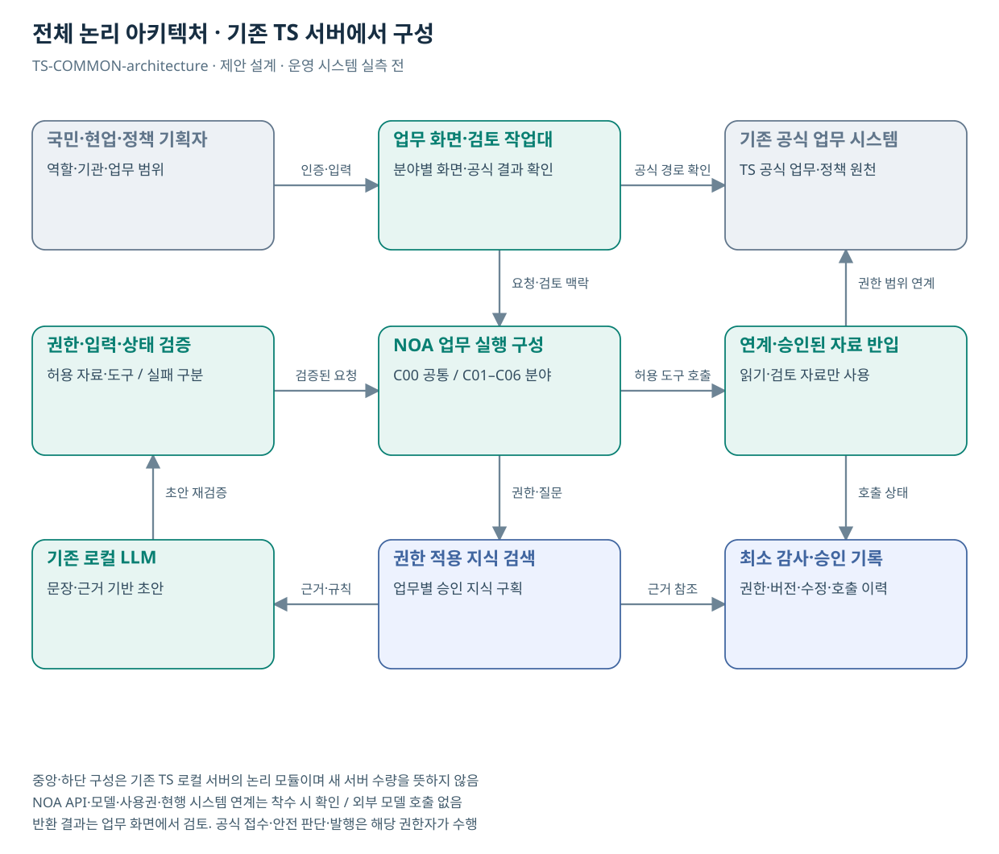

# 공통 아키텍처·수행 경계

기존 NOA 환경과 TS 서버 위에 업무별 지식·규칙·화면·연계를 구성한다. 아래 모듈은 논리 구성이고 신규 서버·DB 구매 수량이 아니다.

| 모듈 | 공유 업무 | 책임·비용 경계 |
| --- | --- | --- |
| C00 기존 NOA 환경·권한·근거·운영 구성 | P01, P02, P03, P04, P05, P06, P07, P08, P09, P10, P11, P12, P13, P14, P15, P16, P17, P18, P19, P20, P21, P22, P23 | 설치 버전·사용권·로컬 호출 점검, 역할별 권한, 원문 근거·로그·배포/복귀, 기존 서버 부하 측정. 이미 제공된 기능은 재구현하지 않고 설정·연계·누락 기능만 산정 |
| C01 증빙 대조 공통 기능 | P01, P03, P04, P05, P11, P12, P17 | 텍스트 구조·원문 위치·요건별 근거·검토 이력 공통 처리. P17에는 대조 엔진 비용 재배정 없음 |
| C02 국민 안내·처리 공통 기능 | P02, P07, P09, P10, P15, P18, P19, P20 | 조건 확인·상태 표시·근거 응답·인계 오류 처리. 실제 본인확인·예약·지급은 각 공식 시스템이 담당 |
| C03 보호된 안전사례 공통 기능 | P06, P08 | 원본/검토본/전파본 구획·검토·승인. 코드 재사용과 데이터 공유를 분리 |
| C04 기준 변경 공통 기능 | P13, P14 | 기준 버전·개정 대조·영향 근거·문서 상태. 관할·기준 적용은 분야별 검토 |
| C05 교육·결과 설명 공통 기능 | P16, P21, P22 | 승인 교재 연결·문답·강사 검토·버전 관리. P22는 이륜차 콘텐츠만 추가 |
| C06 정책 문제정의·대안 검토 공통 기능 | P23 | 문제·주장·근거·가설·소관·대안의 공통 데이터 모델, 검토 단계·보고 출력. P23 증분은 주제별 자료·규칙·평가 적용 |

## 주요 설계 결정

| 결정 | 근거 | 재검토 조건 |
| --- | --- | --- |
| 기존 기반 활용 | 사용자 제약: NOA·로컬 LLM·신규 인프라 0원 | 설치 버전·권한·자원 확인 결과 |
| 분야별 데이터 구획 | 공통 코드 재사용과 원문 접근권한 분리 | 자료 소유자의 변경 승인 |
| 사람 검토·공식 상태 | LLM 초안이 자격·안전·예약·지급·정책 확정으로 바뀌지 않음 | 공식 업무 권한·승인 정책 변경 |
| 증분·공통 비용 분리 | P17/P01, P22/P21 및 여러 업무 공통 이중 계상 방지 | 기존 납품·기능 증거와 실공수 확인 |
| P23 별도 후보 | 사용자 제안의 정책 문제정의·사업대안 지원 | TS 수요·담당부서·소관·자료권한 검증 |

## 계약 전 기술 확인

- 설치 NOA 버전·모델·라이선스·폐쇄망 호출·도구 실행 인터페이스
- 문서 파싱·권한 검색·근거 반환·검토 이력의 실제 제품 지원 여부
- 원문·인덱스·캐시·생성물의 변경·삭제·접근 철회 전파
- 기존 서버 부하·실제 동시성·문서량·응답 목표 측정
- 기존 시스템 공급사 연계·SSO·공식 상태·재시도·복귀 계약

전용 비전·OCR·음성·센서·물리 제어·새 모델 학습 R&D는 이번 범위에 포함하지 않는다. CCK의 보유 기술과 계획 기능을 혼동하지 않으며 근거 원장·정책기획 상태 등 미구현 항목은 SI 공수로 확인한다.