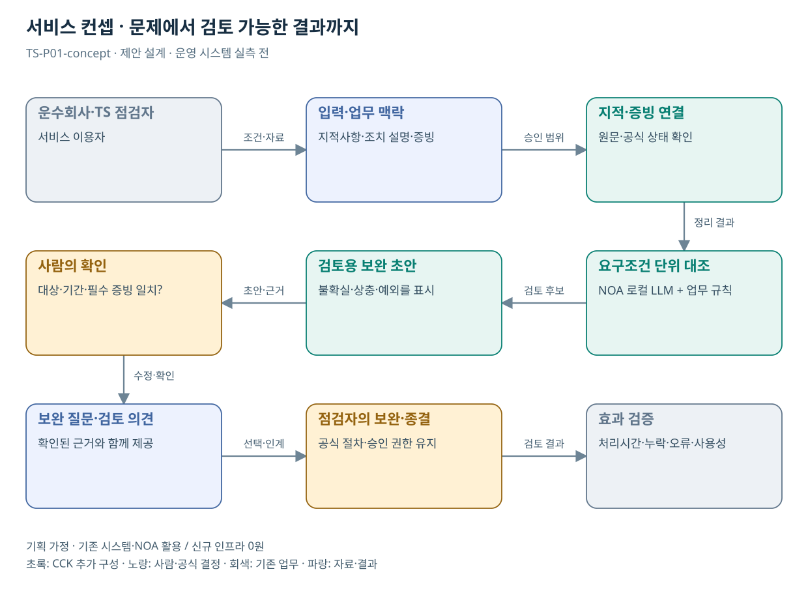

# TS-P01 서비스 정의·컨셉

운수회사 안전점검 개선조치 증빙 검토 지원

> **기획 검토안**: CCK 주관 AX+SI / NOA·로컬 LLM / 기존 서버 / 신규 인프라 0원. 실제 API·물량·견적·효과는 확인 전.

## 서비스 정의

**지적사항마다 조치 증빙과 보완 질문을 붙여 점검자가 검토를 마칠 수 있는 작업 화면**

| 항목 | 설명 |
| --- | --- |
| 대상 사용자 | 운수회사 안전담당자·TS 점검자와 해당 운송서비스 이용 국민 |
| 문제·관찰 | 지적사항과 조치 설명의 표현이 달라 제출자료만으로 보완 필요 여부를 확인하기 어렵다는 가설 |
| 이용 장면 | 업체가 교육을 실시했다고 제출했지만 대상 운전자·해당 지적사항·실시 시점의 연결 근거가 빠진 상황 |
| 확인된 TS 업무 | 서류·현장 점검, 조치 이행 확인과 사후관리 |
| 초기 범위 가정 | 운수회사 한 업종, 점검 유형 1개, 전자문서 3종, 기존 기록 조회 1개 |
| 기존 기반 | 점검 기록·지적사항·조치 상태와 COSAS 협업 화면 |
| CCK AI 적용 | 지적 내용과 조치 증빙의 의미 대조, 누락 질의와 보완 초안 |
| 추가 수행분 | 점검건-증빙 연결·대조 지식·검토 화면·평가 사례 |
| 비교 기준선 | 필수필드 체크리스트와 현행 COSAS 사후관리 |
| 효과 측정 | 중요 보완 누락 건수·잘못된 충족 표시·건별 검토시간 |

## 제공 결과

- 지적별 요구 증빙 목록
- 대응 원문·위치·대상·기간
- 충족 후보 / 미충족 / 상충 / 판단불가
- 보완 질문과 질문을 만든 사유
- 검토자 수정·결정 이력

## 중복·수행 가능성

P17과 한 적용 사업으로 구성; P03·04·05·11·12의 증빙 대조 구성요소 재사용

TS 점검부서가 종결·보완 사례와 기준 버전을 제공하고 COSAS 운영자가 점검키·기관별 권한을 확인한다.

증빙 표현의 유사성을 실제 조치 완료로 오인할 위험. 필수 현장 확인과 미확인 근거를 별도 표시하고 자동 종결을 제공하지 않는다.

## 대안 검토

| 대안 | 적용 내용 | 선택 조건 |
| --- | --- | --- |
| A 기존 절차·규칙·화면 개선 | 필수필드 체크리스트와 현행 COSAS 사후관리 | 같은 효과가 나면 LLM 범위 축소 |
| B 기존 NOA + 업무 지식·연계 | 점검건-증빙 연결·대조 지식·검토 화면·평가 사례 | 권고 검토안. 공통 재사용·실제 증분 산정 |
| C 자료·업무·기관 확대 | 다른 법정 점검의 지적·조치 검토에 구조 재사용; 판정 기준은 업무별 분리 | 초기 효과·권한·자원 검증 후 재산정 |

## 도식의 연결

| 연결 | 전달 내용 |
| --- | --- |
| 운수회사·TS 점검자 → 입력·업무 맥락 | 조건·자료 |
| 입력·업무 맥락 → 지적·증빙 연결 | 승인 범위 |
| 지적·증빙 연결 → 요구조건 단위 대조 | 정리 결과 |
| 요구조건 단위 대조 → 검토용 보완 초안 | 검토 후보 |
| 검토용 보완 초안 → 사람의 확인 | 초안·근거 |
| 사람의 확인 → 보완 질문·검토 의견 | 수정·확인 |
| 보완 질문·검토 의견 → 점검자의 보완·종결 | 선택·인계 |
| 점검자의 보완·종결 → 효과 검증 | 검토 결과 |

## 출처와 확인 범위

- [교통수단안전점검](https://main.kotsa.or.kr/portal/contents.do?menuCode=01040201) — 확인일 2026-09-14; 서류·현장점검, 조치보고·사후관리 확인; 과거 실적은 최신치로 사용하지 않음
- [운수안전컨설팅지원시스템(COSAS)](https://main.kotsa.or.kr/portal/contents.do?menuCode=01081000) — 확인일 2026-09-15; 법정 점검·협업·진행상황 안내 확인; 내부 기능 전수검토 아님

기존 22개 출처는 이전 원장 확인일을 승계했다. 공급사 성능·자료 접근권한·법령 전체를 새로 검증한 자료는 아니다.

[이전 고도화 보고서](file:///G:/%EB%82%B4%20%EB%93%9C%EB%9D%BC%EC%9D%B4%EB%B8%8C/1.%20%EC%97%85%EB%AC%B4%EC%98%81%EC%97%AD/6.%20CCK/1.%20%EC%82%AC%EC%97%85%EA%B4%80%EB%A6%AC/TS/bizops/%5BTS%20%EC%82%AC%EC%97%85%EA%B8%B0%ED%9A%8D%5D/05_%ED%86%B5%ED%95%A9%EC%82%AC%EC%97%85%EA%B8%B0%ED%9A%8D/TS_22%EA%B0%9C%EC%97%85%EB%AC%B4_%EA%B3%A0%EB%8F%84%ED%99%94%EB%B3%B4%EA%B3%A0%EC%84%9C_2026-09-15/%EA%B0%9C%EB%B3%84%EB%B3%B4%EA%B3%A0%EC%84%9C/TS-P01_%EA%B3%A0%EB%8F%84%ED%99%94%EB%B3%B4%EA%B3%A0%EC%84%9C.html)

[Markdown 전체 목록](../../00_상세설계_통합보기.md)