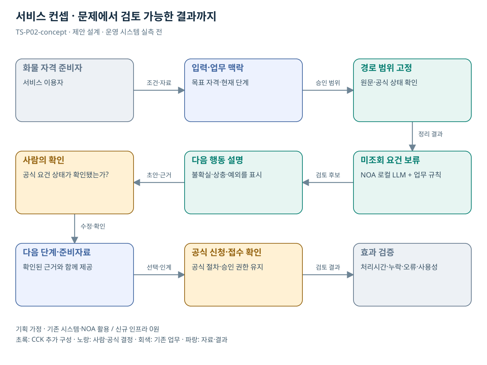

# TS-P02 서비스 정의·컨셉

사업용 운전자 자격 취득 단계별 처리 지원

> **기획 검토안**: CCK 주관 AX+SI / NOA·로컬 LLM / 기존 서버 / 신규 인프라 0원. 실제 API·물량·견적·효과는 확인 전.

## 서비스 정의

**화물 자격 준비자가 현재 단계와 미확인 조건을 확인하고 공식 신청으로 이어가는 안내 서비스**

| 항목 | 설명 |
| --- | --- |
| 대상 사용자 | 버스·택시·화물 자격 취득을 준비하는 국민과 자격 상담 담당자 |
| 문제·관찰 | 검사·시험·교육·발급을 따로 확인하면서 다음 단계나 준비자료를 놓치는 가설 |
| 이용 장면 | 검사를 마친 신청자가 자격시험 응시 전에 무엇을 더 해야 하는지 다시 묻는 상황 |
| 확인된 TS 업무 | 운전적성정밀검사, 화물 등 사업용 자격의 시험·교육·발급 |
| 초기 범위 가정 | 초기는 화물 자격 1개 경로, 상태 조회 1개, 신청 시스템 인계 1개 |
| 기존 기반 | 자격 안내·검사/시험/교육/발급 시스템 |
| CCK AI 적용 | 자유로운 경력·질문을 조건으로 정리, 개인별 안내·준비자료 점검·다음 단계 지원 |
| 추가 수행분 | 화물 자격 지식·문진·상태 연계·예외 평가 |
| 비교 기준선 | 자격별 단계형 안내와 링크·입력값 유지 |
| 효과 측정 | 잘못된 다음 단계 안내·조건 재입력·신청 완료 실패 |

## 제공 결과

- 현재 단계와 확인 시점
- 충족·미확인 요건 구분표
- 사용자가 더 확인할 최소 질문
- 공식 신청 인계용 확인 요약
- 접수번호 또는 접수 미확인 상태

## 중복·수행 가능성

P07의 자격 지원 구조 재사용; 자격 기준·증빙·접수권한은 별도

자격 업무부서가 상태코드·유효기간 규칙을 확정하고 운영부서가 본인확인과 인계 허용 범위를 제공한다.

친절한 설명이 자격 충족 판정으로 읽힐 위험. 공식 확인 상태와 개인 진술을 화면에서 분리한다.

## 대안 검토

| 대안 | 적용 내용 | 선택 조건 |
| --- | --- | --- |
| A 기존 절차·규칙·화면 개선 | 자격별 단계형 안내와 링크·입력값 유지 | 같은 효과가 나면 LLM 범위 축소 |
| B 기존 NOA + 업무 지식·연계 | 화물 자격 지식·문진·상태 연계·예외 평가 | 권고 검토안. 공통 재사용·실제 증분 산정 |
| C 자료·업무·기관 확대 | 공공 자격 신청의 단계 안내·완료 확인 재사용; 자격요건은 별도 | 초기 효과·권한·자원 검증 후 재산정 |

## 도식의 연결

| 연결 | 전달 내용 |
| --- | --- |
| 화물 자격 준비자 → 입력·업무 맥락 | 조건·자료 |
| 입력·업무 맥락 → 경로 범위 고정 | 승인 범위 |
| 경로 범위 고정 → 미조회 요건 보류 | 정리 결과 |
| 미조회 요건 보류 → 다음 행동 설명 | 검토 후보 |
| 다음 행동 설명 → 사람의 확인 | 초안·근거 |
| 사람의 확인 → 다음 단계·준비자료 | 수정·확인 |
| 다음 단계·준비자료 → 공식 신청·접수 확인 | 선택·인계 |
| 공식 신청·접수 확인 → 효과 검증 | 검토 결과 |

## 출처와 확인 범위

- [사업용 운송자격 취득절차: 화물](https://main.kotsa.or.kr/portal/contents.do?menuCode=01050800) — 확인일 2026-09-14; 검사·시험·교육·발급 절차 확인
- [주요사업](https://main.kotsa.or.kr/portal/contents.do?menuCode=06020300) — 확인일 2026-09-14; 공식 요약의 7개 사업 분류 확인
- [TS AI 체험존](https://main.kotsa.or.kr/portal/contents.do?menuCode=04050400) — 확인일 2026-09-11; 3종 AI 상담·위험도 분석 컨설팅 안내 확인; 서비스 직접 시험 없음

기존 22개 출처는 이전 원장 확인일을 승계했다. 공급사 성능·자료 접근권한·법령 전체를 새로 검증한 자료는 아니다.

[이전 고도화 보고서](file:///G:/%EB%82%B4%20%EB%93%9C%EB%9D%BC%EC%9D%B4%EB%B8%8C/1.%20%EC%97%85%EB%AC%B4%EC%98%81%EC%97%AD/6.%20CCK/1.%20%EC%82%AC%EC%97%85%EA%B4%80%EB%A6%AC/TS/bizops/%5BTS%20%EC%82%AC%EC%97%85%EA%B8%B0%ED%9A%8D%5D/05_%ED%86%B5%ED%95%A9%EC%82%AC%EC%97%85%EA%B8%B0%ED%9A%8D/TS_22%EA%B0%9C%EC%97%85%EB%AC%B4_%EA%B3%A0%EB%8F%84%ED%99%94%EB%B3%B4%EA%B3%A0%EC%84%9C_2026-09-15/%EA%B0%9C%EB%B3%84%EB%B3%B4%EA%B3%A0%EC%84%9C/TS-P02_%EA%B3%A0%EB%8F%84%ED%99%94%EB%B3%B4%EA%B3%A0%EC%84%9C.html)

[Markdown 전체 목록](../../00_상세설계_통합보기.md)