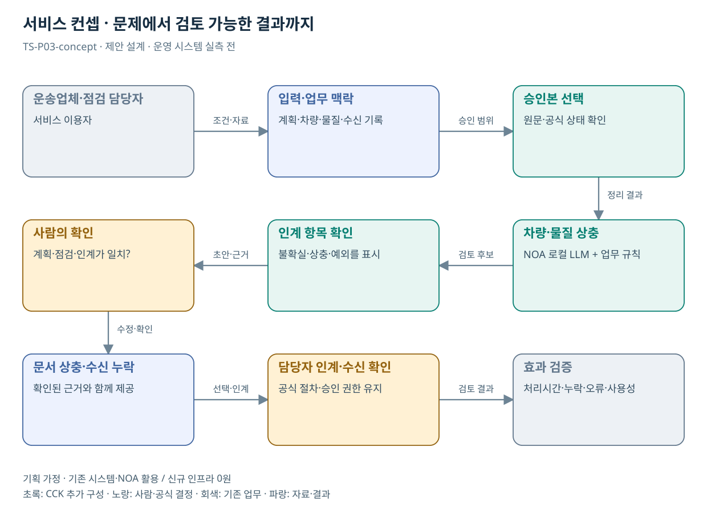

# TS-P03 서비스 정의·컨셉

위험물질 운송계획·점검 인계 문서 일치 확인

> **기획 검토안**: CCK 주관 AX+SI / NOA·로컬 LLM / 기존 서버 / 신규 인프라 0원. 실제 API·물량·견적·효과는 확인 전.

## 서비스 정의

**위험물 운송계획·점검·인계 기록의 상충과 수신 누락을 한 건으로 검토하는 문서 지원**

| 항목 | 설명 |
| --- | --- |
| 대상 사용자 | 위험물 운수업체·TS 및 관할 지자체 점검 담당자와 운송 경로 주변 국민 |
| 문제·관찰 | 운송계획·점검결과·후속 인계 문서 사이의 누락이나 상충을 사람이 반복 대조하는 가설 |
| 이용 장면 | 운송계획의 차량과 점검 기록의 차량이 다르거나 조치 인계의 수신 확인이 없는 상황 |
| 확인된 TS 업무 | 운송계획서·단말 준수사항 확인, 지자체 합동점검 |
| 초기 범위 가정 | 위험물 운송 업무 유형 1개, 계획/점검/인계 문서 3종, 조회 1개 |
| 기존 기반 | 위험물 운송계획·점검·인계 및 기존 관제 |
| CCK AI 적용 | 문서 간 차량·물질·일정 상충 확인과 인계 질의 초안 |
| 추가 수행분 | 위험물 문서 규칙·인계 확인·수신권한 연계 |
| 비교 기준선 | 계획·점검 필수필드 검사와 수신 확인 절차 |
| 효과 측정 | 중요 문서 상충 미발견·필수 인계 항목 누락·인계 확인 소요시간 |

## 제공 결과

- 계획·점검·인계 대응표
- 차량·물질·일정의 상충 항목
- 인계 필수 항목 누락
- 수신 확인 필요 목록
- 담당자 검토용 질의 초안

## 중복·수행 가능성

P01과 점검 문서 대조를 재사용하되 위험물 식별·기관 수신 기록은 별도

TS-BIZ-007 계약 범위, 비식별 문서 묶음, 계획 버전 및 수신기관 권한을 확인한다.

문서 일치가 실제 운송 안전 보장으로 오인될 위험. 결과는 문서 검토이며 현장·관제 판단을 대체하지 않는다.

## 대안 검토

| 대안 | 적용 내용 | 선택 조건 |
| --- | --- | --- |
| A 기존 절차·규칙·화면 개선 | 계획·점검 필수필드 검사와 수신 확인 절차 | 같은 효과가 나면 LLM 범위 축소 |
| B 기존 NOA + 업무 지식·연계 | 위험물 문서 규칙·인계 확인·수신권한 연계 | 권고 검토안. 공통 재사용·실제 증분 산정 |
| C 자료·업무·기관 확대 | 위험물·재난 협업의 인계 문서 검토 패턴; 실시간 관제와 지휘 책임은 별도 | 초기 효과·권한·자원 검증 후 재산정 |

## 도식의 연결

| 연결 | 전달 내용 |
| --- | --- |
| 운송업체·점검 담당자 → 입력·업무 맥락 | 조건·자료 |
| 입력·업무 맥락 → 승인본 선택 | 승인 범위 |
| 승인본 선택 → 차량·물질 상충 | 정리 결과 |
| 차량·물질 상충 → 인계 항목 확인 | 검토 후보 |
| 인계 항목 확인 → 사람의 확인 | 초안·근거 |
| 사람의 확인 → 문서 상충·수신 누락 | 수정·확인 |
| 문서 상충·수신 누락 → 담당자 인계·수신 확인 | 선택·인계 |
| 담당자 인계·수신 확인 → 효과 검증 | 검토 결과 |

## 출처와 확인 범위

- [TS, 2026년 위험물질운송차량 정기단속 실시](https://main.kotsa.or.kr/portal/bbs/report_view.do?bbscCode=report&bbscSeqn=18812&menuCode=05010200) — 확인일 2026-09-14; 단말·계획서 준수 확인, 지방정부 합동점검 안내 확인
- [사업 범위와 중복판정 v2.0](file:///G:/%EB%82%B4%20%EB%93%9C%EB%9D%BC%EC%9D%B4%EB%B8%8C/1.%20%EC%97%85%EB%AC%B4%EC%98%81%EC%97%AD/6.%20CCK/1.%20%EC%82%AC%EC%97%85%EA%B4%80%EB%A6%AC/TS/bizops/%5BTS%20%EC%82%AC%EC%97%85%EA%B8%B0%ED%9A%8D%5D/00_%EA%B8%B0%ED%9A%8D%EC%A7%80%EC%B9%A8/%EC%8B%A0%EA%B7%9C%EC%82%AC%EC%97%85_%EB%B2%94%EC%9C%84%EC%99%80_%EC%A4%91%EB%B3%B5%EB%B0%B0%EC%A0%9C.md) — 확인일 2026-09-15; 기구축 업무·시스템·AI 후속 적용 허용, 동일 계약 기능의 이중 계상 구분

기존 22개 출처는 이전 원장 확인일을 승계했다. 공급사 성능·자료 접근권한·법령 전체를 새로 검증한 자료는 아니다.

[이전 고도화 보고서](file:///G:/%EB%82%B4%20%EB%93%9C%EB%9D%BC%EC%9D%B4%EB%B8%8C/1.%20%EC%97%85%EB%AC%B4%EC%98%81%EC%97%AD/6.%20CCK/1.%20%EC%82%AC%EC%97%85%EA%B4%80%EB%A6%AC/TS/bizops/%5BTS%20%EC%82%AC%EC%97%85%EA%B8%B0%ED%9A%8D%5D/05_%ED%86%B5%ED%95%A9%EC%82%AC%EC%97%85%EA%B8%B0%ED%9A%8D/TS_22%EA%B0%9C%EC%97%85%EB%AC%B4_%EA%B3%A0%EB%8F%84%ED%99%94%EB%B3%B4%EA%B3%A0%EC%84%9C_2026-09-15/%EA%B0%9C%EB%B3%84%EB%B3%B4%EA%B3%A0%EC%84%9C/TS-P03_%EA%B3%A0%EB%8F%84%ED%99%94%EB%B3%B4%EA%B3%A0%EC%84%9C.html)

[Markdown 전체 목록](../../00_상세설계_통합보기.md)