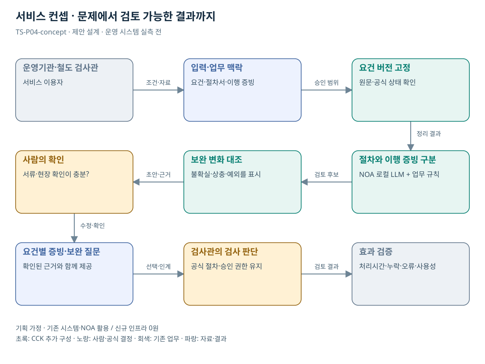

# TS-P04 서비스 정의·컨셉

철도 안전관리체계 요건·증빙·보완 연결

> **기획 검토안**: CCK 주관 AX+SI / NOA·로컬 LLM / 기존 서버 / 신규 인프라 0원. 실제 API·물량·견적·효과는 확인 전.

## 서비스 정의

**철도 안전관리체계의 요건별 제출·보완·현장 확인 근거를 연결하는 검사관 검토 화면**

| 항목 | 설명 |
| --- | --- |
| 대상 사용자 | 철도운영기관 안전관리 담당자·TS 검사관·철도 이용 국민 |
| 문제·관찰 | 안전관리체계의 요건과 문서 개정·보완 증빙을 연결하는 과정에서 빠진 근거를 발견하기 어렵다는 가설 |
| 이용 장면 | 운영기관이 절차서를 개정했지만 실제 적용 기록이 어떤 검사 요건을 충족하는지 분명하지 않은 상황 |
| 확인된 TS 업무 | 운영기관의 체계에 대한 서류·현장 검사 |
| 초기 범위 가정 | 운영기관 1곳, 검사 요건군 1개, 텍스트 전자문서 3종, 읽기 연계 1개 |
| 기존 기반 | 철도 안전관리체계 검사·요건·제출/보완 기록 |
| CCK AI 적용 | 요건-제출자료 의미 연결과 보완 검토 |
| 추가 수행분 | 요건팩·증빙 연결·기관 권한·검사 사례 평가 |
| 비교 기준선 | 전문가 체크리스트·문서 버전관리·기존 철도 검사시스템 |
| 효과 측정 | 필수 증빙 누락 미발견·근거 연결 오류·보완 왕복 횟수 |

## 제공 결과

- 요건별 문서·증빙 연결표
- 이전 지적 대비 보완 변화
- 서류 미확인과 현장 확인 필요의 구분
- 보완 질의 초안
- 검사관 확정 의견과 이력

## 중복·수행 가능성

P05와 문서 검토 엔진 공유; 검사 목적·요건·전문가 판단은 분리

검사 요건군, 적용 기준, 서류·현장 구분, 비식별 보완 사례를 검사관이 확인한다.

절차서 존재와 운영 이행을 혼동할 위험. 요건별 증거 종류를 별도로 강제한다.

## 대안 검토

| 대안 | 적용 내용 | 선택 조건 |
| --- | --- | --- |
| A 기존 절차·규칙·화면 개선 | 전문가 체크리스트·문서 버전관리·기존 철도 검사시스템 | 같은 효과가 나면 LLM 범위 축소 |
| B 기존 NOA + 업무 지식·연계 | 요건팩·증빙 연결·기관 권한·검사 사례 평가 | 권고 검토안. 공통 재사용·실제 증분 산정 |
| C 자료·업무·기관 확대 | 운영기관 안전관리체계 점검 패턴을 재사용하되 각 교통수단 법정기준을 분리 | 초기 효과·권한·자원 검증 후 재산정 |

## 도식의 연결

| 연결 | 전달 내용 |
| --- | --- |
| 운영기관·철도 검사관 → 입력·업무 맥락 | 조건·자료 |
| 입력·업무 맥락 → 요건 버전 고정 | 승인 범위 |
| 요건 버전 고정 → 절차와 이행 증빙 구분 | 정리 결과 |
| 절차와 이행 증빙 구분 → 보완 변화 대조 | 검토 후보 |
| 보완 변화 대조 → 사람의 확인 | 초안·근거 |
| 사람의 확인 → 요건별 증빙·보완 질문 | 수정·확인 |
| 요건별 증빙·보완 질문 → 검사관의 검사 판단 | 선택·인계 |
| 검사관의 검사 판단 → 효과 검증 | 검토 결과 |

## 출처와 확인 범위

- [철도안전관리체계 소개](https://main.kotsa.or.kr/portal/contents.do?menuCode=02040101) — 확인일 2026-09-14; 검사 역할·법적근거·서류와 현장검사 확인; 기관 수·항목 수는 최신 모집단으로 사용하지 않음
- [사업 범위와 중복판정 v2.0](file:///G:/%EB%82%B4%20%EB%93%9C%EB%9D%BC%EC%9D%B4%EB%B8%8C/1.%20%EC%97%85%EB%AC%B4%EC%98%81%EC%97%AD/6.%20CCK/1.%20%EC%82%AC%EC%97%85%EA%B4%80%EB%A6%AC/TS/bizops/%5BTS%20%EC%82%AC%EC%97%85%EA%B8%B0%ED%9A%8D%5D/00_%EA%B8%B0%ED%9A%8D%EC%A7%80%EC%B9%A8/%EC%8B%A0%EA%B7%9C%EC%82%AC%EC%97%85_%EB%B2%94%EC%9C%84%EC%99%80_%EC%A4%91%EB%B3%B5%EB%B0%B0%EC%A0%9C.md) — 확인일 2026-09-15; 기구축 업무·시스템·AI 후속 적용 허용, 동일 계약 기능의 이중 계상 구분

기존 22개 출처는 이전 원장 확인일을 승계했다. 공급사 성능·자료 접근권한·법령 전체를 새로 검증한 자료는 아니다.

[이전 고도화 보고서](file:///G:/%EB%82%B4%20%EB%93%9C%EB%9D%BC%EC%9D%B4%EB%B8%8C/1.%20%EC%97%85%EB%AC%B4%EC%98%81%EC%97%AD/6.%20CCK/1.%20%EC%82%AC%EC%97%85%EA%B4%80%EB%A6%AC/TS/bizops/%5BTS%20%EC%82%AC%EC%97%85%EA%B8%B0%ED%9A%8D%5D/05_%ED%86%B5%ED%95%A9%EC%82%AC%EC%97%85%EA%B8%B0%ED%9A%8D/TS_22%EA%B0%9C%EC%97%85%EB%AC%B4_%EA%B3%A0%EB%8F%84%ED%99%94%EB%B3%B4%EA%B3%A0%EC%84%9C_2026-09-15/%EA%B0%9C%EB%B3%84%EB%B3%B4%EA%B3%A0%EC%84%9C/TS-P04_%EA%B3%A0%EB%8F%84%ED%99%94%EB%B3%B4%EA%B3%A0%EC%84%9C.html)

[Markdown 전체 목록](../../00_상세설계_통합보기.md)