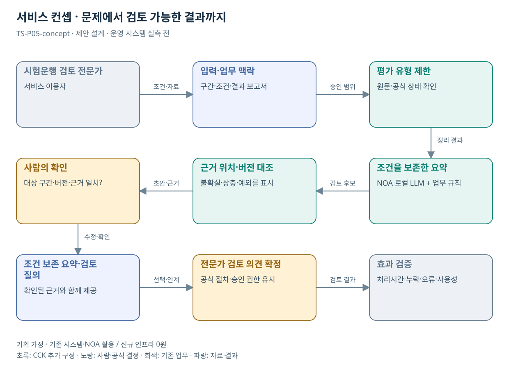

# TS-P05 서비스 정의·컨셉

철도 시험운행·시설평가 보고서 검토 준비

> **기획 검토안**: CCK 주관 AX+SI / NOA·로컬 LLM / 기존 서버 / 신규 인프라 0원. 실제 API·물량·견적·효과는 확인 전.

## 서비스 정의

**시험운행 결과보고서의 누락·조건·근거 위치를 정리해 전문가 검토 준비시간을 줄이는 지원**

| 항목 | 설명 |
| --- | --- |
| 대상 사용자 | 철도 평가 전문가·제출기관과 역사·철도시설 이용 국민 |
| 문제·관찰 | 대량 평가보고서에서 요구 목차·결과·보완자료의 대응 관계를 찾느라 전문 판단 시간이 줄어드는 가설 |
| 이용 장면 | 시험운행 결과표에는 완료라고 적혔지만 보완 확인 문서의 버전과 대상 구간이 다른 상황 |
| 확인된 TS 업무 | 안전진단, 시험운행 결과검토, 정밀진단·성능평가 및 역사 평가 |
| 초기 범위 가정 | 여러 평가 중 시험운행 결과검토 1종 우선, 보고서 유형 3종, 조회 연계 0–1개 |
| 기존 기반 | 철도 시험운행·시설평가의 제출 보고서·검토 절차 |
| CCK AI 적용 | 결과 보고서의 항목·근거 위치·누락·버전 차이 검토 |
| 추가 수행분 | 평가 유형 1종의 보고서 구조·질의 생성·전문가 UI |
| 비교 기준선 | 평가 유형별 목차·서류 체크리스트와 전문 검색 |
| 효과 측정 | 중요 검토 항목 누락·대상 구간/버전 오연결·전문가 검토 준비시간 |

## 제공 결과

- 필수 검토항목 대응표
- 결과와 시험 조건을 함께 표시한 요약
- 누락·구간·버전 불일치
- 텍스트로 확인할 수 없는 도면·표식 목록
- 전문가 질의 초안

## 중복·수행 가능성

P04와 문서 처리·근거 UI 공유; 평가 유형별 서식·검수기준 별도

검토 유형 1종을 확정하고 조건·제약이 포함된 텍스트 보고서와 전문가 검토 의견을 확보한다.

보고서 요약이 기술적 적합 판정을 대신할 위험. 원문 조건과 전문가 결정란을 항상 함께 제시한다.

## 대안 검토

| 대안 | 적용 내용 | 선택 조건 |
| --- | --- | --- |
| A 기존 절차·규칙·화면 개선 | 평가 유형별 목차·서류 체크리스트와 전문 검색 | 같은 효과가 나면 LLM 범위 축소 |
| B 기존 NOA + 업무 지식·연계 | 평가 유형 1종의 보고서 구조·질의 생성·전문가 UI | 권고 검토안. 공통 재사용·실제 증분 산정 |
| C 자료·업무·기관 확대 | 시설 평가 보고서의 준비 검토 패턴; BF·시설진단 등은 별도 요건팩 | 초기 효과·권한·자원 검증 후 재산정 |

## 도식의 연결

| 연결 | 전달 내용 |
| --- | --- |
| 시험운행 검토 전문가 → 입력·업무 맥락 | 조건·자료 |
| 입력·업무 맥락 → 평가 유형 제한 | 승인 범위 |
| 평가 유형 제한 → 조건을 보존한 요약 | 정리 결과 |
| 조건을 보존한 요약 → 근거 위치·버전 대조 | 검토 후보 |
| 근거 위치·버전 대조 → 사람의 확인 | 초안·근거 |
| 사람의 확인 → 조건 보존 요약·검토 질의 | 수정·확인 |
| 조건 보존 요약·검토 질의 → 전문가 검토 의견 확정 | 선택·인계 |
| 전문가 검토 의견 확정 → 효과 검증 | 검토 결과 |

## 출처와 확인 범위

- [한국교통안전공단 철도기술 전문위원 모집안내](https://main.kotsa.or.kr/portal/bbs/notice_view.do?bbscCode=notice&bbscSeqn=18423&menuCode=05010100) — 확인일 2026-09-14; 공고의 수행 업무 확인; 실제 AI 발주·전문가 위촉 결과 미확인

기존 22개 출처는 이전 원장 확인일을 승계했다. 공급사 성능·자료 접근권한·법령 전체를 새로 검증한 자료는 아니다.

[이전 고도화 보고서](file:///G:/%EB%82%B4%20%EB%93%9C%EB%9D%BC%EC%9D%B4%EB%B8%8C/1.%20%EC%97%85%EB%AC%B4%EC%98%81%EC%97%AD/6.%20CCK/1.%20%EC%82%AC%EC%97%85%EA%B4%80%EB%A6%AC/TS/bizops/%5BTS%20%EC%82%AC%EC%97%85%EA%B8%B0%ED%9A%8D%5D/05_%ED%86%B5%ED%95%A9%EC%82%AC%EC%97%85%EA%B8%B0%ED%9A%8D/TS_22%EA%B0%9C%EC%97%85%EB%AC%B4_%EA%B3%A0%EB%8F%84%ED%99%94%EB%B3%B4%EA%B3%A0%EC%84%9C_2026-09-15/%EA%B0%9C%EB%B3%84%EB%B3%B4%EA%B3%A0%EC%84%9C/TS-P05_%EA%B3%A0%EB%8F%84%ED%99%94%EB%B3%B4%EA%B3%A0%EC%84%9C.html)

[Markdown 전체 목록](../../00_상세설계_통합보기.md)