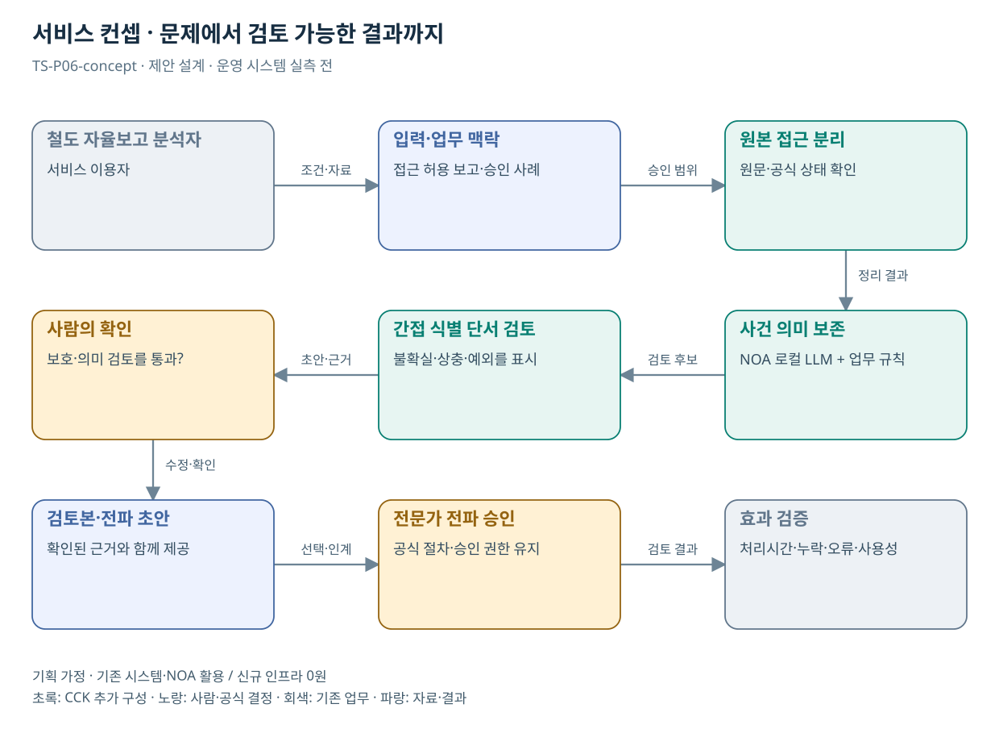

# TS-P06 서비스 정의·컨셉

철도안전 자율보고의 보호된 사례화

> **기획 검토안**: CCK 주관 AX+SI / NOA·로컬 LLM / 기존 서버 / 신규 인프라 0원. 실제 API·물량·견적·효과는 확인 전.

## 서비스 정의

**철도 자율보고 원본을 보호하면서 검토용 분석과 전파용 사례 초안을 분리하는 업무 지원**

| 항목 | 설명 |
| --- | --- |
| 대상 사용자 | 철도 위험을 보고하는 국민·종사자와 자율보고 분석 담당자 |
| 문제·관찰 | 자유 서술의 안전상 핵심 맥락을 보존하면서 보고자를 드러내지 않는 사례로 정리하기 어렵다는 가설 |
| 이용 장면 | 작은 역의 특정 근무시간과 직무를 그대로 쓰면 이름을 지워도 신고자를 추정할 수 있는 상황 |
| 확인된 TS 업무 | 잠재 위험 접수, 분석·개선 및 신고자 보호 |
| 초기 범위 가정 | 철도 자율보고 유형 1개, 승인된 보고서·사례 문서 2종, 외부 쓰기 0개 |
| 기존 기반 | 철도 자율보고 접수·분석·전파 절차 |
| CCK AI 적용 | 사건 구조화, 핵심 맥락을 보존한 요약, 검토용·전파용 초안 |
| 추가 수행분 | 철도 분류체계·보호 설정·의미 보존/재식별 평가 |
| 비교 기준선 | 정형 보고양식·전문 분류체계·수동 비식별 템플릿 |
| 효과 측정 | 안전 핵심 사실의 의미 손실·식별 위험 누락·전문가 수정 부담 |

## 제공 결과

- 권한이 제한된 사건 구조화표
- 위해요인과 불확실성
- 검토용 상세본
- 식별 단서를 조정한 전파용 초안
- 의미 보존·재식별 검토 기록

## 중복·수행 가능성

P08과 처리 구성요소를 공유하되 원본 저장·접근권한·보호규칙은 분리

보고 보호 책임자가 원본 사용 목적·접근자·보존·전파 정책을 확정한다. 확정 전 실제 원본 반입은 하지 않는다.

표면적 비식별 처리 후 재식별 또는 안전 의미 손실 가능성. 자동 비식별 완료를 보장하지 않고 전문가 이중 검토를 요구한다.

## 대안 검토

| 대안 | 적용 내용 | 선택 조건 |
| --- | --- | --- |
| A 기존 절차·규칙·화면 개선 | 정형 보고양식·전문 분류체계·수동 비식별 템플릿 | 같은 효과가 나면 LLM 범위 축소 |
| B 기존 NOA + 업무 지식·연계 | 철도 분류체계·보호 설정·의미 보존/재식별 평가 | 권고 검토안. 공통 재사용·실제 증분 산정 |
| C 자료·업무·기관 확대 | 다른 자율보고 제도의 처리 구조만 재사용, 항공 원본과 통합 금지 | 초기 효과·권한·자원 검증 후 재산정 |

## 도식의 연결

| 연결 | 전달 내용 |
| --- | --- |
| 철도 자율보고 분석자 → 입력·업무 맥락 | 조건·자료 |
| 입력·업무 맥락 → 원본 접근 분리 | 승인 범위 |
| 원본 접근 분리 → 사건 의미 보존 | 정리 결과 |
| 사건 의미 보존 → 간접 식별 단서 검토 | 검토 후보 |
| 간접 식별 단서 검토 → 사람의 확인 | 초안·근거 |
| 사람의 확인 → 검토본·전파 초안 | 수정·확인 |
| 검토본·전파 초안 → 전문가 전파 승인 | 선택·인계 |
| 전문가 전파 승인 → 효과 검증 | 검토 결과 |

## 출처와 확인 범위

- [철도안전 자율보고 제도](https://main.kotsa.or.kr/portal/contents.do?menuCode=02030500) — 확인일 2026-09-14; 제도 목적·신고자 보호·법적근거 안내 확인

기존 22개 출처는 이전 원장 확인일을 승계했다. 공급사 성능·자료 접근권한·법령 전체를 새로 검증한 자료는 아니다.

[이전 고도화 보고서](file:///G:/%EB%82%B4%20%EB%93%9C%EB%9D%BC%EC%9D%B4%EB%B8%8C/1.%20%EC%97%85%EB%AC%B4%EC%98%81%EC%97%AD/6.%20CCK/1.%20%EC%82%AC%EC%97%85%EA%B4%80%EB%A6%AC/TS/bizops/%5BTS%20%EC%82%AC%EC%97%85%EA%B8%B0%ED%9A%8D%5D/05_%ED%86%B5%ED%95%A9%EC%82%AC%EC%97%85%EA%B8%B0%ED%9A%8D/TS_22%EA%B0%9C%EC%97%85%EB%AC%B4_%EA%B3%A0%EB%8F%84%ED%99%94%EB%B3%B4%EA%B3%A0%EC%84%9C_2026-09-15/%EA%B0%9C%EB%B3%84%EB%B3%B4%EA%B3%A0%EC%84%9C/TS-P06_%EA%B3%A0%EB%8F%84%ED%99%94%EB%B3%B4%EA%B3%A0%EC%84%9C.html)

[Markdown 전체 목록](../../00_상세설계_통합보기.md)