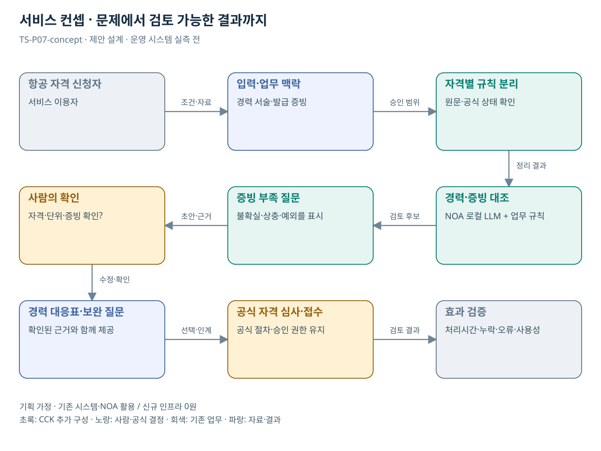

# TS-P07 서비스 정의·컨셉

항공 자격 응시 준비자료 점검 지원

> **기획 검토안**: CCK 주관 AX+SI / NOA·로컬 LLM / 기존 서버 / 신규 인프라 0원. 실제 API·물량·견적·효과는 확인 전.

## 서비스 정의

**항공 자격 신청자의 경력 서술과 증빙을 요구자료에 연결하는 응시 준비 지원**

| 항목 | 설명 |
| --- | --- |
| 대상 사용자 | 항공종사자·경량항공기 조종사 자격 응시자와 담당자 |
| 문제·관찰 | 자격 종류·경력·제출자료의 조건 차이를 이해하지 못해 신청 준비를 반복하는 가설 |
| 이용 장면 | 응시자가 경력 설명을 제출했지만 신청하려는 자격의 요구 자료와 연결되지 않는 상황 |
| 확인된 TS 업무 | 자격증명 시험 등 항공 자격 업무 |
| 초기 범위 가정 | 항공 자격 1종의 신청 준비, 문서 유형 2종, 상태 조회·인계 각 1개 |
| 기존 기반 | 항공 자격 안내·경력 증빙·신청 시스템 |
| CCK AI 적용 | 경력 서술과 자격별 준비자료 비교, 개인별 설명·보완 질문 |
| 추가 수행분 | 항공 자격 지식·경력 서술 대조·신청 연계 |
| 비교 기준선 | 자격별 구조화 문진표와 제출서류 체크리스트 |
| 효과 측정 | 잘못된 준비자료 안내·보완 요구 재발·신청 준비시간 |

## 제공 결과

- 경력 진술·증빙 대응표
- 확인된 수치와 미확인 수치
- 준비자료 보완 질문
- 응시 가능 여부의 공식 확인 경로
- 이용자가 확인한 인계 요약

## 중복·수행 가능성

P02와 자격 지원 구조 공유; 항공 경력 인정·증명서·심사 규칙 별도

항공 자격 1종의 경력 인정 기준·공식 증빙 유형·인계 가능 범위를 자격 담당자가 확인한다.

LLM의 경력 합산이나 해석이 응시 자격 판정처럼 보일 위험. 공식 확인과 준비 지원을 결과 필드에서 구분한다.

## 대안 검토

| 대안 | 적용 내용 | 선택 조건 |
| --- | --- | --- |
| A 기존 절차·규칙·화면 개선 | 자격별 구조화 문진표와 제출서류 체크리스트 | 같은 효과가 나면 LLM 범위 축소 |
| B 기존 NOA + 업무 지식·연계 | 항공 자격 지식·경력 서술 대조·신청 연계 | 권고 검토안. 공통 재사용·실제 증분 산정 |
| C 자료·업무·기관 확대 | 공공 전문자격의 증빙 준비 패턴; 자격 인정은 담당기관 고유 규칙 | 초기 효과·권한·자원 검증 후 재산정 |

## 도식의 연결

| 연결 | 전달 내용 |
| --- | --- |
| 항공 자격 신청자 → 입력·업무 맥락 | 조건·자료 |
| 입력·업무 맥락 → 자격별 규칙 분리 | 승인 범위 |
| 자격별 규칙 분리 → 경력·증빙 대조 | 정리 결과 |
| 경력·증빙 대조 → 증빙 부족 질문 | 검토 후보 |
| 증빙 부족 질문 → 사람의 확인 | 초안·근거 |
| 사람의 확인 → 경력 대응표·보완 질문 | 수정·확인 |
| 경력 대응표·보완 질문 → 공식 자격 심사·접수 | 선택·인계 |
| 공식 자격 심사·접수 → 효과 검증 | 검토 결과 |

## 출처와 확인 범위

- [항공종사자/경량항공기조종사 자격증명 시험](https://main.kotsa.or.kr/portal/contents.do?menuCode=02010200) — 확인일 2026-09-14; 자격 종류·공식 수행 업무·법령 안내 확인. 응시 세부 요건 전수 대조 아님

기존 22개 출처는 이전 원장 확인일을 승계했다. 공급사 성능·자료 접근권한·법령 전체를 새로 검증한 자료는 아니다.

[이전 고도화 보고서](file:///G:/%EB%82%B4%20%EB%93%9C%EB%9D%BC%EC%9D%B4%EB%B8%8C/1.%20%EC%97%85%EB%AC%B4%EC%98%81%EC%97%AD/6.%20CCK/1.%20%EC%82%AC%EC%97%85%EA%B4%80%EB%A6%AC/TS/bizops/%5BTS%20%EC%82%AC%EC%97%85%EA%B8%B0%ED%9A%8D%5D/05_%ED%86%B5%ED%95%A9%EC%82%AC%EC%97%85%EA%B8%B0%ED%9A%8D/TS_22%EA%B0%9C%EC%97%85%EB%AC%B4_%EA%B3%A0%EB%8F%84%ED%99%94%EB%B3%B4%EA%B3%A0%EC%84%9C_2026-09-15/%EA%B0%9C%EB%B3%84%EB%B3%B4%EA%B3%A0%EC%84%9C/TS-P07_%EA%B3%A0%EB%8F%84%ED%99%94%EB%B3%B4%EA%B3%A0%EC%84%9C.html)

[Markdown 전체 목록](../../00_상세설계_통합보기.md)