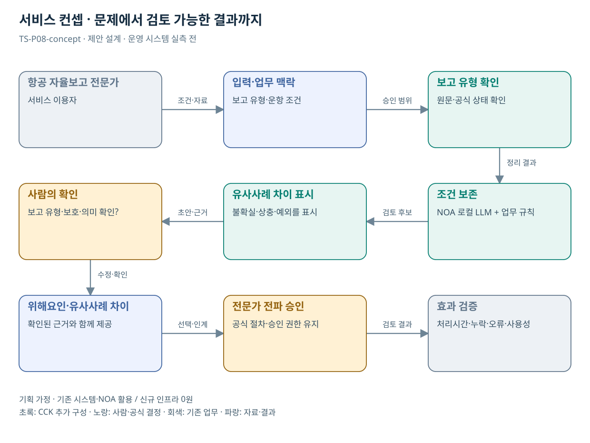

# TS-P08 서비스 정의·컨셉

항공안전 자율보고 분석·전파 초안 지원

> **기획 검토안**: CCK 주관 AX+SI / NOA·로컬 LLM / 기존 서버 / 신규 인프라 0원. 실제 API·물량·견적·효과는 확인 전.

## 서비스 정의

**항공 자율보고에서 사건 조건과 유사사례의 차이를 보존한 전문가 분석·전파 초안 지원**

| 항목 | 설명 |
| --- | --- |
| 대상 사용자 | 항공종사자·이용자와 자율보고 전문 분석 담당자 |
| 문제·관찰 | 항공 사건의 여러 조건을 놓치지 않고 일반화된 안전사례로 정리하는 부담이 있다는 가설 |
| 이용 장면 | 같은 사건이라도 기상·절차·장비 상태 중 하나를 생략하면 다른 안전교훈이 되는 상황 |
| 확인된 TS 업무 | 자율보고의 전문 분석과 일반화된 안전정보 전파 |
| 초기 범위 가정 | 항공 위해요인 보고 유형 1개, 원본·사례 문서 2종, 전문가 검토만 제공 |
| 기존 기반 | 항공 자율보고 접수·전문 분석·안전사례 전파 |
| CCK AI 적용 | 사건 순서·조건 구조화, 유사사례 차이 비교, 안전사례 초안 |
| 추가 수행분 | 항공 분류체계·보고 유형 규칙·전문 검토 평가 |
| 비교 기준선 | 전문 양식·분류체계와 수동 분석·전파 템플릿 |
| 효과 측정 | 핵심 사건 조건 누락·유사사례 오연결·재식별 검토 실패 |

## 제공 결과

- 보고 유형 확인 질문
- 조건을 보존한 사건 요약
- 유사사례 후보와 공통점·차이점
- 보호 검토가 필요한 단서
- 전문가 확인 전 전파 초안

## 중복·수행 가능성

P06과 원본 처리 구조 공유; 의무/자율보고 기준·전문 용어·권한 분리

항공 보고 보호책임자·전문가가 보고 유형 안내와 승인 사례의 사용 범위를 확인한다.

유사한 문장 때문에 다른 운항 조건을 같은 원인으로 해석할 위험. 차이점과 적용 제한을 결과에 필수 포함한다.

## 대안 검토

| 대안 | 적용 내용 | 선택 조건 |
| --- | --- | --- |
| A 기존 절차·규칙·화면 개선 | 전문 양식·분류체계와 수동 분석·전파 템플릿 | 같은 효과가 나면 LLM 범위 축소 |
| B 기존 NOA + 업무 지식·연계 | 항공 분류체계·보고 유형 규칙·전문 검토 평가 | 권고 검토안. 공통 재사용·실제 증분 산정 |
| C 자료·업무·기관 확대 | 신고자 보호형 안전사례 구조 재사용, 기관 간 원본 공유 전제 없음 | 초기 효과·권한·자원 검증 후 재산정 |

## 도식의 연결

| 연결 | 전달 내용 |
| --- | --- |
| 항공 자율보고 전문가 → 입력·업무 맥락 | 조건·자료 |
| 입력·업무 맥락 → 보고 유형 확인 | 승인 범위 |
| 보고 유형 확인 → 조건 보존 | 정리 결과 |
| 조건 보존 → 유사사례 차이 표시 | 검토 후보 |
| 유사사례 차이 표시 → 사람의 확인 | 초안·근거 |
| 사람의 확인 → 위해요인·유사사례 차이 | 수정·확인 |
| 위해요인·유사사례 차이 → 전문가 전파 승인 | 선택·인계 |
| 전문가 전파 승인 → 효과 검증 | 검토 결과 |

## 출처와 확인 범위

- [항공안전 자율보고제도](https://main.kotsa.or.kr/portal/contents.do?menuCode=02010500) — 확인일 2026-09-14; 전문 분석·보고자 비식별 일반화·전파 및 의무보고 구분 확인

기존 22개 출처는 이전 원장 확인일을 승계했다. 공급사 성능·자료 접근권한·법령 전체를 새로 검증한 자료는 아니다.

[이전 고도화 보고서](file:///G:/%EB%82%B4%20%EB%93%9C%EB%9D%BC%EC%9D%B4%EB%B8%8C/1.%20%EC%97%85%EB%AC%B4%EC%98%81%EC%97%AD/6.%20CCK/1.%20%EC%82%AC%EC%97%85%EA%B4%80%EB%A6%AC/TS/bizops/%5BTS%20%EC%82%AC%EC%97%85%EA%B8%B0%ED%9A%8D%5D/05_%ED%86%B5%ED%95%A9%EC%82%AC%EC%97%85%EA%B8%B0%ED%9A%8D/TS_22%EA%B0%9C%EC%97%85%EB%AC%B4_%EA%B3%A0%EB%8F%84%ED%99%94%EB%B3%B4%EA%B3%A0%EC%84%9C_2026-09-15/%EA%B0%9C%EB%B3%84%EB%B3%B4%EA%B3%A0%EC%84%9C/TS-P08_%EA%B3%A0%EB%8F%84%ED%99%94%EB%B3%B4%EA%B3%A0%EC%84%9C.html)

[Markdown 전체 목록](../../00_상세설계_통합보기.md)