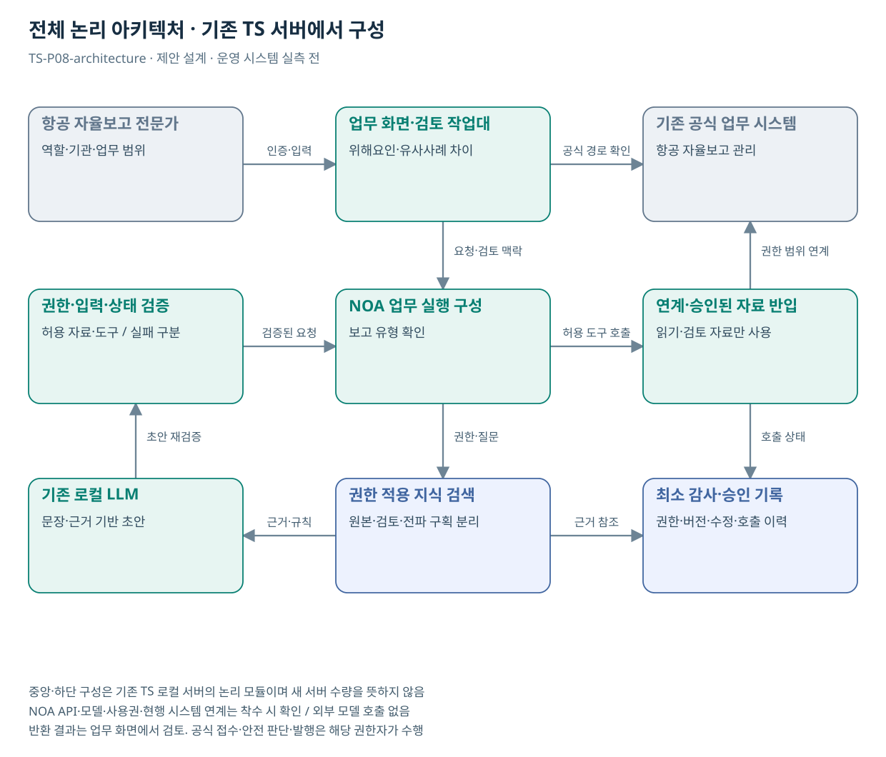

# TS-P08 전체 아키텍처

항공안전 자율보고 분석·전파 초안 지원

> **기획 검토안**: CCK 주관 AX+SI / NOA·로컬 LLM / 기존 서버 / 신규 인프라 0원. 실제 API·물량·견적·효과는 확인 전.

## 시스템 경계·수행 책임

| 영역 | 구성·역할 | 책임 |
| --- | --- | --- |
| 기존 기반 | 항공 자율보고 접수·전문 분석·안전사례 전파 | TS 원 시스템·자료 운영부서 |
| 업무 화면 | 항공 자율보고에서 사건 조건과 유사사례의 차이를 보존한 전문가 분석·전파 초안 지원 | CCK 구현·연계 / TS 업무 승인 |
| NOA·로컬 LLM | 사건 순서·조건 구조화, 유사사례 차이 비교, 안전사례 초안 | CCK 설치 버전·호출·사용권 확인 |
| 규칙·연계 | 자율보고 원본 접근과 승인 사례 검색을 별도 승인한다. 외부 보고 송신·의무보고 시스템 자동 제출은 초기 제외한다. P06의 보호·승인 모듈을 재사용하되 항공 규칙·데이터 영역을 따로 둔다. | CCK 어댑터 / 원 시스템 공식 결과 |
| 공통 모듈 | C00, C03 | 통합 선택 시 1회 계상 |
| 공식 결정 | 전문가 전파 승인 | 해당 업무 권한자 |

도식은 **논리 모듈**이며 새 서버 수량이 아니다. 신규 GPU·서버·스토리지·망 장비·클라우드 비용은 0원이다. 자원이 부족하면 범위·동시 처리·배치 주기를 조정한다.

## 재사용·구현 경계

P06과 원본 처리 구조 공유; 의무/자율보고 기준·전문 용어·권한 분리

추가 작업: 항공 분류체계·보고 유형 규칙·전문 검토 평가

NOA·보유 기술의 공개 설명은 설치 버전의 API·사용권·성능·검증 완료 증거가 아니다. 지식 검색·근거 연결·업무 상태 관리의 실제 보유 여부를 확인해 설정과 추가 개발을 구분한다.

## 논리 인터페이스 계약

| 계약 | 입력→출력 | 실패·권한 |
| --- | --- | --- |
| 승인 자료 반입 | 허용된 항공 자율보고·전문 분류체계·승인된 사례·전파 규칙 → 대상·기간·버전이 있는 자료 | 형식·이용권한·자료 분류 확인. 이미지 전용 자료는 텍스트 요청·수동 확인 |
| 원천 조회 | 항공 자율보고 관리 → 상태·시점·참조키 | 실제 API·권한 확인 후 읽기 연계 |
| AI 요청 | request_id, actor_scope, source_refs, question → draft, evidence_refs, uncertainty | 원문 내 지시는 분석 대상. 허용 도구·권한을 변경하지 못함 |
| 검토·처리 | 위해요인·유사사례 차이 → 전문가 전파 승인 | 자동 공식 쓰기 없음. 검토 결과·공식 경로 제공 |

실제 API 명칭·주소·스키마는 미확인이다. 자율보고 원본 접근과 승인 사례 검색을 별도 승인한다. 외부 보고 송신·의무보고 시스템 자동 제출은 초기 제외한다. P06의 보호·승인 모듈을 재사용하되 항공 규칙·데이터 영역을 따로 둔다.

## 보안·운영·복귀

- 현행 인증과 기관·업무·자료 권한 연결. 검색·색인·첨부·캐시에 같은 정책 적용
- 외부 자료는 승인된 경로로 반입. 내부 문서·질문은 외부 모델로 전송하지 않음
- 프롬프트·규칙·모델·색인 버전을 묶어 배포·이전 승인 버전 보관
- 권한 누출·허위 확정·심각한 오류 발견 시 기능 중지 후 기존 업무 경로 복귀

원본·검토본·전파본은 서로 다른 권한과 색인 구획을 사용한다. 철도·항공의 코드 재사용은 원문 공유를 뜻하지 않는다.
## 도식의 연결

| 연결 | 전달 내용 |
| --- | --- |
| 항공 자율보고 전문가 → 업무 화면·검토 작업대 | 인증·입력 |
| 업무 화면·검토 작업대 → 기존 공식 업무 시스템 | 공식 경로 확인 |
| 업무 화면·검토 작업대 → NOA 업무 실행 구성 | 요청·검토 맥락 |
| 권한·입력·상태 검증 → NOA 업무 실행 구성 | 검증된 요청 |
| NOA 업무 실행 구성 → 연계·승인된 자료 반입 | 허용 도구 호출 |
| 연계·승인된 자료 반입 → 기존 공식 업무 시스템 | 권한 범위 연계 |
| NOA 업무 실행 구성 → 권한 적용 지식 검색 | 권한·질문 |
| 권한 적용 지식 검색 → 기존 로컬 LLM | 근거·규칙 |
| 기존 로컬 LLM → 권한·입력·상태 검증 | 초안 재검증 |
| 연계·승인된 자료 반입 → 최소 감사·승인 기록 | 호출 상태 |
| 권한 적용 지식 검색 → 최소 감사·승인 기록 | 근거 참조 |

## 출처와 확인 범위

- [항공안전 자율보고제도](https://main.kotsa.or.kr/portal/contents.do?menuCode=02010500) — 확인일 2026-09-14; 전문 분석·보고자 비식별 일반화·전파 및 의무보고 구분 확인

기존 22개 출처는 이전 원장 확인일을 승계했다. 공급사 성능·자료 접근권한·법령 전체를 새로 검증한 자료는 아니다.

[이전 고도화 보고서](file:///G:/%EB%82%B4%20%EB%93%9C%EB%9D%BC%EC%9D%B4%EB%B8%8C/1.%20%EC%97%85%EB%AC%B4%EC%98%81%EC%97%AD/6.%20CCK/1.%20%EC%82%AC%EC%97%85%EA%B4%80%EB%A6%AC/TS/bizops/%5BTS%20%EC%82%AC%EC%97%85%EA%B8%B0%ED%9A%8D%5D/05_%ED%86%B5%ED%95%A9%EC%82%AC%EC%97%85%EA%B8%B0%ED%9A%8D/TS_22%EA%B0%9C%EC%97%85%EB%AC%B4_%EA%B3%A0%EB%8F%84%ED%99%94%EB%B3%B4%EA%B3%A0%EC%84%9C_2026-09-15/%EA%B0%9C%EB%B3%84%EB%B3%B4%EA%B3%A0%EC%84%9C/TS-P08_%EA%B3%A0%EB%8F%84%ED%99%94%EB%B3%B4%EA%B3%A0%EC%84%9C.html)

[Markdown 전체 목록](../../00_상세설계_통합보기.md)