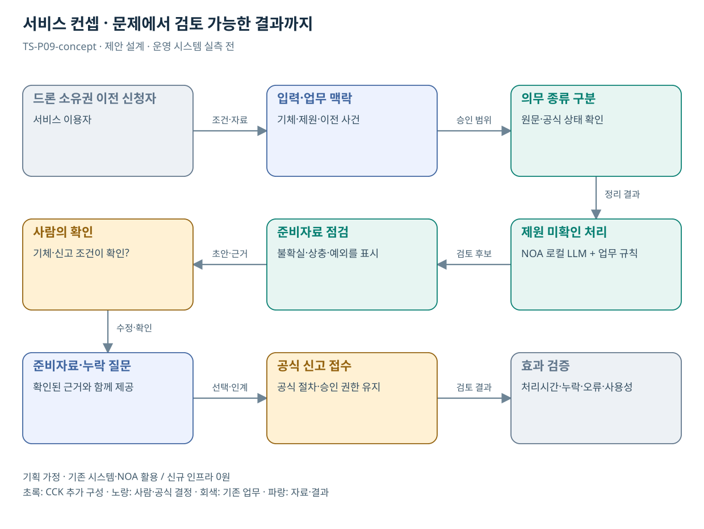

# TS-P09 서비스 정의·컨셉

드론 기체 변경·말소 신고 준비 지원

> **기획 검토안**: CCK 주관 AX+SI / NOA·로컬 LLM / 기존 서버 / 신규 인프라 0원. 실제 API·물량·견적·효과는 확인 전.

## 서비스 정의

**드론 소유권 이전 신고의 필요한 정보와 증빙을 확인해 공식 접수로 넘기는 준비 지원**

| 항목 | 설명 |
| --- | --- |
| 대상 사용자 | 드론 소유자·사업자와 기체신고 담당자 |
| 문제·관찰 | 소유권·용도·보관처 변경을 신고·자격·비행 승인과 혼동하는 가설 |
| 이용 장면 | 기체를 양도한 사람이 변경신고와 조종자 자격을 같은 절차로 이해하는 상황 |
| 확인된 TS 업무 | 기체 신고·변경·말소, 자격·안전·교육 관련 안내 |
| 초기 범위 가정 | 소유권 이전 또는 말소 중 1개 경로, 문서 2종, 공식 접수 경로 인계 |
| 기존 기반 | 드론 기체 변경·말소 안내와 신고 절차 |
| CCK AI 적용 | 변경 사유를 이해한 맞춤 안내·필요자료 질문·신고서 준비·인계 |
| 추가 수행분 | 신고 유형 1개 지식·문진·보완 점검·인계 설정 |
| 비교 기준선 | 변경 유형별 문진표·표준 안내·입력 검증 |
| 효과 측정 | 절차 혼동·잘못된 신고 유형·보완 재제출 |

## 제공 결과

- 기체 신고·조종자격·비행 승인 구분
- 소유권 이전 준비 체크리스트
- 제원·증빙 미확인 질문
- 확인된 입력 요약
- 공식 접수 경로와 미접수/접수 상태

## 중복·수행 가능성

P02·07과 문진/자료 점검 재사용; 기체 신고·비행승인·자격 규칙 분리

소유권 이전의 현행 서식·필수 제원·접수 인계 범위를 신고 담당자가 확인한다.

모델명만으로 제원·신고 의무를 추정할 위험. 확인 출처와 불명 상태를 유지한다.

## 대안 검토

| 대안 | 적용 내용 | 선택 조건 |
| --- | --- | --- |
| A 기존 절차·규칙·화면 개선 | 변경 유형별 문진표·표준 안내·입력 검증 | 같은 효과가 나면 LLM 범위 축소 |
| B 기존 NOA + 업무 지식·연계 | 신고 유형 1개 지식·문진·보완 점검·인계 설정 | 권고 검토안. 공통 재사용·실제 증분 산정 |
| C 자료·업무·기관 확대 | 소유권 변경·말소 신고 준비 패턴, 각 법정 신고 요건 분리 | 초기 효과·권한·자원 검증 후 재산정 |

## 도식의 연결

| 연결 | 전달 내용 |
| --- | --- |
| 드론 소유권 이전 신청자 → 입력·업무 맥락 | 조건·자료 |
| 입력·업무 맥락 → 의무 종류 구분 | 승인 범위 |
| 의무 종류 구분 → 제원 미확인 처리 | 정리 결과 |
| 제원 미확인 처리 → 준비자료 점검 | 검토 후보 |
| 준비자료 점검 → 사람의 확인 | 초안·근거 |
| 사람의 확인 → 준비자료·누락 질문 | 수정·확인 |
| 준비자료·누락 질문 → 공식 신고 접수 | 선택·인계 |
| 공식 신고 접수 → 효과 검증 | 검토 결과 |

## 출처와 확인 범위

- [초경량비행장치 기체신고](https://main.kotsa.or.kr/portal/contents.do?menuCode=02020100) — 확인일 2026-09-14; 신고·변경·말소 안내 및 드론원스톱 연결 확인
- [사업 범위와 중복판정 v2.0](file:///G:/%EB%82%B4%20%EB%93%9C%EB%9D%BC%EC%9D%B4%EB%B8%8C/1.%20%EC%97%85%EB%AC%B4%EC%98%81%EC%97%AD/6.%20CCK/1.%20%EC%82%AC%EC%97%85%EA%B4%80%EB%A6%AC/TS/bizops/%5BTS%20%EC%82%AC%EC%97%85%EA%B8%B0%ED%9A%8D%5D/00_%EA%B8%B0%ED%9A%8D%EC%A7%80%EC%B9%A8/%EC%8B%A0%EA%B7%9C%EC%82%AC%EC%97%85_%EB%B2%94%EC%9C%84%EC%99%80_%EC%A4%91%EB%B3%B5%EB%B0%B0%EC%A0%9C.md) — 확인일 2026-09-15; 기구축 업무·시스템·AI 후속 적용 허용, 동일 계약 기능의 이중 계상 구분

기존 22개 출처는 이전 원장 확인일을 승계했다. 공급사 성능·자료 접근권한·법령 전체를 새로 검증한 자료는 아니다.

[이전 고도화 보고서](file:///G:/%EB%82%B4%20%EB%93%9C%EB%9D%BC%EC%9D%B4%EB%B8%8C/1.%20%EC%97%85%EB%AC%B4%EC%98%81%EC%97%AD/6.%20CCK/1.%20%EC%82%AC%EC%97%85%EA%B4%80%EB%A6%AC/TS/bizops/%5BTS%20%EC%82%AC%EC%97%85%EA%B8%B0%ED%9A%8D%5D/05_%ED%86%B5%ED%95%A9%EC%82%AC%EC%97%85%EA%B8%B0%ED%9A%8D/TS_22%EA%B0%9C%EC%97%85%EB%AC%B4_%EA%B3%A0%EB%8F%84%ED%99%94%EB%B3%B4%EA%B3%A0%EC%84%9C_2026-09-15/%EA%B0%9C%EB%B3%84%EB%B3%B4%EA%B3%A0%EC%84%9C/TS-P09_%EA%B3%A0%EB%8F%84%ED%99%94%EB%B3%B4%EA%B3%A0%EC%84%9C.html)

[Markdown 전체 목록](../../00_상세설계_통합보기.md)