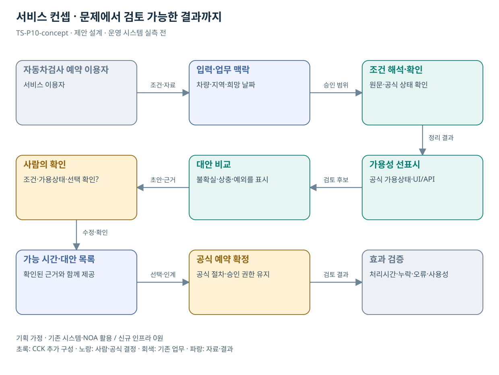

# TS-P10 서비스 정의·컨셉

자동차검사 예약 탐색·재검사 후속행동 지원

> **기획 검토안**: CCK 주관 AX+SI / NOA·로컬 LLM / 기존 서버 / 신규 인프라 0원. 실제 API·물량·견적·효과는 확인 전.

## 서비스 정의

**검사소와 날짜를 오가며 마감을 확인하는 불편을 줄이는 예약 가능 상태 중심 탐색 화면**

| 항목 | 설명 |
| --- | --- |
| 대상 사용자 | 자동차검사 예약자·재검사 대상 차량 소유자 |
| 문제·관찰 | 예약 마감을 확인하려고 날짜·검사소 화면을 왕복한다는 이용 경험; 결과 이후 행동 혼란은 추가 검증 가설 |
| 이용 장면 | 검사소를 찾았으나 날짜별 마감을 뒤늦게 확인해 조건을 다시 입력하는 상황 |
| 확인된 TS 업무 | 검사 예약, 정기·종합·신규검사, 튜닝·재검사 등 |
| 초기 범위 가정 | 예약 탐색 1개 흐름을 우선, 차량 유형 1개, 가용성 조회 1개; 재검사 지원은 후속 범위 |
| 기존 기반 | 자동차검사 검색·달력·예약·결과 안내 |
| CCK AI 적용 | 날짜·이동 범위의 자연어 조건 이해, 대안 설명, 확인 질문·예약 인계 |
| 추가 수행분 | 가용상태 UI·조건 해석·예약 연계·중복방지 평가 |
| 비교 기준선 | 예약 상태를 미리 보여주는 달력·검색 UI와 공식 API 개선 |
| 효과 측정 | 빈자리 탐색시간·화면 왕복·상태 불일치·중복 예약 |

## 제공 결과

- 조건을 유지한 검사소·가능 시간 목록
- 클릭 전 달력 상태
- 동일 날짜 다른 검사소 / 동일 검사소 다른 날짜 대안
- 조건을 벗어나는 대안의 변경 내용
- 예약 결과·변경/취소 경로

## 중복·수행 가능성

P19와 조건 확인·상태 표시 공유; 검사 슬롯과 DRT 배차 상태는 별도

예약 운영부서가 가용상태·마감·확정 응답·중복 요청 처리 방식을 제공하고 현행 탐색 동선을 재현한다.

LLM보다 UI·연계 품질이 효용을 좌우한다. 화면 개선만 한 비교안과 같은 조건에서 탐색시간·왕복을 비교해 AI 추가 가치를 확인한다.

## 대안 검토

| 대안 | 적용 내용 | 선택 조건 |
| --- | --- | --- |
| A 기존 절차·규칙·화면 개선 | 예약 상태를 미리 보여주는 달력·검색 UI와 공식 API 개선 | 같은 효과가 나면 LLM 범위 축소 |
| B 기존 NOA + 업무 지식·연계 | 가용상태 UI·조건 해석·예약 연계·중복방지 평가 | 권고 검토안. 공통 재사용·실제 증분 산정 |
| C 자료·업무·기관 확대 | 공공 예약 서비스의 조건 유지·가용성 비교 패턴; 공급 부족은 별도 문제 | 초기 효과·권한·자원 검증 후 재산정 |

## 도식의 연결

| 연결 | 전달 내용 |
| --- | --- |
| 자동차검사 예약 이용자 → 입력·업무 맥락 | 조건·자료 |
| 입력·업무 맥락 → 조건 해석·확인 | 승인 범위 |
| 조건 해석·확인 → 가용성 선표시 | 정리 결과 |
| 가용성 선표시 → 대안 비교 | 검토 후보 |
| 대안 비교 → 사람의 확인 | 초안·근거 |
| 사람의 확인 → 가능 시간·대안 목록 | 수정·확인 |
| 가능 시간·대안 목록 → 공식 예약 확정 | 선택·인계 |
| 공식 예약 확정 → 효과 검증 | 검토 결과 |

## 출처와 확인 범위

- [자동차검사 소개](https://main.kotsa.or.kr/portal/contents.do?menuCode=01010000) — 확인일 2026-09-14; 검사 목적·종류·법적근거 안내 확인; 개인별 법률 안내로 사용하지 않음
- [한국교통안전공단 조사 — 대화 확인 및 구조화](file:///G:/%EB%82%B4%20%EB%93%9C%EB%9D%BC%EC%9D%B4%EB%B8%8C/1.%20%EC%97%85%EB%AC%B4%EC%98%81%EC%97%AD/6.%20CCK/1.%20%EC%82%AC%EC%97%85%EA%B4%80%EB%A6%AC/TS/bizops/%5BTS%20%EC%82%AC%EC%97%85%EA%B8%B0%ED%9A%8D%5D/04_%EA%B8%B0%EA%B4%80%EB%A6%AC%EC%84%9C%EC%B9%98/TS_%EB%8C%80%ED%99%94%EA%B5%AC%EC%A1%B0%ED%99%94/%ED%95%9C%EA%B5%AD%EA%B5%90%ED%86%B5%EC%95%88%EC%A0%84%EA%B3%B5%EB%8B%A8_%EB%8C%80%ED%99%94%EA%B5%AC%EC%A1%B0%ED%99%94_2026-09-09.md) — 확인일 2026-09-11; 사용자 예약 불편·정정 발언의 파생 기록 확인; 현행 화면 재현·민원 모집단 확인 아님
- [“국민 생활 편의 높인다” TS, 자동차검사 데이터 활용 국민 아이디어 공모](https://main.kotsa.or.kr/portal/bbs/report_view.do?bbscCode=report&bbscSeqn=18905&menuCode=05010200) — 확인일 2026-09-11; 보도자료 본문 확인; 수상·발주·API 공개는 미확인

기존 22개 출처는 이전 원장 확인일을 승계했다. 공급사 성능·자료 접근권한·법령 전체를 새로 검증한 자료는 아니다.

[이전 고도화 보고서](file:///G:/%EB%82%B4%20%EB%93%9C%EB%9D%BC%EC%9D%B4%EB%B8%8C/1.%20%EC%97%85%EB%AC%B4%EC%98%81%EC%97%AD/6.%20CCK/1.%20%EC%82%AC%EC%97%85%EA%B4%80%EB%A6%AC/TS/bizops/%5BTS%20%EC%82%AC%EC%97%85%EA%B8%B0%ED%9A%8D%5D/05_%ED%86%B5%ED%95%A9%EC%82%AC%EC%97%85%EA%B8%B0%ED%9A%8D/TS_22%EA%B0%9C%EC%97%85%EB%AC%B4_%EA%B3%A0%EB%8F%84%ED%99%94%EB%B3%B4%EA%B3%A0%EC%84%9C_2026-09-15/%EA%B0%9C%EB%B3%84%EB%B3%B4%EA%B3%A0%EC%84%9C/TS-P10_%EA%B3%A0%EB%8F%84%ED%99%94%EB%B3%B4%EA%B3%A0%EC%84%9C.html)

[Markdown 전체 목록](../../00_상세설계_통합보기.md)