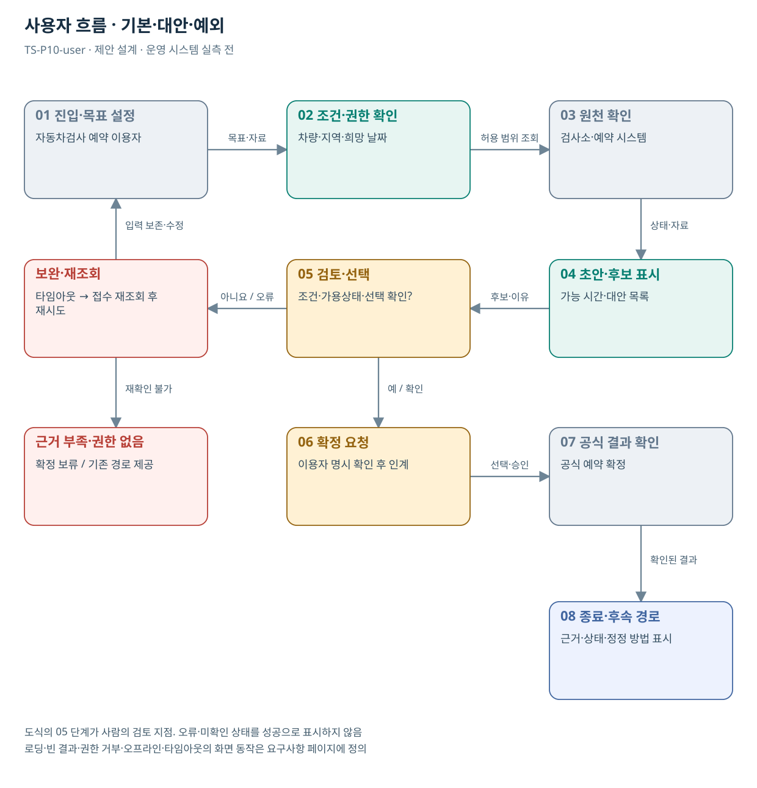

# TS-P10 사용자 흐름

자동차검사 예약 탐색·재검사 후속행동 지원

> **기획 검토안**: CCK 주관 AX+SI / NOA·로컬 LLM / 기존 서버 / 신규 인프라 0원. 실제 API·물량·견적·효과는 확인 전.

## 사용자 목표·사전조건

자동차검사 예약자·재검사 대상 차량 소유자가 검사소와 날짜를 오가며 마감을 확인하는 불편을 줄이는 예약 가능 상태 중심 탐색 화면를 이용한다.

예약 운영부서가 가용상태·마감·확정 응답·중복 요청 처리 방식을 제공하고 현행 탐색 동선을 재현한다.

## 기본·대안·예외 흐름

조건 입력 → 가용상태 조회 → 같은 화면 비교 → 선택 확인 → 공식 예약 요청 → 확정/마감/결과 미확인. 결과 미확인은 상태 재조회 후 재시도 여부를 결정한다.

| 단계 | 사용자 행동 | 시스템·공식 확인 |
| --- | --- | --- |
| 진입 | 자동차검사 예약 이용자가 목적 선택 | 권한·자료 범위 확인 |
| 입력 | 차량·지역·희망 날짜 | 구조화·누락·적용일 확인 질문 |
| 검토 | 가능 시간·대안 목록 | 검사소 목록과 달력에 공식 가능·마감·휴무·미확인 상태를 표시한다. |
| 수정·대안 | 조건·가용상태·선택 확인? | 동일 날짜 다른 검사소와 같은 검사소 다른 날짜를 분리해 제시한다. |
| 최종 확인 | 공식 예약 확정 | 최종 요청 전 유효 상태를 확인하고 요청 결과가 모호하면 원 시스템을 재조회한다. |
| 예외 | 타임아웃 → 접수 재조회 후 재시도 | 입력·검토 맥락 보존, 기존 경로 제공 |

## 화면 정의

| 화면 ID | 목적·주요 정보 | 이동·권한 |
| --- | --- | --- |
| TS-P10-UI01 | 조건·자료 입력 / 차량·지역·희망 날짜 | 역할 확인 후 UI02 |
| TS-P10-UI02 | 결과·근거·불확실성 비교 / 가능 시간·대안 목록 | 같은 맥락에서 수정 → UI01 또는 UI03 |
| TS-P10-UI03 | 검토·공식 상태 / 공식 예약 확정 | 권한자 확인 후 완료·보완·유보 |
| TS-P10-UI04 | 오류·재조회·기존 처리 경로 | 조건 보존 / 허용된 단계 복귀 |

## 화면 상태·복구

| 상태 | 동작 |
| --- | --- |
| 기본·로딩 | 입력조건·범위·진행 상태 표시. 중복 버튼 비활성 |
| 빈 결과 | 조건 일치 없음과 확인한 조회 범위 표시. 필수조건 임의 변경 금지 |
| 부분 성공 | 확인·미확인 항목을 분리 |
| 입력 오류 | 해당 필드에 수정 이유 표시, 다른 입력 보존 |
| 권한 거부 | 원문 노출 없이 접근 불가·확인 경로 안내 |
| 시스템 오류·오프라인 | 기존 경로·재시도 안내. 조회 실패를 마감·불합격으로 바꾸지 않음 |
| 타임아웃 | 이전 접수·결과 유무를 재조회한 뒤 재시도 |
| 성공·비활성 | 공식 확정과 초안 완료 구분. 승인 전 확정 불가 |

## 화면 배치·접근성

검사소 목록·날짜 상태·시간을 같은 탐색 맥락에 배치한다. 마감 확인만을 위해 날짜 화면을 왕복하지 않게 한다. 모바일 전환에서도 조건을 보존한다.

키보드 이동·명시적 레이블·포커스·색 외 상태 문구를 제공한다. 390/768/1440px와 확대·스크린리더에서 핵심 과업을 검증한다. WCAG 2.2 AA는 목표이며 실제 서비스 합격 판정은 미실행이다.
## 도식의 연결

| 연결 | 전달 내용 |
| --- | --- |
| 01 진입·목표 설정 → 02 조건·권한 확인 | 목표·자료 |
| 02 조건·권한 확인 → 03 원천 확인 | 허용 범위 조회 |
| 03 원천 확인 → 04 초안·후보 표시 | 상태·자료 |
| 04 초안·후보 표시 → 05 검토·선택 | 후보·이유 |
| 05 검토·선택 → 보완·재조회 | 아니요 / 오류 |
| 보완·재조회 → 01 진입·목표 설정 | 입력 보존·수정 |
| 05 검토·선택 → 06 확정 요청 | 예 / 확인 |
| 06 확정 요청 → 07 공식 결과 확인 | 선택·승인 |
| 07 공식 결과 확인 → 08 종료·후속 경로 | 확인된 결과 |
| 보완·재조회 → 근거 부족·권한 없음 | 재확인 불가 |

## 출처와 확인 범위

- [자동차검사 소개](https://main.kotsa.or.kr/portal/contents.do?menuCode=01010000) — 확인일 2026-09-14; 검사 목적·종류·법적근거 안내 확인; 개인별 법률 안내로 사용하지 않음
- [한국교통안전공단 조사 — 대화 확인 및 구조화](file:///G:/%EB%82%B4%20%EB%93%9C%EB%9D%BC%EC%9D%B4%EB%B8%8C/1.%20%EC%97%85%EB%AC%B4%EC%98%81%EC%97%AD/6.%20CCK/1.%20%EC%82%AC%EC%97%85%EA%B4%80%EB%A6%AC/TS/bizops/%5BTS%20%EC%82%AC%EC%97%85%EA%B8%B0%ED%9A%8D%5D/04_%EA%B8%B0%EA%B4%80%EB%A6%AC%EC%84%9C%EC%B9%98/TS_%EB%8C%80%ED%99%94%EA%B5%AC%EC%A1%B0%ED%99%94/%ED%95%9C%EA%B5%AD%EA%B5%90%ED%86%B5%EC%95%88%EC%A0%84%EA%B3%B5%EB%8B%A8_%EB%8C%80%ED%99%94%EA%B5%AC%EC%A1%B0%ED%99%94_2026-09-09.md) — 확인일 2026-09-11; 사용자 예약 불편·정정 발언의 파생 기록 확인; 현행 화면 재현·민원 모집단 확인 아님
- [“국민 생활 편의 높인다” TS, 자동차검사 데이터 활용 국민 아이디어 공모](https://main.kotsa.or.kr/portal/bbs/report_view.do?bbscCode=report&bbscSeqn=18905&menuCode=05010200) — 확인일 2026-09-11; 보도자료 본문 확인; 수상·발주·API 공개는 미확인

기존 22개 출처는 이전 원장 확인일을 승계했다. 공급사 성능·자료 접근권한·법령 전체를 새로 검증한 자료는 아니다.

[이전 고도화 보고서](file:///G:/%EB%82%B4%20%EB%93%9C%EB%9D%BC%EC%9D%B4%EB%B8%8C/1.%20%EC%97%85%EB%AC%B4%EC%98%81%EC%97%AD/6.%20CCK/1.%20%EC%82%AC%EC%97%85%EA%B4%80%EB%A6%AC/TS/bizops/%5BTS%20%EC%82%AC%EC%97%85%EA%B8%B0%ED%9A%8D%5D/05_%ED%86%B5%ED%95%A9%EC%82%AC%EC%97%85%EA%B8%B0%ED%9A%8D/TS_22%EA%B0%9C%EC%97%85%EB%AC%B4_%EA%B3%A0%EB%8F%84%ED%99%94%EB%B3%B4%EA%B3%A0%EC%84%9C_2026-09-15/%EA%B0%9C%EB%B3%84%EB%B3%B4%EA%B3%A0%EC%84%9C/TS-P10_%EA%B3%A0%EB%8F%84%ED%99%94%EB%B3%B4%EA%B3%A0%EC%84%9C.html)

[Markdown 전체 목록](../../00_상세설계_통합보기.md)