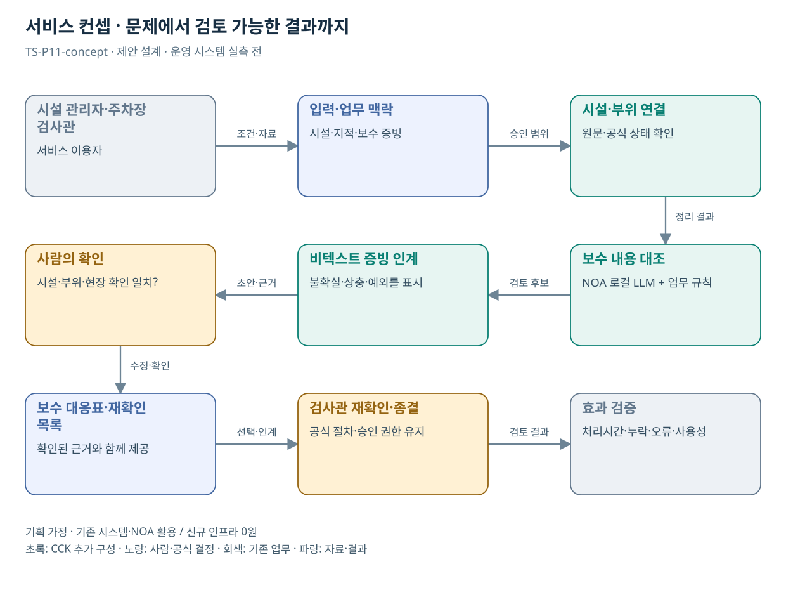

# TS-P11 서비스 정의·컨셉

기계식주차장 검사 후 보완 증빙 연결

> **기획 검토안**: CCK 주관 AX+SI / NOA·로컬 LLM / 기존 서버 / 신규 인프라 0원. 실제 API·물량·견적·효과는 확인 전.

## 서비스 정의

**기계식주차장 지적사항과 보수·재확인 증빙을 시설별로 연결하는 검사 후속 검토 지원**

| 항목 | 설명 |
| --- | --- |
| 대상 사용자 | 주차시설 관리자·보수업체·검사관과 주차장 이용 국민 |
| 문제·관찰 | 검사 지적과 보수 설명·재확인 자료의 대응을 추적하기 어렵다는 가설 |
| 이용 장면 | 관리자가 보수를 완료했다고 제출했지만 지적된 장치와 작업 내용이 일치하는지 문서에서 불명확한 상황 |
| 확인된 TS 업무 | 설계서 안전도 심사, 사용·정기·정밀안전검사와 교육 |
| 초기 범위 가정 | 검사 종류 1개·시설 1개 시범, 지적/보수/재확인 문서 3종, 조회 1개 |
| 기존 기반 | 기계식주차장 검사·보수·재확인 자료 |
| CCK AI 적용 | 지적사항과 보수 설명의 대응·누락·추가 확인 질문 |
| 추가 수행분 | 시설/검사 규칙·보수 대조·검사시스템 연계 |
| 비교 기준선 | 시설별 보수 체크리스트와 기존 검사 관리시스템 |
| 효과 측정 | 중요 보완 누락·시설/장치 오연결·추가 제출 왕복 |

## 제공 결과

- 시설·검사·지적별 보수 대응표
- 보수 내용의 미확인 범위
- 타 시설·부위 증빙 불일치
- 현장 재확인 필요 목록
- 보완 요청 초안

## 중복·수행 가능성

P01·04·05와 증빙 처리 공유; 시설·검사·장치 식별과 판정기준 별도

검사 유형과 시설·부위 식별체계, 기존 AI 상담·TS-BIZ-005 범위 및 실제 보완 사례를 확인한다.

수리 문서 확인이 시설 안전 확인으로 오인될 위험. 문서 검토와 검사관의 실물 확인을 상태에서 분리한다.

## 대안 검토

| 대안 | 적용 내용 | 선택 조건 |
| --- | --- | --- |
| A 기존 절차·규칙·화면 개선 | 시설별 보수 체크리스트와 기존 검사 관리시스템 | 같은 효과가 나면 LLM 범위 축소 |
| B 기존 NOA + 업무 지식·연계 | 시설/검사 규칙·보수 대조·검사시스템 연계 | 권고 검토안. 공통 재사용·실제 증분 산정 |
| C 자료·업무·기관 확대 | 시설 검사-보수 문서 대응 구조 재사용; 각 시설의 검사 책임은 유지 | 초기 효과·권한·자원 검증 후 재산정 |

## 도식의 연결

| 연결 | 전달 내용 |
| --- | --- |
| 시설 관리자·주차장 검사관 → 입력·업무 맥락 | 조건·자료 |
| 입력·업무 맥락 → 시설·부위 연결 | 승인 범위 |
| 시설·부위 연결 → 보수 내용 대조 | 정리 결과 |
| 보수 내용 대조 → 비텍스트 증빙 인계 | 검토 후보 |
| 비텍스트 증빙 인계 → 사람의 확인 | 초안·근거 |
| 사람의 확인 → 보수 대응표·재확인 목록 | 수정·확인 |
| 보수 대응표·재확인 목록 → 검사관 재확인·종결 | 선택·인계 |
| 검사관 재확인·종결 → 효과 검증 | 검토 결과 |

## 출처와 확인 범위

- [기계식주차장 검사: 검사소개](https://main.kotsa.or.kr/portal/contents.do?menuCode=01030401) — 확인일 2026-09-14; 설계서 안전도·사용·정기·정밀검사 업무 확인
- [TS AI 체험존](https://main.kotsa.or.kr/portal/contents.do?menuCode=04050400) — 확인일 2026-09-11; 3종 AI 상담·위험도 분석 컨설팅 안내 확인; 서비스 직접 시험 없음
- [사업 범위와 중복판정 v2.0](file:///G:/%EB%82%B4%20%EB%93%9C%EB%9D%BC%EC%9D%B4%EB%B8%8C/1.%20%EC%97%85%EB%AC%B4%EC%98%81%EC%97%AD/6.%20CCK/1.%20%EC%82%AC%EC%97%85%EA%B4%80%EB%A6%AC/TS/bizops/%5BTS%20%EC%82%AC%EC%97%85%EA%B8%B0%ED%9A%8D%5D/00_%EA%B8%B0%ED%9A%8D%EC%A7%80%EC%B9%A8/%EC%8B%A0%EA%B7%9C%EC%82%AC%EC%97%85_%EB%B2%94%EC%9C%84%EC%99%80_%EC%A4%91%EB%B3%B5%EB%B0%B0%EC%A0%9C.md) — 확인일 2026-09-15; 기구축 업무·시스템·AI 후속 적용 허용, 동일 계약 기능의 이중 계상 구분

기존 22개 출처는 이전 원장 확인일을 승계했다. 공급사 성능·자료 접근권한·법령 전체를 새로 검증한 자료는 아니다.

[이전 고도화 보고서](file:///G:/%EB%82%B4%20%EB%93%9C%EB%9D%BC%EC%9D%B4%EB%B8%8C/1.%20%EC%97%85%EB%AC%B4%EC%98%81%EC%97%AD/6.%20CCK/1.%20%EC%82%AC%EC%97%85%EA%B4%80%EB%A6%AC/TS/bizops/%5BTS%20%EC%82%AC%EC%97%85%EA%B8%B0%ED%9A%8D%5D/05_%ED%86%B5%ED%95%A9%EC%82%AC%EC%97%85%EA%B8%B0%ED%9A%8D/TS_22%EA%B0%9C%EC%97%85%EB%AC%B4_%EA%B3%A0%EB%8F%84%ED%99%94%EB%B3%B4%EA%B3%A0%EC%84%9C_2026-09-15/%EA%B0%9C%EB%B3%84%EB%B3%B4%EA%B3%A0%EC%84%9C/TS-P11_%EA%B3%A0%EB%8F%84%ED%99%94%EB%B3%B4%EA%B3%A0%EC%84%9C.html)

[Markdown 전체 목록](../../00_상세설계_통합보기.md)