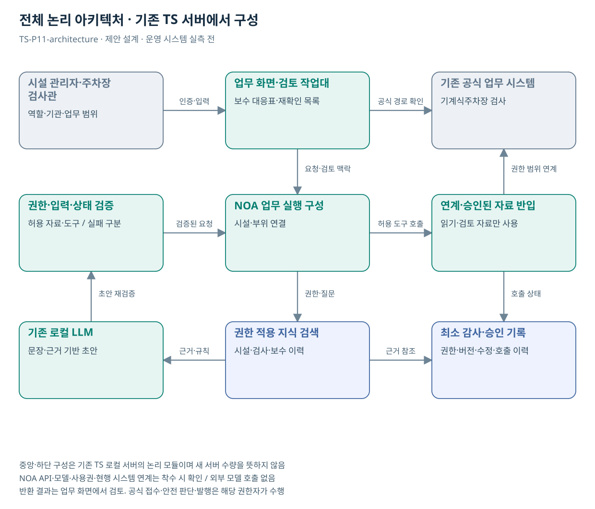

# TS-P11 전체 아키텍처

기계식주차장 검사 후 보완 증빙 연결

> **기획 검토안**: CCK 주관 AX+SI / NOA·로컬 LLM / 기존 서버 / 신규 인프라 0원. 실제 API·물량·견적·효과는 확인 전.

## 시스템 경계·수행 책임

| 영역 | 구성·역할 | 책임 |
| --- | --- | --- |
| 기존 기반 | 기계식주차장 검사·보수·재확인 자료 | TS 원 시스템·자료 운영부서 |
| 업무 화면 | 기계식주차장 지적사항과 보수·재확인 증빙을 시설별로 연결하는 검사 후속 검토 지원 | CCK 구현·연계 / TS 업무 승인 |
| NOA·로컬 LLM | 지적사항과 보수 설명의 대응·누락·추가 확인 질문 | CCK 설치 버전·호출·사용권 확인 |
| 규칙·연계 | 시설·검사 결과 조회 1개와 텍스트 증빙 적재를 우선한다. 검사 결과 등록은 기존 시스템 권한을 유지하고 TS-BIZ-005의 동일 납품 범위를 대조한다. | CCK 어댑터 / 원 시스템 공식 결과 |
| 공통 모듈 | C00, C01 | 통합 선택 시 1회 계상 |
| 공식 결정 | 검사관 재확인·종결 | 해당 업무 권한자 |

도식은 **논리 모듈**이며 새 서버 수량이 아니다. 신규 GPU·서버·스토리지·망 장비·클라우드 비용은 0원이다. 자원이 부족하면 범위·동시 처리·배치 주기를 조정한다.

## 재사용·구현 경계

P01·04·05와 증빙 처리 공유; 시설·검사·장치 식별과 판정기준 별도

추가 작업: 시설/검사 규칙·보수 대조·검사시스템 연계

NOA·보유 기술의 공개 설명은 설치 버전의 API·사용권·성능·검증 완료 증거가 아니다. 지식 검색·근거 연결·업무 상태 관리의 실제 보유 여부를 확인해 설정과 추가 개발을 구분한다.

## 논리 인터페이스 계약

| 계약 | 입력→출력 | 실패·권한 |
| --- | --- | --- |
| 승인 자료 반입 | 시설ID·검사 결과·지적사항·보수 기록·공식 재확인 결과 → 대상·기간·버전이 있는 자료 | 형식·이용권한·자료 분류 확인. 이미지 전용 자료는 텍스트 요청·수동 확인 |
| 원천 조회 | 기계식주차장 검사 → 상태·시점·참조키 | 실제 API·권한 확인 후 읽기 연계 |
| AI 요청 | request_id, actor_scope, source_refs, question → draft, evidence_refs, uncertainty | 원문 내 지시는 분석 대상. 허용 도구·권한을 변경하지 못함 |
| 검토·처리 | 보수 대응표·재확인 목록 → 검사관 재확인·종결 | 자동 공식 쓰기 없음. 검토 결과·공식 경로 제공 |

실제 API 명칭·주소·스키마는 미확인이다. 시설·검사 결과 조회 1개와 텍스트 증빙 적재를 우선한다. 검사 결과 등록은 기존 시스템 권한을 유지하고 TS-BIZ-005의 동일 납품 범위를 대조한다.

## 보안·운영·복귀

- 현행 인증과 기관·업무·자료 권한 연결. 검색·색인·첨부·캐시에 같은 정책 적용
- 외부 자료는 승인된 경로로 반입. 내부 문서·질문은 외부 모델로 전송하지 않음
- 프롬프트·규칙·모델·색인 버전을 묶어 배포·이전 승인 버전 보관
- 권한 누출·허위 확정·심각한 오류 발견 시 기능 중지 후 기존 업무 경로 복귀

## 도식의 연결

| 연결 | 전달 내용 |
| --- | --- |
| 시설 관리자·주차장 검사관 → 업무 화면·검토 작업대 | 인증·입력 |
| 업무 화면·검토 작업대 → 기존 공식 업무 시스템 | 공식 경로 확인 |
| 업무 화면·검토 작업대 → NOA 업무 실행 구성 | 요청·검토 맥락 |
| 권한·입력·상태 검증 → NOA 업무 실행 구성 | 검증된 요청 |
| NOA 업무 실행 구성 → 연계·승인된 자료 반입 | 허용 도구 호출 |
| 연계·승인된 자료 반입 → 기존 공식 업무 시스템 | 권한 범위 연계 |
| NOA 업무 실행 구성 → 권한 적용 지식 검색 | 권한·질문 |
| 권한 적용 지식 검색 → 기존 로컬 LLM | 근거·규칙 |
| 기존 로컬 LLM → 권한·입력·상태 검증 | 초안 재검증 |
| 연계·승인된 자료 반입 → 최소 감사·승인 기록 | 호출 상태 |
| 권한 적용 지식 검색 → 최소 감사·승인 기록 | 근거 참조 |

## 출처와 확인 범위

- [기계식주차장 검사: 검사소개](https://main.kotsa.or.kr/portal/contents.do?menuCode=01030401) — 확인일 2026-09-14; 설계서 안전도·사용·정기·정밀검사 업무 확인
- [TS AI 체험존](https://main.kotsa.or.kr/portal/contents.do?menuCode=04050400) — 확인일 2026-09-11; 3종 AI 상담·위험도 분석 컨설팅 안내 확인; 서비스 직접 시험 없음
- [사업 범위와 중복판정 v2.0](file:///G:/%EB%82%B4%20%EB%93%9C%EB%9D%BC%EC%9D%B4%EB%B8%8C/1.%20%EC%97%85%EB%AC%B4%EC%98%81%EC%97%AD/6.%20CCK/1.%20%EC%82%AC%EC%97%85%EA%B4%80%EB%A6%AC/TS/bizops/%5BTS%20%EC%82%AC%EC%97%85%EA%B8%B0%ED%9A%8D%5D/00_%EA%B8%B0%ED%9A%8D%EC%A7%80%EC%B9%A8/%EC%8B%A0%EA%B7%9C%EC%82%AC%EC%97%85_%EB%B2%94%EC%9C%84%EC%99%80_%EC%A4%91%EB%B3%B5%EB%B0%B0%EC%A0%9C.md) — 확인일 2026-09-15; 기구축 업무·시스템·AI 후속 적용 허용, 동일 계약 기능의 이중 계상 구분

기존 22개 출처는 이전 원장 확인일을 승계했다. 공급사 성능·자료 접근권한·법령 전체를 새로 검증한 자료는 아니다.

[이전 고도화 보고서](file:///G:/%EB%82%B4%20%EB%93%9C%EB%9D%BC%EC%9D%B4%EB%B8%8C/1.%20%EC%97%85%EB%AC%B4%EC%98%81%EC%97%AD/6.%20CCK/1.%20%EC%82%AC%EC%97%85%EA%B4%80%EB%A6%AC/TS/bizops/%5BTS%20%EC%82%AC%EC%97%85%EA%B8%B0%ED%9A%8D%5D/05_%ED%86%B5%ED%95%A9%EC%82%AC%EC%97%85%EA%B8%B0%ED%9A%8D/TS_22%EA%B0%9C%EC%97%85%EB%AC%B4_%EA%B3%A0%EB%8F%84%ED%99%94%EB%B3%B4%EA%B3%A0%EC%84%9C_2026-09-15/%EA%B0%9C%EB%B3%84%EB%B3%B4%EA%B3%A0%EC%84%9C/TS-P11_%EA%B3%A0%EB%8F%84%ED%99%94%EB%B3%B4%EA%B3%A0%EC%84%9C.html)

[Markdown 전체 목록](../../00_상세설계_통합보기.md)