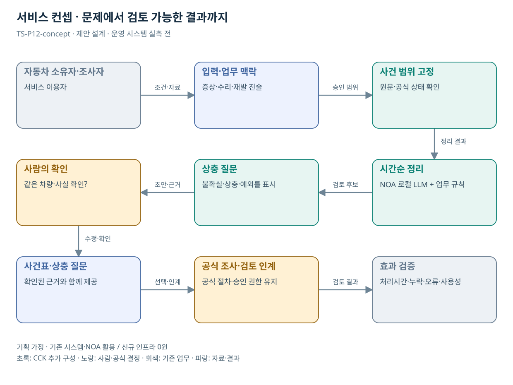

# TS-P12 서비스 정의·컨셉

자동차 결함·수리 이력의 사건 정리 지원

> **기획 검토안**: CCK 주관 AX+SI / NOA·로컬 LLM / 기존 서버 / 신규 인프라 0원. 실제 API·물량·견적·효과는 확인 전.

## 서비스 정의

**자동차 증상·수리·재발 진술을 원문과 연결해 소비자와 조사 담당자가 확인하는 사건 정리 지원**

| 항목 | 설명 |
| --- | --- |
| 대상 사용자 | 결함을 신고하는 차량 소유자·소비자 지원 및 조사 담당자 |
| 문제·관찰 | 동일 증상의 반복과 수리 경과를 여러 문서로 설명하면서 사실관계가 누락되는 가설 |
| 이용 장면 | 소유자가 수차례 같은 증상을 겪었으나 수리내역에 표현이 달라 사건의 순서가 혼동되는 상황 |
| 확인된 TS 업무 | 결함정보 수집·분석, 조사와 교환·환불 중재 관련 업무 |
| 초기 범위 가정 | 소비자 제출자료 준비 흐름 1개, 수리내역·신고서 2종, 조회 0–1개 |
| 기존 기반 | 결함 신고·수리내역·조사/소비자 지원 절차 |
| CCK AI 적용 | 수리·증상 연표와 사실/불확실 구분, 신청자 확인·사건 요약 |
| 추가 수행분 | 사건 식별·시간순 대조·본인 확인·원문 추적 |
| 비교 기준선 | 시간순 입력 양식과 제출서류 체크리스트 |
| 효과 측정 | 사건 순서 오류·근거 없는 사실 추가·보완 문의 왕복 |

## 제공 결과

- 발생→수리→재발 사건표
- 각 사실의 진술/증빙 출처
- 날짜·차량·주행거리 상충
- 본인 확인 질문
- 확인된 사실과 미확인 주장을 구분한 인계 자료

## 중복·수행 가능성

P01·11의 문서 연결 재사용; 소비자 사실정리와 안전 적합 판정은 구분

신고·조사 담당자가 사실 묶음의 필수 항목과 소비자 확인 절차, 기존 리콜 AI 상담 범위를 확인한다.

서술을 매끄럽게 만드는 과정에서 사실과 추정을 합칠 위험. 진술·문서·확인 상태를 각각 저장한다.

## 대안 검토

| 대안 | 적용 내용 | 선택 조건 |
| --- | --- | --- |
| A 기존 절차·규칙·화면 개선 | 시간순 입력 양식과 제출서류 체크리스트 | 같은 효과가 나면 LLM 범위 축소 |
| B 기존 NOA + 업무 지식·연계 | 사건 식별·시간순 대조·본인 확인·원문 추적 | 권고 검토안. 공통 재사용·실제 증분 산정 |
| C 자료·업무·기관 확대 | 공공 분쟁·소비자 보호의 사실정리 패턴, 법률·보상 판단은 기관별 | 초기 효과·권한·자원 검증 후 재산정 |

## 도식의 연결

| 연결 | 전달 내용 |
| --- | --- |
| 자동차 소유자·조사자 → 입력·업무 맥락 | 조건·자료 |
| 입력·업무 맥락 → 사건 범위 고정 | 승인 범위 |
| 사건 범위 고정 → 시간순 정리 | 정리 결과 |
| 시간순 정리 → 상충 질문 | 검토 후보 |
| 상충 질문 → 사람의 확인 | 초안·근거 |
| 사람의 확인 → 사건표·상충 질문 | 수정·확인 |
| 사건표·상충 질문 → 공식 조사·검토 인계 | 선택·인계 |
| 공식 조사·검토 인계 → 효과 검증 | 검토 결과 |

## 출처와 확인 범위

- [자동차 안전연구](https://main.kotsa.or.kr/portal/contents.do?menuCode=01060100) — 확인일 2026-09-14; KATRI, 결함조사·자기인증·안전도평가·국제조화 확인
- [TS AI 체험존](https://main.kotsa.or.kr/portal/contents.do?menuCode=04050400) — 확인일 2026-09-11; 3종 AI 상담·위험도 분석 컨설팅 안내 확인; 서비스 직접 시험 없음

기존 22개 출처는 이전 원장 확인일을 승계했다. 공급사 성능·자료 접근권한·법령 전체를 새로 검증한 자료는 아니다.

[이전 고도화 보고서](file:///G:/%EB%82%B4%20%EB%93%9C%EB%9D%BC%EC%9D%B4%EB%B8%8C/1.%20%EC%97%85%EB%AC%B4%EC%98%81%EC%97%AD/6.%20CCK/1.%20%EC%82%AC%EC%97%85%EA%B4%80%EB%A6%AC/TS/bizops/%5BTS%20%EC%82%AC%EC%97%85%EA%B8%B0%ED%9A%8D%5D/05_%ED%86%B5%ED%95%A9%EC%82%AC%EC%97%85%EA%B8%B0%ED%9A%8D/TS_22%EA%B0%9C%EC%97%85%EB%AC%B4_%EA%B3%A0%EB%8F%84%ED%99%94%EB%B3%B4%EA%B3%A0%EC%84%9C_2026-09-15/%EA%B0%9C%EB%B3%84%EB%B3%B4%EA%B3%A0%EC%84%9C/TS-P12_%EA%B3%A0%EB%8F%84%ED%99%94%EB%B3%B4%EA%B3%A0%EC%84%9C.html)

[Markdown 전체 목록](../../00_상세설계_통합보기.md)