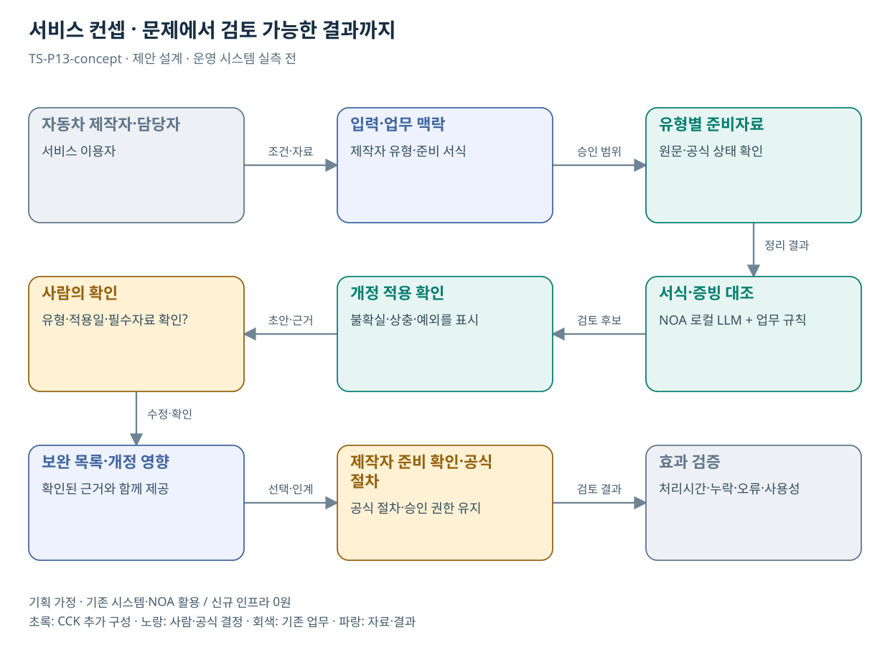

# TS-P13 서비스 정의·컨셉

자동차 제작자 자기인증 준비·변경 반영 지원

> **기획 검토안**: CCK 주관 AX+SI / NOA·로컬 LLM / 기존 서버 / 신규 인프라 0원. 실제 API·물량·견적·효과는 확인 전.

## 서비스 정의

**자동차 제작자가 자기인증 절차의 준비자료와 기준 개정 영향을 확인하는 업무 지원**

| 항목 | 설명 |
| --- | --- |
| 대상 사용자 | 자동차 제작자·수입자와 기술검토 담당자, 차량 구매 국민 |
| 문제·관찰 | 자기인증 절차와 서류 작성의 어려움을 TS가 공식 발표; 개인화 지원의 수요·효과는 검증 전 |
| 이용 장면 | 처음 등록하는 제작자가 등록·기술검토·안전검사 단계별 제출자료를 구분하지 못하는 상황 |
| 확인된 TS 업무 | 자기인증 적합조사 및 제작자 절차·서류 안내 |
| 초기 범위 가정 | 제작자 유형 1개·절차 1개, 전자문서 3종·기준집 1개, 승인된 개정 사례 1개 |
| 기존 기반 | 자기인증 절차 안내·서식·기술기준·기존 가이드 |
| CCK AI 적용 | 제작자 상황별 안내, 준비서류 비교, 적용기준 변경 영향 설명 |
| 추가 수행분 | 제작자 절차 1종 지식·서식 대조·준비상태 UI |
| 비교 기준선 | TS 기존 가이드 영상·문서·단계별 체크리스트 |
| 효과 측정 | 중요 서류 보완 누락·구기준 안내·추가 문의·준비시간 |

## 제공 결과

- 유형·단계별 준비자료표
- 서식 필드와 근거 대응
- 개정에 영향받는 서식 후보
- 적용일·범위 미확인 질문
- 담당자가 확정한 보완 목록

## 중복·수행 가능성

P14와 기준 버전·변경 영향 기능 공유; 제작자 제출 준비 화면은 별도

공식 자료의 절차·서류 어려움은 확인된 수요 단서다. 실제 제작자 유형별 빈도·시간·지원부서 수요와 최종 서식은 추가 확인한다.

절차 안내의 유효성을 기술 인증 적합성으로 확대 해석할 위험. 준비지원 범위와 공식 판정 주체를 표시한다.

## 대안 검토

| 대안 | 적용 내용 | 선택 조건 |
| --- | --- | --- |
| A 기존 절차·규칙·화면 개선 | TS 기존 가이드 영상·문서·단계별 체크리스트 | 같은 효과가 나면 LLM 범위 축소 |
| B 기존 NOA + 업무 지식·연계 | 제작자 절차 1종 지식·서식 대조·준비상태 UI | 권고 검토안. 공통 재사용·실제 증분 산정 |
| C 자료·업무·기관 확대 | 사업자 인증·신고 준비의 기준-서식 대조 패턴; 법정 인증은 별도 | 초기 효과·권한·자원 검증 후 재산정 |

## 도식의 연결

| 연결 | 전달 내용 |
| --- | --- |
| 자동차 제작자·담당자 → 입력·업무 맥락 | 조건·자료 |
| 입력·업무 맥락 → 유형별 준비자료 | 승인 범위 |
| 유형별 준비자료 → 서식·증빙 대조 | 정리 결과 |
| 서식·증빙 대조 → 개정 적용 확인 | 검토 후보 |
| 개정 적용 확인 → 사람의 확인 | 초안·근거 |
| 사람의 확인 → 보완 목록·개정 영향 | 수정·확인 |
| 보완 목록·개정 영향 → 제작자 준비 확인·공식 절차 | 선택·인계 |
| 제작자 준비 확인·공식 절차 → 효과 검증 | 검토 결과 |

## 출처와 확인 범위

- [TS “자동차 자기인증 절차, 영상으로 한눈에 확인”](https://main.kotsa.or.kr/portal/bbs/report_view.do?bbscCode=report&bbscSeqn=18813&menuCode=05010200) — 확인일 2026-09-14; 절차 이해 어려움 및 가이드 제작 본문 확인; 영상 자체를 분석하지 않음
- [자동차 안전연구](https://main.kotsa.or.kr/portal/contents.do?menuCode=01060100) — 확인일 2026-09-14; KATRI, 결함조사·자기인증·안전도평가·국제조화 확인

기존 22개 출처는 이전 원장 확인일을 승계했다. 공급사 성능·자료 접근권한·법령 전체를 새로 검증한 자료는 아니다.

[이전 고도화 보고서](file:///G:/%EB%82%B4%20%EB%93%9C%EB%9D%BC%EC%9D%B4%EB%B8%8C/1.%20%EC%97%85%EB%AC%B4%EC%98%81%EC%97%AD/6.%20CCK/1.%20%EC%82%AC%EC%97%85%EA%B4%80%EB%A6%AC/TS/bizops/%5BTS%20%EC%82%AC%EC%97%85%EA%B8%B0%ED%9A%8D%5D/05_%ED%86%B5%ED%95%A9%EC%82%AC%EC%97%85%EA%B8%B0%ED%9A%8D/TS_22%EA%B0%9C%EC%97%85%EB%AC%B4_%EA%B3%A0%EB%8F%84%ED%99%94%EB%B3%B4%EA%B3%A0%EC%84%9C_2026-09-15/%EA%B0%9C%EB%B3%84%EB%B3%B4%EA%B3%A0%EC%84%9C/TS-P13_%EA%B3%A0%EB%8F%84%ED%99%94%EB%B3%B4%EA%B3%A0%EC%84%9C.html)

[Markdown 전체 목록](../../00_상세설계_통합보기.md)