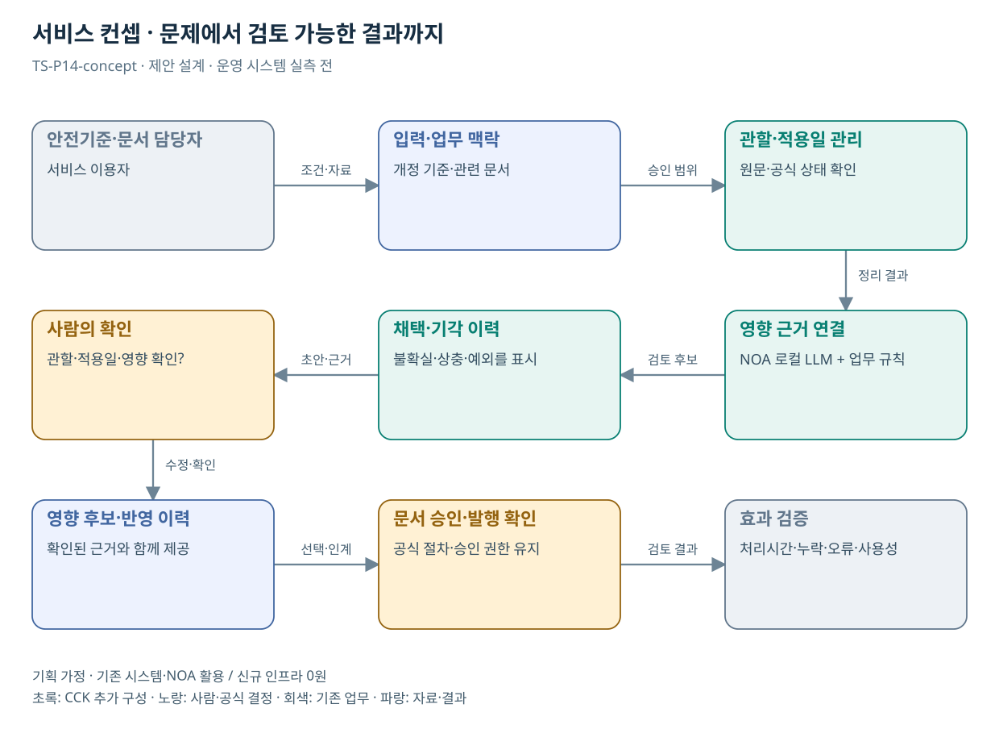

# TS-P14 서비스 정의·컨셉

미래차 안전기준 변경의 시험·안내 문서 영향 검토

> **기획 검토안**: CCK 주관 AX+SI / NOA·로컬 LLM / 기존 서버 / 신규 인프라 0원. 실제 API·물량·견적·효과는 확인 전.

## 서비스 정의

**미래차 안전기준 개정이 시험계획·서식·안내문에 미치는 영향을 검토하고 반영 이력을 추적하는 지원**

| 항목 | 설명 |
| --- | --- |
| 대상 사용자 | KATRI 기준·시험 담당자와 차량 제작자·소비자 |
| 문제·관찰 | 변경된 안전기준이 시험계획·설명자료·서식에 어디까지 영향을 주는지 확인 부담이 있다는 가설 |
| 이용 장면 | 시험보고서 양식은 개정됐지만 공개 안내가 이전 기준을 설명하는 상황 |
| 확인된 TS 업무 | 시험·안전도평가, 자율주행·사이버보안 관련 연구 기반 |
| 초기 범위 가정 | 안전기준군 1개, 시험계획/서식/안내 3종, 실제 개정 사례 1개 |
| 기존 기반 | 안전기준·시험계획·안내문·서식 관리 |
| CCK AI 적용 | 개정 기준의 영향 문서 후보와 반영 확인 목록 |
| 추가 수행분 | 안전기준군 1개·문서 영향·담당자 검토·발행 상태 |
| 비교 기준선 | 문서 버전관리·변경 알림·담당자 체크리스트 |
| 효과 측정 | 필수 반영 대상 누락·잘못된 영향 제시·오래된 안내 잔존 |

## 제공 결과

- 개정 전후 조항 차이
- 영향 문서·담당자 목록
- 직접 영향 / 검토 필요 / 관련 없음
- 반영 의견과 원문 근거
- 승인·발행·미반영 상태

## 중복·수행 가능성

P13과 개정 기준 관리·영향 검색 1회 구성; 시험 담당자의 반영·승인 흐름은 별도

기준 담당자가 국내 적용·시행일을 확정하고 문서 관리자가 문서 목록·소유자·발행 상태를 제공한다.

관련 문서의 존재만으로 변경 필요를 확정할 위험. 변경 사유와 전문가 채택·기각을 추적한다.

## 대안 검토

| 대안 | 적용 내용 | 선택 조건 |
| --- | --- | --- |
| A 기존 절차·규칙·화면 개선 | 문서 버전관리·변경 알림·담당자 체크리스트 | 같은 효과가 나면 LLM 범위 축소 |
| B 기존 NOA + 업무 지식·연계 | 안전기준군 1개·문서 영향·담당자 검토·발행 상태 | 권고 검토안. 공통 재사용·실제 증분 산정 |
| C 자료·업무·기관 확대 | 인증·시험기관의 기준 변경 반영 패턴; 기관별 시험 기준 분리 | 초기 효과·권한·자원 검증 후 재산정 |

## 도식의 연결

| 연결 | 전달 내용 |
| --- | --- |
| 안전기준·문서 담당자 → 입력·업무 맥락 | 조건·자료 |
| 입력·업무 맥락 → 관할·적용일 관리 | 승인 범위 |
| 관할·적용일 관리 → 영향 근거 연결 | 정리 결과 |
| 영향 근거 연결 → 채택·기각 이력 | 검토 후보 |
| 채택·기각 이력 → 사람의 확인 | 초안·근거 |
| 사람의 확인 → 영향 후보·반영 이력 | 수정·확인 |
| 영향 후보·반영 이력 → 문서 승인·발행 확인 | 선택·인계 |
| 문서 승인·발행 확인 → 효과 검증 | 검토 결과 |

## 출처와 확인 범위

- [자동차 안전연구](https://main.kotsa.or.kr/portal/contents.do?menuCode=01060100) — 확인일 2026-09-14; KATRI, 결함조사·자기인증·안전도평가·국제조화 확인
- [설립목적 및 연혁: 2000년 이후](https://main.kotsa.or.kr/portal/contents.do?menuCode=06020201) — 확인일 2026-09-11; 2025-11-06 K-City·사이버보안센터, 2026-01-02 특장차검사지원센터 기록 확인

기존 22개 출처는 이전 원장 확인일을 승계했다. 공급사 성능·자료 접근권한·법령 전체를 새로 검증한 자료는 아니다.

[이전 고도화 보고서](file:///G:/%EB%82%B4%20%EB%93%9C%EB%9D%BC%EC%9D%B4%EB%B8%8C/1.%20%EC%97%85%EB%AC%B4%EC%98%81%EC%97%AD/6.%20CCK/1.%20%EC%82%AC%EC%97%85%EA%B4%80%EB%A6%AC/TS/bizops/%5BTS%20%EC%82%AC%EC%97%85%EA%B8%B0%ED%9A%8D%5D/05_%ED%86%B5%ED%95%A9%EC%82%AC%EC%97%85%EA%B8%B0%ED%9A%8D/TS_22%EA%B0%9C%EC%97%85%EB%AC%B4_%EA%B3%A0%EB%8F%84%ED%99%94%EB%B3%B4%EA%B3%A0%EC%84%9C_2026-09-15/%EA%B0%9C%EB%B3%84%EB%B3%B4%EA%B3%A0%EC%84%9C/TS-P14_%EA%B3%A0%EB%8F%84%ED%99%94%EB%B3%B4%EA%B3%A0%EC%84%9C.html)

[Markdown 전체 목록](../../00_상세설계_통합보기.md)