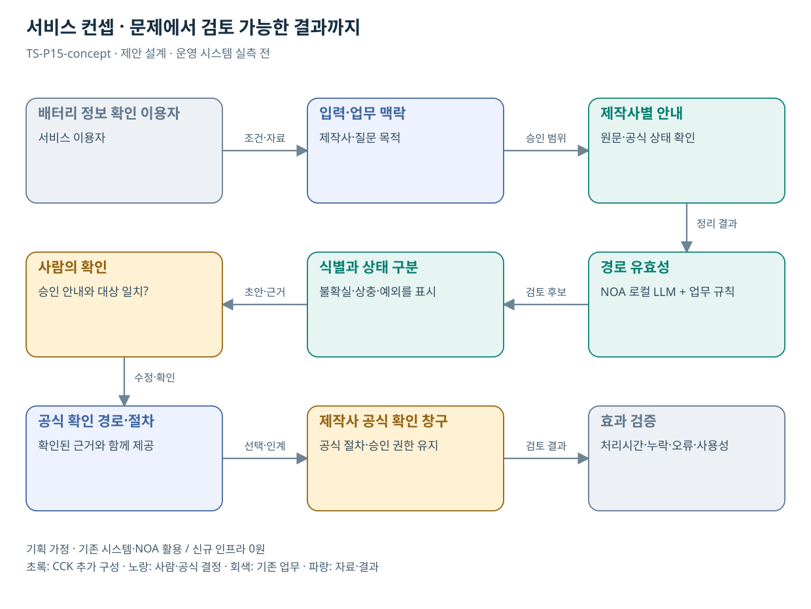

# TS-P15 서비스 정의·컨셉

전기차 배터리 식별정보 확인 절차 지원

> **기획 검토안**: CCK 주관 AX+SI / NOA·로컬 LLM / 기존 서버 / 신규 인프라 0원. 실제 API·물량·견적·효과는 확인 전.

## 서비스 정의

**배터리 식별정보를 찾으려는 국민에게 제작사별 공식 확인 절차를 쉽게 설명하는 기존 상담 AI의 지식 확장**

| 항목 | 설명 |
| --- | --- |
| 대상 사용자 | 전기차 소유자와 배터리 정보 안내 담당자 |
| 문제·관찰 | 차종·제작사별 확인 경로가 달라 식별번호를 찾기 번거롭다는 가설 |
| 이용 장면 | 소유자가 배터리 정보를 TS에 새로 등록해야 하는지 제작사 앱에서 확인하면 되는지 혼동하는 상황 |
| 확인된 TS 업무 | 배터리 식별번호 확인 및 소유자 자율관리 안내 |
| 초기 범위 가정 | 제작사 1곳의 공식 절차 안내, 공개 문서 1종, 개인 데이터 연계 0개 |
| 기존 기반 | 마이배터리 및 제작사별 식별정보 안내 |
| CCK AI 적용 | 질문 의도·제작사·확인 목적을 이해한 근거 안내와 예외 질문 |
| 추가 수행분 | 공식 안내 지식팩·질문 유형·링크 갱신·오안내 평가 |
| 비교 기준선 | 제작사별 링크·짧은 문진형 안내 페이지 |
| 효과 측정 | 잘못된 확인 경로·완료까지 탐색시간·불필요한 문의 |

## 제공 결과

- 제작사·질문에 맞는 확인 경로
- 정보 확인에 필요한 항목
- 식별정보의 의미와 해석 한계
- 공식 안내 근거·확인일
- 찾을 수 없을 때 담당 창구

## 중복·수행 가능성

P02·09·18·20과 안내/문진 기능 재사용; 독립 배터리 AI 엔진 불필요

기존 상담 AI 운영자와 제작사 공식 안내의 갱신 책임·확인 주기를 정한다. 별도 플랫폼 사업으로 중복 발주하지 않는다.

식별정보 안내를 배터리 안전 진단으로 오해할 위험. 확인 가능한 정보의 범위를 구체적으로 설명한다.

## 대안 검토

| 대안 | 적용 내용 | 선택 조건 |
| --- | --- | --- |
| A 기존 절차·규칙·화면 개선 | 제작사별 링크·짧은 문진형 안내 페이지 | 같은 효과가 나면 LLM 범위 축소 |
| B 기존 NOA + 업무 지식·연계 | 공식 안내 지식팩·질문 유형·링크 갱신·오안내 평가 | 권고 검토안. 공통 재사용·실제 증분 산정 |
| C 자료·업무·기관 확대 | 제품 식별정보 조회 안내 패턴; 상태진단 기능으로 확대하지 않음 | 초기 효과·권한·자원 검증 후 재산정 |

## 도식의 연결

| 연결 | 전달 내용 |
| --- | --- |
| 배터리 정보 확인 이용자 → 입력·업무 맥락 | 조건·자료 |
| 입력·업무 맥락 → 제작사별 안내 | 승인 범위 |
| 제작사별 안내 → 경로 유효성 | 정리 결과 |
| 경로 유효성 → 식별과 상태 구분 | 검토 후보 |
| 식별과 상태 구분 → 사람의 확인 | 초안·근거 |
| 사람의 확인 → 공식 확인 경로·절차 | 수정·확인 |
| 공식 확인 경로·절차 → 제작사 공식 확인 창구 | 선택·인계 |
| 제작사 공식 확인 창구 → 효과 검증 | 검토 결과 |

## 출처와 확인 범위

- [마이배터리 서비스](https://main.kotsa.or.kr/portal/contents.do?menuCode=04040400) — 확인일 2026-09-14; 식별번호와 소유자 자율관리 전환 안내 확인

기존 22개 출처는 이전 원장 확인일을 승계했다. 공급사 성능·자료 접근권한·법령 전체를 새로 검증한 자료는 아니다.

[이전 고도화 보고서](file:///G:/%EB%82%B4%20%EB%93%9C%EB%9D%BC%EC%9D%B4%EB%B8%8C/1.%20%EC%97%85%EB%AC%B4%EC%98%81%EC%97%AD/6.%20CCK/1.%20%EC%82%AC%EC%97%85%EA%B4%80%EB%A6%AC/TS/bizops/%5BTS%20%EC%82%AC%EC%97%85%EA%B8%B0%ED%9A%8D%5D/05_%ED%86%B5%ED%95%A9%EC%82%AC%EC%97%85%EA%B8%B0%ED%9A%8D/TS_22%EA%B0%9C%EC%97%85%EB%AC%B4_%EA%B3%A0%EB%8F%84%ED%99%94%EB%B3%B4%EA%B3%A0%EC%84%9C_2026-09-15/%EA%B0%9C%EB%B3%84%EB%B3%B4%EA%B3%A0%EC%84%9C/TS-P15_%EA%B3%A0%EB%8F%84%ED%99%94%EB%B3%B4%EA%B3%A0%EC%84%9C.html)

[Markdown 전체 목록](../../00_상세설계_통합보기.md)