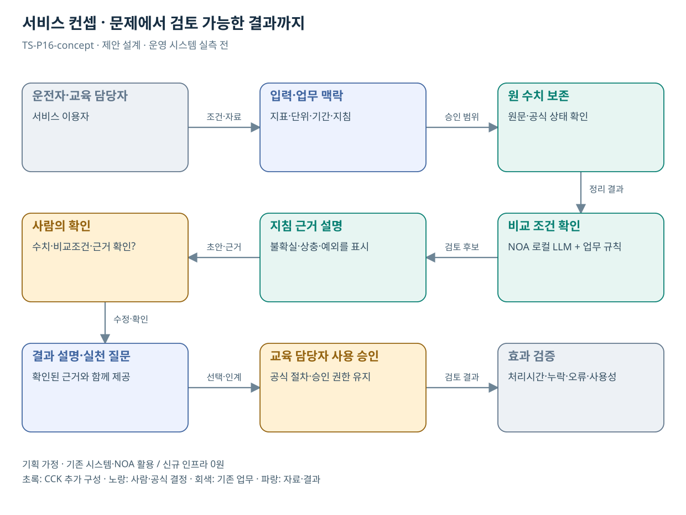

# TS-P16 서비스 정의·컨셉

공식 운행분석 결과의 안전행동 설명 지원

> **기획 검토안**: CCK 주관 AX+SI / NOA·로컬 LLM / 기존 서버 / 신규 인프라 0원. 실제 API·물량·견적·효과는 확인 전.

## 서비스 정의

**확정된 ETAS 운행분석 지표를 운전자가 이해할 수 있는 설명과 실천 질문으로 바꾸는 교육 지원**

| 항목 | 설명 |
| --- | --- |
| 대상 사용자 | 운수회사 교육담당자·사업용 운전자와 운송서비스 이용 국민 |
| 문제·관찰 | 기존 운행분석 결과를 실제 교육·조치로 이해하고 활용하기 어렵다는 가설 |
| 이용 장면 | 운전자가 위험행동 횟수는 보지만 어떤 상황·지침과 연결해 개선해야 할지 묻는 상황 |
| 확인된 TS 업무 | ETAS 위험운전 분석, TAGO·TIMS·자동차 정보 등 |
| 초기 범위 가정 | ETAS 결과 유형 1개·승인된 안전지침 1개, 조회 1개, 다른 정보시스템은 후속 |
| 기존 기반 | ETAS 위험운전 분석·진단표·교육 전후 결과 |
| CCK AI 적용 | 공식 수치·기간의 맥락 설명, 질의응답·맞춤 실천 문답 |
| 추가 수행분 | ETAS 결과 연계·단위 검증·지침 연결·해설 평가 |
| 비교 기준선 | 기존 ETAS 진단표·교육 전후 비교·정형 해설 |
| 효과 측정 | 수치·기간 설명 오류·교육 내용 이해·담당자 수정량 |

## 제공 결과

- 수치·단위를 보존한 결과 설명
- 산출 조건과 비교 제한
- 지표에 연결된 승인된 안전행동
- 교육용 질문·실천 확인표
- 교육 담당자 수정 이력

## 중복·수행 가능성

P21·22와 교육 자료 생성 부분 공유; ETAS 결과 조회·해석은 P16이 담당

ETAS 운영자가 지표 정의·확정 결과·조회 권한을 제공하고 교육 담당자가 실천 지침을 승인한다.

지표 해설이 새로운 안전 진단처럼 읽힐 위험. 출처 수치와 해석 문장을 분리하고 제한조건을 함께 표시한다.

## 대안 검토

| 대안 | 적용 내용 | 선택 조건 |
| --- | --- | --- |
| A 기존 절차·규칙·화면 개선 | 기존 ETAS 진단표·교육 전후 비교·정형 해설 | 같은 효과가 나면 LLM 범위 축소 |
| B 기존 NOA + 업무 지식·연계 | ETAS 결과 연계·단위 검증·지침 연결·해설 평가 | 권고 검토안. 공통 재사용·실제 증분 산정 |
| C 자료·업무·기관 확대 | 기존 공공 분석 결과의 근거 해설 패턴; 지표 계산은 원시스템 | 초기 효과·권한·자원 검증 후 재산정 |

## 도식의 연결

| 연결 | 전달 내용 |
| --- | --- |
| 운전자·교육 담당자 → 입력·업무 맥락 | 조건·자료 |
| 입력·업무 맥락 → 원 수치 보존 | 승인 범위 |
| 원 수치 보존 → 비교 조건 확인 | 정리 결과 |
| 비교 조건 확인 → 지침 근거 설명 | 검토 후보 |
| 지침 근거 설명 → 사람의 확인 | 초안·근거 |
| 사람의 확인 → 결과 설명·실천 질문 | 수정·확인 |
| 결과 설명·실천 질문 → 교육 담당자 사용 승인 | 선택·인계 |
| 교육 담당자 사용 승인 → 효과 검증 | 검토 결과 |

## 출처와 확인 범위

- [운행기록분석시스템(ETAS)](https://main.kotsa.or.kr/portal/contents.do?menuCode=01040400) — 확인일 2026-09-15; 위험행동·진단·교육 전후 비교 안내 확인
- [주요사업](https://main.kotsa.or.kr/portal/contents.do?menuCode=06020300) — 확인일 2026-09-14; 공식 요약의 7개 사업 분류 확인

기존 22개 출처는 이전 원장 확인일을 승계했다. 공급사 성능·자료 접근권한·법령 전체를 새로 검증한 자료는 아니다.

[이전 고도화 보고서](file:///G:/%EB%82%B4%20%EB%93%9C%EB%9D%BC%EC%9D%B4%EB%B8%8C/1.%20%EC%97%85%EB%AC%B4%EC%98%81%EC%97%AD/6.%20CCK/1.%20%EC%82%AC%EC%97%85%EA%B4%80%EB%A6%AC/TS/bizops/%5BTS%20%EC%82%AC%EC%97%85%EA%B8%B0%ED%9A%8D%5D/05_%ED%86%B5%ED%95%A9%EC%82%AC%EC%97%85%EA%B8%B0%ED%9A%8D/TS_22%EA%B0%9C%EC%97%85%EB%AC%B4_%EA%B3%A0%EB%8F%84%ED%99%94%EB%B3%B4%EA%B3%A0%EC%84%9C_2026-09-15/%EA%B0%9C%EB%B3%84%EB%B3%B4%EA%B3%A0%EC%84%9C/TS-P16_%EA%B3%A0%EB%8F%84%ED%99%94%EB%B3%B4%EA%B3%A0%EC%84%9C.html)

[Markdown 전체 목록](../../00_상세설계_통합보기.md)