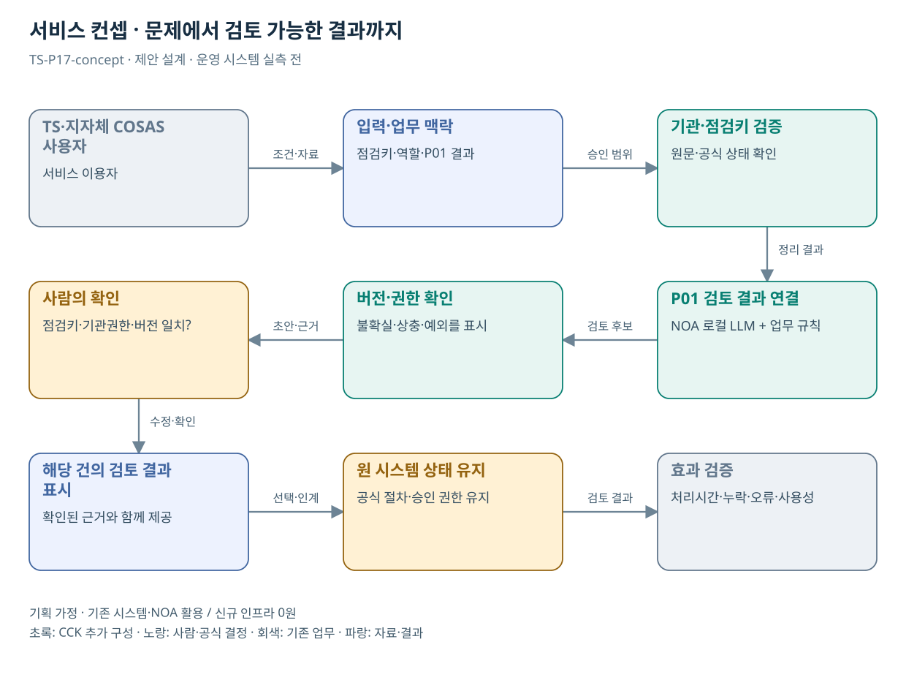

# TS-P17 서비스 정의·컨셉

COSAS 협업 문서 검토 기능 연계

> **기획 검토안**: CCK 주관 AX+SI / NOA·로컬 LLM / 기존 서버 / 신규 인프라 0원. 실제 API·물량·견적·효과는 확인 전.

## 서비스 정의

**P01의 검토 결과를 COSAS의 올바른 점검건·기관 권한·화면에 연결하는 통합 과업**

| 항목 | 설명 |
| --- | --- |
| 대상 사용자 | TS·지자체·운수회사 안전관리 담당자 |
| 문제·관찰 | 새 포털이 필요한 것이 아니라 기존 협업 과정의 문서 해석에 공백이 있는지 확인해야 함 |
| 이용 장면 | COSAS에 진행상태는 있으나 보완 요구와 제출자료의 의미상 대응이 모호한 상황 |
| 확인된 TS 업무 | TS·지자체·운수회사 자료 공유 및 진행상황 관리 |
| 초기 범위 가정 | L01의 문서 대조 결과를 COSAS 한 업무 화면에 연계하는 부속 과업 |
| 기존 기반 | COSAS 협업·현황·점검 진행상태 화면 |
| CCK AI 적용 | P01 증빙 검토 결과를 기존 점검 화면에서 확인·정정·인계 |
| 추가 수행분 | COSAS 커넥터·권한 매핑·화면 삽입·상태 호환 시험 |
| 비교 기준선 | 현행 COSAS 협업·진행상황·맞춤형 안전정보 |
| 효과 측정 | 권한 오류·점검건 오연결·상태 불일치·중복 입력 |

## 제공 결과

- 점검건에 연결된 P01 검토 요약
- 권한 있는 근거 링크
- 원 상태와 분석 시점
- 버전 충돌·연계 실패 안내
- 연계 및 사용자 접근 감사 기록

## 중복·수행 가능성

P01과 같은 점검건·대상자·결과를 다루므로 한 사업의 연계 모듈로 통합

P01 결과 스키마와 COSAS 운영자의 연계 허용·키 매핑·기관 권한표가 있어야 한다.

같은 점검 흐름을 별도 AI 사업으로 중복 견적할 위험. P01은 검토 기능, P17은 COSAS 연계·권한·호환 시험으로 비용을 구분한다.

## 대안 검토

| 대안 | 적용 내용 | 선택 조건 |
| --- | --- | --- |
| A 기존 절차·규칙·화면 개선 | 현행 COSAS 협업·진행상황·맞춤형 안전정보 | 같은 효과가 나면 LLM 범위 축소 |
| B 기존 NOA + 업무 지식·연계 | COSAS 커넥터·권한 매핑·화면 삽입·상태 호환 시험 | 권고 검토안. 공통 재사용·실제 증분 산정 |
| C 자료·업무·기관 확대 | 기존 포털에 검토 결과를 연결하는 커넥터 패턴 | 초기 효과·권한·자원 검증 후 재산정 |

## 도식의 연결

| 연결 | 전달 내용 |
| --- | --- |
| TS·지자체 COSAS 사용자 → 입력·업무 맥락 | 조건·자료 |
| 입력·업무 맥락 → 기관·점검키 검증 | 승인 범위 |
| 기관·점검키 검증 → P01 검토 결과 연결 | 정리 결과 |
| P01 검토 결과 연결 → 버전·권한 확인 | 검토 후보 |
| 버전·권한 확인 → 사람의 확인 | 초안·근거 |
| 사람의 확인 → 해당 건의 검토 결과 표시 | 수정·확인 |
| 해당 건의 검토 결과 표시 → 원 시스템 상태 유지 | 선택·인계 |
| 원 시스템 상태 유지 → 효과 검증 | 검토 결과 |

## 출처와 확인 범위

- [운수안전컨설팅지원시스템(COSAS)](https://main.kotsa.or.kr/portal/contents.do?menuCode=01081000) — 확인일 2026-09-15; 법정 점검·협업·진행상황 안내 확인; 내부 기능 전수검토 아님

기존 22개 출처는 이전 원장 확인일을 승계했다. 공급사 성능·자료 접근권한·법령 전체를 새로 검증한 자료는 아니다.

[이전 고도화 보고서](file:///G:/%EB%82%B4%20%EB%93%9C%EB%9D%BC%EC%9D%B4%EB%B8%8C/1.%20%EC%97%85%EB%AC%B4%EC%98%81%EC%97%AD/6.%20CCK/1.%20%EC%82%AC%EC%97%85%EA%B4%80%EB%A6%AC/TS/bizops/%5BTS%20%EC%82%AC%EC%97%85%EA%B8%B0%ED%9A%8D%5D/05_%ED%86%B5%ED%95%A9%EC%82%AC%EC%97%85%EA%B8%B0%ED%9A%8D/TS_22%EA%B0%9C%EC%97%85%EB%AC%B4_%EA%B3%A0%EB%8F%84%ED%99%94%EB%B3%B4%EA%B3%A0%EC%84%9C_2026-09-15/%EA%B0%9C%EB%B3%84%EB%B3%B4%EA%B3%A0%EC%84%9C/TS-P17_%EA%B3%A0%EB%8F%84%ED%99%94%EB%B3%B4%EA%B3%A0%EC%84%9C.html)

[Markdown 전체 목록](../../00_상세설계_통합보기.md)