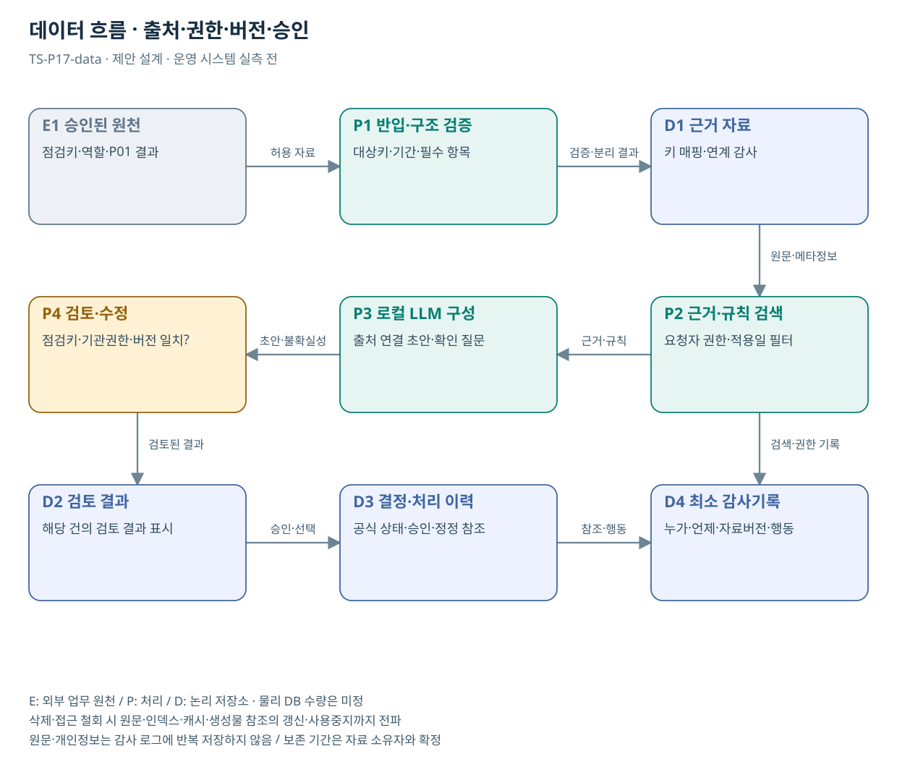

# TS-P17 데이터 흐름

COSAS 협업 문서 검토 기능 연계

> **기획 검토안**: CCK 주관 AX+SI / NOA·로컬 LLM / 기존 서버 / 신규 인프라 0원. 실제 API·물량·견적·효과는 확인 전.

## 자료의 입력·결과

COSAS 점검건·역할별 권한·기존 상태·L01 검토 결과 → 기존 업무 화면의 근거·보완 확인 영역. 실제 DB명·API·보존기간은 자료 소유자와 확정한다.

| 논리 저장소 | 내용 | 권한·수명주기 |
| --- | --- | --- |
| D1 승인 근거 | 키 매핑·연계 감사 / 원문 위치·버전·적용일 | 권한 계승 / 변경·삭제 시 색인 갱신 |
| D2 검토 결과 | 해당 건의 검토 결과 표시 / 초안·수정·근거 | 업무 대상키·역할별 접근 / 승인본 분리 |
| D3 결정·처리 이력 | 원 시스템 상태 유지 / 검토자·이유·참조 | 공식 상태는 원 시스템 기준 |
| D4 최소 감사 | 권한·자료 버전·행동·성공/실패 | 원문 전체 중복 저장 금지 / 보존기간 협의 |

## 데이터 정의·검증

| 논리 필드 | 의미·검증 |
| --- | --- |
| cosas_case_id / p01_case_id | 동일 점검건의 양쪽 식별키 |
| organization / role | 기관·사용자 역할 매핑 |
| document_ref / acl | 문서 참조와 원천 접근권한 |
| p01_result_version / source_version | 검토 결과와 원 기록의 버전 |
| source_status / observed_at | COSAS 원 상태와 조회 시각 |
| integration_event / outcome | 연계 성공·실패·재시도 이력 |

## 품질·예외·변경 처리

| 조건 | 처리 |
| --- | --- |
| 대상·기간·단위 불일치 | 화면에서 숨기는 것뿐 아니라 직접 문서 요청도 차단한다. |
| 문서 변경·근거 철회 | 재색인·캐시 만료·생성물 근거 상태를 함께 갱신. 최신 확정 표시 중지 |
| 권한 변경·삭제 | 원문·색인·캐시·결과 참조에 전파. 보존 의무·삭제 권한 담당자 확인 |
| 자료 내 명령 | 입력은 분석 대상이며 시스템 권한·도구 설정을 덮어쓰지 못함 |
| 자료 없음·모호함 | 재조회·재분석이 완료될 때까지 최신 검토 결과로 표시하지 않는다. |

## 데이터 주권의 구현 조건

- 기관이 원문·색인·임베딩·질문·생성물·감사의 저장 위치와 접근을 통제
- 외부 공개자료 반입 권한과 내부 모델 처리 경계 분리
- 운영자·원격 유지보수·백업·반출·정정·삭제 경로까지 검증
- 납품 시 지식·규칙·구성·근거·검토 이력을 이관할 형식 명시

## 도식의 연결

| 연결 | 전달 내용 |
| --- | --- |
| E1 승인된 원천 → P1 반입·구조 검증 | 허용 자료 |
| P1 반입·구조 검증 → D1 근거 자료 | 검증·분리 결과 |
| D1 근거 자료 → P2 근거·규칙 검색 | 원문·메타정보 |
| P2 근거·규칙 검색 → P3 로컬 LLM 구성 | 근거·규칙 |
| P3 로컬 LLM 구성 → P4 검토·수정 | 초안·불확실성 |
| P4 검토·수정 → D2 검토 결과 | 검토된 결과 |
| D2 검토 결과 → D3 결정·처리 이력 | 승인·선택 |
| D3 결정·처리 이력 → D4 최소 감사기록 | 참조·행동 |
| P2 근거·규칙 검색 → D4 최소 감사기록 | 검색·권한 기록 |

## 출처와 확인 범위

- [운수안전컨설팅지원시스템(COSAS)](https://main.kotsa.or.kr/portal/contents.do?menuCode=01081000) — 확인일 2026-09-15; 법정 점검·협업·진행상황 안내 확인; 내부 기능 전수검토 아님

기존 22개 출처는 이전 원장 확인일을 승계했다. 공급사 성능·자료 접근권한·법령 전체를 새로 검증한 자료는 아니다.

[이전 고도화 보고서](file:///G:/%EB%82%B4%20%EB%93%9C%EB%9D%BC%EC%9D%B4%EB%B8%8C/1.%20%EC%97%85%EB%AC%B4%EC%98%81%EC%97%AD/6.%20CCK/1.%20%EC%82%AC%EC%97%85%EA%B4%80%EB%A6%AC/TS/bizops/%5BTS%20%EC%82%AC%EC%97%85%EA%B8%B0%ED%9A%8D%5D/05_%ED%86%B5%ED%95%A9%EC%82%AC%EC%97%85%EA%B8%B0%ED%9A%8D/TS_22%EA%B0%9C%EC%97%85%EB%AC%B4_%EA%B3%A0%EB%8F%84%ED%99%94%EB%B3%B4%EA%B3%A0%EC%84%9C_2026-09-15/%EA%B0%9C%EB%B3%84%EB%B3%B4%EA%B3%A0%EC%84%9C/TS-P17_%EA%B3%A0%EB%8F%84%ED%99%94%EB%B3%B4%EA%B3%A0%EC%84%9C.html)

[Markdown 전체 목록](../../00_상세설계_통합보기.md)