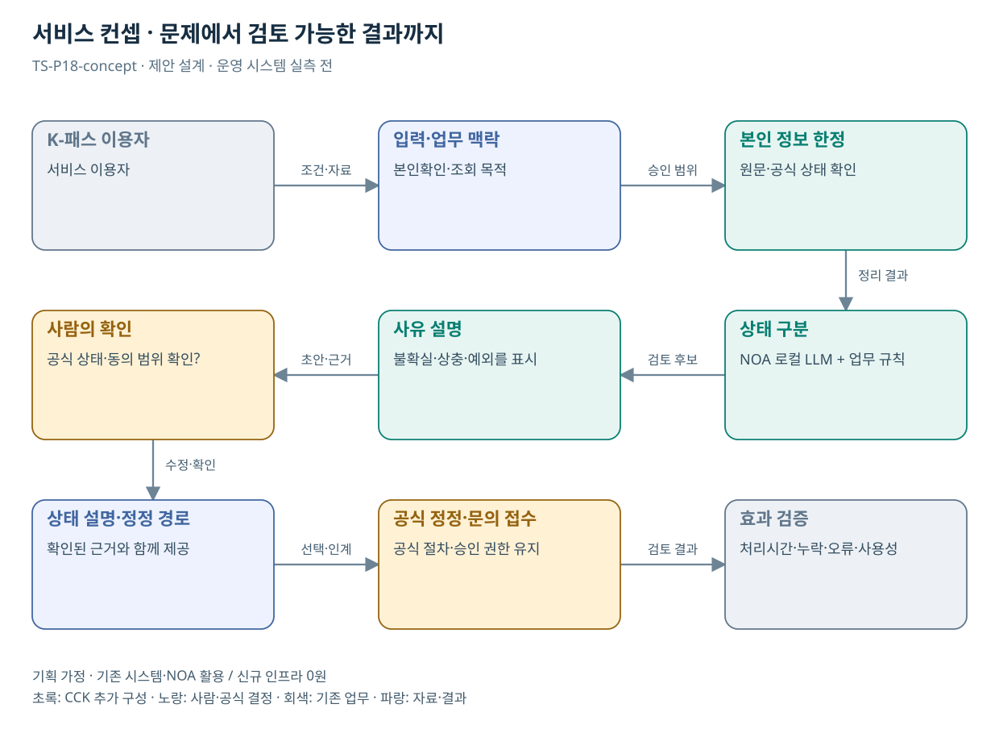

# TS-P18 서비스 정의·컨셉

K-패스 이용 등록·처리결과 이해 지원

> **기획 검토안**: CCK 주관 AX+SI / NOA·로컬 LLM / 기존 서버 / 신규 인프라 0원. 실제 API·물량·견적·효과는 확인 전.

## 서비스 정의

**K-패스 이용자가 공식 등록 상태와 처리 사유를 이해하고 필요한 정정·문의로 이어가는 지원**

| 항목 | 설명 |
| --- | --- |
| 대상 사용자 | K-패스 이용자와 환급 관련 상담·처리 담당자 |
| 문제·관찰 | 카드 발급·가입·등록·이용·지급 상태를 혼동해 혜택 이용을 놓치는 가설 |
| 이용 장면 | 카드는 발급받았으나 등록 상태가 확인되지 않아 환급이 안 된 이유를 찾는 상황 |
| 확인된 TS 업무 | 대중교통비 환급 관련 이용 지원 |
| 초기 범위 가정 | 등록 완료 확인 또는 미지급 상태 설명 중 1개 흐름, 조회 1개·인계 1개 |
| 기존 기반 | K-패스 등록·이용·처리상태·기존 안내 |
| CCK AI 적용 | 상태·사유의 개인별 설명, 누락 질문·정정 안내·문의 인계 |
| 추가 수행분 | 상태/사유 지식·본인확인·조회·정정 인계 |
| 비교 기준선 | 단계별 상태 화면·사유코드 해설·정형 도움말 |
| 효과 측정 | 상태 오안내·정정 문의 왕복·처리 완료 확인 실패 |

## 제공 결과

- 확인된 등록·카드 상태
- 공식 상태와 이용자 진술의 구분
- 처리 사유를 쉬운 말로 설명한 내용
- 본인이 할 수 있는 정정·문의 단계
- 공식 접수 결과 또는 미확인 표시

## 중복·수행 가능성

공통 문진·상태 해설을 재사용; 자격·환급 산식과 지급 상태는 원 시스템

운영부서가 상태·사유코드, 본인확인·동의 및 정정 인계 범위를 제공한다. 현재 처리 지연 원인은 자료 없이 단정하지 않는다.

쉬운 설명이 미지급 원인이나 지급액의 확정으로 읽힐 위험. 원천 코드에 없는 원인·금액을 생성하지 않는다.

## 대안 검토

| 대안 | 적용 내용 | 선택 조건 |
| --- | --- | --- |
| A 기존 절차·규칙·화면 개선 | 단계별 상태 화면·사유코드 해설·정형 도움말 | 같은 효과가 나면 LLM 범위 축소 |
| B 기존 NOA + 업무 지식·연계 | 상태/사유 지식·본인확인·조회·정정 인계 | 권고 검토안. 공통 재사용·실제 증분 산정 |
| C 자료·업무·기관 확대 | 공공 지원금의 등록·진행상태 해설; 자격·금액 계산은 기관 규칙 | 초기 효과·권한·자원 검증 후 재산정 |

## 도식의 연결

| 연결 | 전달 내용 |
| --- | --- |
| K-패스 이용자 → 입력·업무 맥락 | 조건·자료 |
| 입력·업무 맥락 → 본인 정보 한정 | 승인 범위 |
| 본인 정보 한정 → 상태 구분 | 정리 결과 |
| 상태 구분 → 사유 설명 | 검토 후보 |
| 사유 설명 → 사람의 확인 | 초안·근거 |
| 사람의 확인 → 상태 설명·정정 경로 | 수정·확인 |
| 상태 설명·정정 경로 → 공식 정정·문의 접수 | 선택·인계 |
| 공식 정정·문의 접수 → 효과 검증 | 검토 결과 |

## 출처와 확인 범위

- [대중교통비 환급 지원 사업(K-패스)](https://main.kotsa.or.kr/portal/contents.do?menuCode=01080300) — 확인일 2026-09-14; 환급 목적과 가입 절차 확인; 병합 표의 금액·비율은 재인용하지 않음

기존 22개 출처는 이전 원장 확인일을 승계했다. 공급사 성능·자료 접근권한·법령 전체를 새로 검증한 자료는 아니다.

[이전 고도화 보고서](file:///G:/%EB%82%B4%20%EB%93%9C%EB%9D%BC%EC%9D%B4%EB%B8%8C/1.%20%EC%97%85%EB%AC%B4%EC%98%81%EC%97%AD/6.%20CCK/1.%20%EC%82%AC%EC%97%85%EA%B4%80%EB%A6%AC/TS/bizops/%5BTS%20%EC%82%AC%EC%97%85%EA%B8%B0%ED%9A%8D%5D/05_%ED%86%B5%ED%95%A9%EC%82%AC%EC%97%85%EA%B8%B0%ED%9A%8D/TS_22%EA%B0%9C%EC%97%85%EB%AC%B4_%EA%B3%A0%EB%8F%84%ED%99%94%EB%B3%B4%EA%B3%A0%EC%84%9C_2026-09-15/%EA%B0%9C%EB%B3%84%EB%B3%B4%EA%B3%A0%EC%84%9C/TS-P18_%EA%B3%A0%EB%8F%84%ED%99%94%EB%B3%B4%EA%B3%A0%EC%84%9C.html)

[Markdown 전체 목록](../../00_상세설계_통합보기.md)