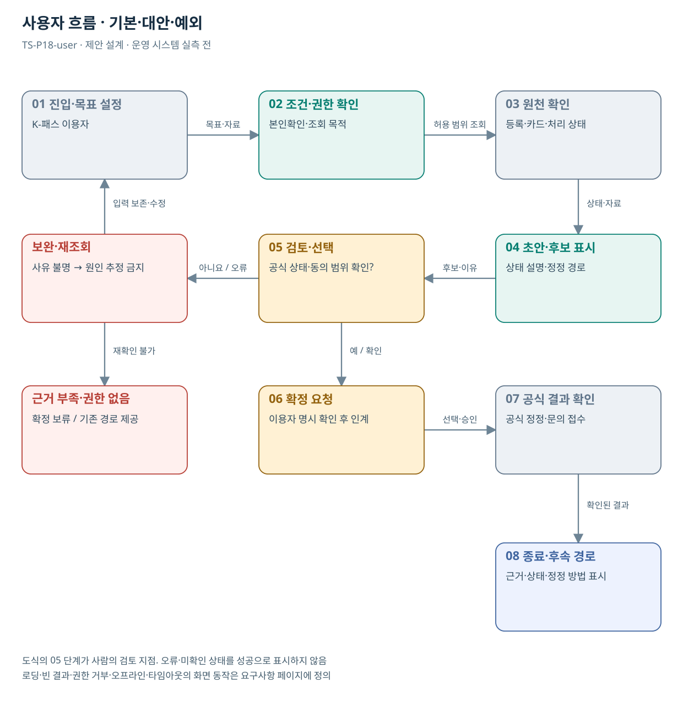

# TS-P18 사용자 흐름

K-패스 이용 등록·처리결과 이해 지원

> **기획 검토안**: CCK 주관 AX+SI / NOA·로컬 LLM / 기존 서버 / 신규 인프라 0원. 실제 API·물량·견적·효과는 확인 전.

## 사용자 목표·사전조건

K-패스 이용자와 환급 관련 상담·처리 담당자가 K-패스 이용자가 공식 등록 상태와 처리 사유를 이해하고 필요한 정정·문의로 이어가는 지원를 이용한다.

운영부서가 상태·사유코드, 본인확인·동의 및 정정 인계 범위를 제공한다. 현재 처리 지연 원인은 자료 없이 단정하지 않는다.

## 기본·대안·예외 흐름

목적 확인 → 본인확인 → 공식 상태 조회 → 이유·다음 행동 설명 → 이용자 선택 → 정정/문의 인계 → 접수 확인. 환급액은 공식 확정값만 설명한다.

| 단계 | 사용자 행동 | 시스템·공식 확인 |
| --- | --- | --- |
| 진입 | K-패스 이용자가 목적 선택 | 권한·자료 범위 확인 |
| 입력 | 본인확인·조회 목적 | 구조화·누락·적용일 확인 질문 |
| 검토 | 상태 설명·정정 경로 | 등록 완료·카드 연결·처리 대기의 원천 코드를 각각 표시한다. |
| 수정·대안 | 공식 상태·동의 범위 확인? | 공식 사유코드와 해당 기간 규칙에 따라 이유를 설명한다. |
| 최종 확인 | 공식 정정·문의 접수 | 사용자 확인 후 기존 경로로 넘기고 접수 상태를 확인한다. |
| 예외 | 사유 불명 → 원인 추정 금지 | 입력·검토 맥락 보존, 기존 경로 제공 |

## 화면 정의

| 화면 ID | 목적·주요 정보 | 이동·권한 |
| --- | --- | --- |
| TS-P18-UI01 | 조건·자료 입력 / 본인확인·조회 목적 | 역할 확인 후 UI02 |
| TS-P18-UI02 | 결과·근거·불확실성 비교 / 상태 설명·정정 경로 | 같은 맥락에서 수정 → UI01 또는 UI03 |
| TS-P18-UI03 | 검토·공식 상태 / 공식 정정·문의 접수 | 권한자 확인 후 완료·보완·유보 |
| TS-P18-UI04 | 오류·재조회·기존 처리 경로 | 조건 보존 / 허용된 단계 복귀 |

## 화면 상태·복구

| 상태 | 동작 |
| --- | --- |
| 기본·로딩 | 입력조건·범위·진행 상태 표시. 중복 버튼 비활성 |
| 빈 결과 | 조건 일치 없음과 확인한 조회 범위 표시. 필수조건 임의 변경 금지 |
| 부분 성공 | 확인·미확인 항목을 분리 |
| 입력 오류 | 해당 필드에 수정 이유 표시, 다른 입력 보존 |
| 권한 거부 | 원문 노출 없이 접근 불가·확인 경로 안내 |
| 시스템 오류·오프라인 | 기존 경로·재시도 안내. 조회 실패를 마감·불합격으로 바꾸지 않음 |
| 타임아웃 | 이전 접수·결과 유무를 재조회한 뒤 재시도 |
| 성공·비활성 | 공식 확정과 초안 완료 구분. 승인 전 확정 불가 |

## 화면 배치·접근성

입력 조건 / 결과와 근거 / 확인·보완·유보의 정보 순서로 구성한다. 이는 설계용 화면 구성안이며 현행 시스템 화면의 재현이 아니다.

키보드 이동·명시적 레이블·포커스·색 외 상태 문구를 제공한다. 390/768/1440px와 확대·스크린리더에서 핵심 과업을 검증한다. WCAG 2.2 AA는 목표이며 실제 서비스 합격 판정은 미실행이다.
## 도식의 연결

| 연결 | 전달 내용 |
| --- | --- |
| 01 진입·목표 설정 → 02 조건·권한 확인 | 목표·자료 |
| 02 조건·권한 확인 → 03 원천 확인 | 허용 범위 조회 |
| 03 원천 확인 → 04 초안·후보 표시 | 상태·자료 |
| 04 초안·후보 표시 → 05 검토·선택 | 후보·이유 |
| 05 검토·선택 → 보완·재조회 | 아니요 / 오류 |
| 보완·재조회 → 01 진입·목표 설정 | 입력 보존·수정 |
| 05 검토·선택 → 06 확정 요청 | 예 / 확인 |
| 06 확정 요청 → 07 공식 결과 확인 | 선택·승인 |
| 07 공식 결과 확인 → 08 종료·후속 경로 | 확인된 결과 |
| 보완·재조회 → 근거 부족·권한 없음 | 재확인 불가 |

## 출처와 확인 범위

- [대중교통비 환급 지원 사업(K-패스)](https://main.kotsa.or.kr/portal/contents.do?menuCode=01080300) — 확인일 2026-09-14; 환급 목적과 가입 절차 확인; 병합 표의 금액·비율은 재인용하지 않음

기존 22개 출처는 이전 원장 확인일을 승계했다. 공급사 성능·자료 접근권한·법령 전체를 새로 검증한 자료는 아니다.

[이전 고도화 보고서](file:///G:/%EB%82%B4%20%EB%93%9C%EB%9D%BC%EC%9D%B4%EB%B8%8C/1.%20%EC%97%85%EB%AC%B4%EC%98%81%EC%97%AD/6.%20CCK/1.%20%EC%82%AC%EC%97%85%EA%B4%80%EB%A6%AC/TS/bizops/%5BTS%20%EC%82%AC%EC%97%85%EA%B8%B0%ED%9A%8D%5D/05_%ED%86%B5%ED%95%A9%EC%82%AC%EC%97%85%EA%B8%B0%ED%9A%8D/TS_22%EA%B0%9C%EC%97%85%EB%AC%B4_%EA%B3%A0%EB%8F%84%ED%99%94%EB%B3%B4%EA%B3%A0%EC%84%9C_2026-09-15/%EA%B0%9C%EB%B3%84%EB%B3%B4%EA%B3%A0%EC%84%9C/TS-P18_%EA%B3%A0%EB%8F%84%ED%99%94%EB%B3%B4%EA%B3%A0%EC%84%9C.html)

[Markdown 전체 목록](../../00_상세설계_통합보기.md)