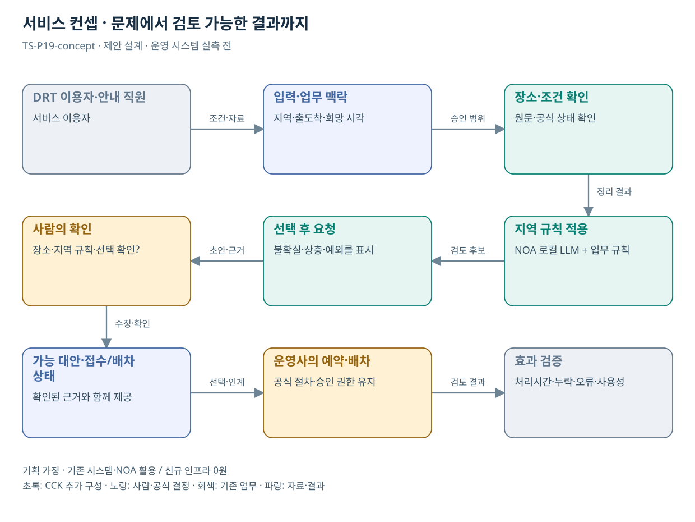

# TS-P19 서비스 정의·컨셉

DRT 이용 조건·예약 완료 지원

> **기획 검토안**: CCK 주관 AX+SI / NOA·로컬 LLM / 기존 서버 / 신규 인프라 0원. 실제 API·물량·견적·효과는 확인 전.

## 서비스 정의

**DRT 이용 조건을 텍스트로 확인하고 지역별 공식 접수·배차 상태를 알려주는 이용 지원**

| 항목 | 설명 |
| --- | --- |
| 대상 사용자 | 교통 취약지역 주민·고령 이용자와 지자체 예약 담당자 |
| 문제·관찰 | 지역별 이용 조건과 예약 경로를 이해하기 어려워 이동 신청을 반복하는 가설 |
| 이용 장면 | 주민이 병원에 갈 시간과 출발지는 설명하지만 어떤 예약 정보를 입력해야 할지 모르는 상황 |
| 확인된 TS 업무 | 지자체 수요응답형 교통의 정산·예약·운행 지원 |
| 초기 범위 가정 | 지자체 1곳·운송모델 1개, 텍스트 또는 직원 입력 보조, 조회·예약 각 1개 |
| 기존 기반 | 지자체 DRT 예약·배차·취소와 TS 지원플랫폼 |
| CCK AI 적용 | 자유로운 이동 요구를 필수 조건으로 정리, 대안 설명·예약 준비 |
| 추가 수행분 | 지역 규칙팩·예약 연계·접수/배차 구분·취소 예외 |
| 비교 기준선 | 기존 인터넷·콜센터·기사 예약과 단계형 문진표 |
| 효과 측정 | 예약 조건 재입력·접수 실패·배차 확정 오안내·상담 보조 부담 |

## 제공 결과

- 확인된 출도착·시각 요약
- 구역·시간 등 이용 조건 확인
- 공식 대안과 변경 조건
- 접수와 배차를 구분한 상태
- 취소·문의 경로

## 중복·수행 가능성

P10과 자연어 조건·확인·실패 복구 구조 공유; 배차/운행 규칙은 별도

참여 지자체·운영사가 연계 범위와 정류장 코드·예약/배차/취소 상태를 확인해야 실제 예약 개발을 확정할 수 있다.

접수 완료를 이동 확정으로 안내할 위험. 배차 대기와 확정·취소 상태를 화면에 지속 표시한다.

## 대안 검토

| 대안 | 적용 내용 | 선택 조건 |
| --- | --- | --- |
| A 기존 절차·규칙·화면 개선 | 기존 인터넷·콜센터·기사 예약과 단계형 문진표 | 같은 효과가 나면 LLM 범위 축소 |
| B 기존 NOA + 업무 지식·연계 | 지역 규칙팩·예약 연계·접수/배차 구분·취소 예외 | 권고 검토안. 공통 재사용·실제 증분 산정 |
| C 자료·업무·기관 확대 | 지자체별 규칙과 운영주체를 분리한 예약 지원 패턴 | 초기 효과·권한·자원 검증 후 재산정 |

## 도식의 연결

| 연결 | 전달 내용 |
| --- | --- |
| DRT 이용자·안내 직원 → 입력·업무 맥락 | 조건·자료 |
| 입력·업무 맥락 → 장소·조건 확인 | 승인 범위 |
| 장소·조건 확인 → 지역 규칙 적용 | 정리 결과 |
| 지역 규칙 적용 → 선택 후 요청 | 검토 후보 |
| 선택 후 요청 → 사람의 확인 | 초안·근거 |
| 사람의 확인 → 가능 대안·접수/배차 상태 | 수정·확인 |
| 가능 대안·접수/배차 상태 → 운영사의 예약·배차 | 선택·인계 |
| 운영사의 예약·배차 → 효과 검증 | 검토 결과 |

## 출처와 확인 범위

- [수요응답형 대중교통(DRT) 구축·운영](https://main.kotsa.or.kr/portal/contents.do?menuCode=01080500) — 확인일 2026-09-14; TS 지원플랫폼과 지자체 운영 역할 확인; 과거 국정과제 번호는 현재 근거로 사용하지 않음
- [사업 범위와 중복판정 v2.0](file:///G:/%EB%82%B4%20%EB%93%9C%EB%9D%BC%EC%9D%B4%EB%B8%8C/1.%20%EC%97%85%EB%AC%B4%EC%98%81%EC%97%AD/6.%20CCK/1.%20%EC%82%AC%EC%97%85%EA%B4%80%EB%A6%AC/TS/bizops/%5BTS%20%EC%82%AC%EC%97%85%EA%B8%B0%ED%9A%8D%5D/00_%EA%B8%B0%ED%9A%8D%EC%A7%80%EC%B9%A8/%EC%8B%A0%EA%B7%9C%EC%82%AC%EC%97%85_%EB%B2%94%EC%9C%84%EC%99%80_%EC%A4%91%EB%B3%B5%EB%B0%B0%EC%A0%9C.md) — 확인일 2026-09-15; 기구축 업무·시스템·AI 후속 적용 허용, 동일 계약 기능의 이중 계상 구분

기존 22개 출처는 이전 원장 확인일을 승계했다. 공급사 성능·자료 접근권한·법령 전체를 새로 검증한 자료는 아니다.

[이전 고도화 보고서](file:///G:/%EB%82%B4%20%EB%93%9C%EB%9D%BC%EC%9D%B4%EB%B8%8C/1.%20%EC%97%85%EB%AC%B4%EC%98%81%EC%97%AD/6.%20CCK/1.%20%EC%82%AC%EC%97%85%EA%B4%80%EB%A6%AC/TS/bizops/%5BTS%20%EC%82%AC%EC%97%85%EA%B8%B0%ED%9A%8D%5D/05_%ED%86%B5%ED%95%A9%EC%82%AC%EC%97%85%EA%B8%B0%ED%9A%8D/TS_22%EA%B0%9C%EC%97%85%EB%AC%B4_%EA%B3%A0%EB%8F%84%ED%99%94%EB%B3%B4%EA%B3%A0%EC%84%9C_2026-09-15/%EA%B0%9C%EB%B3%84%EB%B3%B4%EA%B3%A0%EC%84%9C/TS-P19_%EA%B3%A0%EB%8F%84%ED%99%94%EB%B3%B4%EA%B3%A0%EC%84%9C.html)

[Markdown 전체 목록](../../00_상세설계_통합보기.md)