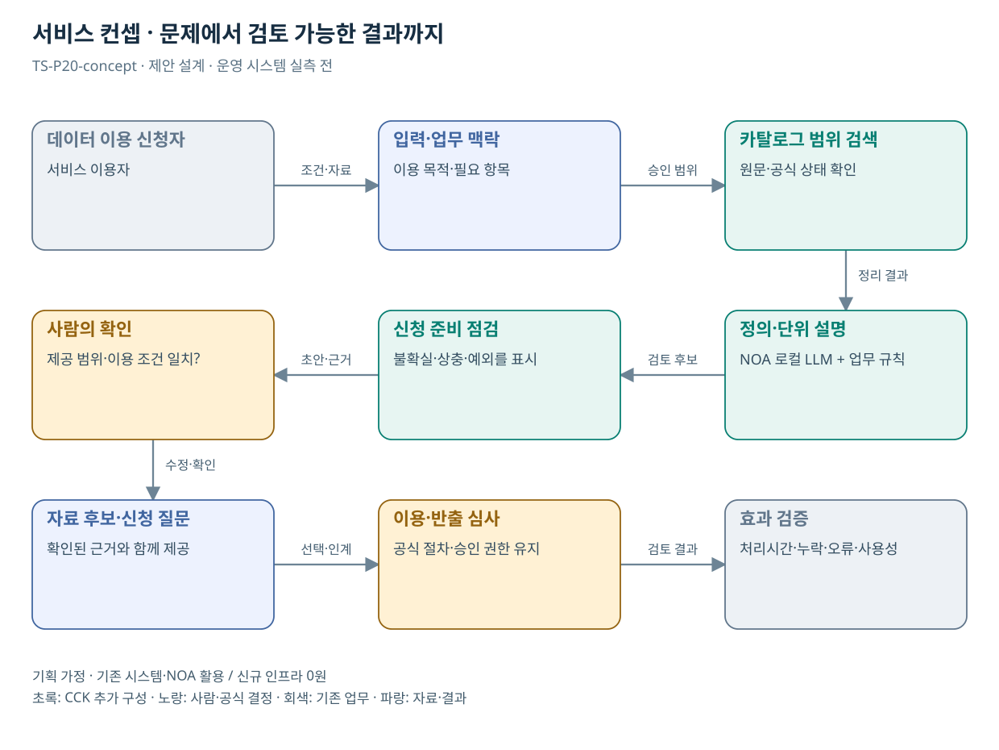

# TS-P20 서비스 정의·컨셉

데이터 개방센터 이용·분석 준비 지원

> **기획 검토안**: CCK 주관 AX+SI / NOA·로컬 LLM / 기존 서버 / 신규 인프라 0원. 실제 API·물량·견적·효과는 확인 전.

## 서비스 정의

**데이터 개방센터 공개 카탈로그를 이해하고 이용 신청 목적·항목을 준비하는 기존 지식서비스 확장**

| 항목 | 설명 |
| --- | --- |
| 대상 사용자 | 승인된 연구자·기업 이용자와 데이터 개방 담당자 |
| 문제·관찰 | 데이터의 정의·이용조건·제공절차를 이해하지 못해 분석 준비를 반복하는 가설 |
| 이용 장면 | 이용자가 필요한 변수는 찾았지만 반출 가능 범위와 신청 목적을 혼동하는 상황 |
| 확인된 TS 업무 | 자동차 생애주기 등 데이터의 통제된 분석 이용 지원 |
| 초기 범위 가정 | 공개 카탈로그 1개 분야·이용 절차 문서 2종, 원시 데이터 연계 0개 |
| 기존 기반 | 데이터 개방센터 카탈로그·사전·이용 절차 |
| CCK AI 적용 | 자연어 목적에 맞는 자료 후보 설명, 변수·제약 안내, 신청 준비 |
| 추가 수행분 | 공개 카탈로그 지식·신청 질문·반출 경계·오안내 평가 |
| 비교 기준선 | 검색 가능한 데이터 사전·이용 안내·정형 신청 양식 |
| 효과 측정 | 변수 정의 오안내·권한 위반·신청 보완·분석 준비시간 |

## 제공 결과

- 목적에 관련된 카탈로그 후보
- 정의·단위·기간·이용 제한
- 목적과 요청 항목의 대응표
- 신청 준비 보완 질문
- 담당 심사·반출 확인 경로

## 중복·수행 가능성

공통 RAG·문진 재사용; 이 사업의 산출물은 데이터 이용 준비이며 원본 통합 아님

개방센터가 공개 가능한 카탈로그·이용 안내와 갱신 책임자를 확정한다. 신규 분석 엔진 견적과 혼합하지 않는다.

자료를 검색해 주는 기능이 데이터 이용 승인처럼 보일 위험. 제공 가능성과 개별 이용·반출 심사를 구분한다.

## 대안 검토

| 대안 | 적용 내용 | 선택 조건 |
| --- | --- | --- |
| A 기존 절차·규칙·화면 개선 | 검색 가능한 데이터 사전·이용 안내·정형 신청 양식 | 같은 효과가 나면 LLM 범위 축소 |
| B 기존 NOA + 업무 지식·연계 | 공개 카탈로그 지식·신청 질문·반출 경계·오안내 평가 | 권고 검토안. 공통 재사용·실제 증분 산정 |
| C 자료·업무·기관 확대 | 공공 데이터 이용신청 준비 패턴; 원시 데이터·승인 권한은 기관별 | 초기 효과·권한·자원 검증 후 재산정 |

## 도식의 연결

| 연결 | 전달 내용 |
| --- | --- |
| 데이터 이용 신청자 → 입력·업무 맥락 | 조건·자료 |
| 입력·업무 맥락 → 카탈로그 범위 검색 | 승인 범위 |
| 카탈로그 범위 검색 → 정의·단위 설명 | 정리 결과 |
| 정의·단위 설명 → 신청 준비 점검 | 검토 후보 |
| 신청 준비 점검 → 사람의 확인 | 초안·근거 |
| 사람의 확인 → 자료 후보·신청 질문 | 수정·확인 |
| 자료 후보·신청 질문 → 이용·반출 심사 | 선택·인계 |
| 이용·반출 심사 → 효과 검증 | 검토 결과 |

## 출처와 확인 범위

- [TS 데이터 개방센터](https://main.kotsa.or.kr/portal/contents.do?menuCode=03030200) — 확인일 2026-09-14; 데이터 종류·원본 반출 제한·제공결정 절차 확인

기존 22개 출처는 이전 원장 확인일을 승계했다. 공급사 성능·자료 접근권한·법령 전체를 새로 검증한 자료는 아니다.

[이전 고도화 보고서](file:///G:/%EB%82%B4%20%EB%93%9C%EB%9D%BC%EC%9D%B4%EB%B8%8C/1.%20%EC%97%85%EB%AC%B4%EC%98%81%EC%97%AD/6.%20CCK/1.%20%EC%82%AC%EC%97%85%EA%B4%80%EB%A6%AC/TS/bizops/%5BTS%20%EC%82%AC%EC%97%85%EA%B8%B0%ED%9A%8D%5D/05_%ED%86%B5%ED%95%A9%EC%82%AC%EC%97%85%EA%B8%B0%ED%9A%8D/TS_22%EA%B0%9C%EC%97%85%EB%AC%B4_%EA%B3%A0%EB%8F%84%ED%99%94%EB%B3%B4%EA%B3%A0%EC%84%9C_2026-09-15/%EA%B0%9C%EB%B3%84%EB%B3%B4%EA%B3%A0%EC%84%9C/TS-P20_%EA%B3%A0%EB%8F%84%ED%99%94%EB%B3%B4%EA%B3%A0%EC%84%9C.html)

[Markdown 전체 목록](../../00_상세설계_통합보기.md)