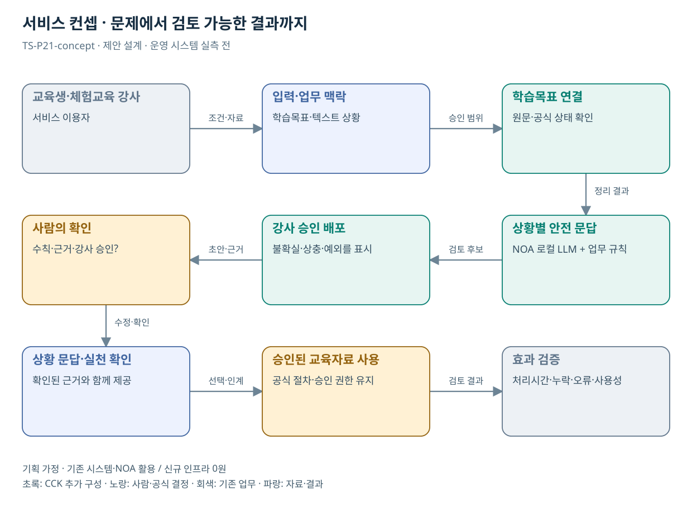

# TS-P21 서비스 정의·컨셉

교통안전 체험교육 전후 실천 지원

> **기획 검토안**: CCK 주관 AX+SI / NOA·로컬 LLM / 기존 서버 / 신규 인프라 0원. 실제 API·물량·견적·효과는 확인 전.

## 서비스 정의

**체험교육 전후에 운전자의 상황을 승인 교재와 연결해 강사가 검토한 실천 질문을 제공하는 지원**

| 항목 | 설명 |
| --- | --- |
| 대상 사용자 | 사업용 운전자·교육강사와 운송서비스 이용 국민 |
| 문제·관찰 | 현장 교육에서 배운 내용을 실제 운행의 후속 실천으로 연결하기 어렵다는 가설 |
| 이용 장면 | 교육생이 자신의 운행환경에서 배운 안전행동을 언제 적용할지 구체적으로 질문하는 상황 |
| 확인된 TS 업무 | 사업용 운수종사자 등 대상 현장·실기 교육 |
| 초기 범위 가정 | 교육과정 1개·승인된 교재/사례 2종, 교육상태 조회 1개, 강사 검토 후 사용 |
| 기존 기반 | 체험교육 과정·교재·수료·강사 검토 |
| CCK AI 적용 | 교육생 상황별 문답·실천 확인지와 강사용 설명 초안 |
| 추가 수행분 | 과정별 승인 지식·상황 문답·강사 검토·교육 효과 평가 |
| 비교 기준선 | 기존 교재·정형 복습문항·ETAS 교육 전후 비교 |
| 효과 측정 | 안전수칙 오설명·핵심 내용 이해·강사 수정량·후속 실천 확인 |

## 제공 결과

- 목표와 연결된 상황 질문
- 안전 수칙·근거·적용 조건
- 교육생의 실천 확인 목록
- 강사 승인 교안·문답
- 후속 응답과 개선 의견

## 중복·수행 가능성

P22를 과정별 콘텐츠 모듈로 통합; P16과 결과 활용·교육 문답 공유

교육 책임자가 학습목표·교재·사용 시점과 강사 검토 역할을 확정한다. 교육 효과 평가는 실제 교육생 동의·운영 조건 확보 후 수행한다.

교육 문답 개선을 무사고 효과로 과장할 위험. 우선 근거 정확성·학습 확인·강사 수정량을 측정하고 사고성과는 장기 별도 검증한다.

## 대안 검토

| 대안 | 적용 내용 | 선택 조건 |
| --- | --- | --- |
| A 기존 절차·규칙·화면 개선 | 기존 교재·정형 복습문항·ETAS 교육 전후 비교 | 같은 효과가 나면 LLM 범위 축소 |
| B 기존 NOA + 업무 지식·연계 | 과정별 승인 지식·상황 문답·강사 검토·교육 효과 평가 | 권고 검토안. 공통 재사용·실제 증분 산정 |
| C 자료·업무·기관 확대 | 공공 실기교육의 사전·사후 문답 구조; 실기·수료 판정은 교육기관 | 초기 효과·권한·자원 검증 후 재산정 |

## 도식의 연결

| 연결 | 전달 내용 |
| --- | --- |
| 교육생·체험교육 강사 → 입력·업무 맥락 | 조건·자료 |
| 입력·업무 맥락 → 학습목표 연결 | 승인 범위 |
| 학습목표 연결 → 상황별 안전 문답 | 정리 결과 |
| 상황별 안전 문답 → 강사 승인 배포 | 검토 후보 |
| 강사 승인 배포 → 사람의 확인 | 초안·근거 |
| 사람의 확인 → 상황 문답·실천 확인 | 수정·확인 |
| 상황 문답·실천 확인 → 승인된 교육자료 사용 | 선택·인계 |
| 승인된 교육자료 사용 → 효과 검증 | 검토 결과 |

## 출처와 확인 범위

- [교통안전체험교육](https://main.kotsa.or.kr/portal/contents.do?menuCode=01070300) — 확인일 2026-09-14; 실기·체험 목적·대상·센터 확인
- [운행기록분석시스템(ETAS)](https://main.kotsa.or.kr/portal/contents.do?menuCode=01040400) — 확인일 2026-09-15; 위험행동·진단·교육 전후 비교 안내 확인

기존 22개 출처는 이전 원장 확인일을 승계했다. 공급사 성능·자료 접근권한·법령 전체를 새로 검증한 자료는 아니다.

[이전 고도화 보고서](file:///G:/%EB%82%B4%20%EB%93%9C%EB%9D%BC%EC%9D%B4%EB%B8%8C/1.%20%EC%97%85%EB%AC%B4%EC%98%81%EC%97%AD/6.%20CCK/1.%20%EC%82%AC%EC%97%85%EA%B4%80%EB%A6%AC/TS/bizops/%5BTS%20%EC%82%AC%EC%97%85%EA%B8%B0%ED%9A%8D%5D/05_%ED%86%B5%ED%95%A9%EC%82%AC%EC%97%85%EA%B8%B0%ED%9A%8D/TS_22%EA%B0%9C%EC%97%85%EB%AC%B4_%EA%B3%A0%EB%8F%84%ED%99%94%EB%B3%B4%EA%B3%A0%EC%84%9C_2026-09-15/%EA%B0%9C%EB%B3%84%EB%B3%B4%EA%B3%A0%EC%84%9C/TS-P21_%EA%B3%A0%EB%8F%84%ED%99%94%EB%B3%B4%EA%B3%A0%EC%84%9C.html)

[Markdown 전체 목록](../../00_상세설계_통합보기.md)