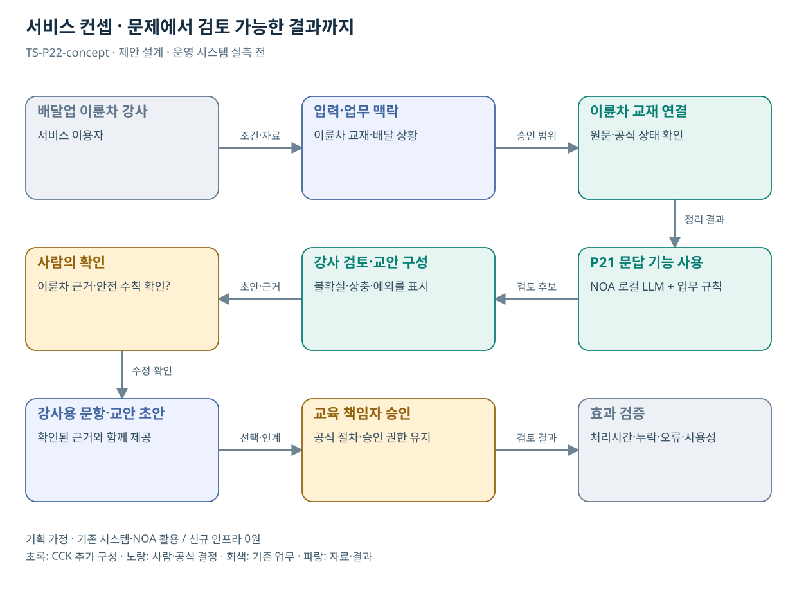

# TS-P22 서비스 정의·컨셉

배달업 이륜차 강사 교안·상황문답 지원

> **기획 검토안**: CCK 주관 AX+SI / NOA·로컬 LLM / 기존 서버 / 신규 인프라 0원. 실제 API·물량·견적·효과는 확인 전.

## 서비스 정의

**P21의 공통 교육 기능에 이륜차 배달 상황·수칙·강사 교안을 추가하는 전문 콘텐츠 모듈**

| 항목 | 설명 |
| --- | --- |
| 대상 사용자 | 배달업 이륜차 강사·신규 종사자와 도로 이용 국민 |
| 문제·관찰 | 강사별 설명과 사례 구성의 편차를 승인된 안전수칙 안에서 줄일 필요가 있다는 가설 |
| 이용 장면 | 강사가 신규 입사자의 질문을 실제 교육 사례로 바꾸되 위험한 요령을 섞지 않아야 하는 상황 |
| 확인된 TS 업무 | 2026년 배달업 이륜차 전문강사 양성 교육생 모집 확인 |
| 초기 범위 가정 | 강사 양성 또는 신규입사 교육 모듈 1개, 승인 교재/문답 2종, 외부 연계 0개 |
| 기존 기반 | 배달업 이륜차 강사교육·승인 교안 |
| CCK AI 적용 | 이륜차 상황에 맞는 문답·교안 보완·안전수칙 대조 |
| 추가 수행분 | 이륜차 콘텐츠팩·교안 검토 규칙·강사 화면 설정 |
| 비교 기준선 | 공통 교안·강사 가이드·검증된 상황문답 템플릿 |
| 효과 측정 | 위험한 요령 생성·근거 없는 설명·교안 수정 부담·교육생 이해 |

## 제공 결과

- 배달 상황별 문항·해설 초안
- 교재 근거와 안전상 금지 사항
- 강사 진행용 질문·지도 메모
- 교육 책임자 승인 교안
- 기각·수정된 문항 이력

## 중복·수행 가능성

P21 공통 교육 엔진에 이륜차 과정·강사 권한·평가 사례를 추가

P21 공통 교육 기능을 전제로 교육 책임자가 이륜차 자료·문항 검토자를 제공한다. 단독 수행 시 공통비의 별도 산정이 필요하다.

교육 엔진·강사 화면을 P21과 P22에 각각 견적할 위험. P22는 이륜차 규칙·콘텐츠·평가·설정 비용만 산정한다.

## 대안 검토

| 대안 | 적용 내용 | 선택 조건 |
| --- | --- | --- |
| A 기존 절차·규칙·화면 개선 | 공통 교안·강사 가이드·검증된 상황문답 템플릿 | 같은 효과가 나면 LLM 범위 축소 |
| B 기존 NOA + 업무 지식·연계 | 이륜차 콘텐츠팩·교안 검토 규칙·강사 화면 설정 | 권고 검토안. 공통 재사용·실제 증분 산정 |
| C 자료·업무·기관 확대 | 같은 교육 지원 구조의 직군별 콘텐츠팩; 새 엔진 개발로 집계하지 않음 | 초기 효과·권한·자원 검증 후 재산정 |

## 도식의 연결

| 연결 | 전달 내용 |
| --- | --- |
| 배달업 이륜차 강사 → 입력·업무 맥락 | 조건·자료 |
| 입력·업무 맥락 → 이륜차 교재 연결 | 승인 범위 |
| 이륜차 교재 연결 → P21 문답 기능 사용 | 정리 결과 |
| P21 문답 기능 사용 → 강사 검토·교안 구성 | 검토 후보 |
| 강사 검토·교안 구성 → 사람의 확인 | 초안·근거 |
| 사람의 확인 → 강사용 문항·교안 초안 | 수정·확인 |
| 강사용 문항·교안 초안 → 교육 책임자 승인 | 선택·인계 |
| 교육 책임자 승인 → 효과 검증 | 검토 결과 |

## 출처와 확인 범위

- [2026년 제1차 배달업 이륜차 전문강사 양성 교육생 모집 공고](https://main.kotsa.or.kr/portal/bbs/notice_view.do?bbscCode=notice&bbscSeqn=18415&menuCode=05010100) — 확인일 2026-09-14; 교육생 모집 목적·내용 확인; 교육 이수 결과 미확인
- [교통안전체험교육](https://main.kotsa.or.kr/portal/contents.do?menuCode=01070300) — 확인일 2026-09-14; 실기·체험 목적·대상·센터 확인

기존 22개 출처는 이전 원장 확인일을 승계했다. 공급사 성능·자료 접근권한·법령 전체를 새로 검증한 자료는 아니다.

[이전 고도화 보고서](file:///G:/%EB%82%B4%20%EB%93%9C%EB%9D%BC%EC%9D%B4%EB%B8%8C/1.%20%EC%97%85%EB%AC%B4%EC%98%81%EC%97%AD/6.%20CCK/1.%20%EC%82%AC%EC%97%85%EA%B4%80%EB%A6%AC/TS/bizops/%5BTS%20%EC%82%AC%EC%97%85%EA%B8%B0%ED%9A%8D%5D/05_%ED%86%B5%ED%95%A9%EC%82%AC%EC%97%85%EA%B8%B0%ED%9A%8D/TS_22%EA%B0%9C%EC%97%85%EB%AC%B4_%EA%B3%A0%EB%8F%84%ED%99%94%EB%B3%B4%EA%B3%A0%EC%84%9C_2026-09-15/%EA%B0%9C%EB%B3%84%EB%B3%B4%EA%B3%A0%EC%84%9C/TS-P22_%EA%B3%A0%EB%8F%84%ED%99%94%EB%B3%B4%EA%B3%A0%EC%84%9C.html)

[Markdown 전체 목록](../../00_상세설계_통합보기.md)