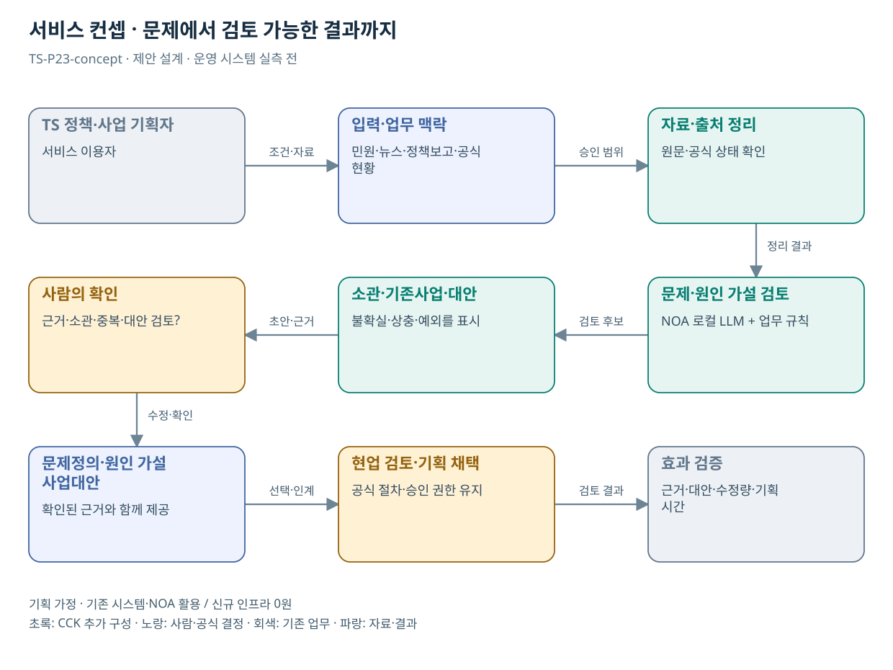

# TS-P23 서비스 정의·컨셉

교통안전 문제정의·정책사업 기획 AI 에이전트

> **기획 검토안**: P23은 추가 후보이며 조사에서 정리한 22개 업무 묶음에 포함하지 않음. CCK 주관 AX+SI / NOA·로컬 LLM / 기존 서버 / 신규 인프라 0원. 실제 API·물량·견적·효과는 확인 전.

## 서비스 정의

**민원·뉴스·정책보고·공식 현황을 근거로 문제를 정의하고 원인 가설·TS 역할·기존사업 차이·추가 사업 대안을 검토하는 기획 작업대**

| 항목 | 설명 |
| --- | --- |
| 대상 사용자 | TS 정책·사업기획 담당자, 분야별 현업 전문가, 사업으로 영향을 받는 국민·운송사업자 |
| 문제·관찰 | 민원·보도·정책의견과 공식 현황이 분산되어 문제의 대상·규모·원인 가설·기관 개입 범위를 사업 대안까지 일관되게 연결하기 어렵다는 사용자 제안 기반 가설 |
| 이용 장면 | 같은 예약 불편이 여러 기사·민원에 보이지만 실제 원인이 예약 공급 부족인지 가용상태 표시·탐색 동선인지 불명확한 상황 |
| 확인된 TS 업무 | TMACS 공식 안내에서 교통안전정보·사고 원인분석·정책 수립 지원 자료 활용을 확인. P23 에이전트가 현재 운영되거나 별도 법정업무라는 뜻은 아님 |
| 초기 범위 가정 | 교통안전 주제 1개, 승인된 자료 유형 4종, 최근 6개월 등 명시된 분석 기간, 자료 100건 이내의 범위 검증부터 시작하는 계획 가정; 대규모 자동수집은 후속 |
| 기존 기반 | TMACS 공식 현황·분석 결과, 승인된 정책보고·사업목록·민원 분석 결과, 기존 NOA 문서 검색·검토 구성 |
| CCK AI 적용 | 출처별 주장 구조화, 사건·중복 기사 묶음, 문제정의 초안, 원인 가설·반대 근거 연결, 소관·기존사업 대조, 대안·평가계획 초안 |
| 추가 수행분 | 문제/주장/근거 데이터 모델·출처 중복·원인 가설 검토·소관/기존사업 대조·기획 단계 승인·정책보고 출력·평가 자료 |
| 비교 기준선 | 담당자의 자료 검색·통계 확인·기획 양식 작성과 규칙 기반 자료 분류 |
| 효과 측정 | 근거 없는 주장·허위 인용·원인 단정·중복 사업 제안·현업 수정량·문제정의 완료시간·기획 채택 사유의 추적 가능성 |

## 제공 결과

- 문제정의 카드: 누구·언제·어디서·무엇이·얼마나·왜 공공 개입인가
- 주장별 근거·반대 근거·확인 범위 원장
- 원인 가설·대체 설명·추가 자료 확인 계획
- 현행 유지·업무 개선·기존사업 고도화·신규 사업·타기관 이관 비교
- TS 검토자가 승인한 사업기획 초안과 결정 이력

## 중복·수행 가능성

P14 기준 변경·P20 카탈로그 설명과 검색 구성 일부 공유. 기존 민원 분류·답변 AI와는 문제 단위 통합·반대 근거·소관·기존사업·대안 선택까지의 산출물 차이를 확인. P23이 찾은 과제가 기존 P01–P22에 해당하면 새 ID 대신 기존 기획 고도화로 연결

기획 책임자·대상 주제·자료 이용권한·기간·기존사업 목록·현업 반대 근거 검토자를 확정한다. 공개 분석자료로 먼저 시작하고 국민신문고 개별 원문 전체 접근을 가정하지 않는다.

기사·민원 빈도를 위험의 규모 또는 원인으로 단정하거나 항상 새 AI 사업을 답으로 선택할 위험. 출처 중복·분모·편향·대안·유보를 필수 항목으로 둔다.

## 대안 검토

| 대안 | 적용 내용 | 선택 조건 |
| --- | --- | --- |
| A 기존 절차·규칙·화면 개선 | 담당자의 자료 검색·통계 확인·기획 양식 작성과 규칙 기반 자료 분류 | 같은 효과가 나면 LLM 범위 축소 |
| B 기존 NOA + 업무 지식·연계 | 문제/주장/근거 데이터 모델·출처 중복·원인 가설 검토·소관/기존사업 대조·기획 단계 승인·정책보고 출력·평가 자료 | 권고 검토안. 공통 재사용·실제 증분 산정 |
| C 자료·업무·기관 확대 | 공통 문제정의 절차는 타 공공기관에 재사용 가능. 기관별 업무·법령·사업·민원 권한·검토 책임은 별도 구성 | 초기 효과·권한·자원 검증 후 재산정 |

## 정책기획 로직

| 단계 | AI 지원 | 사람의 판단 |
| --- | --- | --- |
| 1 주제·권한 | 집단·지역·기간·자료 목록 구성 | 기획 책임자와 이용권한 확정 |
| 2 출처·사건 | 전재·재접수·동일 사건군 식별 | 기사 10건과 사건 1건 구분 |
| 3 현황 대조 | 통계·의견·진술·추론을 분리 | 분모·시점·편향 검토 |
| 4 문제정의 | 누구의 어떤 불편·위험인지 작성 | 규모·공공 개입 필요성 검토 |
| 5 원인 가설 | 원인 후보·반대 근거·대체 설명 | 근거 부족은 추가 조사·유보 |
| 6 TS 역할 | 소관·타기관·기존사업·계약 대조 | 중복이면 기존 사업에 연결 |
| 7 대안 비교 | 현행 유지·업무 개선·고도화·신규·이관 | 효과·비용·부작용·실행 가능성 |
| 8 기획 확정 | 문제–근거–대안–예산–평가계획 연결 | 담당자가 채택·유보·추가조사 결정 |

동일 로컬 LLM을 역할별 프롬프트·검증 규칙·도구로 구성한다. 역할 수만큼 서버를 구매하는 구조가 아니다. 문제·근거 원장과 정책기획 단계 관리 기능은 실제 보유 여부를 확인하여 추가 SI 범위를 산정한다.

## 예약 불편에 적용한 예시

| 항목 | 검토 내용 |
| --- | --- |
| 문제 | 희망 조건의 실제 가용 일정을 비교하려면 마감 확인과 화면 왕복이 필요함 |
| 가설 A | 가용상태 표시·조건 유지·탐색 동선 문제 |
| 가설 B | 희망 지역·시간대의 실제 검사 슬롯 부족 |
| 필요 자료 | 탐색시간·왕복·오류, 가용량·예약량·지역·시간대 분모 |
| 대안 | A는 P10 화면·조회 고도화에 연결. B는 수요·운영 조정 검토 |
| 기획 결과 | 차이가 없는 새 사업 신설 대신 기존 P10 범위·평가 보완 |

사용자 경험을 이용한 **설계 설명 사례**다. 새로 수집한 민원 실증 결과나 검증된 원인 분석이 아니다.
## 도식의 연결

| 연결 | 전달 내용 |
| --- | --- |
| TS 정책·사업 기획자 → 입력·업무 맥락 | 조건·자료 |
| 입력·업무 맥락 → 자료·출처 정리 | 승인 범위 |
| 자료·출처 정리 → 문제·원인 가설 검토 | 정리 결과 |
| 문제·원인 가설 검토 → 소관·기존사업·대안 | 검토 후보 |
| 소관·기존사업·대안 → 사람의 확인 | 초안·근거 |
| 사람의 확인 → 문제정의·원인 가설·사업대안 | 수정·확인 |
| 문제정의·원인 가설·사업대안 → 현업 검토·기획 채택 | 선택·인계 |
| 현업 검토·기획 채택 → 효과 검증 | 검토 결과 |

## 출처와 확인 범위

- [TMACS 공식 업무 안내](https://main.kotsa.or.kr/portal/contents.do?menuCode=01040300) — 확인일 2026-09-15; 정책 기초자료·원인분석 정보의 기존 기반; 원시 데이터 권한 미확인
- [국민권익위 민원 빅데이터 분석·활용 개요](https://www.acrc.go.kr/menu.es?mid=a10104050100) — 확인일 2026-09-15; 기존 민원 분석·정책 및 제도 개선 지원과의 비교
- [한눈에 보는 민원 빅데이터 소개](https://www.acrc.go.kr/menu.es?mid=a10104050200) — 확인일 2026-09-15; 공개 분석자료 활용 가능 범위의 참고; 모든 개별 원문 개방 아님

기존 22개 출처는 이전 원장 확인일을 승계했다. 공급사 성능·자료 접근권한·법령 전체를 새로 검증한 자료는 아니다.

사용자 제안에 대한 추가 기획이며 공식 업무 신설·예산 확정 아님.

[Markdown 전체 목록](../../00_상세설계_통합보기.md)