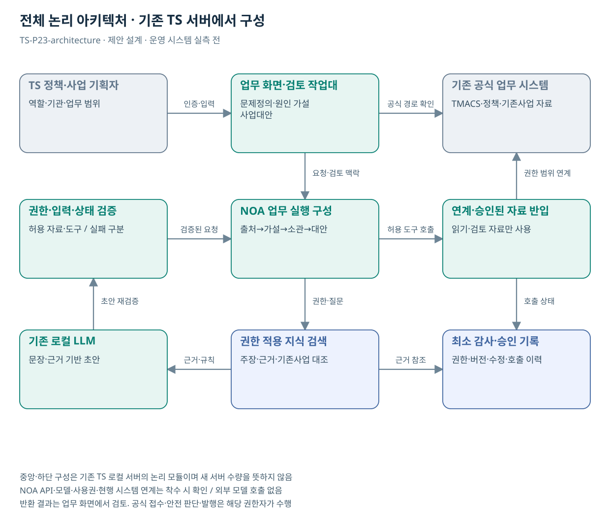

# TS-P23 전체 아키텍처

교통안전 문제정의·정책사업 기획 AI 에이전트

> **기획 검토안**: P23은 추가 후보이며 조사에서 정리한 22개 업무 묶음에 포함하지 않음. CCK 주관 AX+SI / NOA·로컬 LLM / 기존 서버 / 신규 인프라 0원. 실제 API·물량·견적·효과는 확인 전.

## 시스템 경계·수행 책임

| 영역 | 구성·역할 | 책임 |
| --- | --- | --- |
| 기존 기반 | TMACS 공식 현황·분석 결과, 승인된 정책보고·사업목록·민원 분석 결과, 기존 NOA 문서 검색·검토 구성 | TS 원 시스템·자료 운영부서 |
| 업무 화면 | 민원·뉴스·정책보고·공식 현황을 근거로 문제를 정의하고 원인 가설·TS 역할·기존사업 차이·추가 사업 대안을 검토하는 기획 작업대 | CCK 구현·연계 / TS 업무 승인 |
| NOA·로컬 LLM | 출처별 주장 구조화, 사건·중복 기사 묶음, 문제정의 초안, 원인 가설·반대 근거 연결, 소관·기존사업 대조, 대안·평가계획 초안 | CCK 설치 버전·호출·사용권 확인 |
| 규칙·연계 | 외부 자료는 승인된 수집 경로·업로드를 통해 로컬로 반입한다. 내부 LLM에서 직접 무제한 인터넷을 조회하지 않는다. TMACS·민원·정책자료 API는 실존·권한 확인 후 읽기 연계한다. 자동 정책 확정·제안 발송·사업 등록 쓰기는 초기 0개다. | CCK 어댑터 / 원 시스템 공식 결과 |
| 공통 모듈 | C00, C06 | 통합 선택 시 1회 계상 |
| 공식 결정 | 현업 검토·기획 채택 | 해당 업무 권한자 |

도식은 **논리 모듈**이며 새 서버 수량이 아니다. 신규 GPU·서버·스토리지·망 장비·클라우드 비용은 0원이다. 자원이 부족하면 범위·동시 처리·배치 주기를 조정한다.

## 재사용·구현 경계

P14 기준 변경·P20 카탈로그 설명과 검색 구성 일부 공유. 기존 민원 분류·답변 AI와는 문제 단위 통합·반대 근거·소관·기존사업·대안 선택까지의 산출물 차이를 확인. P23이 찾은 과제가 기존 P01–P22에 해당하면 새 ID 대신 기존 기획 고도화로 연결

추가 작업: 문제/주장/근거 데이터 모델·출처 중복·원인 가설 검토·소관/기존사업 대조·기획 단계 승인·정책보고 출력·평가 자료

NOA·보유 기술의 공개 설명은 설치 버전의 API·사용권·성능·검증 완료 증거가 아니다. 지식 검색·근거 연결·업무 상태 관리의 실제 보유 여부를 확인해 설정과 추가 개발을 구분한다.

## 논리 인터페이스 계약

| 계약 | 입력→출력 | 실패·권한 |
| --- | --- | --- |
| 승인 자료 반입 | 승인된 뉴스 본문/발췌·민원 비식별 자료·정책보고·공식 현황·기관업무·기존사업 정보 → 대상·기간·버전이 있는 자료 | 형식·이용권한·자료 분류 확인. 이미지 전용 자료는 텍스트 요청·수동 확인 |
| 원천 조회 | TMACS·정책·기존사업 자료 → 상태·시점·참조키 | 실제 API·권한 확인 후 읽기 연계 |
| AI 요청 | request_id, actor_scope, source_refs, question → draft, evidence_refs, uncertainty | 원문 내 지시는 분석 대상. 허용 도구·권한을 변경하지 못함 |
| 검토·처리 | 문제정의·원인 가설·사업대안 → 현업 검토·기획 채택 | 자동 공식 쓰기 없음. 검토 결과·공식 경로 제공 |

실제 API 명칭·주소·스키마는 미확인이다. 외부 자료는 승인된 수집 경로·업로드를 통해 로컬로 반입한다. 내부 LLM에서 직접 무제한 인터넷을 조회하지 않는다. TMACS·민원·정책자료 API는 실존·권한 확인 후 읽기 연계한다. 자동 정책 확정·제안 발송·사업 등록 쓰기는 초기 0개다.

## 보안·운영·복귀

- 현행 인증과 기관·업무·자료 권한 연결. 검색·색인·첨부·캐시에 같은 정책 적용
- 외부 자료는 승인된 경로로 반입. 내부 문서·질문은 외부 모델로 전송하지 않음
- 프롬프트·규칙·모델·색인 버전을 묶어 배포·이전 승인 버전 보관
- 권한 누출·허위 확정·심각한 오류 발견 시 기능 중지 후 기존 업무 경로 복귀

뉴스·민원 본문 이용권한을 확인하고 공개 분석보고·승인된 비식별 자료부터 시작한다. 자동 외부 제출·사업 등록은 초기 범위 0개다.
## 도식의 연결

| 연결 | 전달 내용 |
| --- | --- |
| TS 정책·사업 기획자 → 업무 화면·검토 작업대 | 인증·입력 |
| 업무 화면·검토 작업대 → 기존 공식 업무 시스템 | 공식 경로 확인 |
| 업무 화면·검토 작업대 → NOA 업무 실행 구성 | 요청·검토 맥락 |
| 권한·입력·상태 검증 → NOA 업무 실행 구성 | 검증된 요청 |
| NOA 업무 실행 구성 → 연계·승인된 자료 반입 | 허용 도구 호출 |
| 연계·승인된 자료 반입 → 기존 공식 업무 시스템 | 권한 범위 연계 |
| NOA 업무 실행 구성 → 권한 적용 지식 검색 | 권한·질문 |
| 권한 적용 지식 검색 → 기존 로컬 LLM | 근거·규칙 |
| 기존 로컬 LLM → 권한·입력·상태 검증 | 초안 재검증 |
| 연계·승인된 자료 반입 → 최소 감사·승인 기록 | 호출 상태 |
| 권한 적용 지식 검색 → 최소 감사·승인 기록 | 근거 참조 |

## 출처와 확인 범위

- [TMACS 공식 업무 안내](https://main.kotsa.or.kr/portal/contents.do?menuCode=01040300) — 확인일 2026-09-15; 정책 기초자료·원인분석 정보의 기존 기반; 원시 데이터 권한 미확인
- [국민권익위 민원 빅데이터 분석·활용 개요](https://www.acrc.go.kr/menu.es?mid=a10104050100) — 확인일 2026-09-15; 기존 민원 분석·정책 및 제도 개선 지원과의 비교
- [한눈에 보는 민원 빅데이터 소개](https://www.acrc.go.kr/menu.es?mid=a10104050200) — 확인일 2026-09-15; 공개 분석자료 활용 가능 범위의 참고; 모든 개별 원문 개방 아님

기존 22개 출처는 이전 원장 확인일을 승계했다. 공급사 성능·자료 접근권한·법령 전체를 새로 검증한 자료는 아니다.

사용자 제안에 대한 추가 기획이며 공식 업무 신설·예산 확정 아님.

[Markdown 전체 목록](../../00_상세설계_통합보기.md)