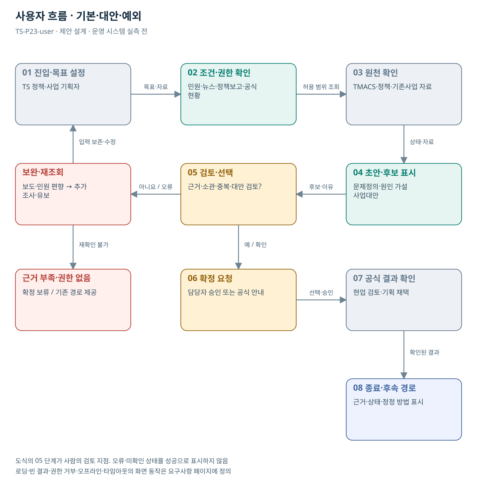

# TS-P23 사용자 흐름

교통안전 문제정의·정책사업 기획 AI 에이전트

> **기획 검토안**: P23은 추가 후보이며 조사에서 정리한 22개 업무 묶음에 포함하지 않음. CCK 주관 AX+SI / NOA·로컬 LLM / 기존 서버 / 신규 인프라 0원. 실제 API·물량·견적·효과는 확인 전.

## 사용자 목표·사전조건

TS 정책·사업기획 담당자, 분야별 현업 전문가, 사업으로 영향을 받는 국민·운송사업자가 민원·뉴스·정책보고·공식 현황을 근거로 문제를 정의하고 원인 가설·TS 역할·기존사업 차이·추가 사업 대안을 검토하는 기획 작업대를 이용한다.

기획 책임자·대상 주제·자료 이용권한·기간·기존사업 목록·현업 반대 근거 검토자를 확정한다. 공개 분석자료로 먼저 시작하고 국민신문고 개별 원문 전체 접근을 가정하지 않는다.

## 기본·대안·예외 흐름

주제·기간·권한 설정 → 출처 적재·중복 식별 → 주장·현황 대조 → 문제정의 검토 → 원인 가설 검토 → TS 소관·기존사업 대조 → 대안 비교 → 기획자 채택/유보 → 보고서 확정. 근거 부족은 추가 조사로 되돌린다.

| 단계 | 사용자 행동 | 시스템·공식 확인 |
| --- | --- | --- |
| 진입 | TS 정책·사업 기획자가 목적 선택 | 권한·자료 범위 확인 |
| 입력 | 민원·뉴스·정책보고·공식 현황 | 구조화·누락·적용일 확인 질문 |
| 검토 | 문제정의·원인 가설·사업대안 | 영향 집단·현황·분모·기간을 문제 카드에 넣고 원인·대체 설명·반대 근거를 분리한다. |
| 수정·대안 | 근거·소관·중복·대안 검토? | TS 업무·위탁·기존계약·기획목록과 비교해 개입 주체 및 실제 추가 작업을 제시한다. |
| 최종 확인 | 현업 검토·기획 채택 | 주장별 원문·시점·불확실성과 대안 선정 이유를 검토자가 승인한다. |
| 예외 | 보도·민원 편향 → 추가 조사·유보 | 입력·검토 맥락 보존, 기존 경로 제공 |

## 화면 정의

| 화면 ID | 목적·주요 정보 | 이동·권한 |
| --- | --- | --- |
| TS-P23-UI01 | 조건·자료 입력 / 민원·뉴스·정책보고·공식 현황 | 역할 확인 후 UI02 |
| TS-P23-UI02 | 결과·근거·불확실성 비교 / 문제정의·원인 가설·사업대안 | 같은 맥락에서 수정 → UI01 또는 UI03 |
| TS-P23-UI03 | 검토·공식 상태 / 현업 검토·기획 채택 | 권한자 확인 후 완료·보완·유보 |
| TS-P23-UI04 | 오류·재조회·기존 처리 경로 | 조건 보존 / 허용된 단계 복귀 |

## 화면 상태·복구

| 상태 | 동작 |
| --- | --- |
| 기본·로딩 | 입력조건·범위·진행 상태 표시. 중복 버튼 비활성 |
| 빈 결과 | 조건 일치 없음과 확인한 조회 범위 표시. 필수조건 임의 변경 금지 |
| 부분 성공 | 확인·미확인 항목을 분리 |
| 입력 오류 | 해당 필드에 수정 이유 표시, 다른 입력 보존 |
| 권한 거부 | 원문 노출 없이 접근 불가·확인 경로 안내 |
| 시스템 오류·오프라인 | 기존 경로·재시도 안내. 조회 실패를 마감·불합격으로 바꾸지 않음 |
| 타임아웃 | 이전 접수·결과 유무를 재조회한 뒤 재시도 |
| 성공·비활성 | 공식 확정과 초안 완료 구분. 승인 전 확정 불가 |

## 화면 배치·접근성

문제·주장 목록 / 찬성·반대 근거·공식 현황 / 담당자의 수정·유보·채택 영역으로 구성한다. 인용 없는 통계나 원인 문장을 찾아 바로 제외·보완할 수 있어야 한다.

키보드 이동·명시적 레이블·포커스·색 외 상태 문구를 제공한다. 390/768/1440px와 확대·스크린리더에서 핵심 과업을 검증한다. WCAG 2.2 AA는 목표이며 실제 서비스 합격 판정은 미실행이다.
## 도식의 연결

| 연결 | 전달 내용 |
| --- | --- |
| 01 진입·목표 설정 → 02 조건·권한 확인 | 목표·자료 |
| 02 조건·권한 확인 → 03 원천 확인 | 허용 범위 조회 |
| 03 원천 확인 → 04 초안·후보 표시 | 상태·자료 |
| 04 초안·후보 표시 → 05 검토·선택 | 후보·이유 |
| 05 검토·선택 → 보완·재조회 | 아니요 / 오류 |
| 보완·재조회 → 01 진입·목표 설정 | 입력 보존·수정 |
| 05 검토·선택 → 06 확정 요청 | 예 / 확인 |
| 06 확정 요청 → 07 공식 결과 확인 | 선택·승인 |
| 07 공식 결과 확인 → 08 종료·후속 경로 | 확인된 결과 |
| 보완·재조회 → 근거 부족·권한 없음 | 재확인 불가 |

## 출처와 확인 범위

- [TMACS 공식 업무 안내](https://main.kotsa.or.kr/portal/contents.do?menuCode=01040300) — 확인일 2026-09-15; 정책 기초자료·원인분석 정보의 기존 기반; 원시 데이터 권한 미확인
- [국민권익위 민원 빅데이터 분석·활용 개요](https://www.acrc.go.kr/menu.es?mid=a10104050100) — 확인일 2026-09-15; 기존 민원 분석·정책 및 제도 개선 지원과의 비교
- [한눈에 보는 민원 빅데이터 소개](https://www.acrc.go.kr/menu.es?mid=a10104050200) — 확인일 2026-09-15; 공개 분석자료 활용 가능 범위의 참고; 모든 개별 원문 개방 아님

기존 22개 출처는 이전 원장 확인일을 승계했다. 공급사 성능·자료 접근권한·법령 전체를 새로 검증한 자료는 아니다.

사용자 제안에 대한 추가 기획이며 공식 업무 신설·예산 확정 아님.

[Markdown 전체 목록](../../00_상세설계_통합보기.md)