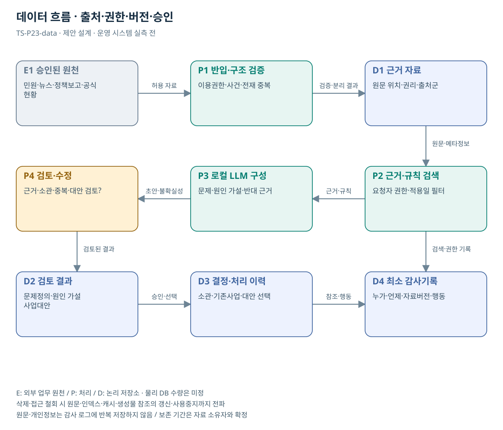

# TS-P23 데이터 흐름

교통안전 문제정의·정책사업 기획 AI 에이전트

> **기획 검토안**: P23은 추가 후보이며 조사에서 정리한 22개 업무 묶음에 포함하지 않음. CCK 주관 AX+SI / NOA·로컬 LLM / 기존 서버 / 신규 인프라 0원. 실제 API·물량·견적·효과는 확인 전.

## 자료의 입력·결과

승인된 뉴스 본문/발췌·민원 비식별 자료·정책보고·공식 현황·기관업무·기존사업 정보 → 문제정의 카드, 주장·근거 원장, 원인 가설 및 추가 확인표, 기존사업 차이표, 정책·사업 대안 비교, 사업기획서 초안. 실제 DB명·API·보존기간은 자료 소유자와 확정한다.

| 논리 저장소 | 내용 | 권한·수명주기 |
| --- | --- | --- |
| D1 승인 근거 | 문제·주장·근거·정책 결정 / 원문 위치·버전·적용일 | 권한 계승 / 변경·삭제 시 색인 갱신 |
| D2 검토 결과 | 문제정의·원인 가설·사업대안 / 초안·수정·근거 | 업무 대상키·역할별 접근 / 승인본 분리 |
| D3 결정·처리 이력 | 현업 검토·기획 채택 / 검토자·이유·참조 | 공식 상태는 원 시스템 기준 |
| D4 최소 감사 | 권한·자료 버전·행동·성공/실패 | 원문 전체 중복 저장 금지 / 보존기간 협의 |

## 데이터 정의·검증

| 논리 필드 | 의미·검증 |
| --- | --- |
| source_id / type / rights | 기사·민원·보고·통계의 유형, 이용 범위·원문 위치 |
| event_date / publish_date / region | 사건일·게시일·수집일·지역을 분리 |
| claim_id / evidence_refs / stance | 주장·근거·찬성/반대/미확인 연결; 인용 문장 확인 |
| issue_id / affected_group / denominator | 문제·영향 집단·노출 또는 이용 규모; 미확인 분모는 미확인 |
| cause_hypothesis / alternatives | 원인 가설·대체 설명·반대 근거·검증 방법 |
| ts_scope / existing_project / decision | TS 소관·기존사업 버전·채택/유보 사유 |

## 품질·예외·변경 처리

| 조건 | 처리 |
| --- | --- |
| 대상·기간·단위 불일치 | 예약 민원 증가만으로 검사 역량 부족이 원인이라고 확정하지 않는다. |
| 문서 변경·근거 철회 | 재색인·캐시 만료·생성물 근거 상태를 함께 갱신. 최신 확정 표시 중지 |
| 권한 변경·삭제 | 원문·색인·캐시·결과 참조에 전파. 보존 의무·삭제 권한 담당자 확인 |
| 자료 내 명령 | 입력은 분석 대상이며 시스템 권한·도구 설정을 덮어쓰지 못함 |
| 자료 없음·모호함 | 존재하지 않는 기사·조문·통계를 인용하지 않고 근거가 없으면 유보하며 자동 외부 제출하지 않는다. |

## 데이터 주권의 구현 조건

- 기관이 원문·색인·임베딩·질문·생성물·감사의 저장 위치와 접근을 통제
- 외부 공개자료 반입 권한과 내부 모델 처리 경계 분리
- 운영자·원격 유지보수·백업·반출·정정·삭제 경로까지 검증
- 납품 시 지식·규칙·구성·근거·검토 이력을 이관할 형식 명시

기사 수·민원 수·고유 사건 수·주장 수를 따로 기록한다. 사건일·게시일·수집일을 분리하고 분모 없는 빈도를 위험률로 표시하지 않는다. 원인 가설에는 반대 근거·대체 설명·검증 방법을 연결한다.
## 도식의 연결

| 연결 | 전달 내용 |
| --- | --- |
| E1 승인된 원천 → P1 반입·구조 검증 | 허용 자료 |
| P1 반입·구조 검증 → D1 근거 자료 | 검증·분리 결과 |
| D1 근거 자료 → P2 근거·규칙 검색 | 원문·메타정보 |
| P2 근거·규칙 검색 → P3 로컬 LLM 구성 | 근거·규칙 |
| P3 로컬 LLM 구성 → P4 검토·수정 | 초안·불확실성 |
| P4 검토·수정 → D2 검토 결과 | 검토된 결과 |
| D2 검토 결과 → D3 결정·처리 이력 | 승인·선택 |
| D3 결정·처리 이력 → D4 최소 감사기록 | 참조·행동 |
| P2 근거·규칙 검색 → D4 최소 감사기록 | 검색·권한 기록 |

## 출처와 확인 범위

- [TMACS 공식 업무 안내](https://main.kotsa.or.kr/portal/contents.do?menuCode=01040300) — 확인일 2026-09-15; 정책 기초자료·원인분석 정보의 기존 기반; 원시 데이터 권한 미확인
- [국민권익위 민원 빅데이터 분석·활용 개요](https://www.acrc.go.kr/menu.es?mid=a10104050100) — 확인일 2026-09-15; 기존 민원 분석·정책 및 제도 개선 지원과의 비교
- [한눈에 보는 민원 빅데이터 소개](https://www.acrc.go.kr/menu.es?mid=a10104050200) — 확인일 2026-09-15; 공개 분석자료 활용 가능 범위의 참고; 모든 개별 원문 개방 아님

기존 22개 출처는 이전 원장 확인일을 승계했다. 공급사 성능·자료 접근권한·법령 전체를 새로 검증한 자료는 아니다.

사용자 제안에 대한 추가 기획이며 공식 업무 신설·예산 확정 아님.

[Markdown 전체 목록](../../00_상세설계_통합보기.md)