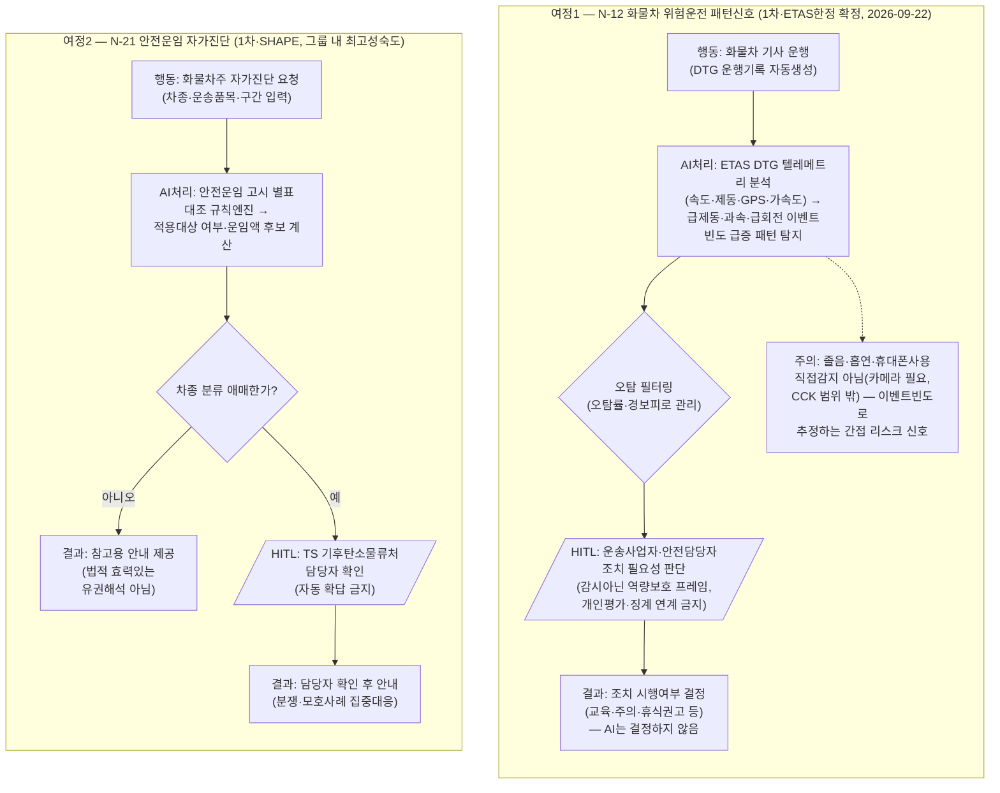
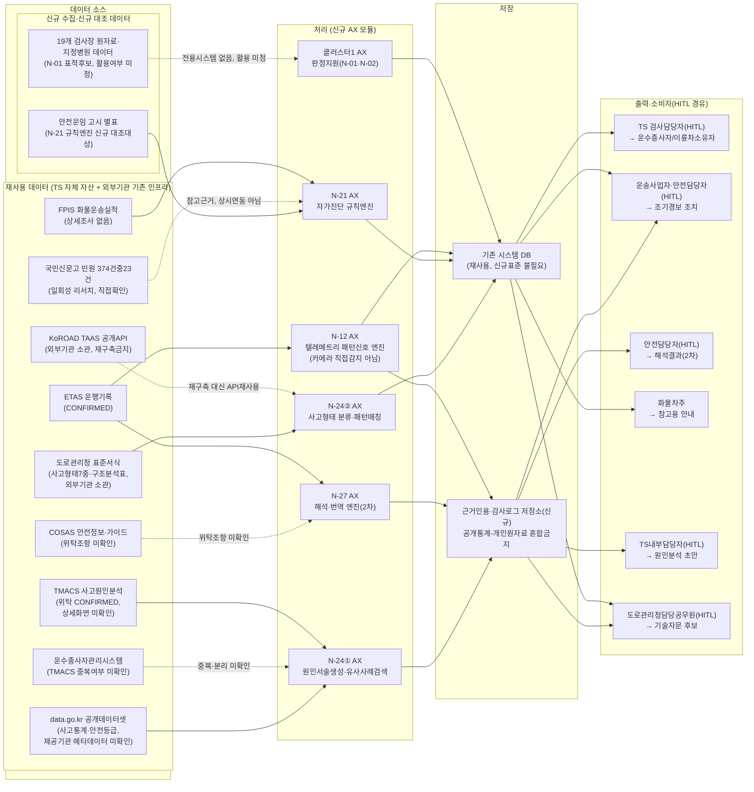

# 그룹 A_운수종사자안전관리 — 운수종사자 안전관리: 아키텍처·서비스흐름도·데이터흐름도

2026-09-21 · 00~02번 문서(요구사항분석서·요구사항정의서·RFP역설계초안)를 시각화한 것 — 새 설계를 창작한 것이 아니라 기존 문서 내용의 다이어그램화. CCK 내부 전략수립용.

> **[2026-09-22 확정 반영]** 사용자 지적("ETAS는 엣지디바이스가 필요한데 우린 플랫폼 쪽")에 따라 N-12 원카드([N-10~N-14 파일](../../N-10~N-14_Phase2검증_기획카드_v0.1_2026-09-09.md) N-12 섹션)를 재검토한 결과, 아래 다이어그램의 N-12 관련 부분("ETAS+AI관제 결합→졸음운전·전방주시태만 조기경보")이 서로 다른 두 기술기반(ETAS=DTG 텔레메트리, TS 실제 자산 / AI관제=카메라 기반 엣지디바이스, 국토부+LG전자 시범사업이지 TS 자산 아님)을 하나로 잘못 묶은 것임을 확인했다. **같은 날 사용자가 최종 결정 — ETAS 텔레메트리 한정 범위로 확정, AI관제(카메라) 결합 트랙은 채택하지 않는다.** 아래 다이어그램은 이 확정을 반영한다.

---

## 1. 전체 아키텍처

```mermaid
flowchart TD
  subgraph UG["사용자군 (이용자 인벤토리)"]
    U1["사업용 운수종사자<br/>(65세+, 자격유지검사 대상) N-01"]
    U2["이륜차 소유자<br/>(검사 대상) N-02"]
    U3["배달종사자·라이더 N-02"]
    U4["화물차 기사·운수종사자<br/>(조기경보 대상) N-12"]
    U5["여객·화물 운송사업자<br/>(DTG 관리의무자) N-12·N-27"]
    U6["운수회사 안전담당자 N-27"]
    U7["화물차주·화물운수사업자 N-21"]
    U8["TS 기후탄소물류처 담당자 N-21"]
    U9["TS 내부(TMACS분석담당·<br/>데이터융복합처) N-24 트랙①"]
    U10["도로관리청 원인조사반<br/>담당공무원 N-24 트랙②"]
    U11["국민(도로 이용자) N-24"]
  end

  subgraph AX["신규 AX 모듈 (그룹 A, 4개 기능 테마 클러스터)"]
    C1a["N-01 자격유지검사<br/>위험군예측·평가도구<br/>(1차, PENDING·국토부중복우려)"]
    C1b["N-02 이륜차검사 AI지원·<br/>라이더 안전교육 지원<br/>(1차, PENDING_CONFIRMATION)"]
    C2a["N-12 화물차 위험운전 패턴신호<br/>(텔레메트리 한정, 졸음직접감지 아님)<br/>(1차·ETAS한정 확정, 2026-09-22)"]
    C2b["N-27 ETAS·COSAS<br/>해석·번역 지원<br/>(2차·SIGNAL, 미확인 다수)"]
    C3["N-21 안전운임<br/>자가진단 규칙엔진<br/>(1차·SHAPE)"]
    C4a["N-24 트랙① TMACS고도화<br/>원인서술·유사사례·개선안초안<br/>(1차)"]
    C4b["N-24 트랙② 도로관리청<br/>기술자문 지원도구<br/>(1차, G6법적근거 약함)"]
  end

  HITL{{"HITL 최종판단(사람)<br/>AI는 후보·근거·초안까지만 산출<br/>6개 카드 전부 공통(A-NFR-001)"}}

  subgraph SI["기존 재사용 시스템(SI)"]
    S_ETAS["ETAS 운행기록분석시스템<br/>(CONFIRMED)"]
    S_COSAS["COSAS 맞춤형 안전정보·컨설팅<br/>(존재 CONFIRMED,<br/>위탁조항 미확인)"]
    S_TMACS["TMACS 교통안전정보관리체계<br/>(위탁 CONFIRMED,<br/>상세화면 미확인)"]
    S_DRV["운수종사자관리시스템(추정)<br/>(존재 CONFIRMED)"]
    S_FH["FPIS 또는 TS홈페이지<br/>(택1 미정, SI신규결합)"]
    S_DATAGOV["data.go.kr 공개데이터셋<br/>(사고통계·안전등급,<br/>제공기관 메타데이터 미확인)"]
    S_MINWON["국민신문고 민원데이터<br/>(일회성 리서치, 상시연동 아님)"]
  end

  subgraph EXT["외부연동"]
    EXT_TAAS["KoROAD TAAS 공개API<br/>(재구축금지 원칙,<br/>TS 사업화선례 미확인)"]
    EXT_ROAD["도로관리청 데이터<br/>(MOU 체결 전제, 미확정)"]
    EXT_CAM["AI관제 카메라(엣지디바이스)<br/>국토부+LG전자 시범사업, TS 자산 아님<br/>졸음·흡연·휴대폰 직접감지는 이 장비 필요<br/>(2026-09-22 확정제외, CCK 범위 밖·별도 하드웨어 트랙)"]
  end

  U1 --> C1a
  U2 --> C1b
  U3 --> C1b
  U4 --> C2a
  U5 --> C2a
  U5 --> C2b
  U6 --> C2b
  U7 --> C3
  U8 --> C3
  U9 --> C4a
  U10 --> C4b
  U11 -.->|"구조적 거리, 간접수혜"| C4a

  C1a --> HITL
  C1b --> HITL
  C2a --> HITL
  C2b --> HITL
  C3 --> HITL
  C4a --> HITL
  C4b --> HITL

  C2a --> S_ETAS
  C2b --> S_ETAS
  C2b -.->|"위탁조항 미확인"| S_COSAS
  C4a --> S_TMACS
  C4a -.->|"TMACS와 중복·분리 미확인"| S_DRV
  C4a --> S_DATAGOV
  C3 --> S_FH
  C3 -.->|"근거참고용, 상시연동 아님"| S_MINWON
  C4b -.->|"재구축 금지, 공개API 그대로"| EXT_TAAS
  C4b -.->|"MOU 미체결"| EXT_ROAD
  C2a -.->|"직접감지(졸음·흡연·휴대폰) 원하면<br/>별도 하드웨어 트랙 필요, 2026-09-22 확정 제외"| EXT_CAM
```

**읽는 법**: 사용자군 11개 노드는 00_요구사항분석서 §이용자·Pain Point 인벤토리를 N-카드별로 그대로 옮겼다. AX 모듈 7개 노드는 01_요구사항정의서 A-FR-001~012를 카드 단위로 묶은 것이며, (1차/2차, 성숙도) 표기는 outline N-08B_06의 연차구분과 evidence_status를 인용했다. HITL 육각형 노드는 A-NFR-001(6개 카드 전부 공통 원칙)을 표현한다. SI 계층은 00_요구사항분석서 §기존 시스템·데이터 자산의 "재사용 대상" 표를 그대로 옮겼고, COSAS 위탁조항·TMACS 상세화면·운수종사자관리시스템 중복여부는 문서가 "미확인"으로 명시한 항목이라 점선+라벨로만 표시했다. N-01·N-02는 "확인된 전용 시스템 없음"이라는 문서 서술에 따라 SI 계층과의 연결선을 긋지 않았다(공백을 지어내지 않음). 외부연동(TAAS·도로관리청)은 "경계 밖 시스템" 절의 재구축금지 원칙을 그대로 인용했다.

---

## 2. 서비스 흐름도

**읽는 법**: 그룹 내 성숙도가 가장 높은 두 카드 — N-12(1차, **2026-09-22 확정**: ETAS 텔레메트리 기반 패턴신호로 스코프 확정, 카메라기반 직접감지는 채택하지 않고 별도 하드웨어 트랙으로만 남김)와 N-21(SHAPE, 그룹 내 최고 성숙도) — 을 대표 여정으로 선택했다. N-12는 01_요구사항정의서 A-FR-005·006과 A-NFR-002(감시아닌 역량보호)·PER-001(오탐관리)을 그대로 옮겼고, HITL 지점은 요구사항정의서가 "사실상 최종 조치 판단은 사람 몫"이라 밝힌 취지를 가시화했다. N-21은 A-FR-009·010과 "애매한 차종 분류는 담당부서 확인 필요로 안내하고 자동 확답 금지"라는 원문을 그대로 분기(HITL)로 표현했다 — 명확한 사례는 HITL 없이 참고용 안내로 종결되고 애매한 사례만 사람에게 넘어가는 구조라는, N-12와는 다른 HITL 발동조건 차이를 문서 그대로 반영했다.

---

## 3. 데이터 흐름도

**읽는 법**: 재사용 데이터 7종(ETAS·COSAS·TMACS·운수종사자관리시스템·FPIS·data.go.kr 2종·국민신문고)은 00_요구사항분석서의 "재사용 대상" 표를 그대로 옮겼다. TAAS·도로관리청 표준서식은 같은 문서의 "경계 밖 시스템(재구축 금지)" 항목을 외부기관 소관 재사용 데이터로 포함했다. 신규수집란의 "안전운임 고시 별표"와 "19개 검사장원자료·지정병원데이터"는 문서가 각각 N-21 규칙엔진의 신규 대조대상, N-01의 "표적 후보(미정)"로 명시한 항목만 넣었고 그 외 새 데이터는 추가하지 않았다. 저장 계층의 "근거인용·감사로그 저장소"는 A-NFR-003(N-24·N-27 근거)을, "공개통계-개인원자료 혼합금지" 라벨은 A-NFR-004(N-24가 N-07 원칙을 계승)를 그대로 인용했다.

---

## 유의사항

이 3개 다이어그램은 CCK 내부 전략수립용으로 작성된 3개 문서(00~02, 2026-09-21)를 종합·시각화한 것이며, TS가 실제로 이런 아키텍처·데이터흐름·서비스여정을 확정했다는 근거는 어디에도 없다(02_RFP_역설계초안 자체가 "실제 발주용 문서 아님"이라고 명시). 점선 및 "미확인/미정/PENDING" 계열 라벨이 붙은 구간(COSAS 위탁조항, TMACS 상세화면, 운수종사자관리시스템-TMACS 중복여부, TAAS 사업화 선례, 19개검사장데이터 활용여부, 도로관리청 MOU 체결여부)은 세 문서 자체가 PENDING_CONFIRMATION/UNKNOWN/PLAUSIBLE로 남긴 것을 그대로 표시했을 뿐, 이번 작업에서 새로 확인하거나 해소한 것이 아니다. N-27(SIGNAL 등급, 차별성 검증 미통과)은 문서 명시에 따라 2차(조건부 편입)로 표기했다. 예산·기간·계약방식·TS 내 소관부서 등은 세 문서 모두 "미정/PENDING"으로 남겼으므로 다이어그램에도 포함하지 않았다. Mermaid 문법은 노드ID를 전부 ASCII로, 라벨은 큰따옴표로 감싸 육안 검토했으나 렌더러에서의 실제 컴파일 테스트는 수행하지 않았다.
