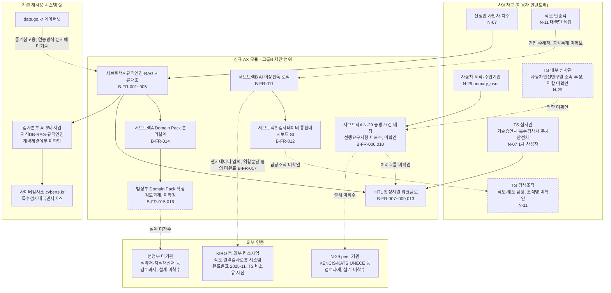
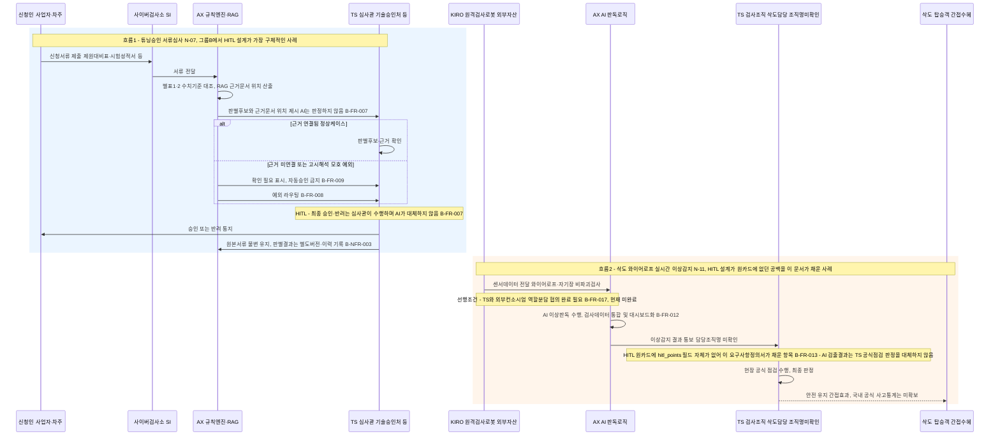
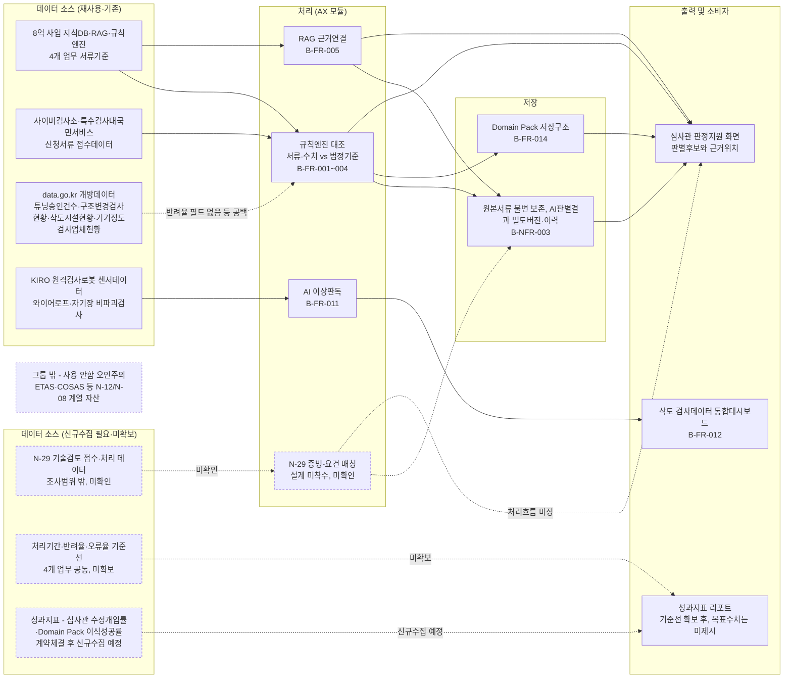

# 그룹 B_검사인증기술심사 — 검사·인증·기술심사: 아키텍처·서비스흐름도·데이터흐름도

2026-09-21 · 00~02번 문서(요구사항분석서·요구사항정의서·RFP역설계초안)를 시각화한 것 — 새 설계를 창작한 것이 아니라 기존 문서 내용의 다이어그램화. CCK 내부 전략수립용.

---

## 1. 전체 아키텍처

**읽는 법**: 사용자군(L0) 박스는 00_요구사항분석서.md의 "이용자·Pain Point 인벤토리" 절 원문(N-07/N-11/N-29 각 항목)을 그대로 옮겼다. "신규 AX 모듈"(L1)과 "기존 재사용 시스템 SI"(L2)의 구분, 그리고 각 AX 노드에 붙인 B-FR-XXX ID는 01_요구사항정의서.md의 절 구성(테마 A~E)과 ID를 그대로 인용했다. "외부 연동"(L3)은 00번 문서의 "기존 시스템·데이터 자산 현황" 중 [재사용 대상]에 있는 KIRO 컨소시엄 자산과, "기능 테마 클러스터" D(범정부/타기관 공통기반)에 등장하는 식약처·지식재산처·N-29 peer기관(KENCIS·KATS·일본자동차기술종합기구·UNECE)을 옮긴 것이다. 점선 노드(U4·U6·AX4·AX7)와 점선 화살표는 세 문서가 스스로 "미확인/UNKNOWN/PENDING_CONFIRMATION/검토과제"라고 밝힌 항목만 표시했다(예: N-11 담당조직명 미기재, N-29 TS내부 심사관 2차사용자 여부 UNKNOWN, N-29 매칭모듈 처리흐름 UNKNOWN, 범정부·peer기관 공통화는 "후보 발굴까지만 진행"). C-1(비전AI 미사용) 설계제약이 N-11(AI 영상인식+자기장 비파괴검사)과 상충할 가능성(B-NFR-013)은 아직 결정되지 않은 항목이라 노드로 표현하지 않고 caveats에 남겼다.

---

## 2. 서비스 흐름도

**읽는 법**: 대표 여정으로 N-07(튜닝승인 서류심사)과 N-11(삭도 와이어로프 실시간 이상감지) 두 건을 골랐다. N-07을 1순위로 선택한 이유는 B-FR-007~009·B-NFR-003으로 HITL 통제(판정권한 보존, 예외 라우팅, 자동승인 금지, 원본불변)가 세 카드 중 가장 구체적으로 설계돼 있기 때문이다(01_요구사항정의서.md §2, §6~7). N-11을 2순위로 대비시킨 이유는 반대로 "N-11 카드 원문에는 hitl_points 필드 자체가 없다"(01_요구사항정의서.md §3, B-FR-013 근거란 "이 문서가 채운 공백(원카드 근거 없음)")는 점을 그대로 드러내기 위해서다 - 다이어그램의 HITL 노트에 이 사실을 명시해, B-FR-013이 원카드가 아니라 요구사항정의서·RFP역설계초안이 사후에 채워 넣은 항목임을 숨기지 않았다. N-29(자동차 기술검토)는 workforce_effect·hitl_points가 전부 UNKNOWN이라(00번 문서 "이용자·Pain Point 인벤토리" N-29 항목) actor→AI→HITL→결과 흐름 자체를 구성할 근거가 없어 이번 서비스 흐름도에서 제외했다.

---

## 3. 데이터 흐름도

**읽는 법**: 00_요구사항분석서.md "기존 시스템·데이터 자산 현황" 절의 세 구분 - [재사용 대상], [미보유/조사범위 밖 UNKNOWN], [그룹 밖 참고, 오인 주의] - 을 그대로 SRC1/SRC2/EXCL 노드로 옮겼다. data.go.kr 개방데이터 항목의 "기계식주차장 처리량·반려율 데이터셋은 미발견"이라는 원문 표현은 D3→P1 점선 화살표의 "반려율 필드 없음 등 공백" 라벨로 반영했다. 저장 구간(S1)은 B-NFR-003(원본 불변·별도이력) 요구사항을 그대로 옮긴 것이며, 출력 구간의 O3(성과지표 리포트)는 B-NFR-015가 "무엇을 측정할지만 정의했고 목표 수치는 제시하지 않았다"고 명시한 점을 라벨에 그대로 남겼다. EXCL 노드는 00번 문서가 "ETAS·COSAS 등은 이번에 읽은 N-07/N-07-확장/N-11/N-29 원문 어디에도 직접 등장하지 않는다... 그룹B의 기존 자산으로 서술하지 않도록 주의"라고 명시적으로 경고한 부분을 그대로 시각화한 것이며, 후속 작업자가 이 자산들을 그룹B 데이터 흐름으로 오인하지 않도록 점선 처리했다.

---

## 유의사항

세 다이어그램은 실제로 확정된 시스템 설계가 아니라, 00_요구사항분석서.md·01_요구사항정의서.md·02_RFP_역설계초안.md 세 문서(모두 "CCK 내부 전략수립용"이며, 02번 문서는 첫 줄에서 "실제 발주 문서가 아니다"라고 명시)를 종합한 시각화 초안이다. 유의할 점은 다음과 같다. (1) 예산·일정·발주부서·계약방식이 전부 미정이며, 참고 RFP(8억 사업)의 예산은 그룹B와 별개 사업의 것이다. (2) N-11의 삭도 담당부서명, N-29의 자동차안전연구원 관련 정확한 부서명 등 다수 조직명이 미확인 상태다. (3) 세 카드의 성숙도가 N-07(확장분, INCUBATE) / N-11(SHAPE) / N-29(SIGNAL, 조사가설 단계)로 크게 다르며, 특히 N-29 관련 노드(AX4, B-FR-006·010)는 "요구사항 확정"이 아니라 "선행요구사항 해소 전 설계착수 대상"이다. (4) C-1(비전 AI 미사용) 설계제약이 N-11(AI 영상인식+자기장 비파괴검사)과 구조적으로 상충할 가능성이 있으나 그룹B 통합 전 결정되지 않은 상태다(B-NFR-013). (5) TS·외부 컨택이 필요한 항목(TS 담당부서 확인, KIRO/경북도 컨소시엄과의 역할분담 협의, 자동차 제작·수입기업 인터뷰, 자동차안전연구원 대상 질문지 발송 등)은 이번 세 문서 작성 세션 범위에서 전부 미실행이며 사용자 승인 대기 상태로 남아 있다. 다이어그램 제작 과정에서 세 문서에 없는 시스템·연동·수치는 추가하지 않았으며, 문서가 스스로 미확인/UNKNOWN/PENDING으로 표시한 항목만 점선·라벨로 구분했다.
