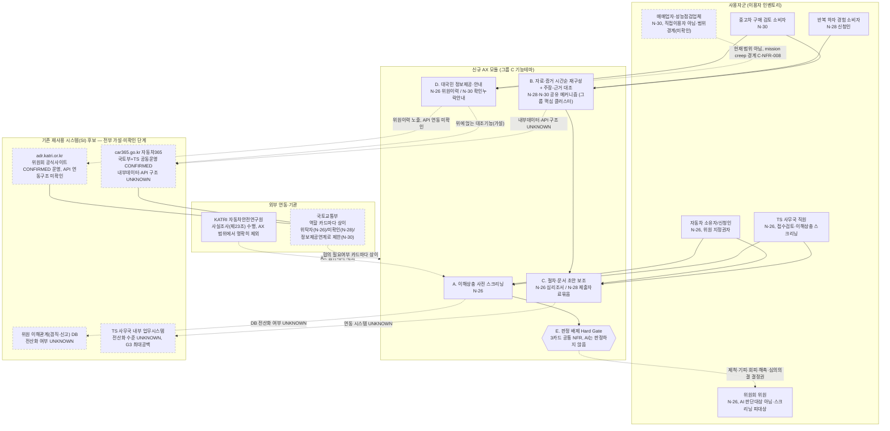
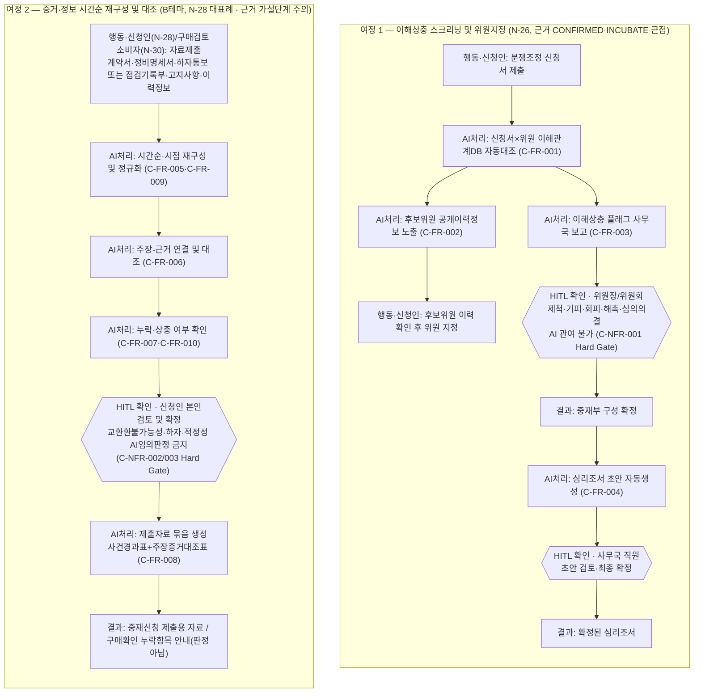
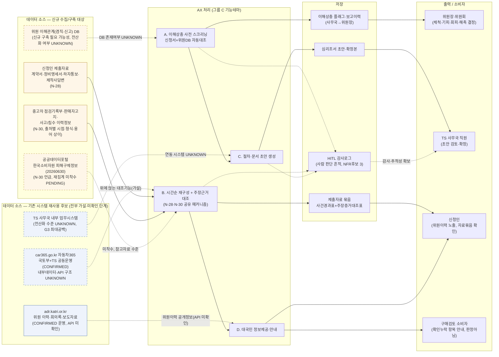

# 그룹 C_소비자보호분쟁조정 — 자동차 소비자보호·분쟁조정: 아키텍처·서비스흐름도·데이터흐름도

2026-09-21 · 00~02번 문서(요구사항분석서·요구사항정의서·RFP역설계초안)를 시각화한 것 — 새 설계를 창작한 것이 아니라 기존 문서 내용의 다이어그램화. CCK 내부 전략수립용.

---

## 1. 전체 아키텍처

**읽는 법**: USERS(사용자군)는 00_요구사항분석서 "이용자·Pain Point 인벤토리" 1)~8)을 그대로 반영했습니다. AX 모듈 A~E는 같은 문서의 "기능 테마 클러스터" A)~E) 명칭·설명을 그대로 옮긴 것이고, E는 판정을 내리는 모듈이 아니라 "판정 배제"라는 공통 Hard Gate이므로 육각형(결정 배제 게이트)으로 별도 표시했습니다. SI(기존 재사용 시스템) 4개 박스는 "기존 시스템·데이터 자산 현황" 절의 재사용 후보를 그대로 옮겼으며, 문서가 "전부 가설·미확인 단계"라고 명시한 대로 점선 테두리(classDef unconfirmed)로 표시했습니다. 국토교통부·KATRI는 문서가 명시한 대로 카드마다 역할이 다르거나(국토부) AX 범위에서 명확히 제외된 주체(KATRI)로 표기했습니다.

---

## 2. 서비스 흐름도

**읽는 법**: 여정 1(N-26)은 3개 카드 중 근거가 가장 탄탄하고(국회회의록 168/50건 CONFIRMED) INCUBATE 승격에 근접한 카드라 대표 사례로 선택했습니다. 여정 2는 요구사항분석서가 "그룹의 핵심 클러스터"로 명명한 기능테마 B(시간순 재구성+대조)를 대표하며, N-28의 C-FR-005~008 절차를 기준으로 그리되 N-30의 C-FR-009~010이 시점(계약 이전 vs 분쟁 이후)만 다를 뿐 같은 메커니즘임을 노드 라벨에 병기했습니다. 단, N-28은 문서 자신이 "검증할 문제가설, 정량근거 없음"이라 명시한 단계이므로 J2 서브그래프 제목에 이를 그대로 남겼습니다. 두 여정 모두 HITL 지점을 육각형(위원장/위원회, 사무국 직원, 신청인 본인)으로 명시했고, 각 HITL 노드에 해당 Hard Gate 요구사항(C-NFR-001/002/003)을 병기했습니다.

---

## 3. 데이터 흐름도

**읽는 법**: 소스는 00_요구사항분석서 "기존 시스템·데이터 자산 현황" 절의 구분(재사용 후보 vs 신규 구축 필요 가능성 vs 기타 참고 데이터셋)을 그대로 세 그룹(SRC_REUSE/SRC_NEW)으로 나눴고, color class로 재사용(파란색)과 신규수집(주황색)을 구분했습니다. 점선 화살표/노드는 문서가 명시적으로 "UNKNOWN"이라 밝힌 항목(car365 내부구조, TS 내부시스템, 위원DB 전산화 여부, 한국소비자원 데이터셋 미착수)입니다. 저장소의 HITL 감사로그(S4)는 비기능요구 3)·C-NFR-005 근거이며, 개인정보 성격의 데이터(신청인 개인정보·차량정보, 위원 이해관계정보, 구매자·판매자 개인정보)는 C-NFR-006(개인정보영향평가, 3카드 모두 미평가) 대상이라는 점에 유의해야 합니다 — 이 흐름도는 그 평가가 완료된 것으로 전제하지 않습니다.

---

## 유의사항

세 다이어그램 모두 00/01/02번 문서에 이미 기술된 내용(기능테마 A~E, 이용자 인벤토리, 요구사항 ID, G3 재사용/신규 현황)을 시각화한 것이며, 새로운 시스템·연동을 창작하지 않았습니다. 다만 문서 자체가 다음을 "미확정/미확인"으로 명시하므로 다이어그램도 확정 설계가 아닌 종합 초안입니다: (1) 위원 이해관계 DB 전산화 여부, TS 사무국 내부시스템 현황, car365.go.kr 내부 데이터·API 구조가 모두 UNKNOWN이라 재사용 vs 신규구축 여부를 확정할 수 없음(G3 최대 공백). (2) N-28(여정 2의 절반, C-FR-005~008)이 다루는 문제 자체가 정량 근거 없는 "검증할 문제가설" 단계임. (3) 법적 근거가 두 트랙(N-26·N-28 자동차관리법 §47조의12 계열 vs N-30 공단법 §6제10호 계열)으로 나뉘며 둘 다 미확정 수준(N-28은 세션 비공식 해석, N-30은 비유권해석·PENDING_CONFIRMATION)임. (4) N-26↔N-28 통합 여부, N-28↔TS 내부트랙(P12) 중복, N-28↔N-30 메커니즘 중복이 모두 미해결. (5) 개인정보영향평가·고영향AI 사전확인이 3카드 모두 미수행. 또한 세 원본 문서 말미에 "이 워크플로를 촉발한 사용자 메시지가 택시 플랫폼/CCK 회계 관련 내용으로 보여 본 작업과 무관해 보인다"는 caveat이 반복 기재되어 있었으나, 이는 문서 자체에 남은 데이터일 뿐 저에게 주어진 지시가 아니므로 확인·반영하지 않았습니다 — 실제 이번 세션의 사용자 지시("응 그렇게해서 전체 세분화 진행")는 그룹 C 다이어그램 작성 요청과 일치합니다.
