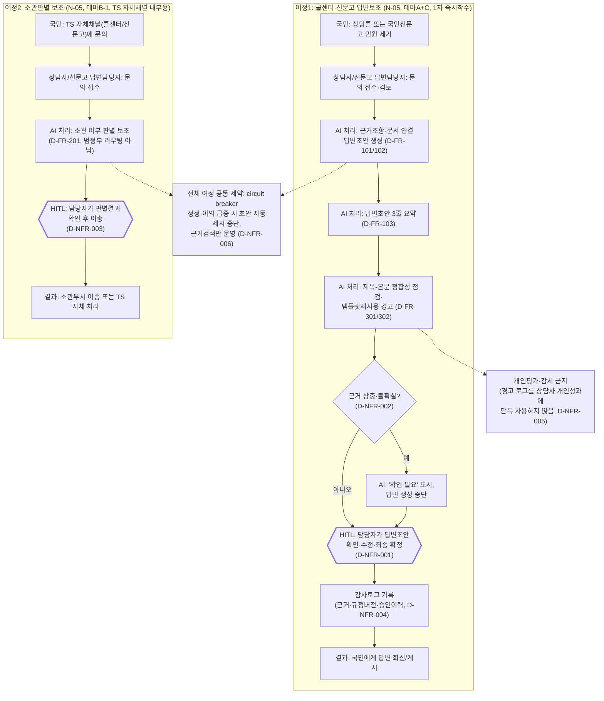
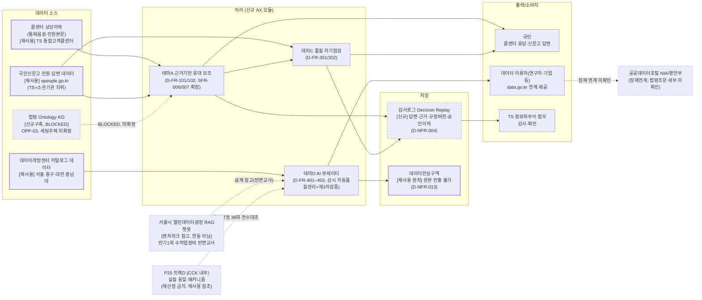

# 그룹 D_대국민정보서비스 — 대국민 정보서비스: 아키텍처·서비스흐름도·데이터흐름도

2026-09-21 · 00~02번 문서(요구사항분석서·요구사항정의서·RFP역설계초안)를 시각화한 것 — 새 설계를 창작한 것이 아니라 기존 문서 내용의 다이어그램화. CCK 내부 전략수립용.

---

## 1. 전체 아키텍처

```mermaid
flowchart TB
  subgraph USERS["사용자군 (이용자 인벤토리)"]
    direction LR
    U1["국민<br/>일반 민원인"]
    U2["TS 통합 고객콜센터<br/>상담사"]
    U3["국민신문고 답변 담당자<br/>(TS 소관기관 지위)"]
    U4["소관 오분류 대응 상담원<br/>(N-22 관점, HOLD 관련)"]
    U5["데이터 이용자<br/>(연구자·기업 등)"]
    U6["TS AI디지털본부/AI혁신본부<br/>(데이터개방센터 운영주체)"]
    U7["TS 정보화부서·법무<br/>(0차 선결과제 담당)"]
    U8["외부 이해관계자<br/>(국민권익위원회 등, 게이트키퍼)"]
  end

  subgraph AX["신규 AX 모듈 (그룹D 제안범위)"]
    direction LR
    ThemeA["테마A 근거기반 응대 보조<br/>D-FR-101/102/103<br/>N-05, SFR-006/007 확장 (1차)"]
    ThemeB1["테마B-1 TS 내부 소관판별 보조<br/>D-FR-201<br/>N-05, 범정부 라우팅 아님 (1차)"]
    ThemeB2["테마B-2 범정부 라우팅<br/>(HOLD, 개발대상 아님)<br/>N-22, 참여여부만 확인"]
    ThemeC["테마C 답변 품질 자기점검<br/>D-FR-301/302<br/>N-05 5장 하위기능 (1차)"]
    ThemeD["테마D 데이터 큐레이션·개방지원<br/>D-FR-401~403<br/>N-14, AI 큐레이터 (1차)"]
    Ontology["OPP-03 법령 Ontology·KG<br/>(BLOCKED, 세팅주체 미확정)"]
  end

  subgraph SI["기존 재사용 시스템 (SI)"]
    direction LR
    CallCenter["TS 통합 고객콜센터<br/>2023-11 통합, CSAP SaaS"]
    SFR["Delivery SFR-006/007<br/>기존 계약범위, 준공 2026-12"]
    DataCenter["TS 데이터개방센터<br/>서울 중구·대전 충남대<br/>데이터안심구역"]
    AIPlatform["AI 공통플랫폼 구축사업<br/>AI디지털본부/AI혁신본부 (추진중)"]
    Epeople["국민신문고 epeople.go.kr<br/>운영: 국민권익위<br/>TS=소관기관 지위만"]
  end

  subgraph EXT["외부/범정부 시스템 (TS 미참여, 게이트키퍼)"]
    direction LR
    Call110["국민콜110<br/>(TS 참여기관 명단 없음, 미확인)"]
    AIEpeople["AI 국민신문고<br/>(4개 기관 시범, TS 미포함)"]
    AIHelper["AI 민원서포터<br/>국무조정실/권익위<br/>(4개 기관 시범, TS 미포함)"]
    OpenDataPortal["공공데이터포털<br/>NIA/행안부<br/>(벤치마크/잠재연계, 미확인)"]
    SeoulRAG["서울시 열린데이터광장 RAG챗봇<br/>(벤치마크 참고, 결함 다수 확인)"]
  end

  P20Node["P20 트랙D (CCK 내부 아카이브)<br/>N-14와 실질 동일 메커니즘<br/>(재산정 금지)"]

  U1 --> ThemeA
  U1 --> ThemeB1
  U2 --> ThemeA
  U2 --> ThemeC
  U3 --> ThemeA
  U3 --> ThemeC
  U4 -.-> ThemeB2
  U5 --> ThemeD
  U6 --> ThemeD
  U6 --> AIPlatform
  U7 -.->|"0차 선결 확인·판단서"| ThemeA
  U7 -.->|"0차 선결 확인·판단서"| ThemeB2
  U8 -.->|"게이트키퍼(참여기관 결정권)"| Call110
  U8 -.->|"게이트키퍼(참여기관 결정권)"| AIHelper
  U8 -.->|"게이트키퍼(참여기관 결정권)"| AIEpeople

  SFR -->|"신규분 확장"| ThemeA
  CallCenter --> ThemeA
  CallCenter --> ThemeB1
  Epeople --> ThemeA
  Epeople --> ThemeC
  Epeople --> ThemeB1
  DataCenter --> ThemeD
  AIPlatform --> ThemeD
  Ontology -.->|"BLOCKED, 세팅주체 미확정"| ThemeA

  ThemeB2 -.->|"참여여부만 확인"| Call110
  ThemeB2 -.->|"참여여부만 확인"| AIHelper
  Epeople -.->|"편입계획 여부 미확인"| AIEpeople
  ThemeD -.->|"벤치마크/잠재연계, 미확인"| OpenDataPortal
  SeoulRAG -.->|"반면교사 벤치마크"| ThemeD
  P20Node -.->|"중복판정 39회 전수대조"| ThemeD

  classDef hold stroke-dasharray: 5 5
  class ThemeB2,U4,U8,Ontology,Call110,AIEpeople,AIHelper,OpenDataPortal,SeoulRAG,P20Node hold

```

**읽는 법**: 최상단 USERS는 00_요구사항분석서 "이용자·Pain Point 인벤토리" 8개 행위자를 그대로 옮겼다(U8 국민권익위는 pain point 서술 대상이 아니라 "게이트키퍼"로 명시된 존재라 점선으로 표시). 가운데 AX는 "기능 테마 클러스터" A/B/C/D를 그대로 옮겼으며, B는 문서가 스스로 "TS 내부용(진행)"과 "범정부용(보류)"으로 분화됐다고 밝힌 대로 B-1/B-2 두 노드로 쪼갰다. SI(기존 재사용 시스템)와 EXT(외부/범정부 시스템)의 항목 구분은 문서의 "기존 재사용 자산" 절과 "외부/범정부 시스템 — TS 미참여" 절 분류를 그대로 따랐다(국민신문고는 문서가 "기존 재사용 자산"으로 분류했으므로 SI에, 국민콜110·AI국민신문고·AI민원서포터·공공데이터포털·서울시RAG챗봇은 "TS 미참여" 절이므로 EXT에 배치). 점선+괄호 라벨(미확인/HOLD/BLOCKED)은 문서가 명시적으로 미확정이라고 밝힌 부분만 표시했다.

---

## 2. 서비스 흐름도

**읽는 법**: 대표 여정으로 N-05(테마A 근거기반응대 + 테마C 품질자기점검, 테마B-1 TS내부 소관판별)를 선택했다. 이유: 01_요구사항정의서에서 "1차(즉시 착수 가능)"로 분류된 유일한 기능군이고, D-FR/D-NFR ID가 가장 촘촘히 부여돼 있으며, HITL 원칙(D-NFR-001 "법적 효력 있는 안내의 최종 확정은 사람이 한다", D-NFR-003 "소관 판별 결과는 담당자가 확인 후 이송")이 명시적으로 서술돼 있기 때문이다. N-22(소관기관 자동 라우팅)는 decision=HOLD로 "개발 대상 카드가 아니다"라고 문서가 명시했으므로(요구사항정의서 §0, §10) 대표 여정에서 제외했다 — 실제로 구축되지 않는 기능을 서비스 흐름으로 그리면 왜곡이 되기 때문이다. 여정1의 "확인 필요/생성 중단" 분기는 D-NFR-002를 그대로 반영했다.

---

## 3. 데이터 흐름도

**읽는 법**: 00_요구사항분석서 "기존 시스템·데이터 자산 현황" 절의 4개 항목군(기존 재사용 자산 / 신규·미확정 자산 / 외부·범정부 시스템 / 내부 잠재중복)을 그대로 소스→처리→저장→출력 파이프라인에 배치했다. [재사용] 라벨은 CONFIRMED 기존 자산, [신규구축/BLOCKED] 라벨은 OPP-03(세팅주체 미확정)처럼 아직 착수되지 않은 항목이다. 감사로그(ST1)는 문서에 존재만 요구되고 실제로 구축된 적 없는 신규 저장소이므로 점선으로 표시했다. 서울시 RAG챗봇·P20·공공데이터포털은 실제 데이터 연동이 아니라 각각 "벤치마크 참고(반면교사)", "중복 판정으로 인한 재사용 참조", "잠재연계 미확인"이라는 성격이므로 점선+괄호 라벨로 실제 흐름과 구분했다.

---

## 유의사항

이 3개 다이어그램은 CCK 내부 전략수립용 3개 문서(00_요구사항분석서·01_요구사항정의서·02_RFP_역설계초안, 모두 2026-09-21 작성 v0.1 초안)를 종합해 시각화한 것이며, TS가 실제로 승인·발주한 설계도가 아니다. 문서 자체가 "TS발 통합 대국민 창구를 설계하는 문서가 아니다"라고 명시하므로(요구사항정의서 §0, D-NFR-015), 아키텍처 다이어그램에서 AX 모듈들이 인접해 보이는 것을 하나의 통합 플랫폼으로 오독해서는 안 된다. N-05·N-22의 법적 근거(G6)는 PENDING_CONFIRMATION이며 N-14만 CONFIRMED이다. 서비스흐름도에 인용된 D-FR-102/302 관련 374건 표본 수치(오접수 1.6~1.9%, 템플릿재사용 의심 ≈10.7%)는 국민신문고 공식 통계가 아니라 이 프로젝트 세션이 직접 붙인 단일 판독 주석이며, 전수조사인지 부분표본인지도 미확인이다(gaps_and_risks #5). 요구사항분석서가 "미확인"으로 명시한 8개 항목(TS 공식 법령적용 여부, 국민콜110 포함여부, AI민원서포터 참여가능성, 게시물 수정권한, TS 소관부서 Sponsor 특정, ALIO 콜센터 정량기준선, 행안부 사전협의 대상여부 등)은 다이어그램에서 관련 노드에 점선/괄호로만 표시했을 뿐 해소한 것이 아니므로, 실제 제안서 작성 전 01/02 문서 원문과 §Ⅶ 미확인 목록을 재확인해야 한다. Mermaid 코드는 이 세션에서 수기로 문법 점검(노드ID 영문·라벨 따옴표·괄호 매칭)만 거쳤으며, 실제 렌더링 환경에서 재검증을 권장한다.
