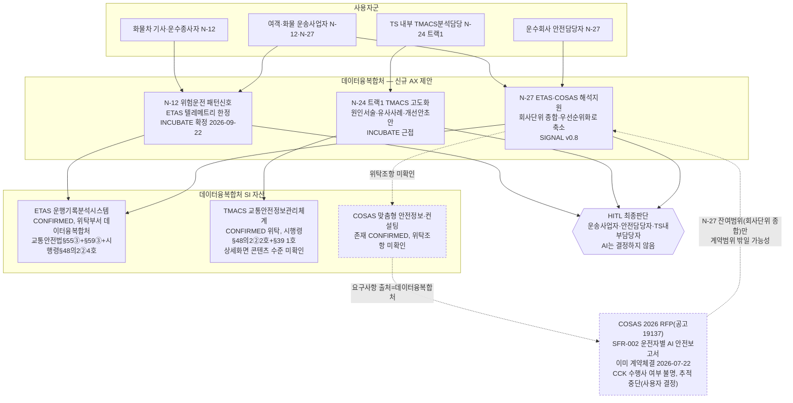
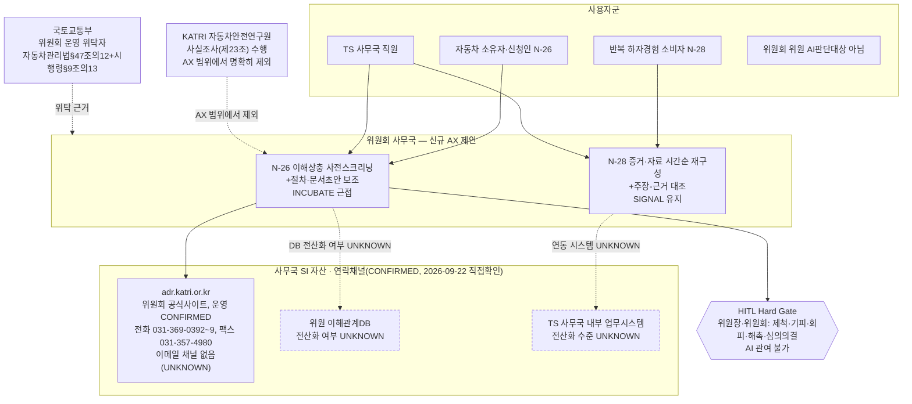
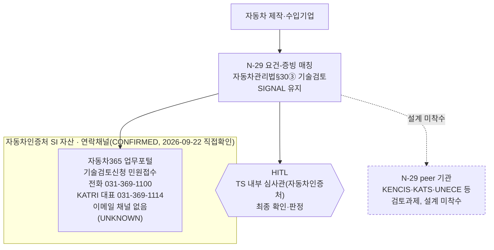
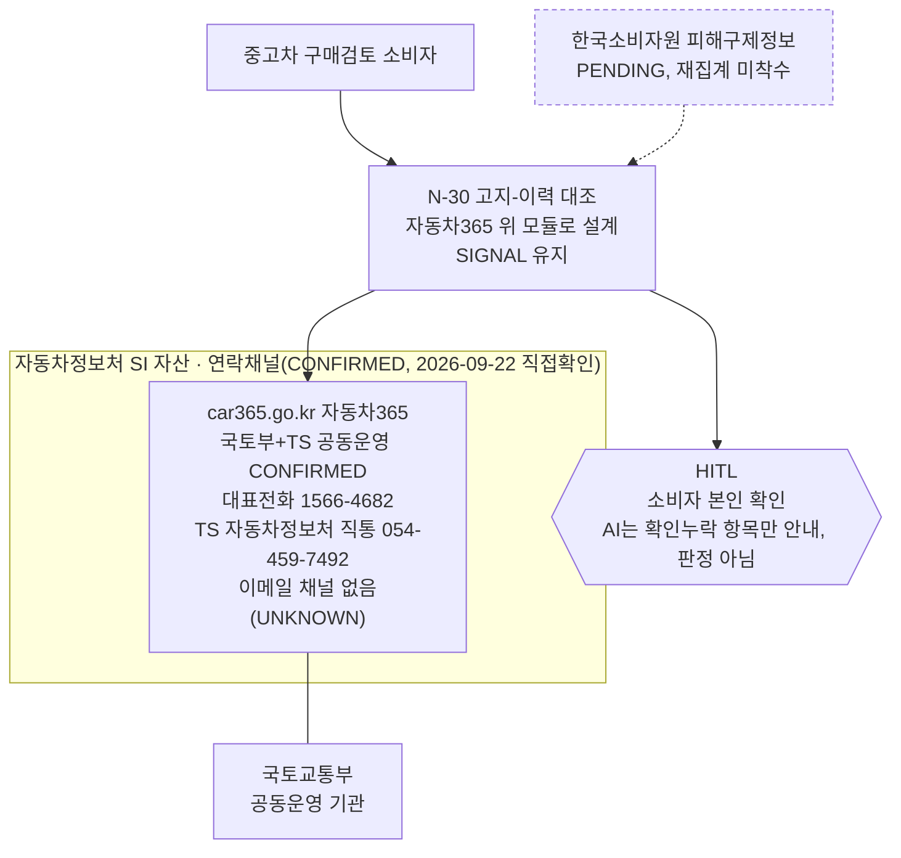
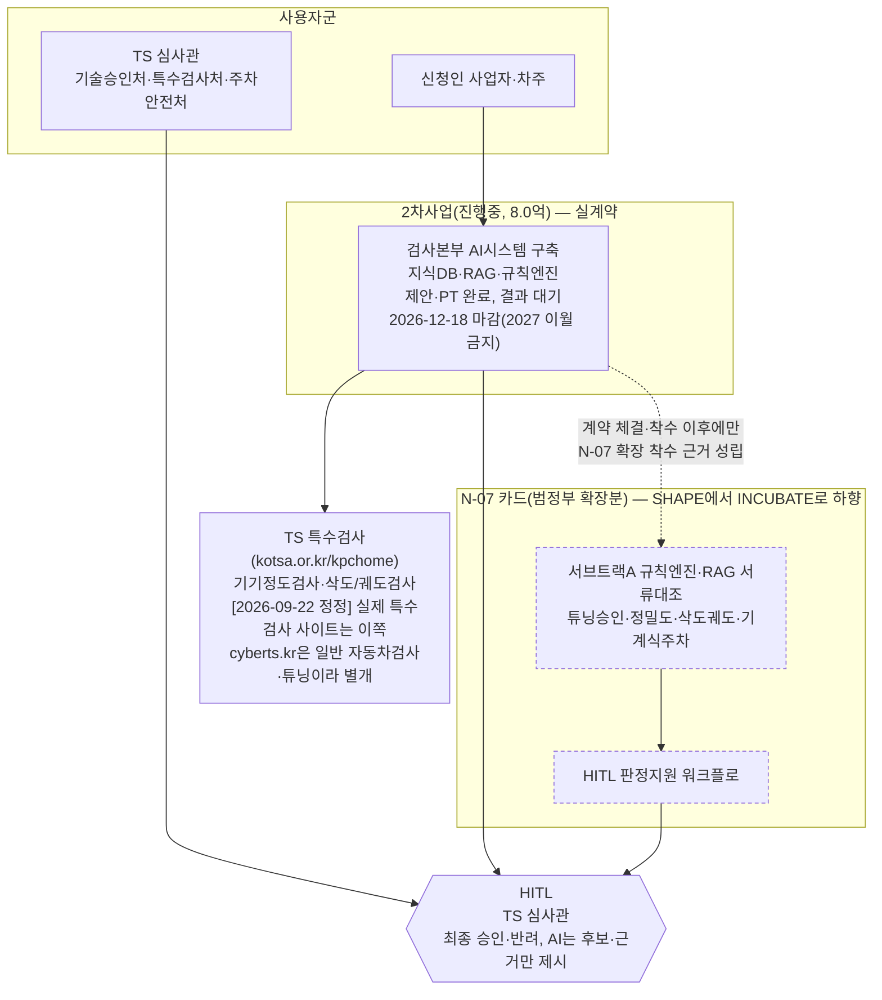
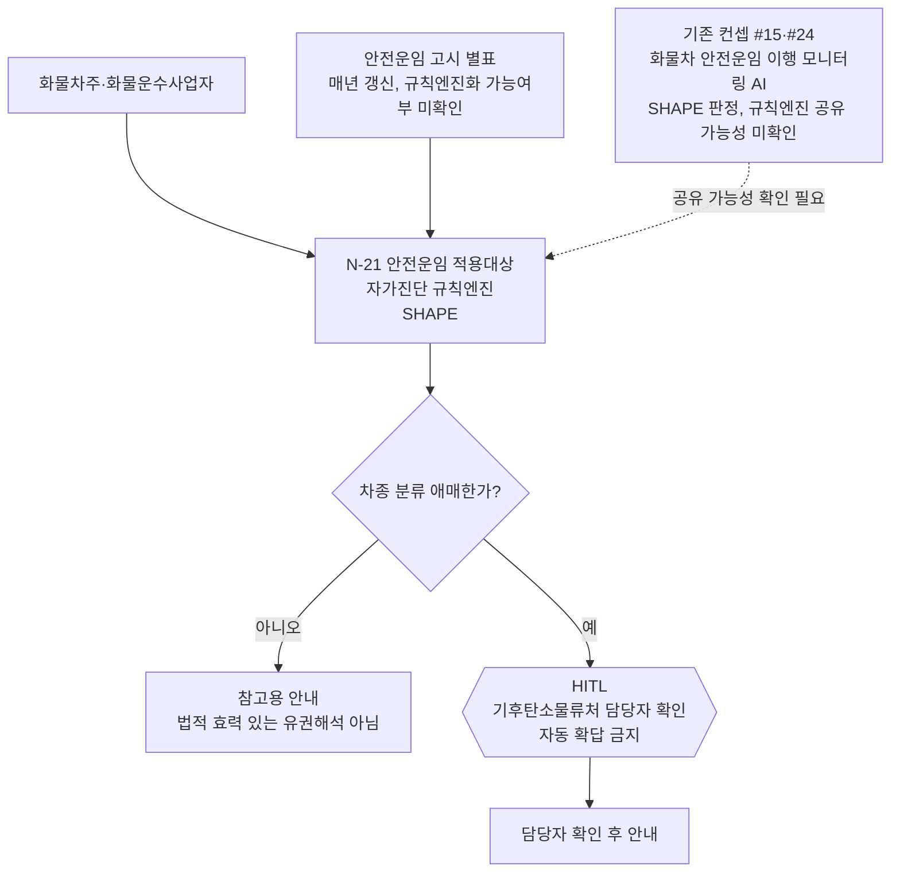
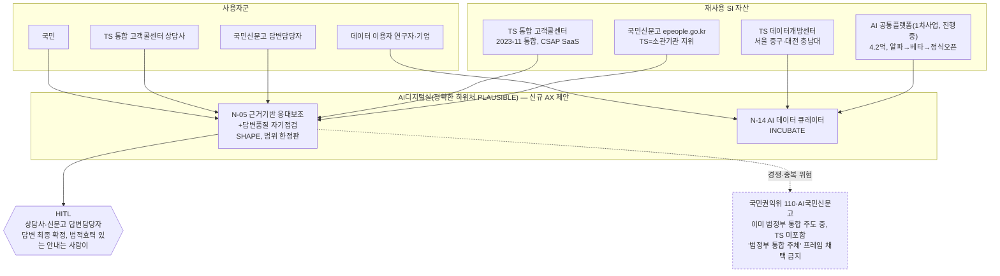
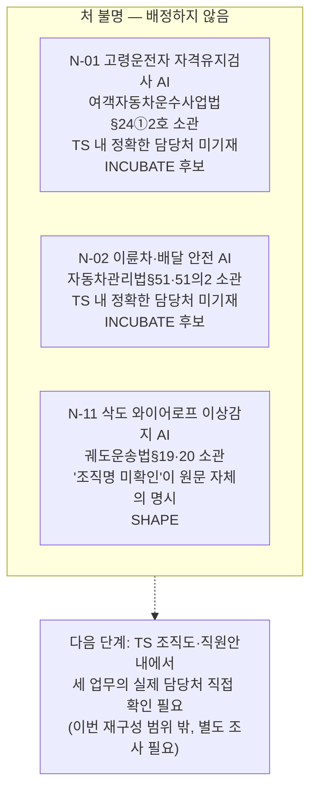

# 42. TS 처(부서) 단위 아키텍처 재구성

버전: v0.1 · 작성일: 2026-09-22 · 작성 경위: 사용자 지적("아키텍처 이상해, 각각 처마다의 전체 아키텍처를 다시 그려줘")에 대한 응답

## 0. 왜 다시 그렸는가

[40번 그룹공고 역설계](40_그룹공고_역설계_2026-09-21) 폴더의 아키텍처 4건(A_운수종사자안전관리·B_검사인증기술심사·C_소비자보호분쟁조정·D_대국민정보서비스)은 **업무 테마**를 조직 축으로 삼았다. 이 문서는 그 대신 **TS 실제 처(부서) 단위**를 축으로, 같은 15개 카드(그룹 A~D가 다뤘던 범위 그대로)를 재편성한다. 사용자가 지적한 문제 3가지에 대한 답은 다음과 같다.

1. **최신 카드 상태 미반영** — 이번 재구성은 이 세션이 방금 완료한 전체 포트폴리오 재조사(9-agent 워크플로, 2026-09-22)의 결과를 그대로 반영했다. N-12(INCUBATE 확정), N-27(SIGNAL, COSAS 2026 계약체결 발견으로 v0.8까지 대폭 축소), N-26(INCUBATE 근접), N-28/29/30(SIGNAL 유지) 등 최신 decision을 각 노드에 표기했다.
2. **그룹(A/B/C/D) 구성 기준이 잘못됨** — 실제로 확인해 보니 "업무 테마"는 TS의 발주·조직 구조와 일치하지 않았다. 예를 들어 그룹 A는 N-12·N-27(데이터융복합처 소관)과 N-21(기후탄소물류처 소관)과 N-01·N-02(부서 불명)를 "운수종사자안전관리"라는 하나의 테마로 묶었는데, 이 넷은 실제로는 최소 3개의 서로 다른(또는 확인되지 않은) 부서에 흩어져 있다. 그룹 B도 마찬가지로 2차사업 3처(N-07)와 KATRI 자동차인증처(N-29)와 부서불명(N-11)을 "검사인증기술심사"로 묶었다. 이 문서는 **이번 세션이 실제로 확인한 부서명**(연락채널 조사 워크플로 포함)을 축으로 다시 짠다.
3. **구조/흐름 자체가 잘못됨** — 처 단위로 재편하면서 각 처가 실제로 무엇을 이미 운영하는지(SI 자산), 그 위에 무엇을 얹으려는지(AX 모듈), 어디까지가 사람 몫인지(HITL)를 부서별 문맥에 맞게 다시 그렸다. 특히 데이터융복합처 클러스터(N-12·N-24①·N-27)는 그룹 A에서는 서로 다른 여정으로 쪼개져 있었으나, 실제로는 ETAS·TMACS라는 같은 SI 자산군 위에 세 카드가 나란히 얹히는 구조라는 점이 처 단위로 보면 훨씬 분명해진다.

**범위**: 그룹 A~D가 다뤘던 15개 카드(N-01·02·05·07·11·12·14·21·22·24·26·27·28·29·30)만 다룬다. 그 밖의 N-카드(N-03·04·06·08·08B·09·10·13·15~20·23·25·31·32·33)는 애초에 40번 문서군의 범위가 아니었으므로 이번 재구성에도 포함하지 않았다.

**방법**: 새 시스템·연동·부서명을 창작하지 않았다. 부서명은 (a) 이번 세션이 별도 워크플로로 직접 확인한 것(N-26·28·29·30, 연락채널까지 확인), (b) N-카드·그룹문서 원문이 이미 명시한 것(N-12·21·27), (c) 확인되지 않아 원문 자체가 "미확인"이라고 밝힌 것(N-01·02·11) 세 종류로 구분해 표기했다. 세 번째 범주는 억지로 부서를 배정하지 않고 "처 불명" 보류함에 그대로 남겼다.

---

## 1. 처 지도 요약표

| 처 | 카드 | 확인 수준 | 최신 decision(2026-09-22 기준) |
|---|---|---|---|
| **데이터융복합처** | N-12 | CONFIRMED(ETAS 위탁부서, 054-459-7241) | INCUBATE 확정 |
| | N-24①(TMACS고도화) | PLAUSIBLE(요구사항분석서 인용, 이번 세션 재확인 아님) | INCUBATE, INVEST 근접 |
| | N-27 | CONFIRMED(COSAS RFP 요구사항 출처란에 명시) | SIGNAL 유지(v0.8, 대폭 축소) |
| **KATRI 자동차안전·하자심의위원회 사무국** | N-26 | CONFIRMED(이번 세션 연락채널 조사, 031-369-0392~9) | INCUBATE 근접 |
| | N-28 | CONFIRMED(동일) | SIGNAL 유지 |
| **KATRI 자동차인증처** | N-29 | CONFIRMED(부서명), 업무기술은 PLAUSIBLE | SIGNAL 유지 |
| **TS 본사 AI디지털실 · 자동차정보처** | N-30 | CONFIRMED(TS 조직도 직접열람) | SIGNAL 유지 |
| **기술승인처·특수검사처·주차안전처**(2차사업 3처) | N-07(범정부 확장분) | CONFIRMED(2차사업 실계약 발주부서와 동일, 25번 §8.0) | 기반사업(8억)=INVEST 진행중 / N-07 카드=SHAPE→INCUBATE 하향 |
| **TS 기후탄소물류처** | N-21 | 카드 원문 명시(재검증 안 함) | SHAPE |
| **AI디지털실**(정확한 하위처 PLAUSIBLE) | N-05 | PLAUSIBLE("AI디지털본부/AI혁신본부" 표현, 자동차정보처 조사에서 확인된 "AI혁신처"와 본부/처 레벨 불일치) | SHAPE(범위 한정) |
| | N-14 | PLAUSIBLE(동일) | INCUBATE |
| **처 불명**(강제 배정 안 함) | N-01, N-02 | UNKNOWN — 카드 원문에 부서명 없음 | INCUBATE 후보 |
| | N-11 | UNKNOWN — "조직명 미확인"이 카드·그룹B 문서 자체의 명시 | SHAPE |
| (참고, TS 처 아님) | N-22 | 해당없음(범정부 경쟁 이슈, TS 부서 문제 아님) | HOLD(독립개발 보류) |
| (참고, TS 처 아님) | N-24②(도로관리청 기술자문) | 도로관리청은 외부기관 | N-24①에 통합돼 있으나 트랙 자체는 별도 |

---

## 2. 처별 전체 아키텍처

### 2.1 데이터융복합처 — N-12·N-24①·N-27 (ETAS·TMACS·COSAS 클러스터)

이 세 카드는 그룹 A 안에서는 서로 다른 "사용자군→AX모듈" 여정으로 흩어져 있었으나, 실제로는 **데이터융복합처가 운영하는 두 SI 자산(ETAS·TMACS)과, 데이터융복합처가 요구사항 출처로 명시된 COSAS 2026 사업** 위에 나란히 얹히는 하나의 부서 포트폴리오다.

**읽는 법**: N-12·N-27은 둘 다 ETAS에 걸쳐 있고, N-27은 COSAS에도 걸쳐 있다 — 그룹 A 다이어그램에서는 이 중첩이 잘 드러나지 않았다. N-24①은 TMACS라는 별도 SI에 얹힌다. COSAS 노드는 이번 세션이 나라장터를 직접 조회해 확인한 사실(2026-07-22 계약체결, CCK 내부 아카이브 2곳 전수조사 결과 흔적 0건)을 그대로 반영했으며, 낙찰업체명은 사용자 지시로 더 이상 추적하지 않는다.

---

### 2.2 KATRI 자동차안전·하자심의위원회 사무국 — N-26·N-28

**읽는 법**: SI 노드의 전화번호·팩스는 이번 세션이 직접 조사·검증한 값(2026-09-22, 3-agent 조사+3-agent 검증 워크플로)이다. 이메일 채널이 없다는 것도 같은 조사의 결론이며, 이 때문에 38번 문서가 전제해 온 "서면 질문지 이메일 발송" 계획이 재검토 대상이 됐다 — 아키텍처 노드에도 그 사실을 그대로 남겼다.

---

### 2.3 KATRI 자동차인증처 — N-29

**읽는 법**: 부서명("자동차인증처") 자체는 CONFIRMED이나, "자기인증능력요건 기술검토"라는 업무 기술 문구는 원문(biz.car365.go.kr)의 정확한 인용이 아니라 재구성 표현임을 검증 단계에서 확인했다(PLAUSIBLE로 구분).

---

### 2.4 TS 본사 AI디지털실 · 자동차정보처 — N-30

**읽는 법**: 자동차정보처는 TS 본사 조직도상 **AI디지털실** 산하(디지털기획처·AI혁신처·정보보안처와 병렬)이며, 이 조직 위치도 이번 세션이 조직도를 직접 열람해 확인했다.

---

### 2.5 기술승인처·특수검사처·주차안전처 (2차사업 3처) — N-07

이 세 처는 **이미 CCK와 실계약 관계**다 — 2차사업(검사본부 AI시스템 구축, 800,499,634원)의 발주부서 본인들이며, 2026-09-22 기준 제안·PT 완료 후 결과 대기 상태다. N-07 카드(범정부 확장분)는 이 실사업 위에 얹으려던 후속 기획으로, 이번 조사에서 SHAPE→INCUBATE로 하향됐다.

**읽는 법**: 이 처들은 다른 클러스터와 성격이 다르다 — "제안 대상"이 아니라 "이미 계약 진행 중인 발주처"다. N-07 카드 자체(범정부 확장분, NIA 18억 사업과 무관함이 확인돼 시급성 논리 약화)는 8억 사업이 완료·안정화된 이후에나 재기획할 대상으로 하향됐다는 점을 점선으로 표시했다.

---

### 2.6 TS 기후탄소물류처 — N-21

**읽는 법**: N-21은 화물자동차 운수사업법§5의11·§5의14, 시행령§4의17·§15④(TS 위탁근거)가 이미 04번 문서 단계에서 CONFIRMED된 카드로, 이번 세션이 부서명을 새로 확인한 것은 아니다(카드 원문 인용).

---

### 2.7 AI디지털실 — N-05·N-14 (정확한 하위처는 PLAUSIBLE)

**읽는 법**: "AI디지털본부/AI혁신본부"(그룹D 원문 표현)와, 별도 워크플로가 확인한 "AI디지털실 산하 AI혁신처"(자동차정보처와 같은 실) 사이에 본부/처 레벨 표기 불일치가 있어 정확한 하위조직명은 PLAUSIBLE로만 표기했다. N-05는 "TS가 범정부 통합의 주체가 된다"는 프레이밍이 국민권익위 110·AI국민신문고와 정면 경쟁하므로 채택 금지라는 점을 원문 그대로 리스크 노드로 남겼다.

---

### 2.8 처 불명 보류함 — N-01·N-02·N-11

아래 3개 카드는 담당 TS 처가 카드 원문·그룹문서 어디에도 확인되지 않는다. 억지로 배정하지 않고 그대로 보류한다.

---

## 3. 이전(그룹 A~D) 대비 무엇이 바뀌었나

| 이전 그룹 | 이전 조직 기준 | 이번 처 기준 재배치 | 드러난 사실 |
|---|---|---|---|
| A(운수종사자안전관리) | 업무 테마 | N-12·N-27→데이터융복합처, N-21→기후탄소물류처, N-24①→데이터융복합처, N-01·02→처 불명 | 하나의 테마 밑에 최소 3개 서로 다른(또는 미확인) 부서가 섞여 있었다 |
| B(검사인증기술심사) | 업무 테마 | N-07→2차사업 3처(이미 실계약), N-29→KATRI 자동차인증처, N-11→처 불명 | 이미 계약 중인 처(2차사업)와 KATRI 산하 처와 부서불명 카드가 한 그룹에 있었다 |
| C(소비자보호분쟁조정) | 업무 테마 | N-26·28→KATRI 위원회 사무국, N-30→AI디지털실 자동차정보처 | 같은 "소비자보호" 테마였지만 실제로는 서로 다른 두 부서(KATRI 산하 vs 본사 AI디지털실) 소관이었다 |
| D(대국민정보서비스) | 업무 테마 | N-05·14→AI디지털실, N-22→해당 TS 처 없음(범정부 경쟁 이슈로 제외) | N-22는애초에 TS 부서 문제가 아니라 범정부 시스템과의 경쟁 문제라, 처 단위 지도에서는 "처 불명"이 아니라 아예 다른 범주(참고)로 빠진다 |

**핵심 발견**: 데이터융복합처가 N-12·N-24①·N-27 세 카드를 동시에 소관하는 것으로 보이며(단 N-24①은 PLAUSIBLE), 이는 그룹 A의 테마별 분산 배치로는 전혀 드러나지 않던 사실이다. 반대로 KATRI는 위원회 사무국(N-26·28)과 자동차인증처(N-29)라는 서로 다른 두 하위조직에 카드가 나뉘어 있어, "KATRI"라는 한 기관명으로 뭉뚱그리면 실제 컨택 대상이 흐려진다는 것도 이번 재구성으로 분명해졌다.
