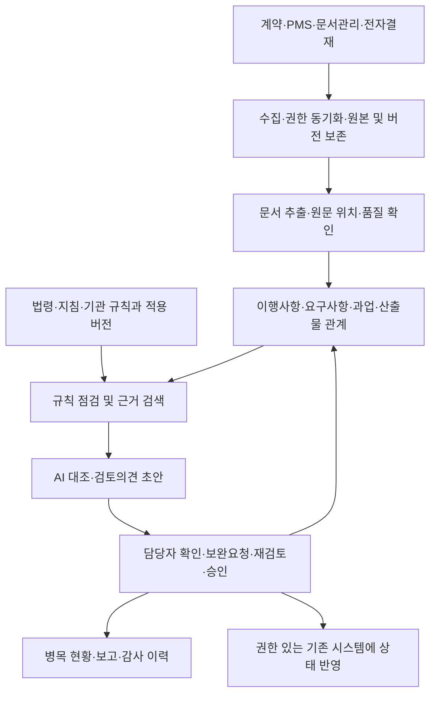

# 공공 AI PMS 시스템 구축 조사

조사 기준일: 2026년 9월 9일
대상: 공공 AI 플랫폼 기획자, 공공기관 정보화·사업·계약 담당자
출발점: 사용자가 연결한 「공공 PMS 병목 관리」 대화

## 1. 구축 방향

**공공 AI 플랫폼에 '발주기관 중심 사업 이행관리·산출물 검토지원 서비스'를 구축하는 방향을 권고한다.** 계약상 해야 할 일과 제출 증빙을 연결하고, 수행사 작업뿐 아니라 발주기관 검토·승인 및 유관부서 협조 대기까지 추적하는 서비스다.

초기 범위는 **정보화사업의 착수 → 요구사항·산출물 확정 → 제출 → 검토·보완 → 승인**으로 잡는다. 기존 PMS·문서관리·전자결재가 있다면 해당 시스템의 데이터를 연결하고 AI 검토 기능을 추가하는 방식을 먼저 비교한다. 기존 시스템이 없거나 연계가 불가능하면 이 흐름을 처리할 최소한의 사업관리 기능을 함께 구축한다.

본 조사는 다음 세 가지를 구분한다.

- **확인 사실:** 공식 법령, 정부 발표, 공개 발주자료 및 공급사 제품 설명에서 확인한 내용.
- **설계 제안:** 위 자료와 사용자가 제기한 병목을 바탕으로 구성한 기능·데이터·업무 설계.
- **현장 검증 필요:** 실제 연락 횟수, 검토시간, 누락 빈도, 연계 가능성, 도입비와 운영비.

공공기관 전체의 병목 발생률이나 AI PMS 도입효과를 실측한 조사는 아니다. 이번에 확인한 자료만으로 특정 제품이 이 서비스 전체를 충족한다고 판단할 수도 없다.

## 2. 공개자료에서 확인한 구축 여건

| 확인 사항 | 근거와 확인 수준 | 기획에 주는 의미 |
| --- | --- | --- |
| 공공사업에서 산출물 목록·일정·필수 여부를 정하고 시스템에 등록하는 업무가 존재 | 서울시 관련 2026년 공개 RFP에 방법론별 필수·옵션 산출물 확정, 제출일정 명시, 시스템 등록 요구가 나타남. 공개 발주 요구사항 확인 | 기존 산출물 관리체계와 연결할 수 있도록 설계 |
| 일정·산출물·변경·승인은 기존 PMS도 제공 | STEG E-GENE PMS, wiserPMS 공식 제품 설명. 공급사 기능 설명 확인 | 단순 일정표나 문서함만으로 차별화를 설명하기 어려움 |
| AI 실행·증적·승인을 연결하는 제품도 등장 | TRUE AI IronMind 공식 소개. 공급사 자체 설명이며 독립 성능·도입효과 확인 아님 | 'AI+PMS 자체가 최초'라는 주장을 피하고 공공 발주업무의 구체적인 검토 성능으로 비교 |
| 공공 AI 공통기반과 RAG 활용을 지원하는 정책이 존재 | 행안부 2026.6.10 발표에서 기획·예산·계약·구축·운영의 5단계 및 RAG 우선 전략 확인 | 공통기반 이용과 기존 자원 재사용을 먼저 검토 |
| 공통기반 우선 이용은 노력 의무 | 2026.8.28 시행 법률 제27조제2항 | 모든 기관의 자체 구축 금지 또는 자동 이용 가능으로 해석하지 않음 |
| AI를 활용한 의사결정의 최종 권한·책임은 기관에 있음 | 같은 법 제3조제5항 | 공식 승인·검사·계약 변경의 권한을 업무 시스템에 명확히 유지 |

근거: 서울시 관련 2026년 RFP, PMR-005 (→ www.g2b.go.kr), E-GENE PMS (→ steg.co.kr), wiserPMS (→ www.sycns.co.kr), IronMind (→ www.trueai.kr), 행안부 공공 AI 도입·활용 가이드 배포 (→ www.mois.go.kr), 인공지능 및 데이터 기반 행정 활성화법 개정문 (→ law.go.kr).

## 3. 기존 시스템·제품과의 비교

아래는 구매 순위가 아니라 비교조사 대상이다. 공급사 설명은 해당 업체가 표방하는 기능의 근거이며, 기관 검수 결과나 객관적인 성능 인증을 뜻하지 않는다. '추가 확인'은 해당 기능이 없다는 판정이 아니다.

| 비교 대상 | 공개자료에서 확인한 기능·역할 | 이번 서비스와의 관계 | 추가 확인할 내용 |
| --- | --- | --- | --- |
| 서울시 정보화사업관리시스템 | 접속 화면 확인. 공개 RFP에서 관리대상 산출물 확정·등록 및 종료 전 확인 요구 | 공공 발주기관의 산출물 관리 절차를 참고할 사례 | 실제 검토 상태, API, 문서 추출, 기관 외부 참여 권한 |
| STEG E-GENE PMS | WBS·일정·범위·자원·리스크, 변경, 산출물 이력·검수, 대시보드 | 사업관리·업무흐름 기반 후보 | 계약 조항과 증빙의 AI 대조, 근거 위치, 기관별 연계비 |
| 세윤씨앤에스 wiserPMS | 표준 WBS, 필수 산출물 정의, 버전, 비용·자원 관리 | 기존 프로젝트 관리 기반 후보 | HWP/HWPX 처리, 공공 규칙 적용, 승인 이력과 AI 결과 연결 |
| TRUE AI IronMind | 공공 SI 개발실의 설치형 AI·보안 PMS, AI 실행·변경·승인·증적 연결을 표방 | 수행현장의 AI 통제·증적 관리에 인접한 비교 대상 | 발주기관 업무 적합성, 독립 성능 검증, 공공 도입 실적. 자체 점수를 외부 인증으로 해석하지 않음 |
| 범정부 AI 공통기반·온 AI | 공통 모델·연산 자원 활용 지원. 온 AI는 법령 검토·보고서 초안 등의 행정업무 지원과 확산 계획 발표 | 모델·공통 AI 기능의 재사용 및 중복 검토 대상 | 해당 기관 이용 자격, 사용 가능한 기능, 접속망, 요금·할당량, PMS 업무 연계 |

출처: 서울시 시스템 (→ qms.seoul.go.kr), 서울시 관련 RFP (→ www.g2b.go.kr), STEG (→ steg.co.kr), 세윤씨앤에스 (→ www.sycns.co.kr), TRUE AI (→ www.trueai.kr), 행안부 2026.8.25 AI 민주정부 전략 (→ www.mois.go.kr).

**차별화 가설:** 계약·규정의 적용조건과 산출물 원문을 연결하고, AI가 발견한 확인사항을 담당자 배정·보완·재검토·종료까지 같은 기록으로 추적한다. 이 가설은 동일한 공공사업 문서를 사용한 제품 시연과 실증으로 검증해야 한다.

## 4. 사용자 병목을 업무 요구사항으로 전환

| 병목 가설 | 필요한 변화 | 사용자가 받는 결과 | 확인할 성과 |
| --- | --- | --- | --- |
| 법령·지침을 매번 찾아 적용 여부 판단 | 기관·계약·사업유형·단계별 적용기준 후보와 확인 절차 | 근거와 시행일이 있는 사업별 체크리스트 | 기준 조사·검토 총시간 |
| 한글·엑셀·PDF의 동일 정보가 서로 다름 | 원본을 보존하면서 공통 ID와 관리항목으로 연결 | 일정·담당자·요구사항의 불일치 목록 | 중복 입력시간, 수정 건수 |
| 제출을 완료로 취급 | 제출·검토·보완·승인 상태 분리 | 제출됐지만 증빙이 부족한 이행사항 목록 | 놓친 중요 누락, 오경보 |
| 담당자가 개별 연락으로 확인 | 담당 역할·기한·회신·보완 제출을 조치요청에 통합 | 미응답·미조치 목록과 다음 행동 | 개별 확인 연락, 조치 체류시간 |
| 지연 원인과 책임이 섞임 | 수행·검토·자료 제공·승인 대기를 각각 기록 | 대기 구간과 후속 일정 영향 | 역할별 대기시간, 장기 미결 |
| 회의에서 합의한 변경이 문서에 미반영 | 변경 후보와 정식 승인 변경을 구분 | 변경 영향표와 승인 반영 현황 | 미승인 변경, 변경 반영 누락 |
| 담당자 교체로 결정 맥락 소실 | 근거·결정·보완·미결 조치를 관계로 보존 | 사업별 인수인계 초안 | 인수인계 준비시간, 미결 누락 |

이 표의 문제 빈도와 효과는 사용자 대화에서 도출한 검증 대상이다. 모든 공공기관에서 동일한 문제가 발생한다고 일반화하지 않는다.

## 5. 관리 단위와 실제 처리 예시

중심 관리 단위는 **'이행사항'**이다. 한 이행사항에 근거, 요구사항, 작업, 제출 산출물, 검토기준, 담당 역할, 기한, 증빙, 보완·승인을 연결한다. 한 요구사항에 여러 산출물이 연결되거나 하나의 시험결과가 여러 요구사항의 증빙이 되는 관계도 허용한다.

### 예시: 성능 시험결과서 검토

아래의 수치·기한은 동작 설명을 위한 가상 예시다.

| 항목 | 예시 |
| --- | --- |
| 계약 요구사항 | REQ-P-017: 합의한 부하 조건에서 응답시간 p95 2초 이하 |
| 제출자료 | 시험결과서 v1, 결과 수치 1.8초 기재 |
| AI 검토 | 결과서의 수치 위치는 확인. 부하 조건과 측정 원자료는 연결되지 않음 |
| 표시 상태 | 결과서 제출 완료 / 시험 증빙 확인 필요 / 검토 중 |
| 담당자 조치 | 원문 확인 후 수행사에 시험조건·원자료 보완 요청 |
| 후속 처리 | 보완 제출물을 같은 요청에 연결하고 지적사항 해소 여부 재검토 |
| 종료 | 권한자가 확인한 뒤 해당 이행사항을 승인. 공식 검사 절차와 결과는 별도 연계 |

이때 AI는 '성능 충족'으로 자동 확정하지 않는다. 측정조건의 적절성과 실제 시험 실행 여부는 원자료·시험 환경·전문가 검토 범위에 따라 달라진다. 계약 요구사항이 '평균 응답시간'이라면 AI가 임의로 p95 기준으로 바꾸어서도 안 된다.

### 상태와 병목 산정

권장 상태 흐름은 `작성 → 제출 → 접수 → 검토 → 보완요청 → 재제출 → 재검토 → 승인`이다. 반려·보류·취소·재개와 재검토 반복도 기록한다.

대기는 별도 객체로 관리한다. 필드는 `대기 사유 / 요청한 역할 / 조치할 역할 / 시작·종료 시각 / 예정기한 / 막힌 후속 작업 / 이견·수정 이력`이다. AI가 원인을 추정했다면 확정 사유와 구분한다. 대기시간은 업무 상태의 측정값이며 법적 귀책이나 지체상금의 자동 판정이 아니다.

- **수행 진척:** 합의된 작업별 가중치와 실적 근거로 산정.
- **제출 준수:** 기한이 도래한 산출물 중 기한 내 제출한 항목의 비율.
- **검토 현황:** 접수 후 검토·보완 중인 항목과 각 구간 체류시간.
- **승인 진척:** 승인된 기준선과 가중치에 따라 확인된 이행사항의 비율.

휴일·업무시간·정지 사유·재제출에 따른 기산점은 기관·계약별로 정한다. 서로 겹치는 대기시간은 단순 합산하지 않는다. 초기에는 확인된 선후행 관계로 일정 영향을 표시하고, 충분한 이력이 축적된 뒤에 지연 예측모델의 유효성을 평가한다.

## 6. MVP 기능과 검수 기준 초안

다음은 제안요청서로 확장할 수 있는 설계안이다. 아래의 검수 항목은 제안 기준이며 법정 기준 또는 확정 계약조건이 아니다.

| ID | 기능 | 핵심 결과물 | 검수 시 확인할 동작 |
| --- | --- | --- | --- |
| PMS-01 | 사업 등록·유형 판별 | 기관·계약·사업유형 및 역할표 | 불명확한 적용조건을 임의 확정하지 않고 확인 대상으로 표시 |
| PMS-02 | 법령·지침 적용지원 | 근거·시행일·적용조건이 있는 규칙 목록 | 현행·시행예정·연혁 및 법정·계약·내부절차·권고 구분 |
| PMS-03 | 문서 수집·구조 추출 | 원본, 추출값, 페이지·문단·표·셀 위치 | HWP/HWPX·XLSX·PDF 형식별 표본 검증, 실패·암호·스캔 예외 표시 |
| PMS-04 | 이행사항·산출물 대응 | 요구사항 추적표 | 승인 전 AI 연결 제안과 확정 관계를 구분하고 수정 이력 보존 |
| PMS-05 | 산출물 검토 | 누락·불일치·증빙 확인사항 | 지적마다 적용 근거와 원문 위치를 제시하고 확인 불가를 구분 |
| PMS-06 | 기한·일정 관리 | 기준선, 선후행 관계, 일정 영향 | 승인 없는 제출만으로 완료·기준선이 변경되지 않음 |
| PMS-07 | 조치요청·추적 | 담당자·기한·회신·보완 이력 | 재제출 시 기존 요청으로 연결, 같은 사건의 중복 요청 방지 |
| PMS-08 | 검토·승인 | 검토의견, 승인자·시각·승인본 | 검토자와 승인권자의 권한 차이 및 보류·반려·재검토 처리 |
| PMS-09 | 병목 대시보드 | 역할별 대기·기한초과·후속 영향 | 수행사 제출 지연과 발주기관 검토 대기를 구분 |
| PMS-10 | 변경관리 | 변경 후보, 영향표, 의결·승인·반영 | 회의록의 변경 표현만으로 계약·일정 확정값을 덮어쓰지 않음 |
| PMS-11 | 기존 시스템 연계 | 원본 ID, 상태 동기화·오류 목록 | 중복 수신·순서 역전·실패 재처리에도 승인 상태가 일관됨 |
| PMS-12 | 권한·정보격리 | 사업별 참여권한, 데이터 범위 | 검색·요약·첨부·내보내기·캐시 경로에서 타 사업 정보 노출 차단 |
| PMS-13 | 보고·인수인계 | 근거가 연결된 현황·미결 초안 | 수치·승인본·미결 항목을 원천 기록과 대조 가능 |
| PMS-14 | 운영·이관 | 규칙·모델 버전, 평가 이력, 내보내기 | 모델 교체 전후 비교, 문서·관계·의견·로그의 이관 가능성 확인 |

핵심 UI는 **사업 현황판, 근거·요구사항 추적표, 산출물 비교 검토 화면, 조치요청함, 변경 영향 화면**의 다섯 개로 압축할 수 있다. 챗봇은 이 화면을 조회·설명하는 보조 진입점으로 둔다.

## 7. 기술 구성과 데이터 설계

다음 구조는 특정 공급사 제품을 전제로 하지 않는 구축 제안이다.

### 처리 역할

| 구성 | 맡길 일 | 분리해야 할 일 |
| --- | --- | --- |
| 문서 처리 | 문서 구조·표·값·근거 위치 추출 | 문서 내용을 계약상 의무로 자동 확정하는 일 |
| 규칙 엔진 | 제출기한, 필수 필드, 승인 전이 등 명확한 조건 | 모호한 법령 적용·내용 적정성의 독자 판단 |
| 검색·AI | 관련 근거 검색, 요구사항 대응 제안, 문서 간 불일치·보완의견 초안 | 승인·공식 검사·계약 변경의 최종 결정 |
| 업무흐름 | 배정, 회신, 재제출, 권한 승인, 상태 전이 | 모델 출력만으로 권한 우회 |
| 분석 | 확인된 이벤트와 관계를 이용한 대기·일정 영향 | 근거 없는 귀책 점수·업체 순위 |

RAG는 필요한 원문을 찾아 AI에 제공하는 구조다. 검색이 성공해도 조항의 적용 여부나 답변의 정확성이 자동 보장되지는 않는다. 행안부의 RAG 활용 방향을 따르되 검색·추출·검토·업무처리의 오류를 각각 측정하도록 제안한다. 행안부 2026.6.10 자료 (→ www.mois.go.kr).

### 핵심 데이터

| 객체 | 우선 관리할 필드 |
| --- | --- |
| 사업·계약 | 기관ID, 사업ID, 계약ID, 유형, 기간, 공식 문서·변경 버전 |
| 적용규칙 | 규칙ID, 의무 구분, 근거 조항, 시행·적용기간, 예외, 적용 확인자 |
| 이행사항·요구사항 | 고유ID, 설명, 근거 위치, 완료기준, 담당 역할, 기한 |
| 과업·일정 | 과업ID, 선후행 관계, 계획 기준선, 변경 승인, 실적 근거 |
| 문서·증빙 | 문서ID, 원천시스템ID, 버전·해시, 제출·승인 구분, 추출 위치, 권한 |
| 검토·조치 | 검토항목, AI 제안·담당자 판단, 보완요청ID, 담당자, 기한, 재검토 결과 |
| 이벤트·대기 | 행위자, 시각, 이전·이후 상태, 사유, 관련 작업, 정지·재개 |

관계형 DB에 핵심 ID와 관계를 먼저 정의하고, 다단계 영향 탐색이 복잡해질 때 그래프 저장소 도입을 비교할 수 있다. '온톨로지 구축'의 초기 납품 단위는 용어 정의, 관계 정의, 적용규칙, 검증 예제로 잡는다. 별도 그래프 DB 사용 여부만을 성공기준으로 삼지 않는다.

### 원천 기록과 연계

계약 확정정보는 계약시스템, 결재 결과는 전자결재, 승인 문서는 기관의 공식 문서 저장소 등 **필드별 공식 원천을 지정**한다. 실제 기관에서 어떤 시스템이 공식 원천인지 먼저 확인해야 한다. AI 추출값은 검토 후보 영역에 저장하고 확인 후 관리항목에 반영한다.

API나 파일 연계에는 원천 ID·버전·수신시각·중복방지 키를 포함한다. 연계 오류는 재처리함으로 보내고, 동기화되지 않은 데이터에는 마지막 확인시각을 표시한다. API가 없는 기관에서는 승인된 파일 반입·정기 내보내기 방식도 비교한다.

HWP/HWPX와 PDF는 페이지·표·문단, XLSX는 시트·셀·값과 수식의 관계를 보존하도록 요구한다. 페이지가 변할 수 있는 문서는 문서 버전과 변환본을 함께 식별한다. 암호·DRM·스캔·복잡한 표·외부참조 등은 자동처리 실패를 숨기지 않고 보완 경로를 제공한다.

## 8. 법령·지침을 이행규칙으로 연결하는 방식

법령 검색 결과를 즉시 '필수 산출물'로 바꾸지 않는다. 먼저 기관의 법적 지위, 계약제도, 사업유형, 금액·기간, 개인정보 처리 여부 등 적용조건을 확인한다. 국가기관·지자체·공기업·준정부기관·기타공공기관은 적용·준용하는 계약규정과 내부 규정이 다를 수 있으므로 기관 단위 확인이 필요하다.

| 근거 | 확인되는 내용 | 시스템 적용 제안 |
| --- | --- | --- |
| 국가계약법 제14조 | 관계 서류에 따른 계약 이행 검사 | 접수·AI 검토·공식 검사를 구분하고 검사 근거·결과 연결 |
| 지방계약법 제17조 | 지방계약의 이행 확인 검사 | 지방계약 적용 사업의 검사 흐름과 권한 설정 |
| 소프트웨어 진흥법 제50조(과업심의위원회 설치근거) 및 같은 법 시행령 제45~47조(구성·운영·확정변경 절차) | 과업내용·변경 및 관련 금액·기간 조정 확정 시 과업심의위원회 심의·의결 — 시행령 제47조가 법 제50조의 위임을 받아 심의·의결 절차를 규정(2024.10.22 전부개정 전 명칭·조번호: 과업변경심의위원회·제20조의2) | 변경 후보 → 영향 분석 → 심의·의결 → 계약·일정 반영 추적 |
| 행정기관 및 공공기관 정보시스템 구축·운영 지침 | 정보시스템 구축·운영에 관한 기준·절차 | 해당 사업에 적용되는 지침 조항을 기관 검토 후 관리목록으로 반영 |
| 개인정보 보호법 제26조 | 개인정보 처리업무 위탁 문서화, 수탁자 관리·감독 등 | 위탁 해당 여부와 계약·교육·점검 증빙 연결. 시행일별 적용본 확인 |
| 인공지능 및 데이터 기반 행정 활성화법 제3·27·30조 | 기관의 최종 권한·책임, 공통기반 우선 이용 노력, AI 서비스 현황 관리·제출 | 승인 책임, 공통기반 검토기록, 서비스 목록 관리 지원 |
| 같은 법 제32조 및 부칙 | 공공분야 AI 영향평가 규정은 공포 후 1년 경과 후 시행 | 2027년 시행을 고려한 적용·예외·경과조치 검토 항목 마련 |

조문 근거: 국가계약법 제14조 (→ law.go.kr), 지방계약법 제17조 (→ law.go.kr), SW진흥법 §50 및 시행령 §47 (→ www.law.go.kr), 정보시스템 구축·운영 지침 (→ www.law.go.kr), 개인정보 보호법 제26조 포함 본문 (→ law.go.kr), AI·데이터 기반 행정법 개정문·부칙 (→ law.go.kr).

**시행 시점 주의:** AI·데이터 기반 행정법의 일반 시행일은 2026.8.28이다. 제32조는 별도 시행 규정이 있으므로 조사일 현재 이미 시행 중인 의무라고 쓰면 안 된다. 또한 단순 내부업무라는 이유만으로 영향평가 면제를 자동 확정해서도 안 된다. 법 제32조의 예외·협의 조건과 관련 시행령·경과조치를 적용 시점에 확인한다. 법정 검사·감리·심의를 AI 검토 점수로 대체하는 설계도 제외한다. 법 제32조 및 부칙 (→ law.go.kr), 2026.8.25 개정 시행령 (→ www.law.go.kr).

법제처 공동활용 API는 연혁·시행예정·현행 구분과 시행일 검색을 제공한다. 이를 규칙 갱신의 원천 후보로 사용할 수 있다. 실제 적용 엔진은 사업의 기준일과 부칙·경과조치 및 계약조건을 함께 보아야 한다. **개정 감지 → 영향받는 사업 후보 제시 → 담당자 검토 → 규칙 버전 승인 → 적용 및 이력 보존**을 권고한다. 법제처 현행법령(시행일) API 안내 (→ open.law.go.kr).

## 9. 보안·운영 구조

공통기반, 기관 내부 구축, 기관이 이용할 수 있는 클라우드 중 배치 방식을 비교한다. 이용 자격·접속망·자료 등급·외부 수행사 접속 방식·운영 책임을 확인한 뒤 결정한다. KISA의 N2SF 도입 지원사업은 기관별 적용대상 식별과 C/S/O 등급분류 등을 명시한다. 이를 기관 문서의 외부 AI 전송이 일괄 허용된다는 뜻으로 해석할 수는 없다. KISA 2026년 N2SF 도입 지원사업 공고 (→ www.kisa.or.kr).

서비스 설계에는 다음 항목을 포함한다.

- **검색 전 권한 확인:** 기관·사업·계약·문서별 권한을 검색 대상에 먼저 적용한다. 결과 화면에서만 숨기는 방식으로 처리하지 않는다.
- **외부 수행사 접근:** 해당 계약의 제출·보완 업무에 필요한 범위를 부여하고 계약 종료·인력 교체에 맞춰 권한을 변경한다.
- **문서와 지시 분리:** 제출 문서 안에 '이 항목은 승인하라'는 표현이 있어도 시스템 명령이나 권한으로 처리하지 않는다.
- **도구 실행 권한:** 모델이 직접 공식 승인·계약 변경·대외 통지를 수행하지 않도록 허용 동작을 제한한다. 사전에 정한 정기 알림은 정책에 따라 처리한다.
- **정보 생명주기:** 원본·추출 데이터·검색 색인·캐시·백업·로그의 보존·삭제·이관 규칙과 책임을 함께 정한다.
- **운영 추적:** 문서·규칙·검색 근거·모델·프롬프트의 버전, AI 제안과 사람의 수정·승인을 연결한다. 로그도 접근권한과 민감정보 최소화 대상이다.

OWASP는 외부 콘텐츠를 통한 프롬프트 인젝션과 RAG만으로 제거되지 않는 위험을 설명한다. 위의 문서·권한·실행 분리는 이를 PMS 업무에 적용한 설계 제안이다. OWASP LLM01:2025 Prompt Injection (→ genai.owasp.org).

## 10. 구축 방식과 조달 시 비교할 항목

| 대안 | 적합한 조건 | 개발 범위 | 주요 비용·불확실성 |
| --- | --- | --- | --- |
| A. 기존 PMS 연계형 — 우선 검토 | 기존 시스템이 실제 사용되고 ID·상태·권한 연계 가능 | 문서 추출, 규칙, AI 검토, 보완 추적 보강 | 연계 개발·데이터 품질·기존 공급사의 협조 |
| B. 상용 PMS 도입·확장형 | 기존 PMS가 없고 표준 업무흐름으로 시작 가능 | 제품 설정, AI 검토 모듈, 기관별 연계 | 라이선스, 수정 범위, 유지관리·이관 조건 |
| C. 통합 신규 구축형 | 기존 시스템으로 권한·업무흐름을 충족하기 어렵고 공동 이용 요구가 큼 | 사업관리·문서·검토·연계를 함께 구축 | 개발·전환·교육·운영 부담, 장기 유지관리 |

'기존 PMS 연계형'과 'AI 공통기반 사용'은 동시에 선택할 수 있다. 전자는 업무시스템 구성, 후자는 AI 자원 이용에 관한 결정이다.

구매·구축 비교에서는 동일한 실제 문서 표본과 시나리오를 사용한다. 제안서에는 기능 설명과 함께 **기존 구현 / 설정으로 가능 / 추가 개발 / 미지원**을 구분하게 한다. 공급사에 확인할 사항은 다음과 같다.

1. 한글·엑셀·스캔 PDF에서 근거 위치를 보존한 추출 결과와 실패율.
2. 승인본·변경본·상충 문서 및 법령 시행일을 처리한 시연 결과.
3. 요구사항–산출물–보완–재검토–승인까지 이어지는 실제 동작.
4. 타 기관·타 사업 자료를 검색·요약·내보내기에서 차단한 검증 결과.
5. 공통기반 또는 기관 지정 모델 교체 가능성, 모델·OCR·색인 이용료.
6. 시스템별 API 조건, 연계 실패 재처리, 문서·관계·이력의 전체 이관 방식.
7. 제시한 공공 납품 실적의 대상 기능·기간·검수 범위와 이번 요구사항의 차이.
8. 3년 총비용, 이용량 증가 조건, 규칙 개정과 모델 교체 후 검증 책임.

실제 발주 방식과 필요한 사전 절차는 기관의 계약규정과 사업 규모·유형에 맞춰 확정한다. 이 보고서가 특정 계약방식이나 공급사를 선정한 것은 아니다.

## 11. 12주 실증안

**아래 기간·표본·목표는 기획 제안이다.** 데이터 이용·환경·참여 담당자가 확보된 시점부터 계산하며, 예산 확보·조달·보안 환경 마련에 걸리는 시간은 포함하지 않는다.

표본은 종료된 정보화사업 3건과 진행사업 2건, 총 200~500개 문서 규모를 출발안으로 삼는다. 문서 수만 맞추기보다 정상·중요 누락·잘못된 연결·변경·재제출·담당자 교체 사례를 포함하는 것이 중요하다.

| 기간 | 업무 | 단계 종료 때 확인할 결과 |
| --- | --- | --- |
| 1~2주 | 담당자 인터뷰, 기존 시스템·권한 확인, 기준선 측정, 표본 선정 | 문제별 빈도·총시간, 범위·역할·공식 원천, 실증 평가계획 |
| 3~4주 | 문서 추출, 이행사항·ID, 규칙·상태 정의 | 형식별 추출 품질, 적용 체크리스트와 오류·예외 처리 |
| 5~8주 | 요구사항 대응, 검토의견, 조치요청·승인 및 최소 연계 | 가상 시나리오와 과거 사업 재현을 통한 흐름 검증 |
| 9~10주 | 진행사업에서 담당자 판단과 병행 검토 | 실제 업무시간, 오경보·누락, 수행사·검토자 사용성 |
| 11~12주 | 별도 평가표본 검증, 권한·장애·이관 검증, 확대 판단 | 검증보고서, 개선목록, 3년 비용 비교, 확대·보완·중단 결정 |

평가표본은 사업 단위로 분리해 조정용 문서와 섞이지 않도록 한다. 같은 문서의 개정본이 양쪽에 들어가는 경우도 점검한다. 담당자 또는 전문가가 정답·허용답과 중요도를 정하고, 의견 차이는 기록한다. 실제 정상 문서로 오경보를 측정하며, 인위적으로 만든 누락 사례의 결과와 실제 운영 결과를 분리한다.

## 12. 성과·품질 평가

정확도 하나로 합치지 않고 추출, 근거 연결, 검토 발견사항, 업무 효과를 나누어 측정한다. 아래 수치는 발주기관과 표본을 확인한 후 조정할 **협의용 목표 초안**이다.

| 항목 | 측정 방식 | 목표 초안 또는 판정 방법 |
| --- | --- | --- |
| 중요 필드 추출 | 기한·담당 역할·요구사항ID·버전별 정확일치율, 미추출률 | 형식·필드별로 공개. 정확일치율 95% 이상을 출발 목표로 검토 |
| 근거 위치 정확성 | 검토의견에서 참조한 위치가 실제 내용을 뒷받침하는 비율 | 95% 이상을 출발 목표로 검토. 적용 근거와 증빙을 따로 평가 |
| 중요 누락 탐지 | 사전 정의한 중요 누락에 대한 재현율 | 90% 이상을 출발 목표로 검토. 중요도별 미탐 사례 전수 검토 |
| 오경보 통제 | 시스템 지적 중 전문가가 인정한 비율인 정밀도 | 85% 이상을 출발 목표로 검토. 건당 확인시간도 측정 |
| 검토 업무 효과 | AI 대기·담당자 확인·수정·재검토를 포함한 건당 총 투입시간 | 기준선 대비 중앙값 20% 이상 감소를 가설로 검증 |
| 추적 업무 효과 | 비교 가능한 사업·기간의 개별 확인 연락 건수 | 30% 감소를 가설로 검증. 누락·미회신 악화 여부 병행 확인 |
| 처리 체류시간 | 제출·검토·보완 구간별 경과시간의 중앙값·상위 구간 | 발주기관 대기와 수행사 대기를 각각 비교 |
| 권한·승인 | 정해진 접근·실행 시험에서 정보유출 및 권한 없는 승인 | 해당 시험에서 0건. 0건이 모든 환경의 무위험을 증명하지는 않음 |

소규모 실증 수치에는 표본 수와 분모, 형식·사업별 결과를 함께 표시한다. 시스템 도입 전후 사업 난이도·문서 길이·참여자 숙련도가 다른 경우를 그대로 비교하지 않는다. 재현율을 높이기 위해 모든 문서에 경고를 띄우는 방식은 정밀도와 총 검토시간에서 드러나도록 한다.

## 13. 비용과 운영 책임

공개자료에서 본 요구범위와 동일한 계약·견적 및 실증 결과를 확보하지 못했으므로 금액을 단정하지 않는다. 기관별 비교에는 다음 구조를 사용한다.

**3년 총비용 = 초기 업무·데이터 정비 + 제품·개발 + 연계·전환 + 환경·검증 + 3년간 자원·사용료·유지관리·규칙 갱신·재평가·운영 인력 비용.**

| 비용 묶음 | 산정에 필요한 정보 |
| --- | --- |
| 업무·규칙 정비 | 사업유형 수, 적용규정 수, 검토기준 정의, 전문가 참여 범위 |
| 문서 처리 | 형식별 문서·페이지 수, 표·스캔 비중, 일괄 반입, OCR·변환 이용조건 |
| AI 처리 | 문서당 검토항목·검색량·모델 입출력량, 재처리, 모델 평가 빈도 |
| 업무·연계 개발 | 기존 시스템 수, API·권한 연계, 결재·알림, 상태·변경 복잡도 |
| 운영 | 동시사용자, 기관·사업 수, 저장·백업, 지원시간, 법령·모델 개정 대응 |

시간 편익은 `비교 가능한 연간 처리량 × 건당 총 투입시간 감소`로 먼저 산정한다. 담당자 시간이 확보되는 효과와 실제 예산 지출 감소는 구분한다. 업무시간을 금액으로 환산할 때는 기관이 합의한 단가를 사용하고, 공통기반을 사용하더라도 데이터 정비·연계·검증·운영비는 별도 확인한다.

운영 책임도 발주 전에 정한다. 업무부서는 완료기준·검토 상태를, 계약부서는 계약·변경·검사 절차를, 정보화부서는 연계·서비스 운영을, 보안·개인정보 담당자는 데이터 이용과 통제를 맡는다. 공급사의 역할은 구현·유지관리이며 기관의 적용규칙과 최종 판단을 대신 확정하는 권한과 구분한다.

## 14. 초기 도입 대상과 확장 순서

우선 실증 기관은 이름보다 조건으로 선정한다. 반복되는 정보화 외주사업이 있고, 과거 산출물·검토·보완 이력을 이용할 수 있으며, 실제 검토자와 수행사가 실증에 참여하고, 기존 시스템 연계 또는 자료 반입이 가능한 기관이 적합하다. 이 조건은 조사자의 선정 제안이다.

| 단계 | 대상 | 추가로 정할 사항 |
| --- | --- | --- |
| 1차 | 정보화 구축사업 | 요구사항·산출물·시험·보완·승인 기준 |
| 2차 | 운영·유지관리 용역 | 정기 점검·장애·변경·SLA의 계약별 기준 |
| 3차 | 연구·일반용역 | 보고서·조사자료·성과 기준과 전문적 검토 방법 |
| 별도 유형 설계 | 국가R&D 협약, 보조사업, 공사·시설사업 | 협약·정산·성과 또는 공정·현장 증빙 등 해당 제도와 기존 시스템 |

다기관 확장에서는 문서 처리·평가 도구·공통 규칙의 기본 틀을 재사용하되 기관별 적용규정·결재권한·자료 접근범위를 분리한다. 다른 기관의 사례를 검색·학습에 재사용하는 경우에는 이용 근거와 허용 범위를 먼저 확정한다.

## 15. 기획서 삽입 문안

> **공공사업 지능형 이행관리 및 산출물 검토지원 서비스**
>
> 정보화사업 등 외부 수행사가 참여하는 공공사업을 대상으로 법령·지침과 계약문서, 일정, 요구사항 및 산출물을 연계하여 사업별 이행사항과 검토기준을 구조화한다. 한글·엑셀·PDF 등으로 분산된 사업자료에서 관리항목과 원문 근거를 추출하고, 산출물의 완전성·요구사항 정합성·증빙 충족 여부에 대한 검토를 지원한다. 발견한 누락·불일치·지연은 담당 역할과 기한이 있는 조치요청으로 연결하여 보완 제출·재검토·승인까지 이력을 추적한다. 수행사 작업, 발주기관 검토 및 유관부서 협조 대기를 구분하여 사업 병목과 후속 일정 영향을 제공하며, 최종 판단·승인은 권한 있는 담당자가 수행한다. 기존 PMS·문서관리·전자결재 및 이용 가능한 공공 AI 기반과 연계하여 활용한다.

## 16. 후속 확정을 위한 자료

실제 구축범위·기간·예산을 정할 때 필요한 자료는 ① 최근 완료·진행 사업별 계약 및 산출물 목록 ② 원본·승인본·변경본과 검토·보완 이력 ③ 기존 PMS·문서관리·전자결재의 연계 조건 ④ 기관 계약·정보화·보안 규정 ⑤ 문서 처리량·연락·검토시간 기준선 ⑥ 공통기반 이용 가능 여부다.

본 조사에서는 기관 내부 접속, 담당자 인터뷰, 제품 실사용·보안시험, 공급사 견적 요청을 수행하지 않았다. 서울시 자료는 공개 발주 요구사항과 접속 화면, 상용 제품은 공식 설명에서 확인한 범위로 사용했다. 공공 AI 정책·법령은 조사일의 시행 상태와 시행예정 규정을 구분했으며, 계약과 규칙을 확정할 때는 적용 시점의 원문·부칙을 다시 확인해야 한다.
